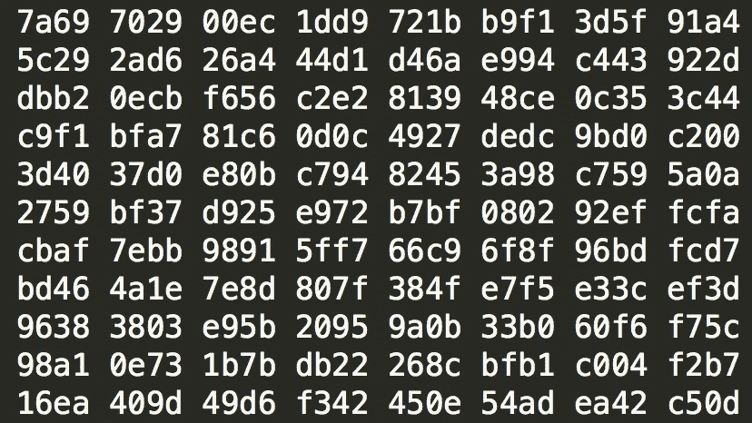

# WebAssembly &应用商店的死亡

> 原文：<https://medium.com/hackernoon/webassembly-the-death-of-the-app-store-c9bc3f9557c8>

我从未对一项新技术如此兴奋过。WebAssembly 是真正的交易，没有人谈论它。

3D 电视的？咩。虚拟现实？Pfft。

Uhh, no.

[官方 webassembly 网站](http://webassembly.org/)在解释 wasm 为何如此神奇方面表现平平:

> WebAssembly 或 *wasm* 是一种新的可移植的、大小和加载时间有效的格式，适合编译到 web 上。

我问过一些网络工程师，他们对 wasm 了解多少。普遍的反应是，他们认为这是一种用汇编语言编写小块代码来完成计算复杂的操作的方法，这些操作在 Javascript 中运行不太好。

的确如此，但这只是故事的一部分。

the first couple of bytes of a webassembly version of [flappy bird](https://hackernoon.com/how-i-built-and-deployed-a-webgl-game-to-a-new-website-in-35m-15b2e8339c31)

wasm 的真正强大之处在于，它允许我们创建曾经只能在桌面上实现的应用程序。文字处理器。复杂的模拟。图像编辑软件。游戏。

我们将能够轻松地将现有的 C 和 C++应用程序的大规模库移植到网络上。随着工具链和 wasm 规范的发展，用 Java 或 Python 等其他语言构建的应用程序也将得到支持。

wasm 将与现有的网络技术完美结合。

将 WebAssembly 与 HTML5 Canvas 配对作为视频缓冲，我们将能够显示软件渲染的图形应用程序。添加 [WebGL2](http://caniuse.com/#feat=webgl2) ，我们得到现代 GPU 加速的 3D 图形。

[the witcher](http://thewitcher.com/en/witcher3) (not wasm …yet)

加入渐进式网络应用程序，我们就有了离线能力。

添加云存储和移动设备，我们可以将我们的应用带到任何地方。

这一切意味着什么？

*   一切都将在网络浏览器中运行。
*   每个人都可以将复杂的原生质量的应用发布到网络上。

**…应用商店将很快变得像商场里的盒装软件商店一样不常见。**

Nice Casio! ([credit](http://gallery.ultimacodex.com/richard-garriott-and-warren-spector-1992/))

我在这里做了一个大胆的预测。现在我们来谈谈 wasm 不会做的事情。

> WebAssembly 旨在通过利用广泛平台上可用的[通用硬件功能](http://webassembly.org/docs/portability/#assumptions-for-efficient-execution)来以本机速度执行。

这里的关键是“通用硬件能力”。它不会让我们以绝对最快的速度访问定制硬件平台。这也可能不是开发低成本嵌入式系统和 IOT 的最佳方式。

游戏控制台等现有平台不会针对 WebAssembly 进行预优化，但我预测 PS5 和 XBox Two 等硬件将随着 WebAssembly 的发展而发展。

PS5 [fan art](http://www.psu.com/news/32403/PS5-release-targets-late-2018-with-most-powerful-console-GPU-says-analyst)

Wasm 将为商业、消费者和视频游戏应用解决 90%的用例。这足以让我为之疯狂兴奋。

顺便说一句，我正在用 WebAssembly 和 WebGL 构建一些很棒的 sh**。加入我的[邮件列表](https://upscri.be/1c08e9/)，成为第一个了解更多信息的人。

*请💚或者跟随如果你今天学到了新的东西！这给了我很大的动力继续这样写文章。*

这里有一个后续的故事，关于你如何[现在就写 wasm】而不用下载任何东西](/@theroccob/write-and-run-webassembly-in-your-browser-today-77b39c92ead0)

> [黑客中午](http://bit.ly/Hackernoon)是黑客如何开始他们的下午。我们是 [@AMI](http://bit.ly/atAMIatAMI) 家庭的一员。我们现在[接受投稿](http://bit.ly/hackernoonsubmission)并乐意[讨论广告&赞助](mailto:partners@amipublications.com)机会。
> 
> 如果你喜欢这个故事，我们推荐你阅读我们的[最新科技故事](http://bit.ly/hackernoonlatestt)和[趋势科技故事](https://hackernoon.com/trending)。直到下一次，不要把世界的现实想当然！

