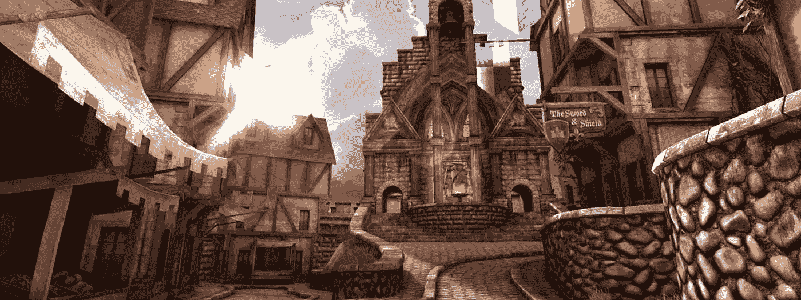
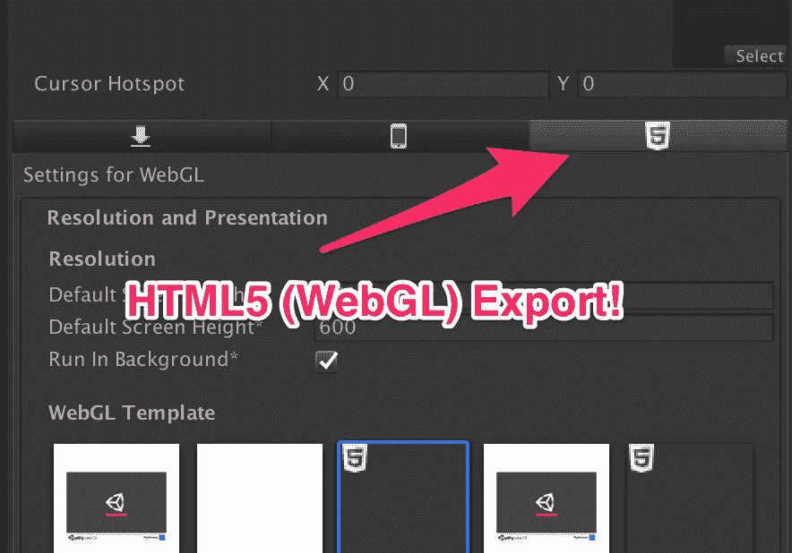
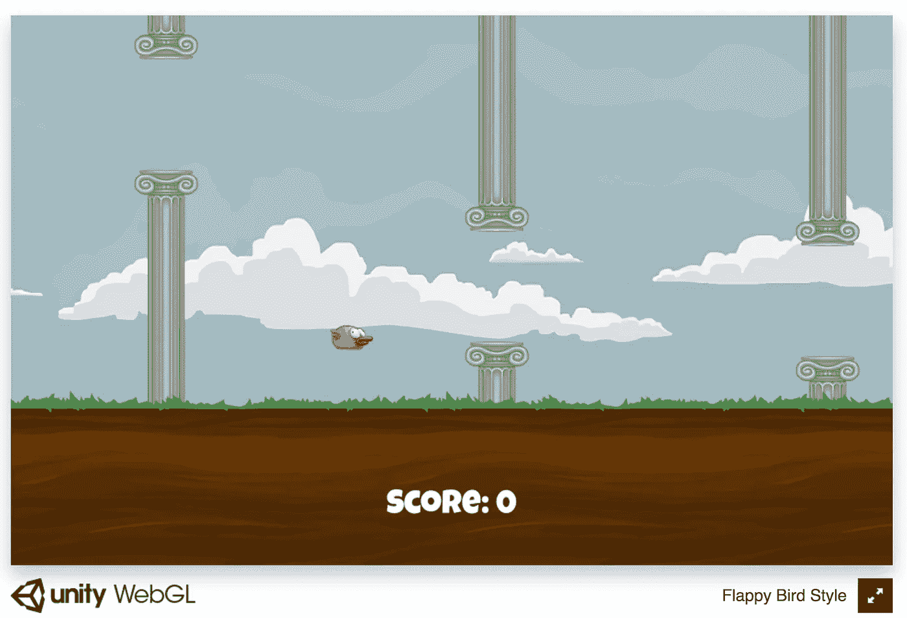
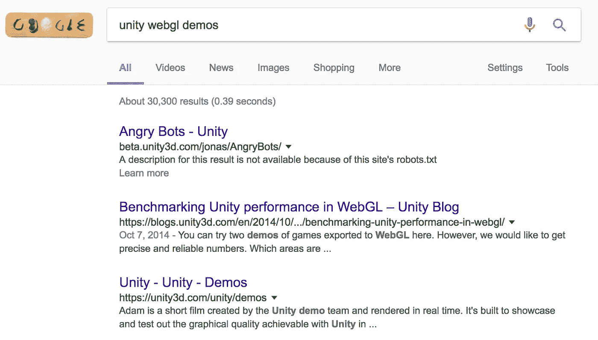
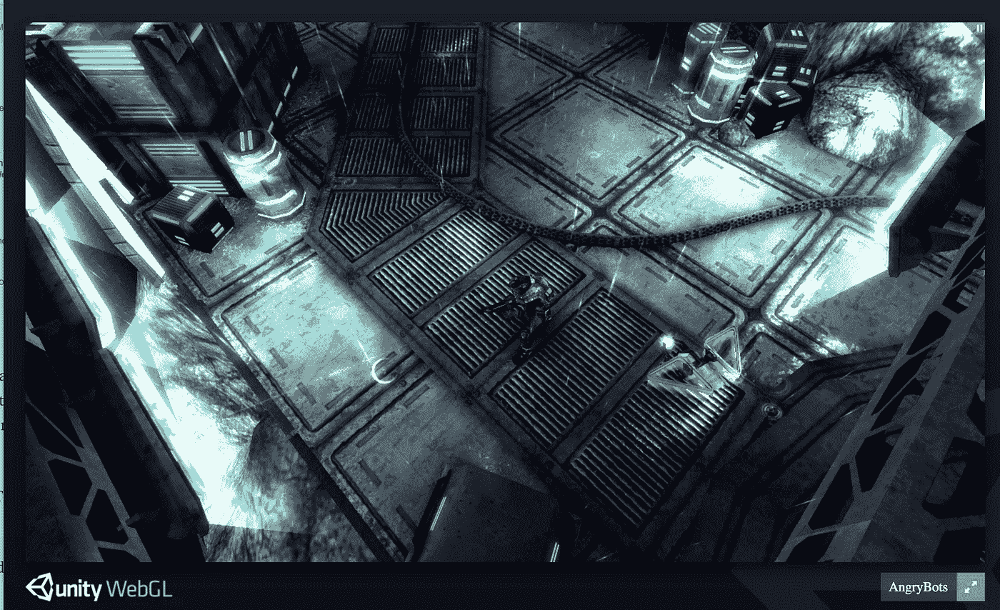
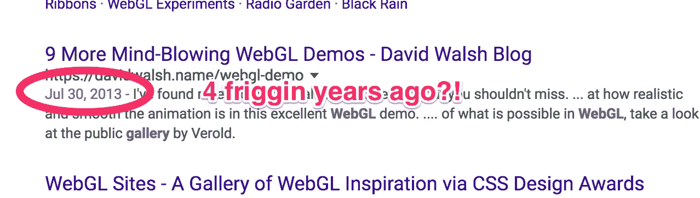
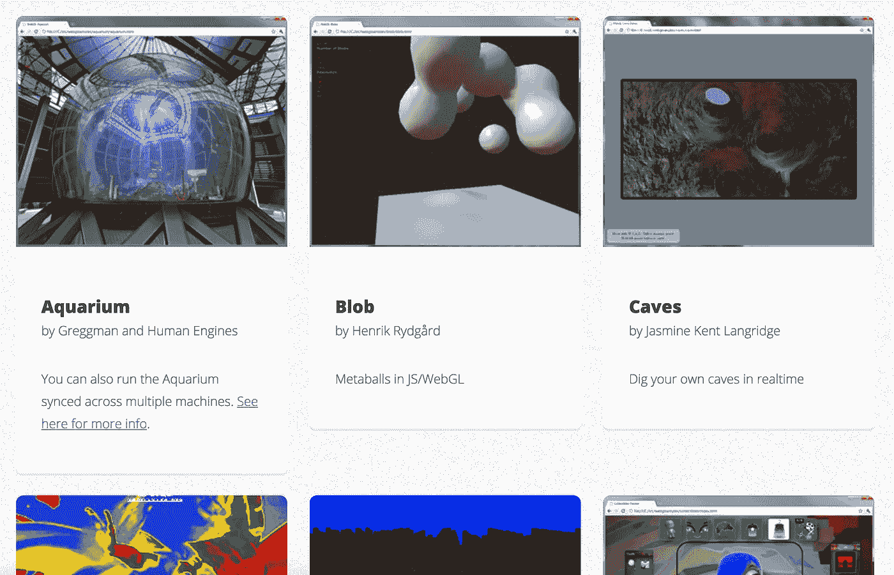
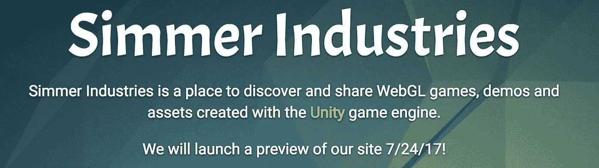

# WebGL 需要一个家

> 原文：<https://medium.com/hackernoon/webgl-needs-a-home-6f11fddc01df>

Epic Citadel

现在还没有一个发现和浏览 WebGL 内容的好地方。但这将会改变。

在本文中，我将解释为什么我认为是 WebGL 大放异彩的时候了，以及为什么这种类型的内容真的需要一站式服务。

## 现在是 2017 年，Unity 把 WebGL 做得非常好

我最近重新熟悉了去年年底的 Unity 游戏引擎。我以前是一名游戏程序员，后来成为了一名网络开发人员，我渴望在假期开发一款游戏。

我为 iPhone 做了一个小型的导弹指令克隆，对此我毫不在意。但是当我学习如何导出 iPhone 时，我意识到 Unity 也有 HTML5(通过 WebGL)导出功能！

我想——这不可能行得通。但事实证明我错了。当我将目标更改为 WebGL 时，它工作得很好，并且资产的总体规模也很小。

我甚至写了一篇文章，讲述在 AWS 上构建和部署 WebGL 游戏是多么简单。从开始到结束我花了[35 米](https://hackernoon.com/how-i-built-and-deployed-a-webgl-game-to-a-new-website-in-35m-15b2e8339c31)。

I deployed this in 35m: [https://unitywebgl.com/](https://unitywebgl.com/)

## 其他人对 Unity & WebGL 做了什么？

所以我开始想……现在 Unity 有了一个相当稳定的出口，有没有一个网站有一堆这样的演示？

Note, that this search is from today, not 6 months ago.

让我们看看这里的前三个链接:

这是一个非常酷的演示，展示了你可以在 Unity 中创建一些非常糟糕的 WebGL 内容。不幸的是，从我对源代码的检查来看，这个演示已经有一年多的历史了，而且是用 Unity 的一个旧测试版构建的。

Kewl!

[**web GL 中的 Unity 性能基准测试**](https://blogs.unity3d.com/2014/10/07/benchmarking-unity-performance-in-webgl/) :这是一篇差不多 3 年前的文章，关于 Unity 的“新”beta 特性 WebGL export。

[**Unity—Unity—Demos**](https://unity3d.com/unity/demos):这是 Unity 技术演示的一些视频和截图的链接。没有值得一提的网络日志。

## 其他 WebGL 演示呢？

所以我试着搜索了一些其他的东西，比如“webgl gallery”或者“webgl demos”。结果同样令人失望。

Mindblowing in 2013, maybe.

## 在进一步挖掘之后…

我发现[http://webglsamples.org/](http://webglsamples.org/)这可能是现存的最接近 WebGL 演示库的东西:

Neat site!

## 机会

网络上有很多很棒的 3D 内容，但是很难发现。

为了解决这个问题，我正在创办一家名为“煨煮工业”的新公司和网站。

the placeholder page!

煨将是一个程序员开发，分享和上传他们的 WebGL 作品的地方，也是一个消费者在购买完整版本之前发现内容和尝试游戏和演示的地方。

为了保持简单和有针对性，第一批内容将限于从 Unity 游戏引擎导出的 WebGL。

***更新 9/2018:煨业现为*** [***煨. io***](https://simmer.io) ***现已上线快一年。我们仍然专注于 Unity，现在正在主持数以千计的游戏和演示。***

## 为什么不自己主持呢？

自我托管让你完全控制你的内容。那么，你究竟为什么要把你的内容上传到像煨行业这样的平台上呢？

这是下一篇文章的主题。敬请关注。

## 名单

加入我的[列表](https://upscri.be/4eb21c/)在 smelle 上线(暂定 7.24.17)时被邀请预览版。如果你是一个 Unity 开发者，有兴趣把你的内容放在煨上，请[联系](mailto:rocco@simmerindustries.co)。

*请💚或者如果你喜欢这篇文章，请关注我。这给了我继续写作的巨大动力:-)。*

[阅读第二部分](https://hackernoon.com/webgl-needs-a-home-6f11fddc01df)