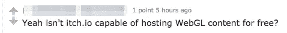
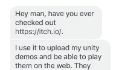
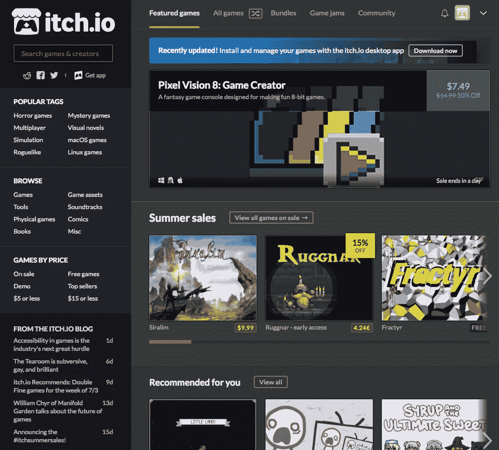
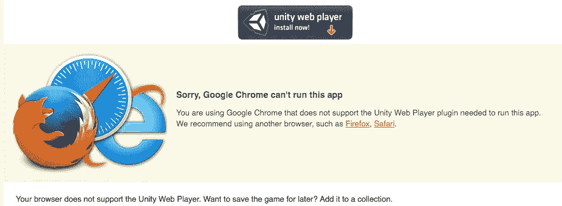
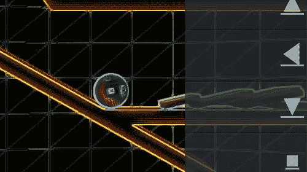
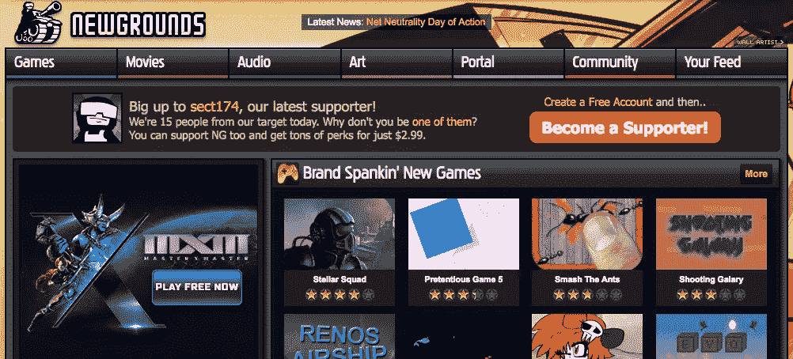
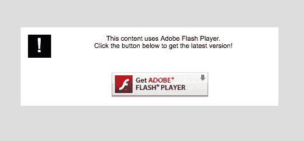
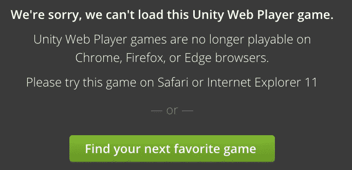
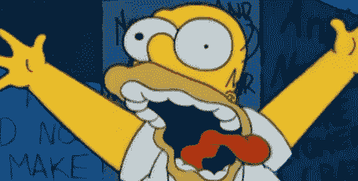
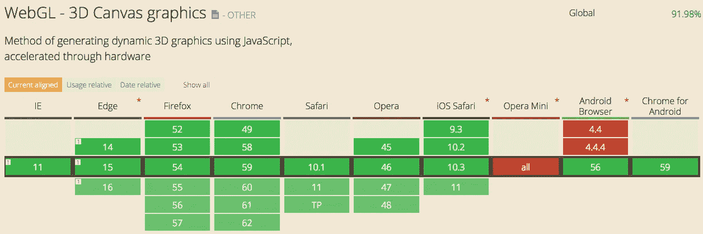

# WebGL 需要一个家:Flash Bit Rot

> 原文：<https://medium.com/hackernoon/webgl-needs-a-home-part-ii-bit-rot-d8c5fec0ebd4>

几天前，[我写了](https://hackernoon.com/webgl-needs-a-home-6f11fddc01df)关于如何在网络上找不到一个有凝聚力的地方来找 WebGL 内容。当你在 Reddit 上发布这种声明时，它会引起一些人的注意。

在这篇文章中，我将谈论在网络上寻找游戏和 WebGL 内容的传统地方，并谈论为什么需要一些新的东西。

但是首先，我在 Reddit 上发布了关于[煨煮工业](http://simmerindustries.com)的帖子，一个我开始解决这个问题的网站。

我得到了几个回复！

所以事实是有的，有很多地方，包括 [itch.io](http://itch.io) 来托管 WebGL 和游戏内容。但是有没有一个有凝聚力的地方？

## itch.io 超级爽……

…但这绝对不同于我试图用[煨工业](https://simmerindustries.com)实现的目标。我认为他们有大约 50，000 个游戏或一些大的东西，但其中很大一部分是可下载的。

[itch.io](http://itch.io)

我点击了很多次才最终进入浏览器/ WebGL 内容(这里有一个链接，链接到 itch [浏览器游戏](https://itch.io/games/platform-web)部分),当我最终到达那里并选择了一个看起来有趣的游戏时，我得到了以下内容:

the dreaded Unity Web Player error

公平地说，在 itch 浏览器游戏部分有很多非常有趣的体验，比如这个球物理[演示](https://therealtakeshi.itch.io/boule):

但我只是觉得我必须做大量的搜索才能找到真正好的 WebGL 内容。

更新:itch.io 创始人 Leaf Corcoran [指出](https://news.ycombinator.com/reply?id=14764779)不需要插件的浏览器游戏的正确页面是[https://itch.io/games/html5](https://itch.io/games/html5)，他在首页增加了一个链接，让他们更容易找到。

## NewGrounds 怎么样？

NewGrounds 是另一个有趣的 2D 和 3D 网页游戏门户。它们从 90 年代就已经存在了！

我在这个网站上找到 WebGL 内容的运气稍微好一点，但是每当我找到一个评价很高的经典游戏时，我得到的是:

## 孔雷盖特怎么样？

Kongregate 是 Web / Indy 游戏的先驱，于 2010 年被出售给 Gamestop。

they let me watch a full 30s advertisement about Six Flags before sending me this error

呃？当然，我会出去下载 IE11…riiiigggghttt。

## 什么是比特腐烂？

在前面的章节中，我已经基本上定义了比特腐蚀，但是这里是教科书的定义:

> **软件腐烂**，也称为**代码腐烂**、**位腐烂**、**软件侵蚀**、**软件腐烂**或[软件熵](https://en.wikipedia.org/wiki/Software_entropy)描述了感知到的“腐烂”，即软件性能随着时间的推移而缓慢恶化，或者其响应能力逐渐减弱，最终导致软件出现故障、不可用，或者被称为[遗留问题](https://en.wikipedia.org/wiki/Legacy_software)并需要[升级](https://en.wikipedia.org/wiki/Software_maintenance)。— [维基百科](https://en.wikipedia.org/wiki/Software_rot)

## 为什么 WebGL 与众不同

> **WebGL** 是一个 JavaScript API，用于在任何兼容的网络浏览器中渲染交互式 3D 和 2D 图形，无需使用插件。

WebGL 是一个 web 标准。这意味着每一个主流浏览器都已经就这个规范达成共识。

它不是 Flash，属于 Adobe。

它不是 Unity 网络播放器，归 Unity 所有。

这是一个开放源代码的网络标准，规范是为任何希望构建自己的浏览器的人发布的。它是开放的、漂亮的，并且已经被所有主要玩家完全采用:

## 我看到了机会

很遗憾所有这些内容都被比特腐蚀掉了，但好消息是有像 WebGL 和 [WebAssembly](https://hackernoon.com/webassembly-the-death-of-the-app-store-c9bc3f9557c8) 这样的新的开放技术可以经受住时间的考验。

想象一下，如果有人编写一个 WebAssembly + WebGL 程序，可以读取和显示大多数旧的 Flash 内容。那真是太酷了。

## 冷静下来

所以我在这篇文章中已经插了几次了，但是我正在创建一个新公司，煨行业，它将托管大量的 WebGL 内容。

在那边的[上车](https://simmerindustries.com)会得到预告发布的通知！

或者在[介质](https://upscri.be/4eb21c/)上添加您的姓名:

请💚如果你喜欢这个，请在 Medium 上跟随我！这给了我继续摇滚的动力。