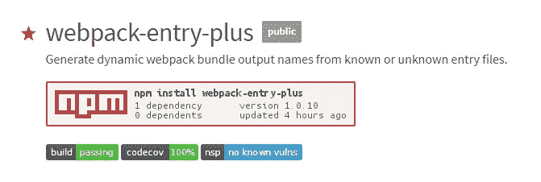

# Webpack:为通配符条目文件创建动态命名的输出

> 原文：<https://medium.com/hackernoon/webpack-creating-dynamically-named-outputs-for-wildcarded-entry-files-9241f596b065>

如果这不是一个性感的头衔，我不知道什么是。

最近，当我试图让它输出以条目文件动态命名的包时，遇到了一个 Webpack 大小的砖墙。棘手的部分是，我希望它对我将来可能要编写的某一类型的所有文件进行前瞻性的处理。

我在网上找不到任何答案或可以招募的节点包，所以我决定自己写。



[https://www.npmjs.com/package/webpack-entry-plus](https://www.npmjs.com/package/webpack-entry-plus)

问题如下:我有一个文件夹存放我所有的核心 JavaScript 代码:

```
|-- core
    |-- file1.js
    |-- file2.js
```

我知道这些文件的名称，我也知道我希望将它们捆绑在一起，以及将输出文件放在哪里:

```
|-- build
    |-- main.js    << Bundle all core files here
|-- core
    |-- file1.js
    |-- file2.js
```

容易做到:

```
// webpack.config.jsmodule.exports = {
  entry: ['./core/file1.js', './core/file2.js'],
  output: {
    filename: './build/[name].js',    << [name] defaults to 'main'
  },                                  << more on that later
}
```

然后，我在某个地方有一堆其他文件夹，它们只与某些内容相关，我希望它们的包相对于源条目文件的位置输出:

```
|-- build
    |-- main.js
|-- core
    |-- file1.js
    |-- file2.js
|-- content
    |-- one
        |-- index.js       << This index
        |-- main.js        << Gets bundled here
    |-- two
        |-- sub
            |-- index.js   << This index
            |-- main.js    << Gets bundled here
```

作为开发人员，我们编写了`index.js`,但是我们希望 [Webpack](https://hackernoon.com/tagged/webpack) 获取它并处理同一个文件夹中紧挨着它的输出`main.js`。我们已经能够通过将一个对象传递给 Webpack 的`entry`值，覆盖默认的`[name]`，并处理多个包来做到这一点。只要我们了解我们正在处理的文件，这种方法就有效:

```
// webpack.config.jsmodule.exports = {
  entry: {
    build:           ['./core/file1.js', './core/file2.js'],
    content/one:     ['./content/one/index.js'],
    content/two/sub: ['./content/two/sub/index.js'],
  },
  output: {
    filename:        './[name]/main.js',
  },
}
```

Webpack 将用每个`entry`对象的条目构建一个包。键`(build, content/one, content/two/sub)`将作为`[name]`值传递给`output`，要捆绑的文件将是每个键的数组值。

这项技术非常强大，如果您愿意，可以用来生成带扩展名的绝对文件名，例如:

```
...entry: {
  build/main.js: ['./core/file1.js', './core/file2.js'],
},
output: '[name]',...
```

我们难题中的最后一个挑战是，我们并不知道我们想要构建的所有`content`包，即使我们知道，我们也不一定想要为所有的包硬编码条目。所以我们使用`glob`节点包来匹配一个通配符，并返回一个包含所有与之匹配的文件的数组:

```
// webpack.config.jsconst glob = require('glob');entry: glob.sync('content/**/index.js'),  << Returns Array of files
```

最后，这就是问题所在。没有办法为每个通配符文件创建一个包，然后输出到与条目相同的文件夹中。

但是知道了我们对`entry`值对象的了解，并且能够操纵`[name]`为我们所用，用一个下午的时间编写代码就能得出一个解决方案。操作 filepath 值，为我们的构建返回一个合适的`[name]`:

```
// webpack.config.jsconst glob = require('glob');const entryArray = glob.sync('content/**/index.js');const entryObject = entryArray.reduce((acc, item) => {
  const name = item.replace('/index.js', '');
  acc[name] = item;
  return acc;
}, {});module.exports = {
  entry:  entryObject,
  output: '[name]/main.js',
}
```

上面的`entryObject`将返回这个，一个适合 Webpack 的`entry`值的值:

```
{
  content/one:     ['./content/one/index.js'],
  content/two/sub: ['./content/two/sub/index.js'],
}
```

如果有必要，我们可以使用`Object.assign()`来组合指定或通配符条目文件的多个对象，以使用这种技术创建适当的输出包，或者使用`.reduce()`或`.map()`或我们喜欢的任何东西。而这正是我所做的:)

但是，因为我认为这是一个没有现有解决方案的常见问题，所以我创建了一个简单的包，它可以为我们处理所有这些问题，并为大多数其他用例提供一个合理的 API。

无论您是想要推出自己的定制实施，还是想要一个开箱即用的解决方案，我都建议您查看一下:

[](https://www.npmjs.com/package/webpack-entry-plus) [## 网络包-入口-plus

### 从已知或未知的条目文件生成动态 webpack 捆绑包输出名称

www.npmjs.com](https://www.npmjs.com/package/webpack-entry-plus)