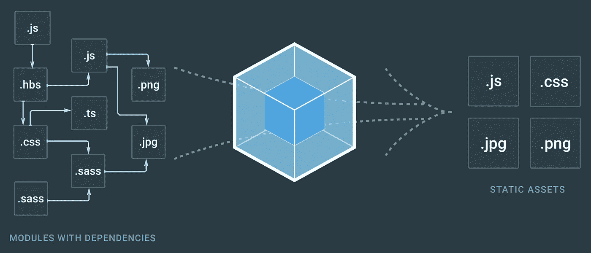

# Webpack 加载器和插件，用于您的新渐进式 Web 应用程序。

> 原文：<https://medium.com/hackernoon/webpack-loaders-and-plugins-for-your-new-progressive-web-app-378e09f469>



我假设你已经知道什么是[网络包](https://webpack.js.org/concepts/)，为什么它很棒，以及[它是如何工作的](https://webpack.js.org/guides/get-started/)，那么让我们开始吧:

你可能知道 [Webpack](https://hackernoon.com/tagged/webpack) 的常用工具有:[样式加载器](https://github.com/webpack-contrib/style-loader)、 [html-webpack-plugin](https://github.com/jantimon/html-webpack-plugin) 、[extract-text-web pack-plugin](https://github.com/webpack-contrib/extract-text-webpack-plugin)、[文件加载器](https://github.com/webpack-contrib/file-loader)和其他流行的东西。

## 1.离线插件

> webpack 的脱机插件(ServiceWorker，AppCache)

*来自官方描述:*

该插件旨在为 webpack 项目提供离线体验。它使用 ServiceWorker 和 AppCache 作为后台的后备。只需在您的`webpack.config`中包含这个插件，并在您的客户端脚本中包含相应的运行时，您的项目就会通过缓存所有(或部分)webpack 输出资产而准备好离线。

[](https://github.com/NekR/offline-plugin) [## NekR/离线插件

### web pack(http://webpack.github.io/)的离线插件

github.com](https://github.com/NekR/offline-plugin) 

## 2.预加载-网络包-插件

[](https://github.com/googlechrome/preload-webpack-plugin) [## Google chrome/preload-web pack-插件

### 这是一个用于连接`` `(和预取)的插件，支持异步块

github.com](https://github.com/googlechrome/preload-webpack-plugin) 

> 一个用于连接`<link rel="’preload’">`(和预取)的 Webpack 插件，支持异步块

*来自官方描述:*

一个 Webpack 插件，用于使用`<link rel='preload'>`自动连接异步的(和其他类型的) [JavaScript](https://hackernoon.com/tagged/javascript) 块。这有助于延迟加载。

## 3.web pack-清单-加载程序

> 用于生成资产清单的 Webpack 插件

自动为你的 app 生成 [manifest.json](https://developers.google.com/web/updates/2014/11/Support-for-installable-web-apps-with-webapp-manifest-in-chrome-38-for-Android) 。

[](https://github.com/danethurber/webpack-manifest-plugin) [## danethurber/web pack-清单-插件

### 用于生成资产清单的插件

github.com](https://github.com/danethurber/webpack-manifest-plugin) 

## 4.PurifyCSS-webpack

> 用 webpack 删除未使用的 CSS

可能，您不希望在您的产品构建中包含未使用的 CSS，这就是 [Purify-CSS](https://github.com/purifycss/purifycss) 的来源。这个 webpack 加载器的目的是移除未使用的 css 选择器。

**注意:**你**应该**配合[extract-text-web pack-plugin](https://www.npmjs.com/package/extract-text-webpack-plugin)使用。

[](https://github.com/webpack-contrib/purifycss-webpack) [## 贡献/purify CSS-网络包

### 用 webpack 删除未使用的 css

github.com](https://github.com/webpack-contrib/purifycss-webpack) 

## 5.复制-网络包-插件

> 这是一个 [webpack](http://webpack.github.io/) 插件，将单个文件或整个目录复制到构建目录。

[](https://github.com/kevlened/copy-webpack-plugin) [## kevlened/copy-webpack-plugin

### 拷贝网络包中的文件和目录

github.com](https://github.com/kevlened/copy-webpack-plugin) 

简单的插件，允许你复制文件/目录。

常见情况是将静态文件(媒体、图像)复制到 dist 文件夹中:

```
new CopyWebpackPlugin([
            {
                from: _.cwd('./static'),
                // to the root of the dist path
                to: './'
            }
        ])
```

## 6.同构风格加载器

> Webpack 的 CSS 样式加载器，针对同构(通用)web 应用程序进行了优化。

[](https://github.com/kriasoft/isomorphic-style-loader) [## kriasoft/同构风格加载器

### Webpack 的 CSS 样式加载器，针对同构(通用)web 应用程序进行了优化

github.com](https://github.com/kriasoft/isomorphic-style-loader) 

*来自官方文件:*

一个替代的 CSS 样式加载器，其工作方式类似于[样式加载器](https://github.com/webpack/style-loader)，但是针对[同构应用](http://nerds.airbnb.com/isomorphic-javascript-future-web-apps/)进行了优化。除了 style-loader 提供的功能之外，它还允许在服务器端渲染(SSR)期间渲染[关键路径 CSS](https://developers.google.com/web/fundamentals/performance/critical-rendering-path/) ，方法是向`styles`对象- `._insertCss()`(将 CSS 注入 DOM)和`._getCss()`(返回 CSS 字符串)添加两个助手方法。

## 7.Eslint-loader

> eslint 加载器(用于 webpack)

[](https://github.com/MoOx/eslint-loader) [## MoOx/eslint-loader

### eslint-loader - eslint 加载器(用于 webpack)

github.com](https://github.com/MoOx/eslint-loader) 

装载机，Eslint-装载机。你知道 eslint `fix` 选项吗？使用这个选项，你的代码将被 eslint 自动格式化。

[**如何用所有这些插件和加载器构建 app？看一下这个例子。**](https://github.com/Metnew/react-semantic.ui-starter)

*Github:*[*【https://github.com/Metnew】*](https://github.com/Metnew) *Twitter:*[*https://twitter.com/coldlinecall*](https://twitter.com/coldlinecall)

[](http://bit.ly/HackernoonFB)[](https://goo.gl/k7XYbx)[](https://goo.gl/4ofytp)

> [黑客中午](http://bit.ly/Hackernoon)是黑客如何开始他们的下午。我们是 AMI 家庭的一员。我们现在[接受投稿](http://bit.ly/hackernoonsubmission)并乐意[讨论广告&赞助](mailto:partners@amipublications.com)机会。
> 
> 如果你喜欢这个故事，我们推荐你阅读我们的[最新科技故事](http://bit.ly/hackernoonlatestt)和[趋势科技故事](https://hackernoon.com/trending)。直到下一次，不要把世界的现实想当然！

