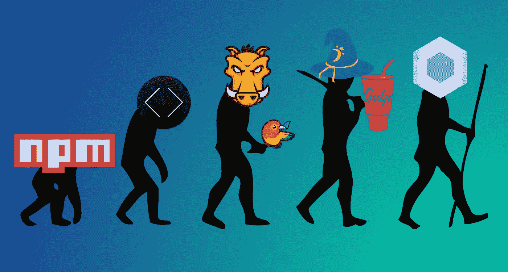
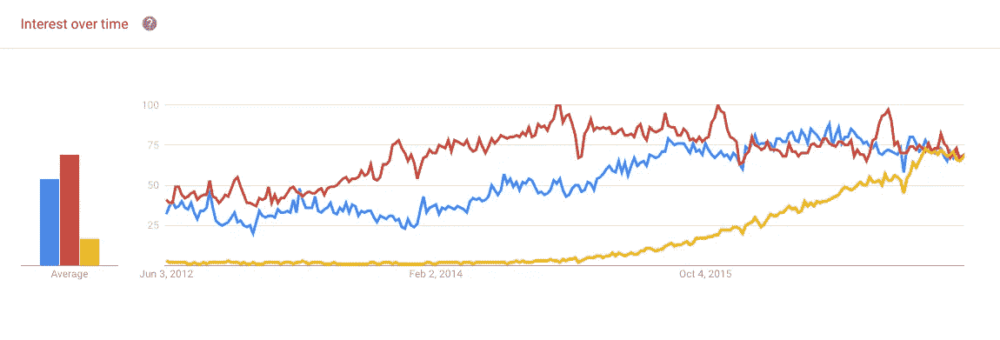

# 网络包与吞咽

> 原文：<https://medium.com/hackernoon/webpack-vs-gulp-e623616b1dc>

随着 Webpack 越来越受欢迎，越来越多的人开始将其与 Gulp 进行比较。

开发者之间激烈的讨论，挤满了[网站和](https://hackernoon.com/tagged/web-development)网站关于哪个更好的评论区。本指南将解释什么是 [Webpack](https://hackernoon.com/tagged/webpack) ，它与 Gulp 有何不同，以及最重要的是——你应该使用哪一个。

# 介绍

The evolution of Homo Frontendalis. Source: blog.qmo.io

在过去的几年里，web 开发行业发生了很多变化。似乎新的工具在不断取代旧的决议。以 CodeKIT 为例:一个基于 GUI 的工具，用于编译和缩小工具和资源，它被 Grunt 所取代。当 Gulp 出现时，它立即以其直观性和强大的功能赢得了 web 开发人员的心。

现在，Webpack 开始流行起来。会完全取代 Gulp 吗？对此有各种不同的看法，但趋势是强有力的:

Grunt (red), Gulp (blue) and Webpack (yellow) in Google Trends

# 想了解更多？[点击此处查看全文](https://buddy.works/blog/webpack-vs-gulp)。

> [黑客中午](http://bit.ly/Hackernoon)是黑客如何开始他们的下午。我们是 [@AMI](http://bit.ly/atAMIatAMI) 家庭的一员。我们现在[接受投稿](http://bit.ly/hackernoonsubmission)并乐意[讨论广告&赞助](mailto:partners@amipublications.com)机会。
> 
> 如果你喜欢这个故事，我们推荐你阅读我们的[最新科技故事](http://bit.ly/hackernoonlatestt)和[趋势科技故事](https://hackernoon.com/trending)。直到下一次，不要把世界的现实想当然！

