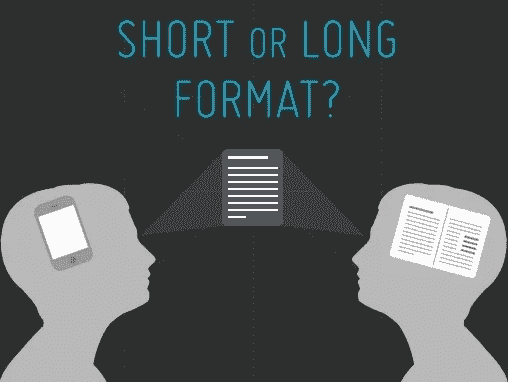
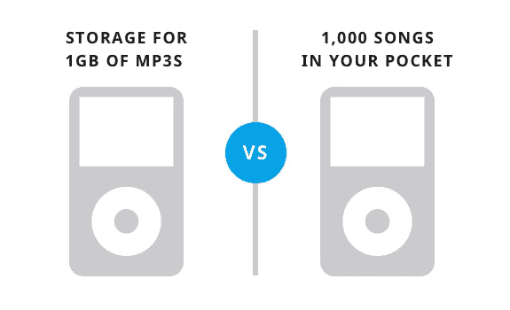
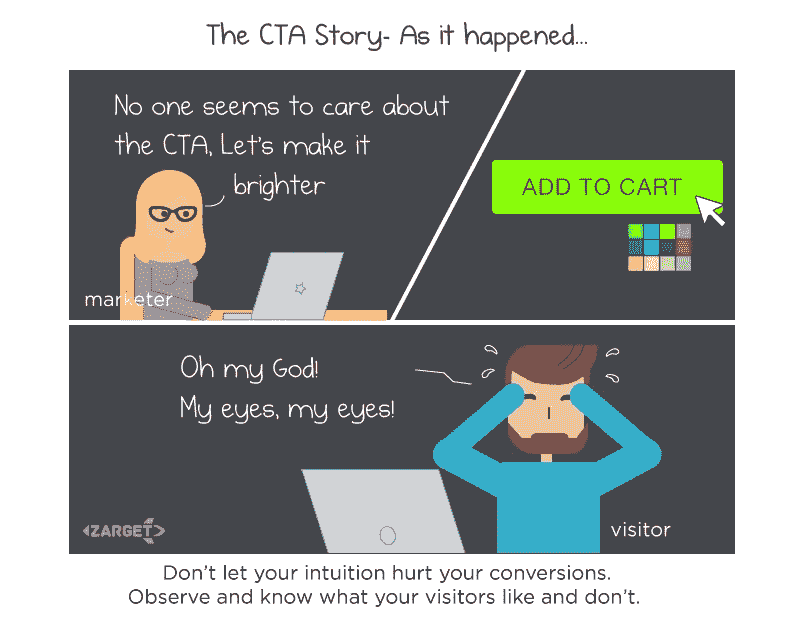

# 网站转化率优化在 4 个快速步骤

> 原文：<https://medium.com/hackernoon/website-conversion-rate-optimisation-in-4-quick-steps-87c13615df25>

## 运行有效**漏斗、A/B 和热图指数**的提示

## 转化率优化数据是避免不同意见之间冲突的最简单方法。

每一个 c **转化率优化专家**的一个大胆说法是——它(CRO)是 ***数据驱动*** 。

但是在你开始访问网站数据之前，你首先需要为你的网站做好充分的准备。CRO 的最初步骤对于营销人员获得精确的**漏斗、A/B 测试和热图**结果以及获得势不可挡的营销成功至关重要。

# TL；WR — #TooLongWontRead

将转换率优化测试分为以下 4 个步骤将会给你更好的见解和扣人心弦的结果。

*   **步骤 1 —收集数据**
*   **步骤 2 —评估关键指标**
*   **第 3 步—开始测试什么**
*   **第四步——分析你的假设**

# #ILoveReading

# 步骤 1 —收集数据

通过对你想转换的每一页进行下面的分析，你可以得到很好的见解。

*   **八卦分析**——找出你现有页面上的明显错误——相关性、清晰度、摩擦和干扰。
*   **科学/技术分析** —通过运行跨浏览器和跨设备测试来查找任何技术故障。
*   **Web Analytics 分析** —运行漏斗和 A/B 测试，分析访问者在哪里以及如何离开你的网站。找出你的转换漏斗中的漏洞。
*   **定性测试** —触发页面调查或电子邮件调查，直接从用户那里获得反馈。
*   **用户测试**——邀请你的一些用户，邀请你的用户与你的网站互动，观察他们如何感知/理解你的功能。从他们那里获得实时反馈。

# 步骤 2 —评估关键指标

**关键绩效指标**(KPI)用于评估产品到达目标受众的**成功率。选择精确的关键性能指标是测试中最关键的部分。众所周知，选择 KPI 因我们所处的行业而异，以下是 CRO 常用的 KPI 列表:**

*   访问次数
*   视图数量
*   在网站上的平均时间
*   页面上的平均时间
*   跳出率
*   退出率
*   转换总数
*   汇率
*   收入(投资回报率)

# SYH？甜食🙂继续…

# 第三步——去测试什么

## "对于你做的每一个 X 测试，期待你的结果."

要知道你的网站是否准备好进行你将要进行的 A/B 测试，问自己以下问题，

*   我在测试什么？(CTA、标题、标题图像等等。)
*   我在为谁测试？(有机流量、潜在线索、新客户等等。)
*   我在哪里测试？(在登录页面、产品页面、结账页面等。)

您可以测试多种东西，但以下是一些最重要的元素:

*   测试标题
*   测试主题行
*   测试标题

# 测试短格式和长格式副本

一般的经验法则是，你的产品/服务越复杂，副本需要的时间就越长。每种情况都是独一无二的，这就是我们表演 CRO 的原因。

**长格式内容**一般来说，长度超过 2000 个单词，这样读起来更有深度和洞察力。

**例如**电子书、白皮书等等。我们使用长格式内容有很多原因。

在你的内容策略中加入长文的另一个原因是为了展示你对特定主题或行业的专业知识。

**简式内容**拥有当下的营销潮流。此外，我们知道通过读者的脑细胞发送小颗粒内容比发送大块内容更容易。这可以解释更多类似于 **Vine** (六秒)视频、**信息图表**等等。这些类型内容易于处理。

长格式和短格式内容都是必要的，而**短格式内容**更倾向于**吸引**和**连接**与观众，而**长格式内容**意在**教育**和**告知**。

# 测试功能与优势

如果我们被要求描述我们的**产品**或服务，第一反应是列出我们产品的**特点**。这在逻辑上可能是对的，但这不是提高转化率的理想方式。相反，开始**测试你能从这些特性中获得的不同好处**。

# 设计您的页面

你的网页看起来有多好和你的网页向你的访问者表达了什么一样重要。您必须重新设计和 A/B 测试的一些重要设计元素包括:

*   图像取代文本
*   颜色和对比度
*   导航提示
*   图像类型
*   空白
*   字体样式和字体大小

# 添加信任元素

你的页面越可靠，它的转化率就越高。人们选择从他们真正信任的人那里购买或选择加入。转化率低通常是因为你的页面没有传达出一种值得信赖的感觉。因此，考虑测试以下元素的效果:

*   支持索赔的数据和统计
*   徽标(在新闻、行业博客中)
*   文字证明
*   视频证明
*   安全标志
*   担保和保修信息

# 定位 CTA

你页面上的**CTA**至关重要，因为它们要求你的用户采取**的最后步骤**。最终目标是，让你的访客通过转换漏斗，最终将他们转化为你的目标。当然，我们都不希望看到我们的访问者到达漏斗的尽头，然后因为一个薄弱的 CTA 而离开。

*   定位您的 CTA(折叠上方或下方)
*   CTAs 颜色、形状和大小
*   CTAs 信息(了解更多…)
*   单页上的多个 CTA

# 第四步——分析你的假设

一旦你确定了网页的设计和其他要素，并形成了一个假设，是时候进行测试了。但是在开始测试之前，创建一个大纲，看看你的测试是否可行。

# 创建一个线框

显然，如果你只是对你的网站或页面做了一些调整，大纲就没有必要了。但是如果变化很大，并且影响了你的页面布局，那么在实现之前，很有必要进行一次 ***视觉检查*** 。

在实施新设计之前，您需要问自己一些问题:

*   转换路径是否清晰？
*   游客来自哪里？
*   CTA 好找吗？
*   设计和信息是否相辅相成？
*   它在移动设备上的响应速度如何？

一旦你确定你的新设计比当前的更有吸引力，就去测试它。

# 执行您的测试

现在你已经准备好开始对你的新设计进行 A/B 测试，为它设置**统计显著性**和**所需的** **样本大小**。开始测试，不要停止，直到你的设计达到你设置的两个标准。

**A/B 测试计算器**对测量合适的样本量有很大帮助。

# 查看您的结果

测试完成后，检查结果并实现成功的版本。将它作为您的默认版本，并面向您的受众。

查看结果时，问自己以下问题:

*   你的转化率提高了多少？
*   这对你的收入有多大影响？
*   是否有任何 KPI 出现显著增长？

从答案中，你可以得到，要么用另一个版本重复同样的测试，要么继续不同的测试。

**定论**:总有进步的空间！即使是最好的版本也可以随时调整，使其转换得更好。

***只是不停地测试……***

# 发这些→👏 👏 👏如果你喜欢这条建议😄