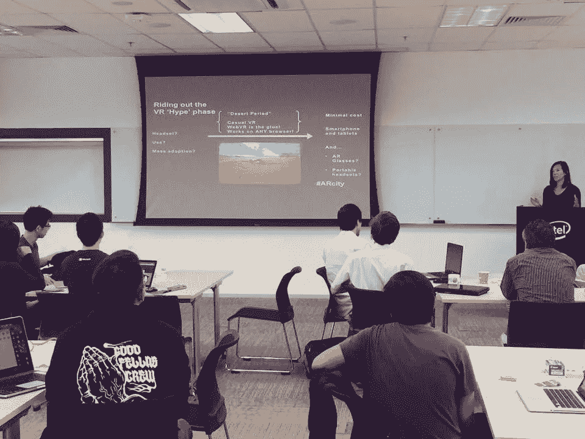
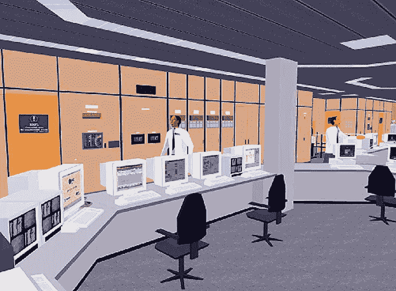
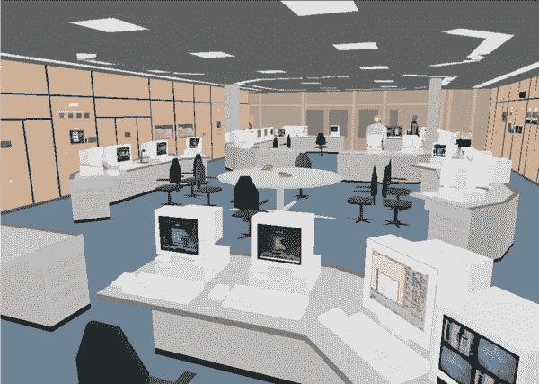
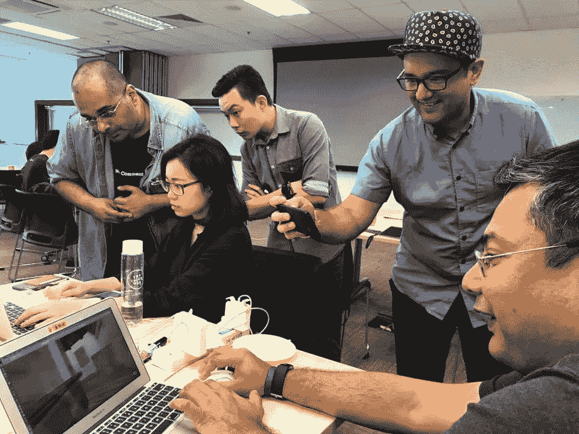
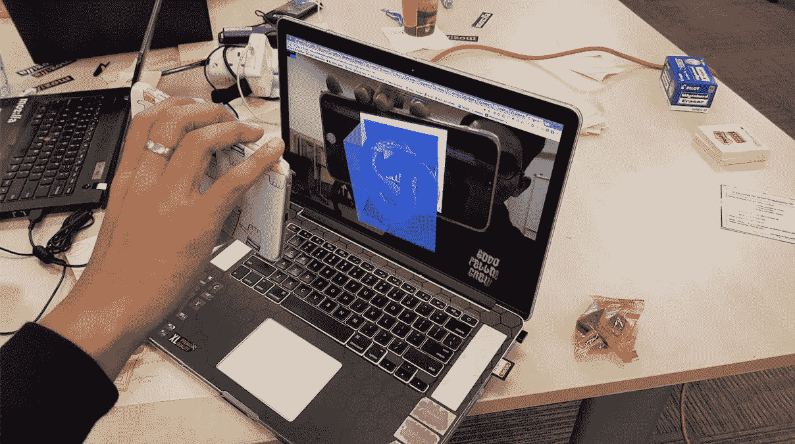

# WebVR:走对主流 VR 阻力最小的路

> 原文：<https://medium.com/hackernoon/webvr-taking-the-path-of-least-resistance-to-mainstream-vr-49da624f7b6a>

*发表于 2017 年 9 月 4 日* [*VRScout*](https://vrscout.com/news/webvr-path-of-least-resistance-to-mainstream-vr/)

**

## *当我们被虚拟现实炒作周期和“虚拟现实什么时候会成为主流？”辩论，被低估和忽视的网络虚拟现实悄悄地向我们走来。*

*如果你想知道为什么你开始在头条新闻中看到越来越多关于 WebVR 的讨论，你并不孤单。仅在今年，我们就已经看到了谷歌和火狐的重大发布，以及独立网络虚拟现实社区的持续增长，比如 JanusVR:*

*这只是开始；从这里开始会有更多。网络虚拟现实的根源实际上始于 23 年前虚拟标记现实语言(VRML)的概念化，最终并没有起飞，但为我们所知的蓬勃发展的虚拟现实网络铺平了道路。*

## *什么是 WebVR？*

*[WebVR](https://www.youtube.com/watch?v=Le8pTXQqM3s%20https://webvr.rocks/) 是一个用于在浏览器中渲染 3D 图形的 JavaScript API，这意味着，如果你在浏览器中输入 3D 网站的链接，你会发现自己处于 3D 空间中(无论是在你的计算机浏览器上还是在 VR 耳机中)。用外行人的话来说，WebVR 是一个低门槛的切入点，可以为 web 开发 VR，而不必熟悉 WebGL，初学者掌握起来会很沮丧。*

*对于消费者来说，WebVR 的易用性和无摩擦性为虚拟现实(VR)和增强现实(AR)的主流采用带来了一线希望。*

*虽然高端体验和硬件肯定有一席之地，但并不是所有的虚拟现实都需要作为“高端”体验。事实上，对于许多用例(比如访问基本网站)，这些体验的可访问性比它们展示尖端图形更重要。最终，正是这些体验将推动沉浸式技术的大规模采用。*

## *“休闲虚拟现实”阶段*

> *为什么和如何？虽然我们正在经历一些人所说的虚拟现实“幻灭的低谷”，但 web VR——我们可以称之为“休闲虚拟现实”——为没有最先进硬件的消费者通过多个平台上的网络体验虚拟现实铺平了道路。事实上，从长远来看，这可能是虚拟现实民主化的最佳方式。*

**

**WebVR developers at a WebVR xLab. Copyright: Vanessa Radd.**

*在过去的几年里，Web 开发人员一直在悄悄地开发和构建这个新的 Web。没有大肆宣传的建设的好处是，开发商可以专注于。WebVR 是对 VR 的“一次编码，多平台工作的回答”，因此它已经证明自己是开发人员快速构建 VR 或 AR 原型并推出产品的成本有效的工具。*

## *技术不可知*

> *英国伯明翰大学人机界面技术团队负责人 Bob Stone 教授说:“多年来，我一直在强调'[技术](https://hackernoon.com/tagged/technology)不可知论'这一术语的重要性，这是基于 20 世纪 90 年代[为虚拟现实开发]的早期经验，当时我们看到各种组织因标准化一种渲染或建模工具包解决方案而遭受甚至失败。*

*在那些日子里，有了诸如[虚拟](https://hackernoon.com/tagged/virtuality)、Division 的 dVS/dVise、Superscape 的 VRT 和 Sense8 的 WorldToolKit 等软件平台，虚拟现实开发人员不得不创造性地创建和移植他们的资产，以确保他们所构建的东西的寿命和持久力。*

*“即使在今天，我们仍然坚持技术不可知的政策，”斯通说。“我们以开放或行业标准的格式存档我们的模型、纹理、代码等，这样，如果一家公司消失了，我们的赞助商和合作者不会空手而归。”*

**

**A British Nuclear Fuels PLC control room modeled and rendered in the 1990s using Superscape’s VRT platform.**

**

**The same BNFL control room model hosted under Division’s dVS/dVISE platform, but using the same assets as in the image above.**

**

**The actual BNFL Control Room, built following early prototyping and human factors trials using VR.**

## *展望未来*

*Mozilla 率先开创了 WebVR，在 2015 年推出了其 [A-Frame](https://www.youtube.com/watch?v=1MskH9uqOyQ) VR 内容创作工具，以及其 [MozVR](https://mozvr.com/) 资源。*

*Mozilla 的技术宣传员迪特里希·阿亚拉(Dietrich Ayala)表示:“我们看到的是，许多公司，无论大小，都在使用 A-Frame 作为快速内容创作工具，并将其作为低摩擦的内容分发方式发布到网络上。“我们的立场是，像 A-Frame 这样的工具降低了内容作者的准入门槛，并简化了每个人的分发。”*

*除了 A-Frame，其他的 WebVR 框架还有 React VR、Argon.js、PlayCanvas、JanusVR 和 Primrose。 [Google](https://www.webvrexperiments.com/) 、 [Oculus](https://developer.oculus.com/webvr/) 和[三星互联网](https://github.com/samsunginternet)也公布了他们的 WebVR 和开源开发者资源。*

*Mozilla、谷歌、三星、脸书、英特尔、微软和其他主要技术公司成立了一个决定网络虚拟现实标准的网络虚拟现实社区组织，苹果最近于今年 7 月[加入了该社区](http://appleinsider.com/articles/17/07/05/apple-software-engineers-join-webvr-virtual-reality-accessibility-group)。*

*阿亚拉说:“虚拟现实生态系统中的网络越多，虚拟现实作为一个创造和创新的地方蓬勃发展的机会就越大。”“随着大多数主流浏览器实现网络虚拟现实，苹果也表示出一些兴趣，标准方面看起来非常积极。”*

## *浏览器*

*在浏览器方面，浏览器供应商正在开发或增强他们的[浏览器](https://webvr.rocks/)，使其对虚拟现实友好:有适用于 Android 的 Chrome、Firefox Nightly、三星互联网、微软 Edge、Chrome、Servo 和 [Oculus Carmel](https://techcrunch.com/2016/10/06/oculus-webvr/) 。你只需要一个桌面或移动浏览器和互联网连接，就可以通过虚拟现实耳机观看虚拟现实网站，或者在 2D 随意观看虚拟现实内容，无需耳机。*

*Mozilla 最近宣布了一项新的 VR 增强功能:它是第一个支持所有用户使用 WebVR 的桌面浏览器。*

## *内容和教育*

*在虚拟现实内容匮乏的情况下，网络虚拟现实内容创作者正聚集在一起进行创作和合作。超过一百万的创作者在 Sketchfab 的 3D/VR 艺术社区平台上分享他们的 3D 模型。Virtuleap 还组织了首届全球 WebVR 黑客马拉松。*

*“对于教育和遗产等应用领域，为网络开发虚拟现实场景和体验非常重要，”Stone 说。“[这]促进了许多受益者的可访问性，而(不一定)需要昂贵和复杂的计算或人机界面硬件。”*

*这种民主化的方法为教育带来的可能性远远超出了我们今天所看到的。*

*斯通说:“我还认为，作为一种 JavaScript API，WebVR 还能让许多未来的学生和年轻的开发人员‘尝试一下’,开始构建展示他们能力的组合，最终展示给未来的雇主。”“我记得 VRML 时代的承诺，以及 SGI 的 Cosmo 和 Cortona3D 等产品(当然，这些产品今天仍然可用)。但是，在 20 世纪 90 年代末和 21 世纪初，能够在专业平台上以更高质量的形式开放互动——令人印象深刻——的虚拟现实体验演示的能力，成为了一种令人惊叹的营销工具。”*

## *为网络虚拟现实和原生应用创建虚拟现实/增强现实内容*

*所以你看到了用 ARKit 制作的门户演示，它在互联网上掀起了风暴。类似地，对于 WebVR，Mozilla 的 A-Frame 允许这样做，尽管使用了“[链接遍历](https://blog.mozvr.com/link-traversal/)”。在这里，你可以创建单独的宇宙来探索，在移动或桌面网络上进出——不需要任何应用程序。最好的部分是你可以呆在网站本身。这是开放网络上的“宇宙”(或门户)遍历。有了 app，你就要离开 app 的约束，去开一个新的。*

*有了 ARKit，人们对 VR 和 AR 内容创作的可能性有了观念上的转变，使大众可以获得内容创作的能力。它解放了更多有创造力的头脑来探索为网络创建 VR 和 AR。*

*就在几周前，我们看到有人把 ARKit 黑进了网络浏览。*

*围绕 AR 在 web 上还有许多其他的实验:将 Argon.js 集成到 A-Frame 中，一个在 Tango(现在的 ARCore)设备上工作的 Chromium 扩展，以及 AR.js。*

*网络虚拟现实的另一个令人兴奋的发展是谷歌本周宣布推出 ARCore。*

> *“到今年年底，所有主要的全球手机品牌都将宣布支持网络虚拟现实，并将在 2017 年第四季度或 2018 年 Q1 奥运会之前推出支持网络虚拟现实的设备，”XR 行业顾问兼天使投资人 Christopher Gomez 表示。“随着 ARKit 和 ARCore 的加入，我们将拥有一个充满活力的平台和想法组合。沉浸式技术将会一直存在——它将成为每个人的现实。《元宇宙》——它是真实的。”*

## *实验是关键*

*在虚拟现实的这个阶段，实验是必要的——社区的创造力是巨大的。如果你是一名 Unity 开发者，集成并接受为 WebVR 开发是相当无缝的。*

*“我喜欢 Unity 的工作流程，网上有很多支持和教程，如果你被困在搜索任何有关它的问题，可能会给你一个有用的答案，”三星互联网开发者倡导者 Uve 说。“A-Frame 是一个流行的 WebVR 框架，它有一个类似于 Unity 的对象组件系统和良好的文档，所以大多数 Unity 开发者如果想尝试一下，将能够转换并相对快速地掌握它。”*

*Unity 作为一个集成开发环境(IDE)和图形引擎，是一个多功能工具，可以快速构建各种类型的体验。开发人员能够将资产编译或导出到不同的本地或 web 平台。*

*三星互联网*的开发者代言人 Diego gonzález-ZúIgA 说:“现在可以通过一个[插件](https://github.com/gtk2k/Unity-WebVR-Assets)在 Unity 中使用 WebVR，对 WebVR 的支持将被集成到 Unity WebGL 中，使 Unity 项目无需修改即可工作。”。*“引擎能够在浏览器的网络虚拟现实实现上创建虚拟现实体验只是时间问题。”*

## *“扩张的城市”#ARCity*

*随着 WebVR 内容创作者和开发者开始在全球范围内融合，在新加坡，社区于 7 月聚集在“增强城市”体验 xLab。这个 xLab 是由 [XR 联盟](https://www.facebook.com/XR-Alliance-1703741423255746/) ( [@xrforce](http://www.twitter.com/xrforce) )与 Mozilla 和亚洲协会 [VR AR Women](https://www.facebook.com/groups/vrarasia/) 合作组织的，这是全球第一个此类 xLab，由[英特尔](https://www.intel.sg/content/www/xa/en/homepage.html)支持的第一个 xLab 装置启动。*

**免责声明:我是 XR 联盟的创始成员，也是亚洲协会 VR AR 女性的创始人。**

**

**WebVR content creators in Singapore**

*使用 A-Frame 和提示:“我们如何以有趣、吸引人和有趣的方式来增加或虚拟化我们对新加坡的体验？”由技术设计师和开发人员组成的参与者聚集在一起，为网络原型和构建 VR/AR 内容，以引人入胜的方式讲述历史和他们在这座城市的经历。*

**

**Creating an AR Tracker**

*这些项目由研讨会参与者、 [AsiaXR group](https://www.facebook.com/groups/xralliance/) 和 [WebVR Asia community](https://www.facebook.com/groups/webvrasia/?ref=br_rs) 和 [group](https://www.facebook.com/groups/webvrasia/?ref=br_rs) 构建，像任何 WebVR 构建一样，允许网络上的任何人从[资源库](https://github.com/augmented-city/singapore)获取代码，并在此基础上构建和混合自己的创作。*

> *“xLab 的开发是为了鼓励在沉浸式技术领域对工具进行创造性的探索，”戈麦斯说。“实验室本身是为便携性而设计的，因为将它扩展到全球其他城市的计划正在进行中。在这个系列中，用于 VR 和 AR 内容创作的 WebVR 工具是重点。Mozilla 和英特尔在这方面一直是很好的合作伙伴，在他们的持续支持下，我们知道 VR 和 AR 的未来对我们所有人来说都是光明的。”*

*为期一天的实验室(包括一个构思会议，然后是一个硬编码会议)产生的项目包括一个城市洪水的 VR/AR 模拟(特色图像)，建立遗愿清单，实验在 VR 和 AR 中旋转 360°图像，在 AR 中跟踪物体，以及“我们建造了这座城市”——人们对这座城市的记忆的元标签，等等。*

**

*我们正朝着体验 3D 的一切迈进:网络、娱乐、应用、全球会议等等——因此，公司和开发者需要跟上速度，否则就会落后。网络虚拟现实允许探索想象力，实验和合作。内容创作者、独立艺术家和开发者渴望创作，等待虚拟现实技术的发展是不可行的。*

**

*WebVR 允许表达的创造性、VR 的民主化和无应用程序的体验。至少在可预见的未来，这是阻力最小的路径，允许 VR 和 AR 内容的传播以及充满活力的民主化生态系统。*

*—
Vanessa Radd @vanradd 是 XR 联盟的创始成员，新加坡 VR AR 协会主席，亚洲 VR AR 妇女协会创始人。Radd 被评为全球前三大增强现实影响者。*