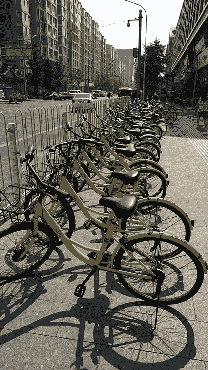
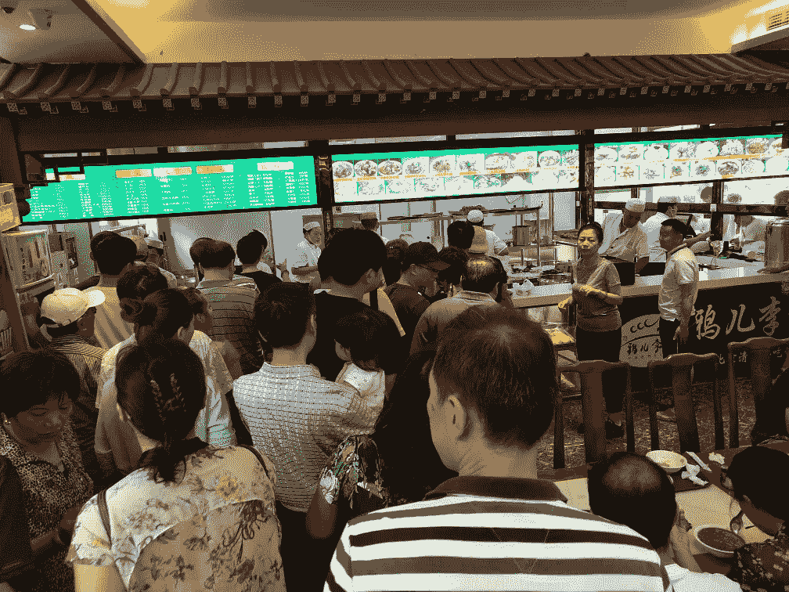
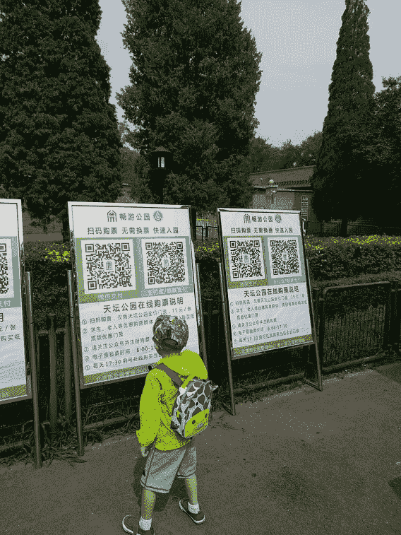
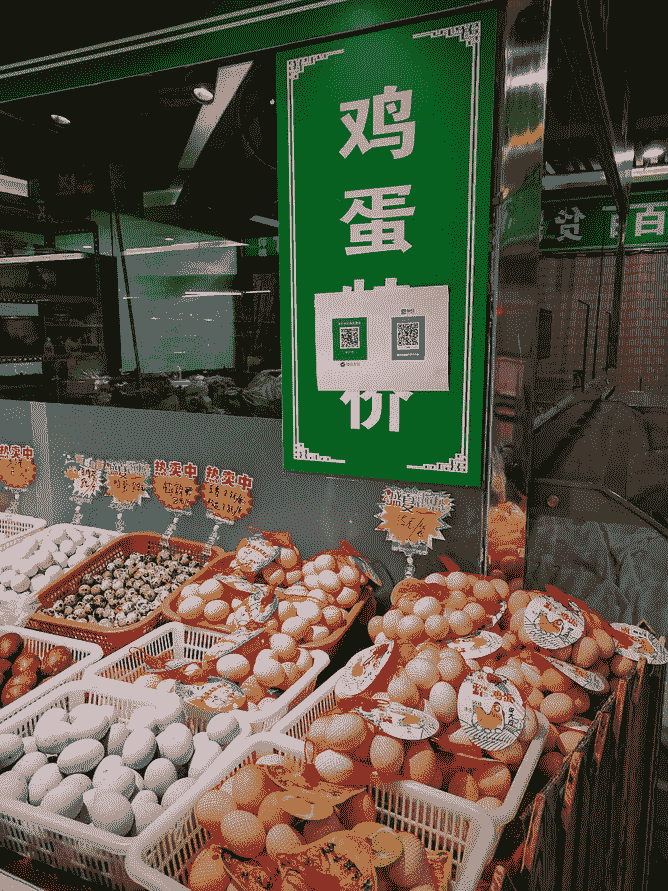
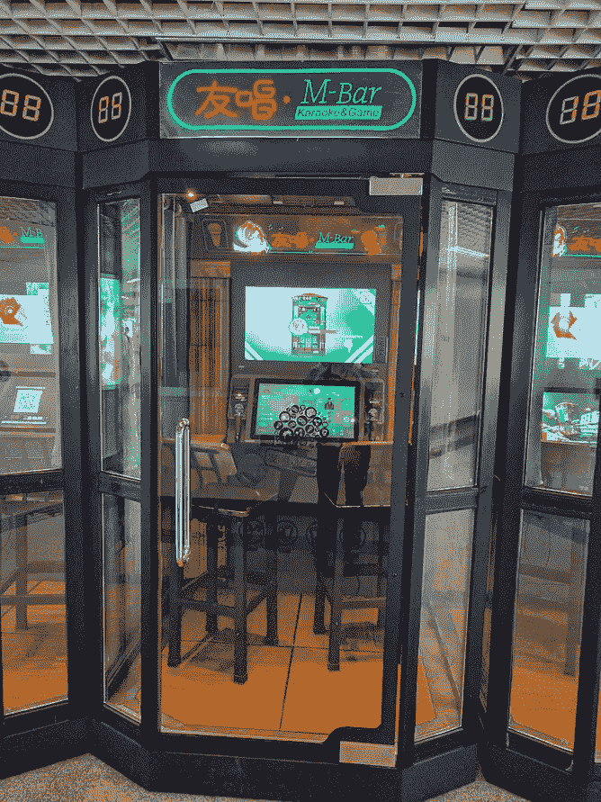
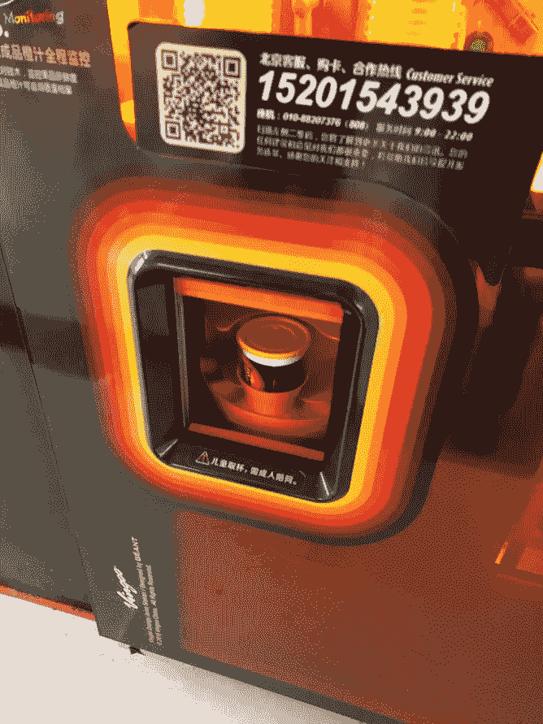
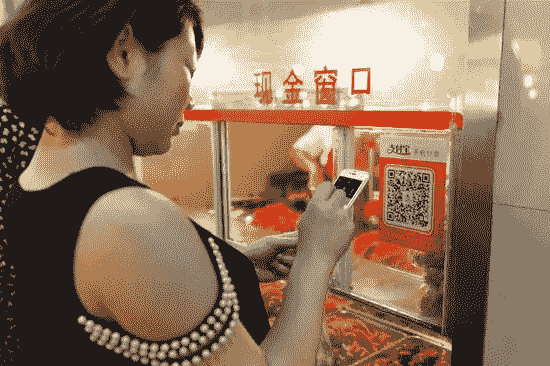
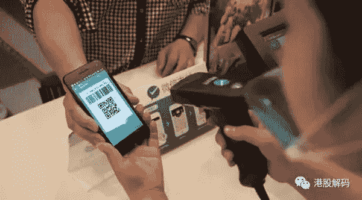

# 科技与文化的相遇:在北京生活的第一周

> 原文：<https://medium.com/hackernoon/week-1-of-living-in-beijing-3ae2ab6d0033>

虽然我大约每年访问中国一次，但在这次访问之前，他们都是为期一周的短途旅行。在这些旅行中，我不可否认是一个游客和局外人，靠漫游的 T-Mobile SIM 卡和谷歌堆栈(嗯，加上微信)生存。不仅仅是为了生存，我决定让自己完全沉浸在日常生活和商业中，以真正了解在快速变化的科技大都市北京生活是什么样的。

以下是第一周让我印象深刻的内容。

Places where you can use a phone: 1) rent a bike. 2) buy traditional breakfast. 3) park entrance ticket

Places where you can use a phone: 4) buy eggs. 5) rent a 2-people karaoke room in a mall. 6) use a vending machine to for fresh-squeezed orange juice

# 移动支付实在是太方便了

从字面上看，你可以只用你的手机在这里茁壮成长——手机的圣杯已经在中国成为现实。融合线上和线下世界的最大障碍是支付；在美国，你仍然需要带一张卡和至少一些现金。微信支付和支付宝(以及其他一些支付方式)已经很好地解决了这个问题。

市场采用的程度令人震惊。让我用几个个人故事来说明。

1)第一次走进我家附近的咖啡店，我点了菜，笨拙地掏出钱包，数着现金付账。过了一会儿，我感觉大家都在看我，不耐烦。我转过身，几乎所有排队的人都已经打开了微信支付，二维码也准备好了。甚至收银员似乎也对我不打算用电话支付感到惊讶。瞬间觉得格格不入。

2)我帮妈妈在公寓后面的当地小摊上买杂货。这个市场就像一个跳蚤市场和吉尔洛路边樱桃摊的杂交品种，也就是说没什么花哨的。我们以 2 CNY(0.3 美元)的价格挑选了几根黄瓜。当我漫不经心地问那家伙是否接受微信支付时，他惊呼“当然！”并给我指了一个他账户的二维码，已经打印好并贴好了，他用它来接受支付。

所有这些都发生在过去的两年里。根据我所看到的，就供应商采用率而言，如果市场渗透率达到 80%以上，我不会感到惊讶。由于中国信用体系的发展和相关监管，该国跳过了信用卡，直接进入了数字支付领域，并取得了巨大成功。点对点和点对点供应商现在都是数字化的。

Two ways of mobile payment. For small vendors, you scan the vendor’s QR code (left). For larger stores, it’s integrated into the POS (right).

# 移动设备无处不在。

移动支付的出现和普及使移动驱动的服务的整个生态系统成为可能，这真正使人们有可能只使用智能手机生活在城市中。

最明显的例子就是以移动和 ofo 为首的自行车共享网络。相信我，你在中国的时候不会错过的。各种不同颜色的自行车，每辆代表一家不同的公司，散落在人行道和街道上。这就像谷歌校园里的 gBikes，但现在想想整个纽约市的密度水平。去使用它？只需下载一个应用程序，当然你不是通过应用程序商店，而是通过用你的微信应用程序扫描二维码来访问。

去医院预约。当然，你可以亲自去和每个人争夺(咳咳，排队)一个名额。或者，你可以在微信上关注医院，上传你的政府颁发的身份证的图片，然后在手机上预约。

在一些咖啡馆(如 InWe Tea)，你甚至不需要去柜台点餐。只需在您最喜欢的餐桌旁坐下，扫描该餐桌的独特二维码，然后开始点餐。咖啡馆知道你在哪一桌，服务员会马上给你端来饮料。当然，这可能有点噱头，但它显示了当你拆分支付交易时所释放的创造力。

# 微信连接一切

一切的中心是微信。很难夸大它的重要性，因为它是连接你的个人、家庭和职业网络的结构。每个人都有一个单一账户，是实名验证的。在一个单独的对话源中，你可以拥有你所有的联系人，个人的和职业的。作为消费者，确实不需要(也不使用)电子邮件；即使在商业环境中，电子邮件也越来越少了。

它也是默认的二维码扫描仪。和默认的移动钱包。以及第三方应用的默认单点登录(SSO)。哦，是的，这也是你如何与供应商和企业互动。

有一个“公共账户”的概念，你可以关注它并与供应商互动。比如我经常去的咖啡馆，就可以关注它的公众号。一旦我做到了这一点，我就可以注册成为会员，领取优惠券，联系客服，所有这些都可以在微信中完成。

因为微信无处不在，每个人都在不停地查看它。“哦，我没有检查我的邮件”和“我一天只检查两次邮件”这样的借口根本站不住脚。你根本不可能“不查”微信。

因此，退出微信，实质上就是退出中国的整个数字世界。谷歌和脸书在美国消费者生活中扮演的角色都不重要。就其作用而言，甚至没有一个微信的竞争对手。想象一下这种类型的垄断会导致什么样的后果是很可怕的。

# 大城市的规模经济。

北京是一个拥有近 3000 万人口的大城市。有些事情只有在人口密度极高的情况下才可能发生，而且也只有在少数几个全球城市中才会发生。也有不好的一面，比如交通和污染。但是有一些地区有着压倒性的便利。

以送货为例。在大型电子商务网站购物默认第二天送货上门(而且经常是免费的！)，有些甚至提供当天送达服务。有可能是因为两个因素。一是配送中心就在市郊，数量巨大，SKU 品种繁多。二是骑着摩托车穿梭于车流中的送货司机；一辆巨型 UPS 卡车根本做不到的事情。

虽然中国不一定是一个服务好的国家，但有一件事它做得很好，那就是速度。点餐和送货是如此之快。从你在一家不错的小餐馆下订单到有人骑着摩托车把它送到你手里，只需要 45 分钟。送货员甚至在食物准备好的几分钟前就已经在餐厅了。试试超级食物。

也有类似于 UberRUSH 的邮寄服务，可以在不到一小时的时间内将小物品从城镇的一边送到另一边。

# 警惕的眼睛

近几年的一个规定是，每个手机号必须绑定一个政府身份证。不在实体店用 ID 认证是不可能拿到本地号的。

与美国大多数网络/应用服务都是通过电子邮件地址注册不同，中国几乎所有的服务都是通过微信用手机号码或单点登录注册的。如果没有本地电话号码来接收认证短信，你甚至无法登录大多数公共 WiFi 网络。

推而广之，这意味着您使用的每个应用和服务*都可以*追溯到您的真实身份。一些应用程序，例如自行车共享应用程序，甚至需要上传您的身份证。它是如此的普通，以至于人们在提供它之前不会三思。

科技公司或政府决定这样做是另一回事，但互联网上没有多少匿名。一双警惕的眼睛。

## 在这里阅读我的经历的第二部分:[科技与文化相遇:在北京生活的第一周](https://hackernoon.com/why-you-might-build-your-start-up-in-china-over-silicon-valley-b23ed7d63951)

> [黑客中午](http://bit.ly/Hackernoon)是黑客如何开始他们的下午。我们是 [@AMI](http://bit.ly/atAMIatAMI) 家庭的一员。我们现在[接受投稿](http://bit.ly/hackernoonsubmission)并乐意[讨论广告&赞助](mailto:partners@amipublications.com)机会。
> 
> 如果你喜欢这个故事，我们推荐你阅读我们的[最新科技故事](http://bit.ly/hackernoonlatestt)和[趋势科技故事](https://hackernoon.com/trending)。直到下一次，不要把世界的现实想当然！

