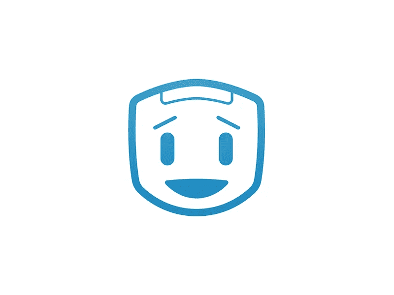
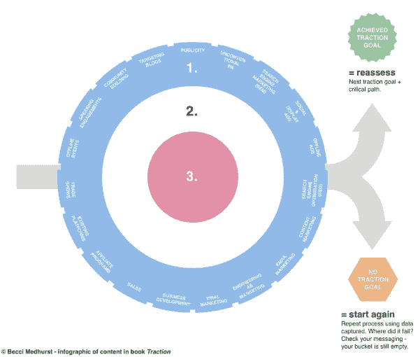

# 12 个月内获得 12 个 MVP——首次更新，团队介绍和 MVP #1

> 原文：<https://medium.com/hackernoon/week-2-recap-12-mvps-in-12-months-1ecc4b852cd0>

我们将跳过今年的第一周，因为那是一个假日周。

继[上周的微创业思路](/digital-founder/exploratory-micro-entrepreneurship-thoughts-chapter-1-fe6d563d05c7#.bbzj1qct6)和[为什么我要在 12 个月内打造 12 个 MVPs】之后，下面是我们的创客团队在动的今年第一次更新。假期把我们踢得屁滚尿流，但我们现在要搬家了。](/digital-founder/an-experiment-in-micro-entrepreneurship-why-im-going-to-build-and-launch-a-dozen-mvps-in-2017-d3fa02ed5226#.2me93bjls)

令人欣慰的是，该团队正在顺利产生今年的第一个 [MVP](https://hackernoon.com/tagged/mvp) 。在讨论第一个 MVP 和我们正在采取的行动之前，让我花点时间介绍一下我的合作者:

## 数字创始人群组 1

1.  [Mubashar " mubs " Iqbal](https://twitter.com/mubashariqbal)—mubs 是一名出色的工程师和制造商，最近被提名为 product hunt 2016 年度最佳制造商(👏)并且是 Digital Founder 第一批创客背后的工程驱动力。

有超过 40 种产品以他的名义提交，包括 [Botlist](https://www.producthunt.com/posts/botlist) 、 [Quuu](https://www.producthunt.com/posts/quuu) 、 [MakerMVP](https://www.producthunt.com/posts/maker-mvp) 、 [Marketing Stack](https://www.producthunt.com/posts/marketing-stack) 和许多其他产品，今年的顶级制造商有血统和雄心将我们的 MVP 想法转化为高性能的原型，将在发布日获得收入。

Mubs 是一种纯粹的快乐，我们非常兴奋能够一起开始这一旅程。

2.[Seth Louey](https://twitter.com/sethlouey)——也是 2016 年 ProductHunt 制造商的提名人，Seth 拥有一种神秘的能力，可以给无生命的项目注入生命。

从品牌推广到构建无缝用户体验，他的设计眼光贯穿于他接触的一切事物，并延伸开来，使其功能化、非技术性且美观。

他的才华在他参与的项目中熠熠生辉(很多次是与 mubs 一起)，包括[僵尸名单](https://twitter.com/BotListco)、[创造者日志](https://twitter.com/CreatorsLog)、[当活跃时](https://twitter.com/WhenActive)和[黑客辅助](https://twitter.com/hackassist)。

几个月前，我在网上天才松弛小组[里见到了穆巴舍和塞斯。当时，我正在为一家游戏公司物色创始团队成员。我的行动号召很有说服力，我们很快发现自己在自己松散的组织中策划着。](http://onlinegeniuses.com/)

我们对此知之甚少，就像在自由职业的世界里常见的那样，忙碌的生活让我们三个人彼此分离，我们的项目被非正式地搁置了。

我们只是太忙了，创收的需要超过了我们涉足新项目的能力——我们一致认为，风险投资的性质决定了将它视为一个附带项目对于我们显然充满热情的破坏性风险投资来说是非常不公平的。

几个月后，我想减少我的队友对自由职业者的依赖，以此来维持自己的生活。

因此，我们的使命是利用我们最擅长的资产——制造东西——在财务上解放彼此。今天我们站在这里，迎接明年我们的第一个 MVP 挑战。

# MVP #1:闲置

有这么多事情要做，迅速决定第一个 MVP 将会是什么是很重要的。

考虑到 Mubs 在假期里玩了一些代码，我们发现自己在第一天就有了一个半工作的原型，并从效率和速度上加倍努力。

那么什么是闲置呢？

简单来说，Idle 会在您离开时负责您的社交媒体更新。

大多数从事技术工作的人都使用某种社交媒体管理来建立自己的社交网络。一般来说，这往往是以提前安排帖子的形式出现的——有时会在特定的时间多次发布。

这对于大部分人来说很有效，他们希望不用手动安排他们的社交更新。问题是，社交已经成为单向更新的停车场。人们在张贴东西，但他们不互相交谈。他们没有联系。

更糟糕的是，如果你*很积极*并投入时间和精力与你的观众沟通，你最不需要的就是在中期*推特风暴*中被完全断章取义的预定更新打断。

我们经常参与多个对话，因为固定的日程安排，一个帖子会突然插入。这扰乱了对话，也破坏了你努力创造的有机努力。

但是，提前管理一个有效的发布时间表可能是困难的，因为对话是短暂的——它们会很快出现和消失。

必须跟踪何时发布什么的前景可能会导致品牌放弃做任何一项活动，这当然会损害他们的社交媒体努力。在非高峰时间转发老的常青树内容有多难？

如果没有硬编码的日程安排，我们如何才能真正实现 24/7 的社交媒体足迹？

一个更优雅的方法可能是以一种方式考虑社交媒体自动化，即*增强*你而不是打断你。

在我们看来，只有当我们*不能参与*时，比如我们不能发推特或睡觉时，才部署我们排队的更新更有意义。

这就是我们创造闲置的原因。

Idle 监控你的社交媒体活动，并在你不能发布内容时自动为你发布内容——在你空闲时增加你的社交媒体活动。

# 空闲:后续步骤

我们现在正在做一些基本的基础设施工作，以组装应用程序的第一次迭代。Mubs 实际上正忙着完成它，应该很快就会有东西上线。

我们还没有决定是否提供免费增值服务。因为我们的目标是尽快获得收入，我们可以选择不这样做。比较这两个选项，Buffer 提供免费增值服务(追加销售 10 美元/月)，而 MeetEdgar 没有(49 美元/月)，很明显，该产品需要在免费增值和付费层之间进行大规模区分。

我怀疑我们能否在早期达到那种复杂程度。我们最终可能会采用一种三层定价 SaaS 机制，依赖一些功能和一些容量来进行调整(即 1/5/10/35 社交账户+功能差异)。

我们在社交媒体领域有一些其他想法，并正在考虑将 Idle 整合到一个名为*padding、*的品牌旗下，其首要任务是以各种方式 *pad* 你的社交媒体。

其中一种方法是允许社交媒体帐户自由构建社交媒体策略，对他们的不活跃做出反应，而不是硬编码和降低敏捷性。

在增长方面，由于我们预计会开发一些社交相关的应用程序，这些应用程序之间的交叉极化将是一个重要的网络效应优势，比如使用电子邮件列表或直接提供一次性优惠，以及从一种产品到下一种产品的交叉/向上销售客户。

目前的情况是，在建立基本的预发布基础设施之前,“成长”(真正属于您的)需要耐心等待一些东西部署到活动服务器上，包括:

*   [营销](https://hackernoon.com/tagged/marketing)自动化基础设施(电子邮件、服务台、像素等。)
*   建立一个预发布列表(因为这是一个社交应用，基于推荐的预发布注册页面实际上可能是一个好策略)
*   建立一个电子邮件预发布序列(如果我们做一个预发布列表，可能会使用[产品发布公式](http://plf4.s3.amazonaws.com/product.launch.blueprint-v4.pdf)
*   建立一个 Wordpress 博客，安装一个主题，设置基本插件
*   影响者的早期推广代码和影响者拓展计划本身
*   计划一些媒体/博客外展活动，包括编制一份我们的竞争对手媒体/博客提及列表，收集作者内容信息，制作电子邮件推介，并将其发送给客座博文或评论。
*   建立一个 ProductHunt 推广页面——鉴于目标市场存在于网站上，我们预计 ProductHunt 的推出将在产品验证中发挥重要作用
*   通过 Segment.io 和 Google Tag Manager 设置量化数据聚合
*   使用类似 Hotjar 的工具为热图、点击图、记录、表格漏斗等建立定性数据。

还有更多的增长积压，但就目前情况而言，我很快发现我们需要(a)应用牛眼框架来找出哪些渠道包含我们构建的社交媒体应用程序的最大潜力，以及(b)构建发布套件/剧本来发布我们的社交媒体应用程序。

当我们讨论今年 12 个 MVP 的路线图时，看起来我们已经决定将每个 MVP 重新组合成 3-4 个年度主题中的一个。

所以我们假设 2017 年的主题之一是社交。我们需要为我们期望参与的每个主题建立一个发行剧本；通过这种方式，我们不仅了解了渠道，还加快了上市速度(最终，MVP 验证)。

看看 MeetEdgar，它可以说是我们目前最准确的案例研究(考虑到他们与 Buffer 竞争并成功建立了 320 万美元的 ARR 业务)，他们的增长来自于超过 75，000 名订户的预发布列表和脸书广告(令人惊讶)。

他们声称，使用“尝试我们的新社交媒体应用程序”的价值主张创造了奇迹。

很明显，我打算尝试一下，亲自验证一下。

我们仍然需要考虑哪些渠道对 Idle 有前景，但我的大部分时间将用于设计和建立 Idle 的客户获取系统，这样我们就可以从每个新访客身上获利。

Idle MVP 的目标是验证一些重要的假设，当然也是验证 Idle 最终可能享受的年收入潜力。

我们还想知道 Idle 相对于 Buffer 和 MeetEdgar 的位置——它是一个直接竞争对手，还是假设 Buffer/MeetEdgar 用户可能会为该服务和 Idle 付费。

此外，目前还不清楚 Idle 是一级、二级还是三级项目。

我们将主要关注它的发布，并从我们在发布月份建立的系统中调查有机增长率。这一增长率将决定闲置将坐在哪一层。

本周到此为止——Seth 正在旅行，这意味着在接下来的 5-6 天里，我们不会处理品牌或设计方面的任何事情。没问题，我们已经很清楚空闲应该是什么样子了。我毫不怀疑 Seth 会把它打得落花流水。

## MVP 的状态:空闲

*   收入:0 美元(— %)
*   付费客户:0 ( — %)
*   免费增值客户:0 ( — %)

你喜欢这本书吗？粉碎❤️按钮，帮助将这个故事分发给更多的读者，这样他们就可以跟踪 MVP 的建立和发布过程。

> [黑客中午](http://bit.ly/Hackernoon)是黑客如何开始他们的下午。我们是 [@AMI](http://bit.ly/atAMIatAMI) 家庭的一员。我们现在[接受投稿](http://bit.ly/hackernoonsubmission)并乐意[讨论广告&赞助](mailto:partners@amipublications.com)机会。
> 
> 如果你喜欢这个故事，我们推荐你阅读我们的[最新科技故事](http://bit.ly/hackernoonlatestt)和[趋势科技故事](https://hackernoon.com/trending)。直到下一次，不要把世界的现实想当然！

