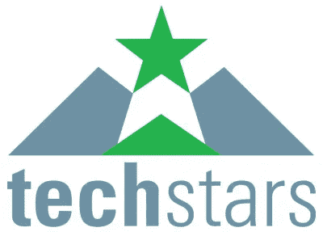

# 纽约市每周 Techstars 多元化/包容性办公时间

> 原文：<https://medium.com/hackernoon/weekly-techstars-diversity-inclusion-office-hours-in-new-york-city-6df2bfbb0c3>

选举后的第二天，亚历克斯·伊斯科尔德(Alex Iskold)写了一篇名为[亲爱的创始人们，我承诺加倍支持你们和你们的创业公司](https://alexiskold.net/2016/11/09/dear-founders-i-commit-to-double-my-support-for-you-and-your-startups/)。这是老式的，美好的亚历克斯随着一系列具体的事情，他要做的。

*   更紧密地与创始人合作，帮助他们融资。
*   帮助创始人增加收入，实现盈利和独立。
*   发送更多的介绍，联系更多的人。
*   回复创始人的每一封电子邮件和每一条推文。
*   会见更多纽约和世界各地的创始人，并给予反馈。
*   总是在我的日历上迭代，为创始人腾出更多的时间。
*   在纽约和世界各地的公共活动中发表关于企业家精神的演讲。
*   博客更多关于创始人关心的话题和想阅读的内容。
*   出版我的(酝酿已久的)创始人书籍。

今天，Alex 写了一篇名为[的帖子，介绍了 Techstars 每周的多样性和包容性，以及纽约市创始人的办公时间](https://alexiskold.net/2016/11/14/introducing-techstars-weekly-diversity-and-inclusion-office-hours-for-founders-in-nyc/)。每周二下午 5 点到 7 点，纽约的一群 Techstars 员工将会见任何女性、少数族裔、LGBTQ 或移民创始人，讨论任何问题。[在这里报名](http://bit.ly/TSNYCFemaleMinorityImmigrantFounders)。

除了亚历克斯之外，其他将在办公室工作[小时](https://hackernoon.com/tagged/hours)的 Techstars 人员包括 [KJ Singh](https://www.linkedin.com/in/kjsnyc) 和 [Jillian Canning](https://www.linkedin.com/in/jilliancanning) ，他们帮助亚历克斯运行 Techstars 纽约市项目， [Jenny Fielding](https://www.linkedin.com/in/jennyfielding) 运行 Techstars 物联网和金融技术项目， [Eamonn Carey](https://www.linkedin.com/in/ecarey) 运行 Techstars Connection，以及 [Jenny Lawton](https://www.linkedin.com/in/jenny-lawton-09278410) ，她最近加入 Techstars 担任首席运营官。

布拉沃帮——我喜欢看到这样的事情发生。

*最初发表于* [*费尔德思*](http://www.feld.com/archives/2016/11/weekly-techstars-diversity-inclusion-office-hours-new-york-city.html) *。*

> 黑客中午是黑客如何开始他们的下午。我们是这个家庭的一员。我们现在[接受投稿](http://bit.ly/hackernoonsubmission)并乐意[讨论广告&赞助](mailto:partners@amipublications.com)机会。
> 
> 如果你喜欢这个故事，我们推荐你阅读我们的[最新科技故事](http://bit.ly/hackernoonlatestt)和[趋势科技故事](https://hackernoon.com/trending)。直到下一次，不要把世界的现实想当然！

