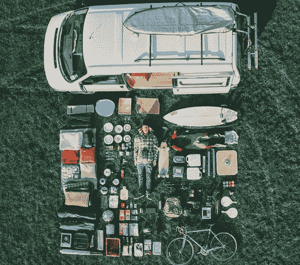
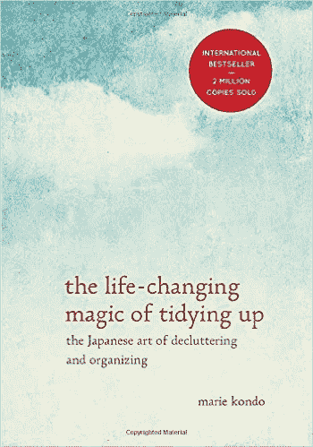
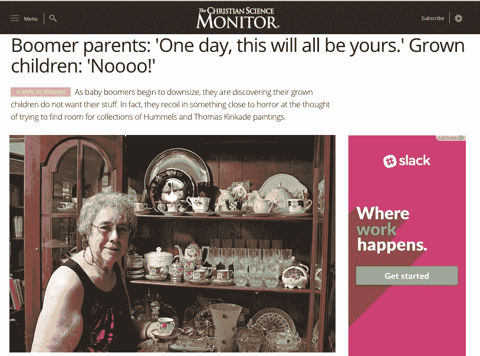
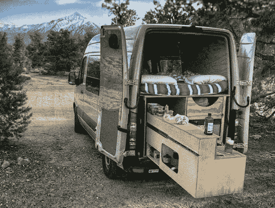
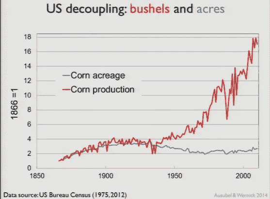
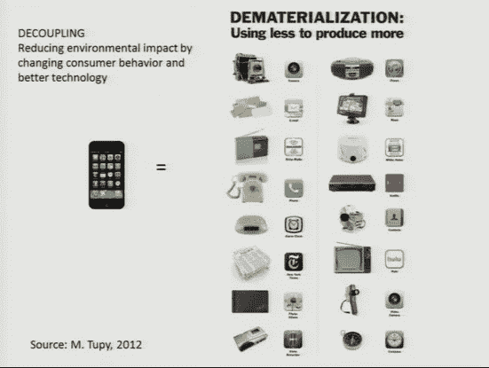
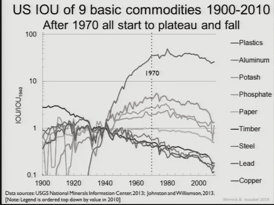
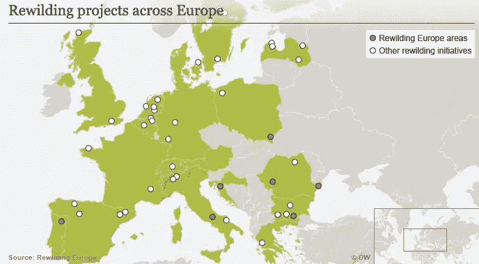
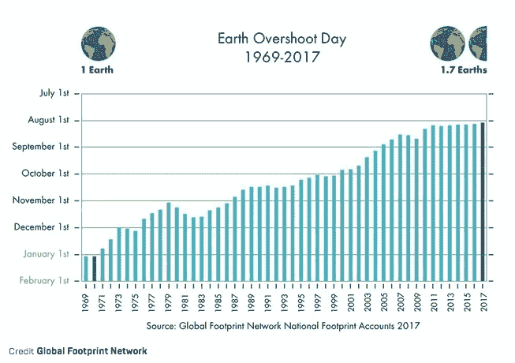

# 欢迎来到巅峰之作

> 原文：<https://medium.com/hackernoon/welcome-to-peak-stuff-e699820c7e9b>

我们在不由自主地拯救地球吗？

is this all you need?

因此，这是一个听起来很疯狂，但完全正确的挑衅性想法——在全球范围内，我们似乎正在达到顶峰。隐藏在显而易见的地方，拥有、使用和消费的物质数量的宏观下降趋势正在重写人类使用多少物质的现实，即使人口在增长。这种衰退在西方民主国家尤其如此。简而言之，我们现在的生活方式意味着我们不需要像过去那样多的物质，也不需要提供物质的供应线。

这种变化是由“三个 D”驱动的——我们的生活正在变得杂乱、密集和分离。

虽然这些变化导致了经济世界的混乱，但它们也对自然界产生了巨大的积极影响，而这种影响在气候变化的所有影响中被忽略了。坦率地说，我们的现代生活方式可能不仅仅是在毁灭地球；在某些方面，他们正在帮助它恢复。

# 再见了，这一切

第一个要谈论的大趋势是清理，也就是把你的东西扔掉。最近，你可能闻到了一丝这种味道，当数百万人阅读这本关于通过移除不需要的东西来整理生活的日本书籍时，他们很快就把自己所有的东西都扔成一堆，只留下自己最珍惜和最有用的东西。

但那只是症状，不是原因。潜在的驱动因素是这样的:有史以来第一次，我们两代人同时裁员。婴儿潮一代和千禧一代要么是[摆脱了](https://www.nytimes.com/2017/03/04/business/retirement/from-downsizing-boomers-a-flood-of-donated-art.html)，要么是[一开始就没有得到东西](https://www.becomingminimalist.com/millennials/)。

> 有史以来第一次，我们两代人同时裁员。

原因很复杂。显然，婴儿潮一代的裁员是有意义的，因为美国历史上最大的一代人开始放弃他们一生的收购，这是在一个前所未有的财富时期形成的(令他们懊恼的是，他们也经常发现他们的孩子不像他们那样重视他们的东西。)

Tea cup collection anyone? Anyone? Buehler? Buehler?

对于千禧一代来说，在就业市场不确定以及共享和零工经济兴起的时代，拥有一大堆东西是没有意义的。另一方面，能够从一个机会/地点快速转移到另一个机会/地点具有很大的吸引力(因此有[数千个 Pinterest 论坛](https://www.pinterest.com/explore/conversion-van/?lp=true)致力于 Sprinter van 转换)。

Oh give me a home, with all my stuff I can roam..

即使对 Van Life 的忠实用户来说，优步和 Lyft 等打车服务的兴起也让拥有一辆车变得更加麻烦，至少在城市地区是这样。随着使用可再生能源的自动电动汽车的到来([在这里阅读更多信息](/@tomprice_22461/the-last-auto-mechanic-841adec75498))，难怪今天的孩子甚至没有驾照，从 20 世纪 80 年代的 80%下降到今天的不到 60%。这也许解释了为什么[拥有汽车的家庭数量几十年来首次下降。](https://qz.com/873704/no-car-households-are-becoming-more-common-in-the-us-after-decades-of-decline/)

所有这些精简意味着一件事——使用的东西少了很多。

# 拥挤的城市，空旷的田野

第二大趋势与密集化有关，空间和回报不再是线性的，这是由我们居住的地方和我们制作食物的方式的两大转变所驱动的。

首先，城市。在世界各地，我们正从农村地区戏剧性地向城市转移。1950 年，大约 30%的地球人口居住在城市。到 2008 年，这一比例为 50%，到 2050 年[预计将达到 70%。这意味着我们不再需要同样多的空间来容纳和雇佣同样多的人。这实际上是一件好事—](http://www.prb.org/Publications/Lesson-Plans/HumanPopulation/Urbanization.aspx) [由于网络效应，城市是更有效的交付商品和服务的方式](http://theweek.com/articles/575452/why-denser-cities-are-better-people--environment)，而[智能城市设计可以让它们变得更好。](https://reset.org/node/27044)

接下来，农场。我们也不再需要那么多的空间或资源来种植食物。不断提高的农业效率使得生产密度与种植面积无关；我们从同样的空间中获得了如此多的东西，有些人可能会合理地怀疑我们是否也已经达到了“峰值农田”。

# 你口袋里的王国

第三个也是最大的一个趋势是你已经直观地知道的——使用正与消费脱钩，这意味着尽管人们仍在使用越来越多的工具(比如日历、相机和计算器)，但他们不再购买和使用那些物理设备。取而代之的是，他们购买一件物品来代替所有的物品，甚至更多。简而言之，我们现在可以把以前堆满客厅和办公室的大堆东西装进口袋了。

> 简而言之，我们现在可以把以前堆满客厅和办公室的大堆东西装进口袋了。

# 少就是少

要看到这三个 D 的效果，你只需要检查原材料的使用——仅仅是全世界使用了多少物理材料。杰西·奥苏贝尔(Jesse Ausubel)一直在这么做，他跟踪了过去几十年中 100 种大宗商品的实际使用情况。结果是显著的:**在全球使用的 100 种大宗商品中，89 种要么持平，要么绝对值下降。**

> **在全球使用的 100 种大宗商品中，89 种要么持平，要么绝对值下降。**

首先是在一个长篇大论的演讲中，然后是在经济地质局的更详细的演讲中，奥苏贝尔提出了一个压倒性的理由，即在美国和其他西方国家，东西的使用已经达到顶峰，很快将在中国和印度达到顶峰。

> 在美国和其他西方国家，东西的使用已经达到顶峰，中国和印度也将很快达到顶峰。

将你的整个王国收入囊中，对于那些曾经生产被它们取代的数十种产品的工厂来说，或许并不那么好，对于那些曾经在那里工作的人来说也是如此。然而，毫无疑问，这对地球是有益的。

# 野生动物在哪里

当所有这些趋势——清理、密集和分离——开始汇聚时，一些完全意想不到的事情发生了:[自然](https://hackernoon.com/tagged/nature)正在反弹。很快。

在整个发达的星球上，荒野正在回归，因为曾经被城镇和农场占据的土地已经回归到它们的自然状态。例如，在前苏联地区，一个面积相当于白俄罗斯的地区已经变成了荒野。野牛已经回到了波兰。塞纳河和莱茵河都有三文鱼。

这里也是如此——48 个州的森林总面积都在增加。这只是开始。如果奥苏贝尔的趋势持续下去，一个印度大小的区域将会在 50 年内被重建。

> 如果奥苏贝尔的趋势持续下去，一个印度大小的区域将会在 50 年内被重建。

当然也有例外。例如，印度仍在快速增长。但是中国似乎正在逐渐结束他们的城市化速成班(产生了巨大的债务泡沫，伟大的新火车和高速公路，以及许多令人毛骨悚然的鬼城)[已经停止建设新的燃煤电厂。](https://www.nytimes.com/2017/01/18/world/asia/china-coal-power-plants-pollution.html)

除了例外，事实仍然是——这些宏观趋势正在打破平衡，如果不是回到过去，那么至少不会把天平推到世界末日。

# 在末日日历上点击暂停

举个例子——你可能听说过这样一个理论:我们需要差不多两个地球来供应我们需要的所有资源？与 iPhone 的发布完全巧合的是，“过冲日”(也就是一年中我们消耗的资源超过地球资源的那一天)已经变得平缓，与奥苏贝尔的分析完全吻合。在过去的十年里，自 20 世纪 60 年代以来，历史上第一次，我们的过度日没有变得更糟。没有好转，但也没有恶化。

> 自 20 世纪 60 年代以来，历史上第一次，我们的过度日没有变得更糟。

诚然，这些趋势会有负面影响。美国有很多工厂过去生产的东西现在都空了。[日益增长的城市化和农业效率意味着随着乌拉尔地区被掏空，许多小社区将被推过临界点。](http://www.npr.org/2014/10/21/357723069/millennials-continue-urbanization-of-america-leaving-small-towns)[中西部的一些城镇将遭受自动驾驶卡车的双重打击，它们绕过高速公路旁的服务经济，直接驾驶电动汽车，不再需要周围农田种植的玉米乙醇。](/@tomprice_22461/the-last-auto-mechanic-841adec75498)

但是，在关于气候变化的末日故事的无情洪流之后，很高兴得知，也许在乌云中有一些好消息的亮光。也许少*就是多*吧，毕竟。

*   这是我写的三篇文章中的第二篇，总结了我从上一份工作过渡到下一份工作时遇到的一些有趣的宏观趋势。(第一篇是关于 [*自驾*](https://hackernoon.com/tagged/self-driving) *电动汽车、* [*你可以并且应该读读*](/@tomprice_22461/the-last-auto-mechanic-841adec75498) *第三篇是关于* [*零售和社交的衰落。*](/transforming-retail/wandering-the-mall-for-one-da2b58e1df2b) *)如果你喜欢这件作品，请点击心形按钮并在社交媒体上分享。如果你正在寻找一个对清洁能源和气候行动有热情，同时具备商业发展、分析和沟通技能的人，我们应该谈谈——我对 ACES 领域特别感兴趣。* [*在 LinkedIN、*](https://www.linkedin.com/in/this-is-tom-price/) *了解更多信息，或发送电子邮件至 tomwprice(at)Gmail . com。感谢您的关注。*