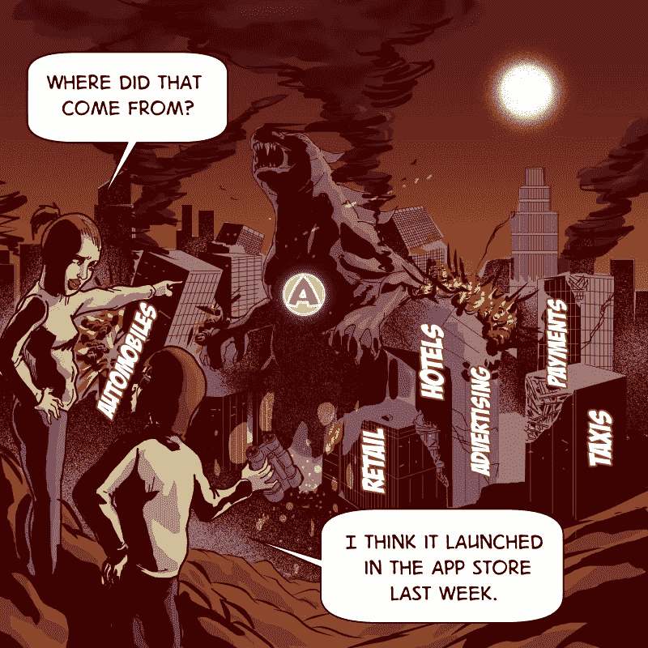

# 欢迎来到未来，阿普齐拉斯统治世界

> 原文：<https://medium.com/hackernoon/welcome-to-the-future-where-appzillas-rule-the-world-3125de430a02>

今天的应用程序比以往任何时候都更大、更快。

10 年前，你必须移山倒海，才能用一款应用接触到数十亿人。您必须支付巨额资本支出，掌握复杂的物理操作(将相当于足球场大小的硬件装架和堆叠)，并雇佣世界上最聪明的工程师来开发可以管理和扩展成千上万台服务器的软件。

今天，你可以从亚马逊购买无限的基础设施。像 Kubernetes 这样强大的软件平台是免费赠送的。

开源软件在种类和复杂程度上持续增长。通过 GitHub 可以很容易地找到并重用大量特性、功能和服务的代码。像 Amazon RDS 这样的大型服务使曾经复杂的任务(如建立和维护数据库)变得像注册服务一样简单。

这些构件允许新的应用程序开发者快速而容易地站在自由软件社区的巨人肩膀上。

具有讽刺意味的是，历史上创新的最大催化剂之一…是一个*法律许可*的授权。

理查德·斯托尔曼是 GNU 通用公共许可证的主要作者。斯托曼倡导自由软件或自由源代码，发起了 GNU 项目，创立了自由软件基金会。

[Image Credit Wikipedia](https://en.wikipedia.org/wiki/Richard_Stallman)

开源运动后来从他的自由软件运动中分支出来。然后莱纳斯·托沃兹给了这场运动实质和力量。

1991 年，托沃兹在一个早期的新闻组中公布了他的意图，这也许是你能想象到的创新周期中最卑微的开端:

> *大家好，正在使用 minix 的各位——*
> 
> 我在克隆公司做一个 386(486)的(免费)操作系统(只是一个爱好，不会像 gnu 一样大和
> 专业)。这个从 4 月份就开始酝酿
> ，开始准备了。我希望得到关于人们喜欢/不喜欢 minix 中的
> 事物的任何反馈，因为我的操作系统有点类似于它
> (文件系统的相同物理布局(由于实际原因)
> 等等)。
> 
> *我目前已经移植了 bash(1.08)和 gcc(1.40)，看起来一切正常。这意味着我会在几个月内得到一些实用的东西，我想知道大多数人想要什么样的功能。欢迎任何建议
> ，但我不保证我会实施:-)*
> 
> *莱纳斯(Torvalds @ kru una . Helsinki . fi)*
> 
> *PS。是的—它没有任何 minix 代码，并且有一个多线程 fs。
> 它是不可移植的(使用 386 任务切换等)，它可能永远不会支持除了 AT-harddisks 之外的任何东西，因为那是我所有的东西。*

他把他的操作系统叫做 Linux。

我们在世界上看到的许多软件创新(至少是服务器部分)都是建立在 Linux 平台之上的。

今天，甚至出现了更大的平台，拥有更多的用户。通过在 iOS、Android 或脸书等大型平台生态系统中开发应用，你可以接触到超过 10 亿的消费者。

我们已经到达了一个拐点，曲线上的一个拐点，在这个拐点上，开发一个杀手级应用的速度已经比过去十年加快了一个数量级。

这是一个重大的飞跃。

Appzillas 是改变行业的杀手级应用，让竞争对手一夜之间变得过时。

它们可以是手机、笔记本电脑、服务器、云中或任何可以运行应用的地方的应用。它们可以是聊天机器人、人工智能服务或语音操作的。

他们利用过去几十年建立的技术杠杆(例如智能手机传感器、人工智能算法等。)推动地球，跨越长期存在的准入壁垒。

Appzillas 改变了供需法则，从根本上重塑了客户体验。他们充满决心和实质，午餐吃价格过高和估值过高的独角兽。它们存在于企业家和风投的梦想中，也存在于勒德分子和传统领袖的噩梦中。

随着创新周期继续加速，Appzillas 将会出现并以前所未有的速度增长。

欢迎来到[未来](https://hackernoon.com/tagged/future)，Appzillas 统治世界。

唯一的问题是:你是会骑上一只 Appzilla 还是被它吃掉？

如果你想了解更多关于我用来推动颠覆性创新和构建价值数十亿美元的软件产品的框架，请注册订阅我的第一本书《T2:颠覆或死亡:世界需要向硅谷学习什么才能在数字时代生存》的发布更新，并立即获取前几章。

You can also find the signup page here: [https://disruptordie.net/](https://disruptordie.net/)

