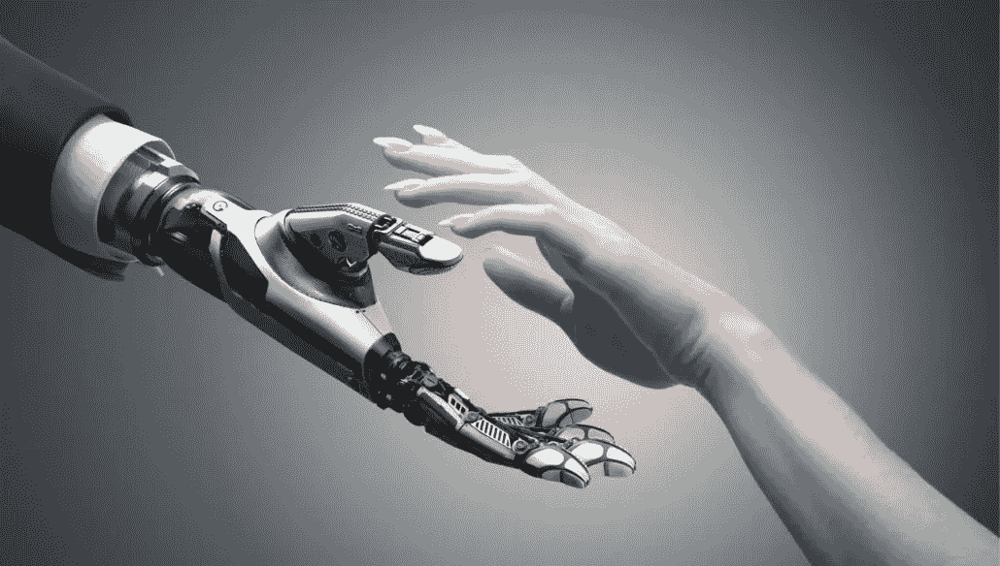

# 欢迎我们的“机器人霸主”:为什么人工智能将造福(而不是毁灭)人类

> 原文：<https://medium.com/hackernoon/welcoming-our-robot-overlords-why-ai-will-benefit-not-destroy-humanity-ab28c130a84b>

Image From [**The Future of Life Institute**](https://futureoflife.org/2017/02/03/align-artificial-intelligence-with-human-values/)

就是它，我叫它:人工智能(*AI*’)已经是***2017 的*** 话题了。我知道特朗普会感到失望，他无数次的失误没有让他赢得冠军，但关于人工智能和所谓的“机器人的崛起”的文章、思考和推文的数量一直令人震惊。我来这里是为了给那堆“电子纸”添加内容，以防标题还没有告诉你。

我遇到的许多关于人工智能的文章主要集中在它的缺点上:事实上，它可能会使数百万人失业，比人类更聪明，并引发核灾难，就像阿诺德·施瓦辛格主演的电影系列一样，让我们面对现实吧，应该在第三部电影结束后就结束了。其他人则关注政府、企业和人们应该做些什么来为即将到来的机器人革命做准备，例如埃里克·维穆伦在*黑客正午*发表的这篇[伟大作品。然而，我还没有看到自动化为什么会对人类有好处。](https://hackernoon.com/hello-new-world-of-artificial-intelligence-e49c4010908)[它们确实存在](https://www.wired.com/insights/2015/02/the-upside-of-artificial-intelligence-development/)，但没有在社交媒体上被广泛分享。事实上，我与朋友和同事就这个话题进行的大多数对话都涉及到负面影响，以及为什么我们不应该走得更远，以免我们希望比我们希望的更早地见到我们的创造者。

关注负面的文章受欢迎是可以理解的。这种“机器人的崛起”所造成的经济后果是有据可查的，那些关注未来的人并没有准确预测彩虹、飞行独角兽和巧克力湖的未来——数千人，可能数百万人，将失去工作。不，这些失业不仅仅发生在蓝领阶层。即使是律师，这份许多父母引以为豪的工作，促使他们的孩子为之努力学习，也不能幸免于即将到来的机器人革命。

# **关注积极的方面&潜力方面**

然而，这种消极的观点是没有根据的。是的，人工智能将会导致工作岗位的减少，但是[更多的工作岗位将会被它创造出来](https://www.economist.com/news/business/21727093-humans-will-supply-digital-services-complement-ai-artificial-intelligence-will-create-new)，许多工作岗位现在可能已经不存在了，或者我们认为没有理由存在了。我的意思是，许多人可能认为计算机会像人工智能一样杀死成千上万的工作岗位，但它肯定创造了新的工作岗位，其中一些在今天看来毫无意义(*咳咳* "*)。如果你在计算机刚开始成为更主流的技术设备时提出这些工作岗位，可能会被认为是可笑的。*

*人工智能还有其他不太为人所知的方式来彻底改变和改善我们的生活。Jillian Richardson 在一篇关于 [*IQ*](https://iq.intel.com/artificial-intelligence-is-good-for-society/) 的文章中记录了农民是如何利用人工智能来提高作物产量和实现利润最大化的。更高的利润不仅有利于从事这一行业的人，如果风向变了，他们的实得工资也会改变，而且作物产量的提高对我们的生存也是必要的。正如理查森指出的，未来几十年，全球人口将大幅膨胀。更多的人意味着更多的食物消费，这反过来意味着我们需要生产更多的食物。结合人造肉产量的增长和纯素食——或者至少是“更绿色”的饮食——的流行，人工智能可能会拯救人类，而不是毁灭人类！*

*教育也是另一个受益于人工智能的领域。虽然我理解并分享教师和家长的担忧，他们担心孩子在课上被粘在手机或笔记本电脑上，但人工智能程序有可能改善许多孩子的学习体验。[人工智能技术将允许教师获得每个孩子如何学习的更个性化的观点，](https://www.livetiles.nyc/blog/pros-cons-artificial-intelligence-classroom/)从而允许教师和教育工作者不仅关注孩子可能会努力的领域——对我来说，这是任何数学问题——而且还帮助他们定制和改进他们的课程，以便全班学生更有效地学习。另外，[你能想象虚拟现实被用在课堂上吗？！科学学科尤其可以从中受益。随着世界各国政府推动 STEM 课程似乎收效甚微，还有什么更好的方法让孩子对这些课程感兴趣呢？](https://www.livetiles.nyc/blog/virtual-reality-digital-classroom/)*

# ***“我个人欢迎我们的机器人统治者！”—总结思路***

*改变是可怕的，有时也是痛苦的。支持和反对人工智能进一步发展的人都同意这一点。但是，这并不意味着我们应该简单地停止向未来前进。正如美国总统乔赛亚·巴特利特在电视剧《白宫风云》中所说，“全球经济力量不可阻挡，就像技术本身一样”。*

*人工智能在这里停留，成长，变得更好。它将会并且正在改善全球数百万人的生活。它不会导致人类的毁灭，因为正如 *Vox* 的 Timothy B. Lee 指出的,*终结者*式的场景，许多人害怕成为“*无限倒退*概念的受害者，因此消灭人类也会导致机器人的消灭，因为它们依赖我们进行修复等等。*

*然而，这并不意味着我们应该盲目地向人工智能进军。它的积极作用远远大于消极作用，但是一点面向未来的东西不会有坏处。像埃隆·马斯克(Elon Musk)这样的人主张引入某种基本收入，我可以把这个想法放在后面，并在之前的文章中提到。*

*人工智能能够也将会让我们的生活变得更好。现在的问题是，作为一个社会，我们是否愿意做所有艰难的面向未来的政策制定工作，以实现人工智能可以带来的潜在改进。*

*(* ***感谢 Colm Fitzpatrick，他促使我在我们就 AI*** 的主题进行讨论后写下这篇文章*)*