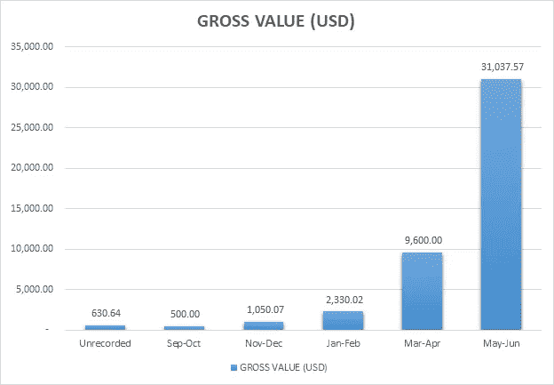
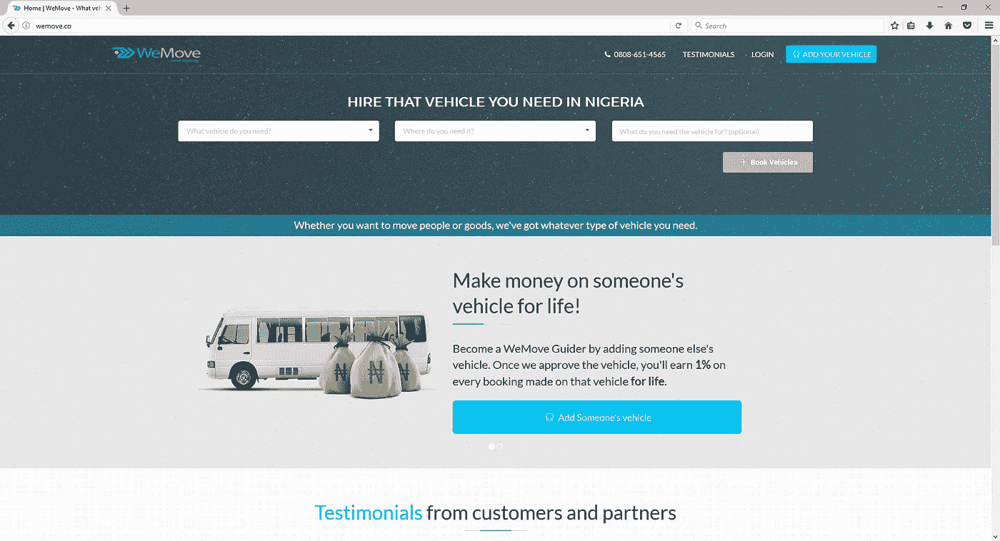

# we move 1.0:WeMove.co 网站不再是 MVP

> 原文：<https://medium.com/hackernoon/wemove-1-0-the-wemove-co-website-is-no-longer-mvp-fa3eadfff82f>

你如何判断人们是否想使用你脑子里的想法？几种方式:

1.  问问他们。
2.  做一个调查，并向公众公布。
3.  建造它，把它放在那里，并记录下反应。

当我去年构思“我们搬家”的想法时，我决定做第三件事，事情的发展很有趣。你可以在下面看到被动运行[网站](https://hackernoon.com/tagged/website)的结果:

Total value of requests gotten on WeMove.co MVP between idea conception in Aug 2016 and June 30, 2017

有趣吧？我也这么认为。这些只是我们有记录的预订请求(许多请求是通过电话提出的，但没有记录)。这些请求主要是通过口头推荐获得的。

申请的车辆从轿车到过山车到大型卡车。需求来自个人和 FMCGs。

# 到目前为止，一切顺利！

然而，从受孕到今天，发生了许多事情。

1.  我已经建立了一个小型的专门团队。
2.  我们已经从仅仅基于电话的预订转变为在线表格预订。
3.  我们运营着一个活跃的 WhatsApp 车主群体，希望从他们的车辆中获得价值；**又变得太**。
4.  我们已经满足了相当多的顾客，他们对我们的服务非常赞赏。看这里的一些感言:[**http://wemove.co/testimonials**](http://wemove.co/testimonials)
5.  我们刚刚上线了我们的 1.0 网站:[**http://www.wemove.co**](http://www.wemove.co)。

The new WeMove.co website

# 车辆在哪里？

所以我们有一个车辆库，可以循环预订。这个新网站应该让用户自己选择车辆，而不是我们给他们。但是我们暂时关闭了它。

禁用是因为:

1.  我们正在将它们从旧网站的旧数据库迁移到新网站。
2.  这些照片没有达到我们想要的标准，所以我们正在重新拍摄，让它们看起来更像样。
3.  我们也在增加车辆的数量。所以如果你有一辆你想赚钱的车，在这里添加:[**http://www.wemove.co/add**](http://www.wemove.co/add)**。**

(增加运载工具的选择很多:从*冈田*到商用飞机)

# 在任何交通工具上赚钱

随着我们新网站的推出，我们将开放 **WeMove Guider 计划**，让任何人都可以添加任何车辆并从车辆中赚钱。

要成为一名 WeMove 向导，你只需要有一部能上网的手机和一个好的摄像头。认识有车的人和想从他们的车上赚钱的人。您添加的任何车辆每成功预订一次，您将获得预订价值 1%的折扣。

(作为对比，我们在 3 月份收到了一个价值 140 万纳米比亚元的请求，我们已经成功执行了一个价值 48 万纳米比亚元的请求。)

在以后的时间里，我会写一篇关于如何成为 WeMove 向导，如何使用仪表板以及完整条款是什么的帖子。

在此期间，您可以添加任何车辆并从中赚钱，方法是前往:

**我非常感谢每一个帮助我们传播消息的人。这些成就大部分都是因为你才被记录下来的。**