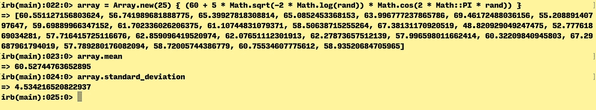

# 利用关系构建虚拟数据

> 原文：<https://medium.com/hackernoon/weve-all-been-there-adedc9e82b42>

我们都经历过。您正在构建一个具有大型数据集的 rails 应用程序，并且您计划让该应用程序在[数据集](https://hackernoon.com/tagged/dataset)上运行分析。如果你遵循测试驱动[设计](https://hackernoon.com/tagged/design) (TDD)模型，那么你将需要测试你的分析方法。问题是，您的数据集太大，无法上传到您的测试套件中。您总是可以复制测试夹具的前 500 行左右，但最终总是会产生奇怪的结果。您真正需要的是对测试数据集的外观有更多的控制。让我们从一个例子开始:

我正在开发一个应用程序来分析来自自行车共享网络的数据。我有一个站点网络，所有站点都有一个名称和 bike_dock_count，并且作为起点站和终点站属于许多行程。行程有持续时间、起点站标识和终点站标识。

`Station attributes: name, dock_count
Trip attributes: duration, start_station_id, end_station_id`

我知道我希望每个车站都有一些与之相关联的行程，但是我们如何设置呢？首先，让我们从在 Ruby 中构建一些虚拟站开始。我可以为此创建 5 个工作站:

`Station.create(name: "station 1", dock_count: 5)
Station.create(name: "station 2", dock_count: 6)
Station.create(name: "station 3", dock_count: 7)
Station.create(name: "station 4", dock_count: 8)
Station.create(name: "station 5", dock_count: 9)`

或者，我可以用一个 times 循环来构建它们，这样可以避免重复:

`5.times do |time|
Station.create(name: "station #{time}", dock_count: time + 5)
end`

太好了，现在我的站点都被覆盖了。我将总是有 5 个站，它们将被一致地命名(我假设数据库正在被清理，所以 id 总是 1–5)。接下来，让我们继续为这些站点构建行程。我们也许应该仔细看看我想从这些分析中得到什么。为了简单起见，我想计算一下:

*   每个车站开始的平均行程数
*   在每个车站结束的平均行程数
*   旅行的平均持续时间
*   行程持续时间的标准偏差。

好吧，那我们怎么做？我想指出平均值是多少，然后构建反映该计数的数据集。假设每站平均要 5 趟。因为每个车站的平均行程简单来说就是:

`total_trips / total_stations = average_trips_per_station`

因此

`total_trips = average_trips_per_station * total_stations`

我们知道，无论如何，如果我们有 5 个站点，并且希望每个站点平均有 5 次旅行，我们需要构建 25 次旅行，这些旅行的实际站点并不重要。我们可以使用另一个循环来构建它:

`25.times do
Trip.create(duration: 1, start_trip_id: rand(1..5), end_trip_id: rand(1..5))
end`

为什么我用兰德(1..5)那里？因为我知道我只有 id 为 1-5 的站点，并且我并不真正关心每个行程分配了哪些站点。这很好，但是我们真的希望我们的持续时间总是 1 吗？这有点无聊，我想我们可以在这里做些更有趣的事情。如果我们设置我们的旅行，使我们的持续时间遵循一个[正态分布](https://en.wikipedia.org/wiki/Normal_distribution)(钟形曲线)。稍微搜索了一下，我发现了这个[方便的公式](http://rosettacode.org/wiki/Random_numbers#Ruby)，它将构建一个指定长度(desired_count)、平均值(avg)和标准偏差(stdev)的数据数组:

`Array.new(desired_count) {avg + stdev * Math.sqrt(-2 * Math.log(rand)) * Math.cos(2 * Math::PI * rand)}`

我们如何在数据生成器中使用它？简单来说，我们需要建立 25 次旅行的数据，假设我们期望的平均持续时间是 60，标准差是 5。代码将如下所示:

`trip_durations = Array.new(25) {60 + 5 * Math.sqrt(-2 * Math.log(rand)) * Math.cos(2 * Math::PI * rand)}`

将此代入 IRB，并使用[描述性统计](https://github.com/thirtysixthspan/descriptive_statistics) gem，它为我提供了#均值和#标准差方法，我得到了以下结果:

很漂亮，很接近。由于数据集是使用 rand 函数构建的，因此对于像这样的小数据集，数据将会关闭。我想，随着构建的数组越来越大，均值和标准差越来越接近我们想要的。当然，在每次测试开始时随机运行这种水平的准确性是不可接受的，所以我们可能希望在 IRB 中运行代码

无论如何，我们可以这样实现它:

`5.times do |time|
Station.create(name: "Station #{time}", dock_count: time+5
end`

`trip_durations = Array.new(25) {60 + 5 * Math.sqrt(-2 * Math.log(rand)) * Math.cos(2 * Math::PI * rand)}`

`25.times do
Trip.create(duration: trip_durations.pop, start_trip_id: rand(1..5), end_trip_id: rand(1..5))
end`

就是这样！现在我已经有了一组代码，可以构建 5 个站点和 25 次旅行。另外，我很清楚我会得到什么(大部分)！