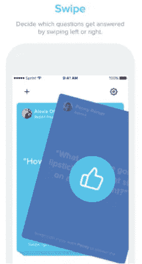
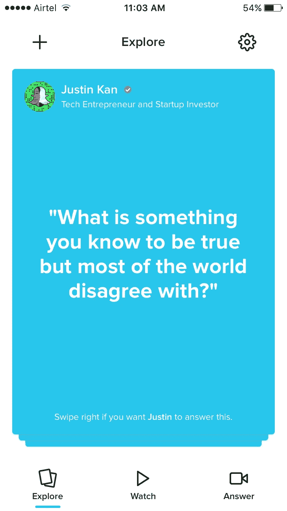
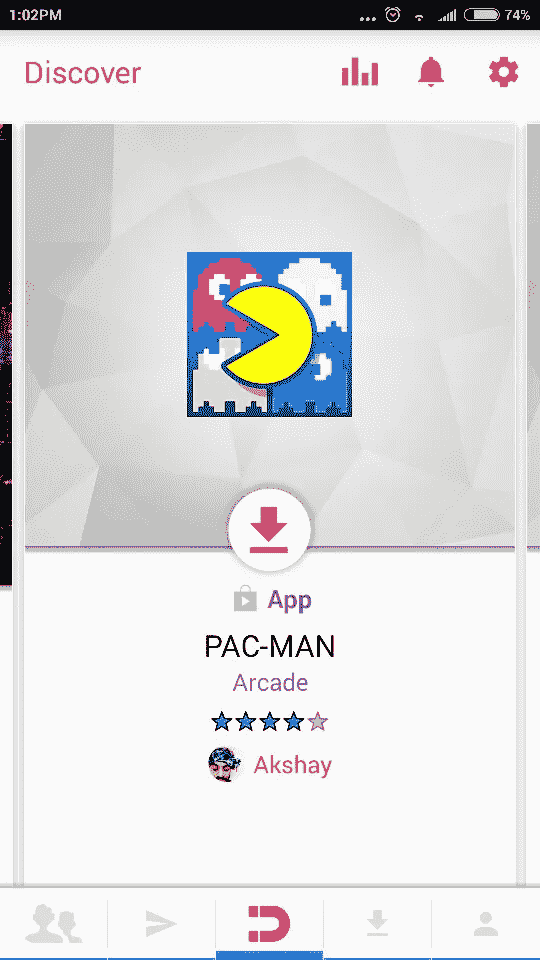
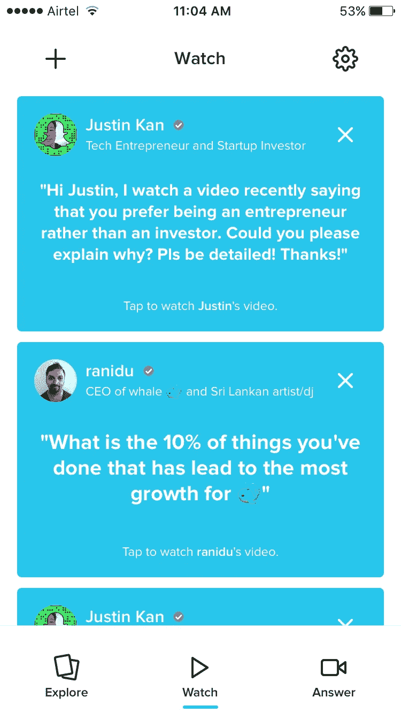
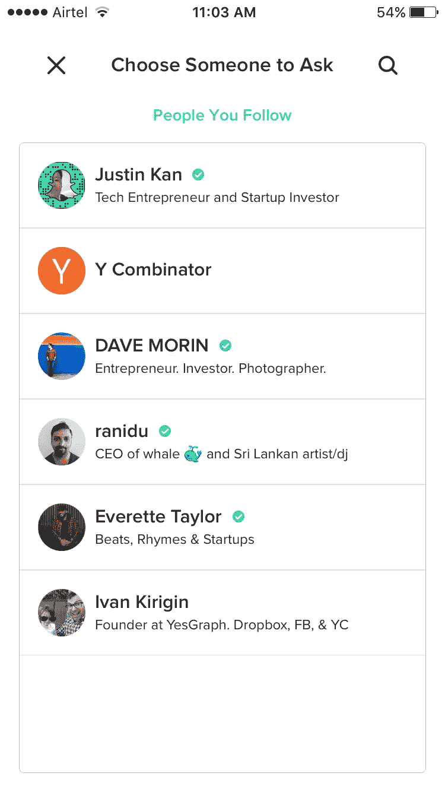
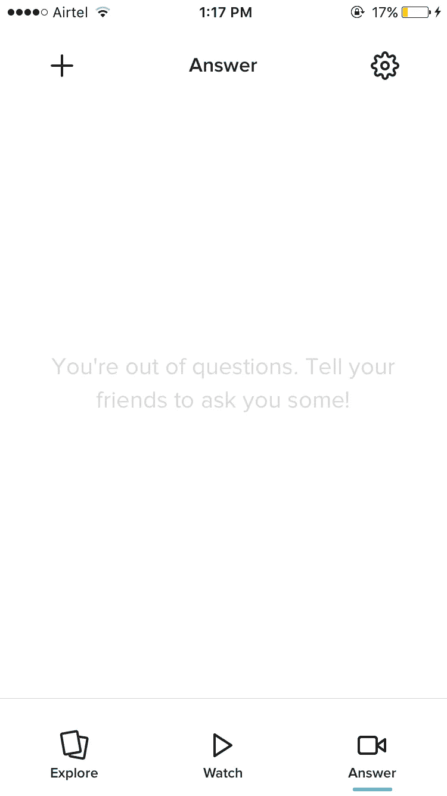

# 鲸鱼 2.0:我将如何重新发明产品

> 原文：<https://medium.com/hackernoon/whale-2-0-take-on-product-8cc7119eafcf>

对于那些不知道的人，Whale 是一个问答应用程序(目前只在 iOS 上)，允许你与有影响的人、名人和朋友分享知识和观点。Whale 是由贾斯汀·坎(Justin Kan)和首席执行官(CEO)拉尼杜·兰卡奇(Ranidu Lankage)共同创立的。

[Whale App](https://itunes.apple.com/us/app/whale-video-q-a-with-your-twitter-friends/id1140619549?mt=8)

我为什么要这么做？主要有三个原因:

1.  我非常喜欢这个想法，因为我对所有社交活动都充满热情。因此，人们总是对 Whale 发生的一切感到好奇。
2.  我对社交消费技术产品情有独钟，希望增加价值，哪怕是一丁点儿。
3.  渴望联系到[贾斯汀·坎](https://medium.com/u/97ddc24c01db?source=post_page-----8cc7119eafcf--------------------------------)来谈谈我和我的联合创始人[杜杰希·考什克](https://medium.com/u/1c56628108cb?source=post_page-----8cc7119eafcf--------------------------------)正在进行的项目[。](https://www.linkedin.com/in/akshaypruthi/)

# **简要回顾 Whale 1.0**

该应用程序由 4 个部分组成。

*   **主页:**作为一名消费者，我可以浏览不同人提出的许多问题。作为一个用户，它敦促我投票支持我想得到意见的问题，还展示了回答这些问题的人的视频回复。

> Take:这是一个有趣的提要。我可以浏览不同的问题，看看专家们持什么观点。考虑到它更像是一个视频平台，用户界面上的文字有点多。饲料可以更加个性化，但我知道这将随着时间的推移。

*   **通知:**在这里，我可以浏览我感兴趣的各种类别，查看受欢迎的豆荚，并关注许多人。

> 拿着:这个对于 1.0 来说太多了。我希望它只是我可以关注的影响者，以及他们拥有专业知识的类别

*   **交流:**这里显示了我问过的或者我必须回答的所有答案。

> 举个例子:UX 非常复杂。

*   **个人资料:**我所有的个人资料都存储在这里

# [鲸鱼 2.0](https://techcrunch.com/2017/06/27/qa-app-whale-gets-tinder-style-swipes/)

# 探索:火绒风格刷卡

在 Whale 2.0 中，提要是一个火绒风格的问题。如果你想让专家回答这个问题，向右滑动，如果你对这个问题不感兴趣，向左滑动。

> 拿走:
> 
> 嗯，当我运行 [Reach App](https://medium.com/u/243a5ba6e01f?source=post_page-----8cc7119eafcf--------------------------------) 并且我们都准备好做我们的第一次重大改造时，我们从自上而下的可滚动提要转移到类似于自左而右的可滚动提要(或多或少是 tinder 风格)。**我们发现交易百分比从 47%大幅下降到 23%**在与大约 1000 名用户交谈后，我了解到人们喜欢快速滚动，更快地找到他们感兴趣的内容。默认刷卡是一个缓慢的游戏，并不意味着这不是你不应该尝试的事情。所以这一切都归结于平台上正在填充的内容的类型。

Reach app (Left to right scrollable screen)

> 此外，在屏幕上，对提问者进行表扬。现在，她/他无处可寻。作为一个来消费内容的用户，我可能对那个人不感兴趣，但作为一个企业，保存这些数据并最终使用这些数据来建立一个可靠的受协同过滤影响的推荐引擎对我来说很重要。
> 
> **在 Reach，使用类似的分析，我们能够将平台内部的网络强度提高 63%**

# **主屏幕上的实验**

**实验一:**鼓励用户用视频格式提问怎么样？

**实验 2:** 建议用户关注更多简档。

实验三:大多数人都不知道该向谁询问那些多年来一直萦绕在他们脑海中的问题？谁能改变他的观点？很多人不知道加里·维纳查克是谁，但一旦他们看到他的内容，他们就会上瘾，并受到他的强烈影响。现在的问题是，Whale 如何帮助我与这些人建立联系？

# 观察:已经回答的问题

> 拿走:
> 
> 喜欢这个界面。我可以看到这可能是一个很好的 UX，当你有成千上万的问题由不同的人回答，并最终变得非常足智多谋和信息消费饲料，这是非常有趣的。

**实验 1:** 为什么不把 UI 更倾向于面向视频的 UI。你的手机屏幕上出现的不是唯一的问题，而是贾斯汀的视频回答。UX 可以是类似脸书视频的东西。搜索栏可以放在顶部，让人们直接搜索他们提出的问题。这可能会更吸引人。

**实验二:**鲸鱼 1.0 曾经在第一个视频结束后带我去看第二个视频。这是一个伟大的黑客行为，因为大多数消费者坐在平台上只是为了消费好的内容，而不知道他们到底想消费什么。自动滚动所有已回答问题的视频将有助于提高参与度。

# 跟随他人

> 拿走:
> 
> 现在这需要很多改进
> 
> 选个人问:作为消费者，我不知道该问谁。我认识的人总是有限的。因此，作为一个平台，如果你不给我建议，你就限制了我的联系
> 
> 你关注的人:可能只是一个标签，太次要了。主要选项卡应该是“您应该关注的人”
> 
> 搜索栏不给我建议。灵感可以从 Instagram 搜索栏获取。顶部是条形图，底部是世界正在关注的顶级影响者(可能是按类别)

# 回答:我应该回答的问题

> 拿走:
> 
> 有了这种 app，消费者 vs 影响者/专家的比例永远很高。这意味着这一部分对大多数消费者来说将是空的。该应用的定位主要围绕专家和名人，并且该应用不支持朋友对所提问题发表意见。因此，我们可以清楚地得出结论，将会有非常少的人向他们的朋友提问。
> 
> 简而言之，这个领域的活动将会非常少，我不确定给这个类别提供这么多房地产是否有帮助。

**实验:**将鲸鱼概念从多对一移动到多对多。在“探索”部分，可能有一个“答案”的辅助 CTA。以便用户可以回答这些问题。在“手表”部分，除了专家的回答之外，可能还有一个小的二级 CTA“3 个人的回答”。在答案类别中，您的所有答案都可能会弹出来。

总的来说，这是一个非常需要的改造。更简单的 UX 和干净的界面。尽管他们可能保留了早期更新中的一些东西。

我个人认为，Whale 有可能成为人们分享知识和观点的巨大平台。问答是人类与生俱来的东西，如果被破解，这可能会爆炸！！

> [黑客中午](http://bit.ly/Hackernoon)是黑客如何开始他们的下午。我们是 [@AMI](http://bit.ly/atAMIatAMI) 家庭的一员。我们现在[接受投稿](http://bit.ly/hackernoonsubmission)并乐意[讨论广告&赞助](mailto:partners@amipublications.com)机会。
> 
> 如果你喜欢这个故事，我们推荐你阅读我们的[最新科技故事](http://bit.ly/hackernoonlatestt)和[趋势科技故事](https://hackernoon.com/trending)。直到下一次，不要把世界的现实想当然！

