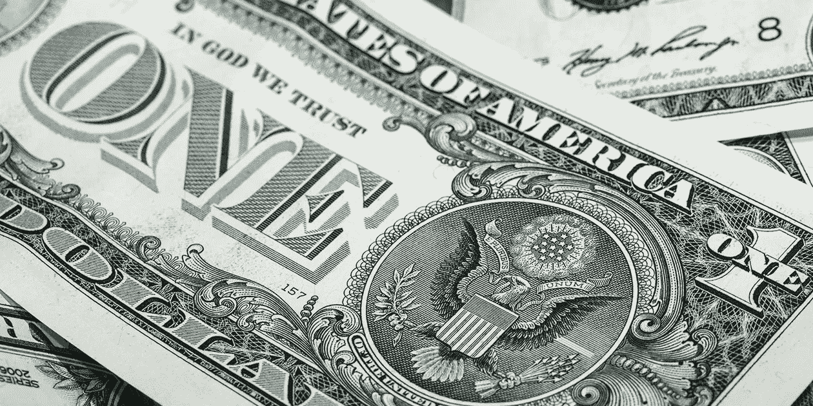
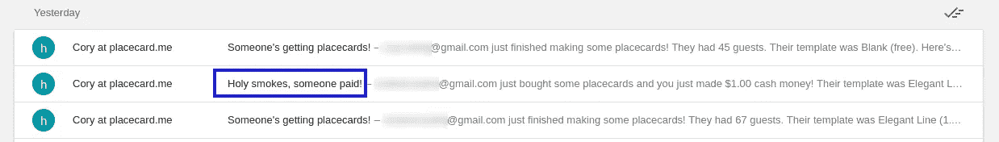
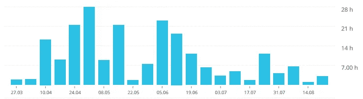
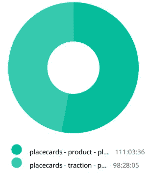
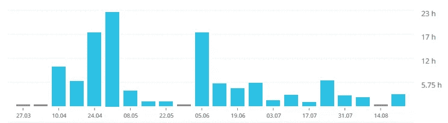
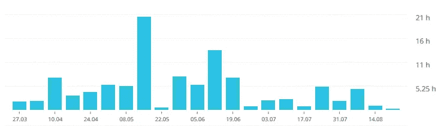
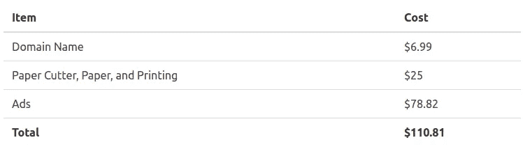

# 从一个 SaaS 项目中赚到你的第一美元的真正原因是什么

> 原文：<https://medium.com/hackernoon/what-actually-goes-into-making-your-first-dollar-from-a-saas-project-ad84e6329ae3>

## 我刚刚在我的 SaaS 应用程序上赚了我的第一美元，只花了 200 个小时和 110 美元

今天早上，我醒来时发现收件箱里有一件非常令人惊讶的事情:

夹杂着标准的“有人在拿座位卡！”我经常收到的邮件是我以前在测试中只见过的一封邮件。

*天哪，有人付钱了！*

**我刚刚从 SaaS 赚了第一笔 1 美元的收入。**真的——就像老生常谈——在我睡觉的时候。

如果你读过[我的一些其他作品](https://theascent.biz/when-your-business-refuses-to-make-money-4bcecf55c666)，你就会明白为什么我会感到惊讶。直到昨晚，我的[可打印的 Place Card 网站](https://www.placecard.me/)还没有产生一单销售。

由于这对我来说是一个重要的里程碑，我认为这是一个很好的时间来深入了解实现它需要付出什么。

我希望这将有助于其他人开始寻找 SaaS 产品，了解他们可能会经历什么。

也就是说，希望你会比我更聪明、更成功。那可能不会太难。

# 那么，是什么造就了 1 美元呢？

主要是时间。

确切的时间是多少？

在写这篇文章的时候，不到 210 个小时，或者大约 5 个工作周和一天，分布在大约 5 个月的时间里。

如果你在家做数学，得出的时薪不到每小时半美分。还好我一直很享受这个过程！在这种情况下我不可能放弃我的日常工作。

以下是时间是如何一周周分解的:

All time reports courtesy of the wonderful app [Toggl](https://toggl.com/)

在我验证了这个想法并构建出 MVP 之后，你可以看到一个很大的提升。然后，当我用广告进行一些实验时，它下降了几个星期，当我在网站上建立了购买模板的能力并进行第二次营销推广时，它又上升了，然后最终进入一个非常稳定的维护期，在这个维护期里，我平均每周花大约 4 个小时保持亮着灯，并做一些小的调整。我想这最后一个阶段会无限期地持续下去。

# 产品与牵引力

另一件有趣的事情是*产品*工作——建设网站并使其更好——与*牵引*工作——试图让它走向世界——之间的区别。

我在 [Traction](https://www.amazon.com/dp/B00TY3ZOMS/) 中读到，一个典型的企业应该把它的时间 50/50 分配在产品和牵引上，从那以后，我一直努力保持这个大概的比例。

这是目前这 210 小时的细分情况:

Product (111 hours) vs Traction (98 hours)

我们也可以观察随着时间的推移，在这两件事情上所做的努力。

Efforts on Product

Efforts on Traction

你可以看到，事情开始于创意验证阶段的牵引努力，随后是在我构建登录页面和 MVP 时的大规模产品推送，牵引接管了我对它的市场推广，最后在维护模式下几乎是五五开。

维护阶段的 50/50 划分是经过深思熟虑的(有时也很困难，因为开发产品要有趣得多)。

# 钱呢？

当然，除了时间之外的另一个投入是金钱。

这是我目前为止在这个项目上花的钱。其实很简单:

坏消息是，在我收回投资之前，我还有很长的路要走。好消息是，大部分钱都花在了用于验证测试的广告上，在我第一次销售之前的一个月里，我没有在这个项目上花一分钱。

我现在自豪地拥有了一台全新的切纸机！所以就这样了。

你可能想知道我的服务器成本在哪里，我承认我在这一点上有点作弊。我在同一个服务器上托管我所有的项目——一个我已经为之付费超过五年的服务器——所以我没有特别把它包括在这个项目的预算中。实际上，我可能应该在这里包括这些成本的一部分。

# SaaS 不容易

当我开始尝试[通过在互联网上做点什么来赚钱的时候](http://www.coryzue.com/writing/the-solopreneur-sabbatical/)很多人警告我这比我想象的要难。男孩，他们是对的。

如果我当时知道我会继续在这个项目上花 200 个小时来减掉 110 美元，我还会这样做吗？

***绝对。***

让我们明确一点——我可能会选择一个完全不同的产品来工作。希望有更多的机会产生真正的收入。我可能还会瞄准一个我更了解的行业，而不是婚礼。

但是我不认为如果不努力的话，我真的能够知道这些事情。我从来都不是那种靠别人告诉我事情就能学好的人——最好是自己去弄清楚这些事情——谢天谢地，我有时间、技能和支持系统来实现这一点。

现在，我更加了解如何从零开始打造一款创收的 SaaS 产品(剧透:工作量很大！).因此，我应该能够充满信心地说，如果我不得不再次这样做，我将能够更聪明地对待它，这也意味着更大的成功。

理论上，我现在也有了一个可持续发展的引擎，有了 Place Card Me，我就能以更少的投资创造更多的收入，甚至有朝一日会实现盈利。

失陪了，我要用我辛苦赚来的 SaaS 现金去买六分之一的肉丸三明治。💰💰💰

*原载于 2017 年 8 月 24 日*[*【www.coryzue.com】*](http://www.coryzue.com/writing/first-dollar/)*。*