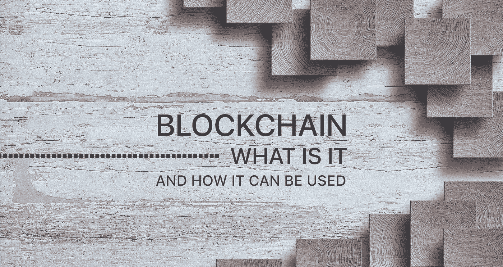
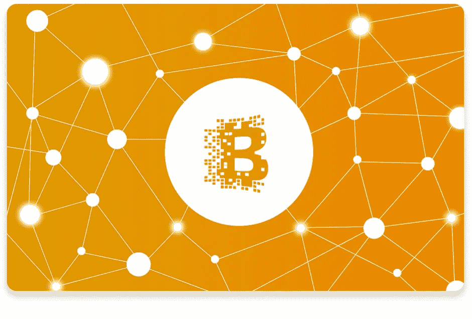
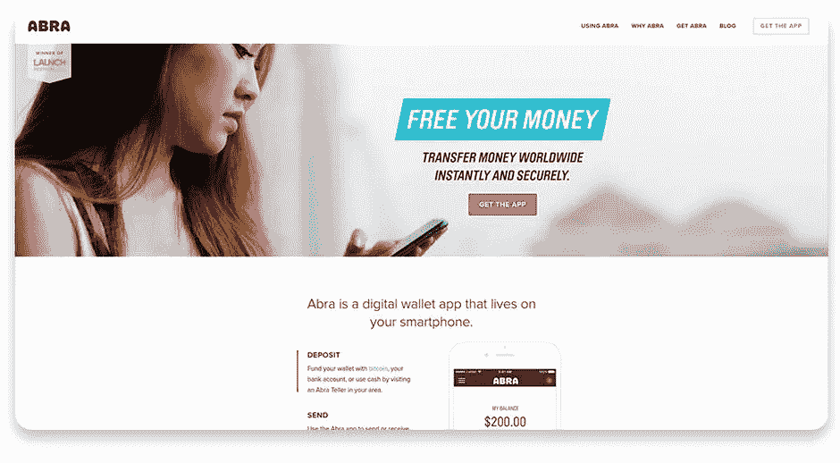
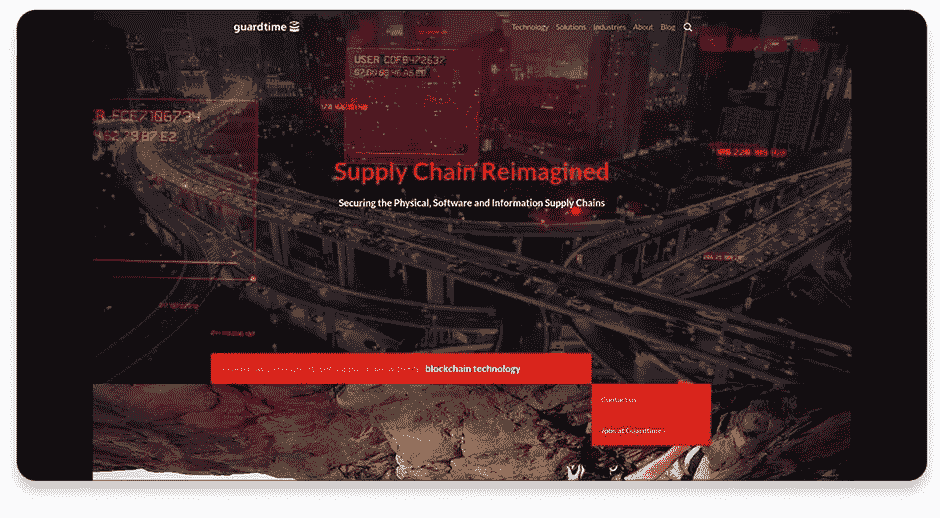
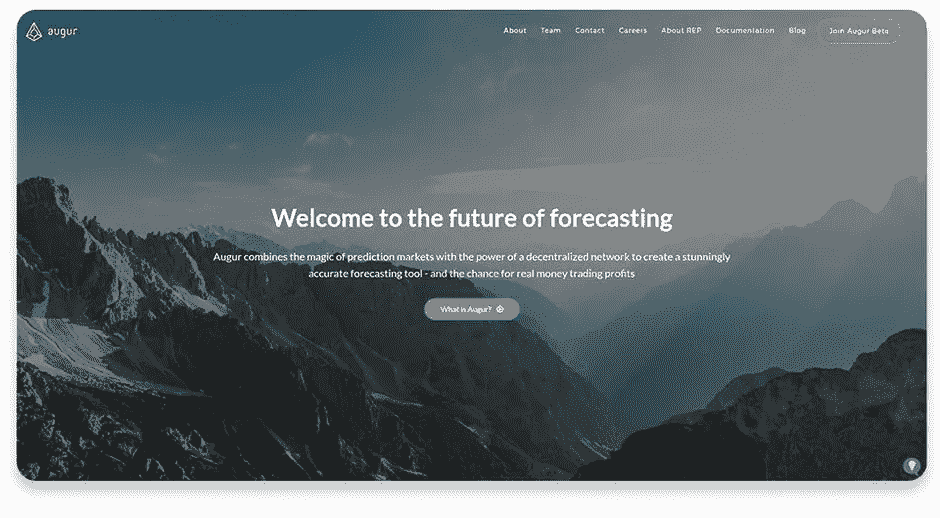
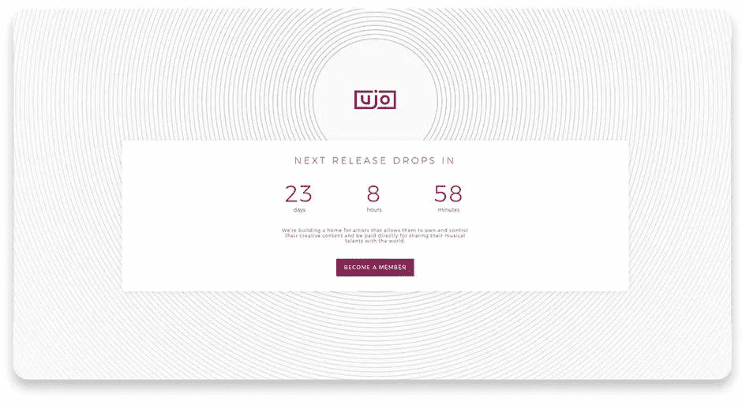
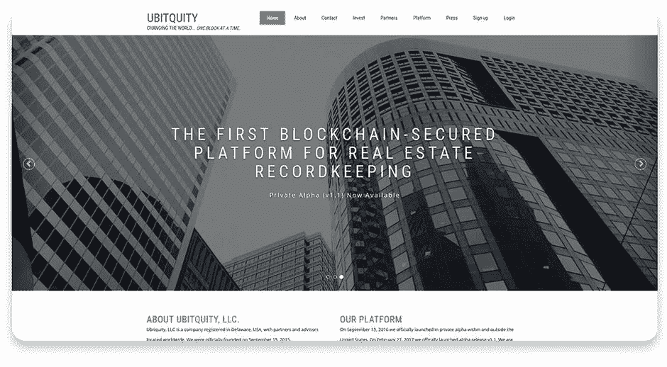
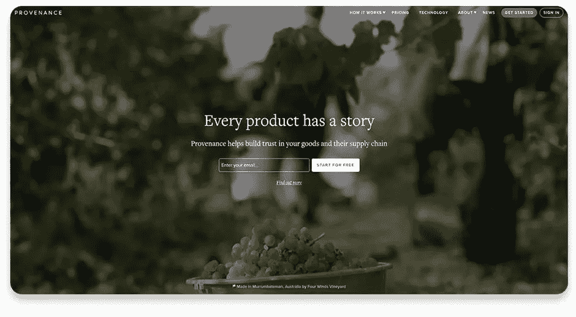
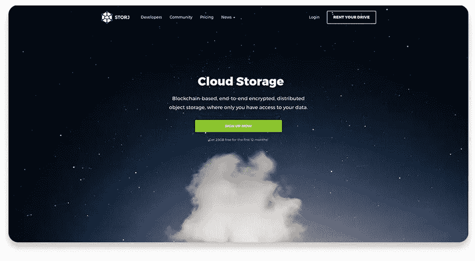

# 什么是区块链，为什么您的企业需要它们

> 原文：<https://medium.com/hackernoon/what-are-blockchains-and-why-your-business-needs-them-fd2647c10af6>

## 区块链——显而易见的安全性

人们普遍认为计算机在存储信息方面是不可靠的。除非您将机器放在某个绝对隐蔽、完全安全的掩体中，没有任何互联网或人工访问，否则有人(或某物)会找到方法闯入并损坏您的数据。很长一段时间以来，这个问题似乎没有实际的解决方案，只有模糊的“光明会确认”的那种。好吧，虽然这种解决问题的方式对某些人来说可能很好，但是严肃的生意通常需要更实际的方法。

谢天谢地，现在有了。它的名字叫区块链，这项技术虽然看似简单透明，但实际上却密不透风。

> *区块链是我们计算机网络迫在眉睫的未来。这是一个非常划算的系统，在这个系统中，每个人都是信息的评判者和保护者，不管是他们的还是其他人的。在区块链内，您的数据不会有被盗、更改或篡改的危险，因为每个人都在监视并准确记录系统内发生的所有事情，而整个过程都受到加密技术的安全保护。*

在本文中，我们将向您解释什么是区块链以及它们是如何操作的。然而，最重要的是，我们将向您介绍一些方法，通过这些方法，您可以将区块链应用到您自己的业务或生活中。为了证明我们的观点，我们还将提供一些成功的区块链企业的例子，包括金融和非金融部门。

## 那么什么是区块链呢？

> *区块链是一个由计算机组成的系统，网络的所有参与者在其中存储和共享信息。可能没有简单的方法来解释区块链是如何工作的，但我们会尽力而为。*

假设您想给邻居贝蒂发送一条消息，其中包含短语**“你好！”在现实生活中，你通常会走到贝蒂面前，直接告诉她这个消息。但是如果贝蒂离你千里之外呢？你最有可能写一张卡片/信/便条，说**“你好”**，并以某种方式送给她:通过邮件或电子邮件，通过你共同的朋友，等等。**

差不多了，好像工作完成了，没什么好担心的。然而，仍然有相当多的可能情况，事情可能会出错。为了让贝蒂收到你的信息，邮件公司必须足够负责任，不要在途中丢失信件，或者电子邮件服务必须足够安全，不会突然遭到黑客攻击，或者你的朋友必须足够可靠，不会忘记传递它。在这三种情况下，你都必须信任他人，并相信他们会完成任务。

这就是所有交易的运作方式，人们已经学会了如何应对。然而，如果你想发送的不是一条说“你好！”，但是，比方说，一个拥有世界上所有核密码列表的？或者你想给贝蒂寄十亿美元？在这种情况下，你会依赖你的朋友(或任何人)吗？没想到会这样。

区块链所做的是，无论你做什么，它基本上消除了依赖他人/服务/机构的需要。以下是方法。

这一切都始于 2009 年，一个叫中本聪的人发表了一篇[文章](https://bitcoin.org/bitcoin.pdf)。没有关于作者的可用信息(或者甚至是作者？)，但这段文字却永远改变了我们看待和存储数据的方式。Nakamoto 的革命性想法包括一种存储类型，每个人都可以看到里面的东西，并确保它是真实的。没有一个比特是可以改变的——一旦某样东西出现在网络上，它就永远留在那里。

这就是区块链的本质。区块链中共享的所有数据都以块为单位进行压缩，一旦一个块被添加到链中，就没有什么可以改变它。如果你需要改变一些东西，你可以在前一个块的基础上添加另一个块，从而通知每个人你已经改变了一些东西。然而，仍然有可能回到一个街区前，看看以前的一切。

让我们暂时回到贝蒂的例子。想象一下，你和贝蒂发生了一场激烈的争吵，你决定写一封刻薄的信，内容是这样的:**“贝蒂真是一件麻烦事！你永远不应该和她做朋友！！!"并通过区块链发送出去。一旦这封信被批准，它被压缩成一个块，并添加到链中，每个人都可以看到贝蒂是一个卑鄙的人。然而，几天后你们都冷静下来，想通了一切，你通过区块链又写了一封信，但这次写的是**“贝蒂是世界上最好的人，她是我绝对的闺蜜！！!"** Whooosh，而且这封信也是审核通过加到链上的，现在大家都可以看到了。**

当然，每个人首先会看到的是这封新的信，这封信里有贝蒂在身边很好。但是所有的网络用户仍然能够回到一两个街区，看到第一个，她是一个可怕的人，没有人应该和她做朋友。明白我们的意思了吗？区块链是一个记录保存者，所有输入的数据都安全可靠地保存在这里，供您阅读和分析。

区块链真正吸引人的地方在于它没有中央存储器。区块链的每个成员都有一份所有数据的副本。您不一定要保存所有东西，但如果您愿意，您可以保存。话虽如此，没有人可以简单地走进来，比如说，在您的数据版本中更改某个句子中的昏迷状态，因为这样一来，网络中的许多其他成员仍然会拥有真实副本，并且会简单地将您的副本排除在外，认为它是不正确的。一旦你的街区被清理和修复，它会在以后被更新，但是，在那之前，它会和其他所有的街区分开。只有所有者才能做出改变，这是一条规则。

当您成为区块链会员时，您会得到两把钥匙:一把私人钥匙和一把公共钥匙。至于接收者的密钥，它是为每个消息/文件/事务随机生成的。现在，您可以对信息进行加密，这样任何人都可以读取您的文件内容，但您也可以使其显示为文件列表，只有接收者才能查看或下载。这些东西是可选的，完全取决于区块链的类型。

系统如何知道是您在进行更改或发送消息？在这些密钥和非对称加密技术的帮助下。

您的第一个密钥(私钥)用于加密数据。记住“你好，贝蒂！”消息？当您想通过区块链发送它时，系统会接收它，并通过一个算法和您的私钥一起运行它。结果，您的消息被加密了，上面有您的签名(这是一种随机生成的足迹，对您的私钥和发送的每一条新消息都是唯一的)。

为了让贝蒂看到这条信息，它必须被批准，压缩成一个块，并添加到链中。这个批准是由区块链的其他成员(或者我们应该说是他们的计算机)在公钥的帮助下完成的。基本上，几个用户通过另一种算法运行您的消息和您的公钥，然后该算法检查该消息上的签名是否是用您的私钥生成的。如果有，您的消息将被压缩到其中一个块中，并排队添加到链中。

之后，Betty 可以很容易地使用接收者的密钥访问消息，而该密钥又是在加密和签名消息/交易的过程中生成的。

就今天而言，没有人能破解你的私钥，因为它需要几百年的时间，因为密钥简直是由可笑的长而复杂的数字和字母组成的字符串。如果我们告诉你事情在未来不会改变，那我们就是在说谎，因为科学家总能发明出能够在几秒钟内解密任何长度的代码的机器。然而，在这种情况发生之前，您可以确信，拥有区块链，您的数据无论如何都是安全的。

## 现在，让我们总结一下:

*   区块链是透明数据存储的新方式。有一些全球性的区块链，如比特币，但也可以为单独的公司或社区创建区块链。
*   许多区块链用户存储了所有数据的完整副本，并定期更新。这意味着即使一个特定的副本被损坏，也总会有数百个备份版本。
*   每个人都可以形成一个数据块。在网络检查其有效性之后，该块被添加到链中。您不能更改该块，只能在其上添加一个新的已更新的块。但是，仍然可以看到前一个模块，并比较两者。
*   所有信息都用数学密码加密，这使得任何形式的欺诈都不可能。你是唯一能够用自己的数据做任何事情的人。
*   不需要“中间人”，所有的交易都发生在人与人之间。没有中央统治权力。每个成员都有发言权，每个声音都是有效的。在区块链，多数人决定，如果有人想反对它的决定，他们必须建立自己的区块链。

## 这对你有什么帮助？

通常，区块链的技术与金钱联系在一起。这很容易解释:区块链交易是安全和免费的(这意味着你不需要像在银行那样为交易付费)。然而，在商业领域内外，区块链还有更多应用。

1.  **资金转移。**既然已经提到了，就从这里开始吧。区块链的货币交易是在各种加密货币的帮助下完成的，比如比特币。这些交易是非常安全和免费的，这意味着你可以向北极的远程工作者汇款，而不用担心有人会在途中窃取。
2.  **智能合约。这是一种非常安全的方式，可以确保某个合同的所有条款都得到履行。这个结果是通过这样一个事实实现的:智能合约对所有参与方都是公正和中立的，它们没有人类情感，也没有欺骗的动机。它们基本上是算法，只有在满足所有必要条件的情况下才会运行。再加上所有的活动记录都保存在区块链，你就有了目前人类所知的最透明的做生意方式。**
3.  **信息验证(身份/所有权/真实性)。如果某样东西被加进了区块链，无论如何它都会永远留在那里。这意味着身份不能被窃取或更改，因为在区块链记录中每个人只有一个身份。他们的成就也是如此:马特不会说这幅画是他画的，因为成千上万的分类账说这幅作品属于贝蒂。**
4.  **分布式云存储。对于任何需要以相对低廉的价格存储大量信息的人来说，这一功能都非常有用。如果你把你所有的信息，加密并存储在网络中所有计算机的小块中，你肯定知道它是安全可靠的。最重要的是，它不会像普通云存储那样花费太多，原因很简单，因为没有中介——你直接为服务付费。**
5.  **原产地证明。**在商品生产中，经常会出现这样的情况:生产商并不生产所有必需的零件，而是简单地组装他们从别处购买的零件，从而生产出最终产品。然而，如果在组装之前这些零件中的一个有问题，有问题的将不是该特定零件的生产者，而是最终产品的生产者。区块链可以用来避免这种不愉快的情况。最终生产商可以将生产的每个步骤的日志添加到区块链中，从而使他们能够向投资者、股东或任何相关人员提供整个过程的可信记录。
6.  **联网和 IOT。**区块链可以成为在某个公司或系统内提供沟通的非常有用的基地。例如， [IBM 和三星已经创建了一个名为 ADEPT](https://www.coindesk.com/ibm-reveals-proof-concept-blockchain-powered-internet-things/) 自主分散点对点遥测的平台，它实现了区块链，为所有相关机器之间的廉价自主通信奠定了基础。换句话说，他们创造了一个基于区块链的物联网(一个连接到互联网并相互连接的电子设备系统)。

坦率地说，当谈到区块链时，可能性只受到想象力的限制。这个系统是如此宏大、有前途和多才多艺，它可以在你想要的任何地方实施。我们可以提供一些企业的例子来证明这一点，这些企业已经成功地运用了区块链。

## 他们是谁？

## [阿布拉](https://www.goabra.com/)

凯西利用区块链的技术使全球比特币和其他基于区块链的货币转移成为可能。你可以在凯西的钱包里存钱，或者把钱寄给世界上任何一个人，所有这些都不需要银行账户，也不需要支付交易费用。

## [保护时间](https://guardtime.com/)

Guardtime 是爱沙尼亚的一个项目，它采用区块链技术来提供工业网络安全。

## [预兆](https://augur.net/)

Augur 是一家总部位于区块链的预测市场。人们可以在这里对体育和股票下注，但它的创始人也希望允许对选举、自然灾害和几乎任何其他事情下注。

## [UJO 音乐](https://ujomusic.com/)

这个平台承诺重建整个音乐产业。Ujo 背后的人菲尔·巴里(Phil Barry)创建了这个网站，希望解决流媒体音乐的问题，并让这个行业变得更容易、更透明:在艺术家和录音棚之间签订智能合同，列出所有创作者，确保他们对音乐所有权的真实性等等。

## [不平等](https://www.ubitquity.io/web/index.html)

Ubitquity 是一个平台，让房产变得更简单。假设这里列出了一所房子，你可以找到关于它的任何信息:通常是业主或房地产经纪人想要隐藏的东西，所有这些都没有中间方和额外的费用。

## [出处](https://www.provenance.org/)

我们以前提到过这一点:使用区块链来确保完整的未来商品的每一部分都是可追溯的、有记录的和高质量的。这正是出处的目的。

## [STORJ](https://storj.io/)

Storj 是分散的(这意味着防黑客)云存储，它为人们提供了以更低的成本和更高的安全性保存信息的能力。有趣的是，你可以出租自己的额外数字存储空间，这为一个全新的区块链市场打开了前景。

## [OPENBAZAAR](https://www.openbazaar.org/)

这几乎是所有在线零售商的天堂。OpenBazaar 直接连接买家和卖家，并采用智能合约，这一切都是为了降低购买成本，提高交易的安全性。总而言之，区块链是 IT 发展中非常有前途的一个分支。它们不仅可以帮助你建立一个安全、可信和透明的系统，而且它们还在不断发展，这意味着很可能有一天它们会有新的功能，甚至更好地适应你的个人需求。无论你想做什么样的 IT 产品，无论是网站还是移动应用，区块链都会是你想做的事情的绝佳补充。区块链的多功能性和它们提供的内在安全性使它们成为任何寻求不可渗透的方式来存储或共享数据的公司的无价之宝。

现在你知道区块链不仅仅是比特币，这项技术在多个商业领域都有广泛的用途。如果您有兴趣在您的业务中应用区块链，请随时[联系我们](http://steelkiwi.com/contacts/)并获得所有相关问题的答案。

## 有用的链接和进一步阅读:

1.  [了解更多区块链:概述、技术、应用领域和用例](https://letstalkpayments.com/an-overview-of-blockchain-technology/)
2.  [区块链将如何保护你的在线身份](https://www.forbes.com/sites/jonathanchester/2017/03/03/how-the-blockchain-will-secure-your-online-identity/#2ef0dbd85523)
3.  [希望将区块链集成到您的业务中？下面是如何](https://www.forbes.com/sites/laurashin/2016/05/10/looking-to-integrate-blockchain-into-your-business-heres-how/#719a51e51a15)
4.  [区块链科技:超越比特币](http://scet.berkeley.edu/wp-content/uploads/BlockchainPaper.pdf)
5.  [区块链:简单解释](http://jrxv.net/x/16/chain.pdf)
6.  [区块链的一些简单经济学](http://steelkiwi.com/blog/blockchain-what-are-they-and-how-it-can-be-used/goo.gl/HaFJr2)
7.  [区块链反应:科技公司计划临界质量](http://www.ey.com/Publication/vwLUAssets/ey-blockchain-reaction-tech-companies-plan-for-critical-mass/$FILE/ey-blockchain-reaction.pdf)