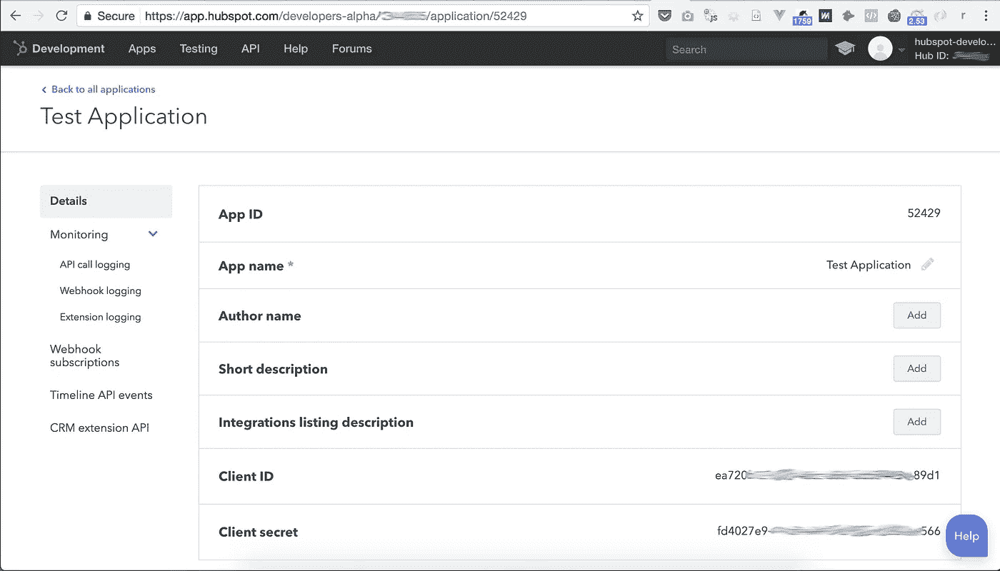
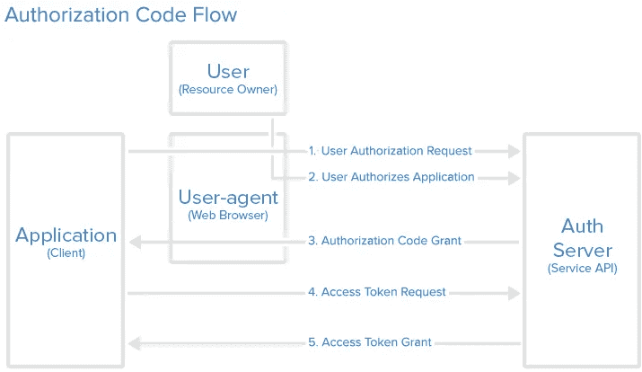

# 什么是 Hubspot webhooks，它们为什么有用？

> 原文：<https://medium.com/hackernoon/what-are-hubspot-webhooks-and-why-are-they-useful-a0caed6d09b6>

## 了解如何设置自定义网页挂钩

在上一篇文章中，我列出了将 [Hubspot](https://hackernoon.com/tagged/hubspot) 与几乎任何东西集成的三种方式，webhooks 是其中之一。
你可能第一次听说 webhooks 是在尝试将 Hubspot 与需要通知来触发外部工作流的第三方软件连接时。

例如， [Zapier](https://hackernoon.com/tagged/zapier) 将允许你基于联系属性的改变启动 Zap，但是不支持由公司或交易属性的改变触发。那么，我们如何设置 Hubspot 来通知第三方应用程序公司属性的变化呢？

这就是 webhooks 发挥作用的时候了。Hubspot 上没有关于它的完整文档，因此有了这篇文章。

# webhook 到底是什么？

> 有时也称为反向 API，webhooks 是用户定义的从平台到外部服务的 HTTP 回调，通常在预定义事件发生时触发

就联系人而言，可以使用 Hubspot 工作流设置联系人的 webhooks，因为注册标准可以是联系人属性的更改。但是，对于公司/交易属性的更改或基于联系人/公司/交易的创建/删除来触发事件，您将需要设置一个自定义 webhook。

*(这里我也讨论***如何扩展原生 Zapier 与 Hubspot 的集成)。**

# *1.每个 webhook 都需要一个应用程序*

*Hubspot *授权*，*执行*，*监控*应用环境中的 webhooks。Hubspot 将通过检查该应用程序的访问权限来确定给定的 webhook 是否可以读取您的数据并在 Hubspot 之外推送更新。
这些权限是您在门户中安装 Hubspot 集成时授予的权限。*

*所以注册 webhook 的第一步是[创建一个 Hubspot 开发者账户](https://app.hubspot.com/signup/developers)(免费)，这将让你创建你的第一个 Hubspot 应用程序。
不用担心，你不一定要做开发者。在这个阶段，应用程序只是一个抽象的实体，你根本不需要任何代码。如果你只需要设置一个 webhook，你的应用程序将只包含一个*名称*、 *ID、客户端 ID* 和*客户端秘密*。*

> *Hubspot 使用客户机 ID 和 secret 来验证您的应用程序发出的请求。“客户端”在 OAuth 标准的上下文中是指消费平台数据，它基本上是您的应用程序的凭证。它相当于软件的用户名/密码。*

**

*Your first Hubspot application! It’s really only a name, ID and Client ID / Client secret*

# *2.配置您的 webhook*

*一旦你创建了一个应用程序，进入 *Webhook 订阅*，点击*创建订阅*。*

*Hubspot 中的每个 webhook 可以由以下事件之一触发:
—联系人/公司/交易的属性变化
—创建新的联系人/公司/交易
—删除现有的联系人/公司/交易*

**

*Set up a webhook for when a contact is deleted*

*配置你的 webhook 来定位正确的 URL。如果你想发送一个触发器给 Zapier，那么复制你的 Zapier hook URL。否则，您可以让它指向您的自定义应用程序。
同时，我推荐使用一个[https://requestb.in/](https://requestb.in/143fcxd1)URL 来试着调试你的 webhook。这是一个临时服务器，它将监听你的 webhook，并在你的浏览器中显示 Hubspot 服务器生成的有效负载。*

# *3.激活门户网站上的网页挂钩*

*安装您的应用程序需要遵循与第三方 Hubspot 集成完全相同的流程。它遵循 OAuth 2.0 *客户端授权代码流程*。*

**

*OAuth Flow to grant an application access to another*

1.  *首先，在用您的应用程序 CLIENT_ID 替换 client_id 之后浏览这个 URL:[https://app.hubspot.com/oauth/authorize?client_id=CLIENT_ID&scope = contacts % 20 自动化&redirect _ uri = https://www . hubspot . com](https://app.hubspot.com/oauth/authorize?client_id=ea720b12-502d-46cc-866f-dd58448b89d1&scope=contacts%20automation&redirect_uri=https://www.hubspot.com)*
2.  *您需要选择安装应用程序(及其 webhook)的门户。*
3.  *Hubspot 将向您(作为门户 Hubspot 的所有者)显示一个提示，要求授权应用程序访问您的 Hubspot 数据。
    您将被重定向到 Hubspot 主页，但请注意复制页面 URL 中的“code”参数。*
4.  *尽管您授予了对该应用程序的访问权限，但您会注意到它仍然没有出现在门户的 Integrations 选项卡中，而它应该出现在该选项卡中。要激活它，您需要让您的“应用程序”通过在访问令牌 Hubspot API 上调用这个请求来生成一个访问令牌(我们不需要它)。要通过您的浏览器完成此操作，请使用 [https://www.hurl.it](https://www.hurl.it) 生成此请求:
    目的地: *POST*[*https://api.hubapi.com/oauth/v1/token*](https://api.hubapi.com/oauth/v1/token)参数: *CLIENT _ ID = YOUR _ CLIENT _ ID
    CODE = THE _ CODE _ FROM _ STEP _ 3
    redirect _ uri =*[*https://www.hubspot.com*](https://www.hubspot.com)*

**不要担心保存查询响应，查询本身应该足以在 Hubspot 门户的 Integrations 选项卡中激活您的应用程序。**

# **4.测试您的 webhook**

**在 Hubspot 门户上激活应用程序(及其 webhook)后，继续创建/删除一个联系人，以查看它是否出现在 Request.bin 中。**

****

**A Hubspot webhook captured in Requestb.in for debugging: the “join_date” property for the contact #123 has just been updated into Hubspot portal**

**如果你对一切都满意，现在你可以用一个 Zapier 触发器 URL 或者一个到你的另一个定制应用程序的链接来替换 webhook URL。**

# **限制**

**需要记住的一点是，目的 URL 是在应用程序级别配置的，而不是在 webhook 级别。因此，一个应用程序的所有 webhooks 将只能向一个目标 URL 报告。例如，如果你需要在 Zapier 中触发不同的 Zap，每个 Zap 使用一个触发 URL，你将不得不在 Hubspot 门户中创建和安装尽可能多的应用程序，这会变得有点混乱。**

**我希望这篇文章是有用的。**

**如果你正在考虑将你的软件与 Hubspot 整合，我鼓励你看看我的另一篇文章或者甚至[来联系](mailto:hi@getlionel.com)。在 [LinkedIn](https://linkedin.com/in/martinlionel) 上给我发消息！**

**莱昂内尔是总部位于伦敦的初创公司 Wi5 的首席技术官，也是面向未来的工程文化课程**的作者。你可以在**上联系他****