# 如果我行使我的创业期权，会有什么税？

> 原文：<https://medium.com/hackernoon/what-are-my-taxes-if-i-exercise-my-startup-options-1a36e0c3b401>

(更多创业运营资源，请查看[OpsMBA.com](http://opsmba.com)。)

这篇文章一步一步地介绍了一个案例研究，这个案例研究估计了行使初创公司股票期权的税收影响。

我给自己做了这个，所以我想和大家分享一下。它又长又无聊，但也可能有所帮助。

律师警告:做任何事之前，先找专业人士谈谈！这是一个高层次的总结，给你一个系统如何工作的概念，而不是一个计算你的[税](https://hackernoon.com/tagged/taxes)的方法。不要依靠这个做任何事情！

希望这对某个人有帮助！如果你对创业法律、财务或运营有任何反馈或问题，请[发微博给我](http://www.twitter.com/jaredcohe)或[发电子邮件给我](mailto:jaredcohe@gmail.com)。如果有帮助的话，我很乐意写更多这样的文章。

## TL；速度三角形定位法(dead reckoning)

如果你只是想要一个超级快速，非常粗略的估计你的潜在税收，而不想读整篇文章(我理解！):

*   [点击此处](http://bit.ly/1iwAv6r)复制 Google Doc 模型(需要登录 Google)。
*   改变细胞:B2，AC2，AC4 和 AC5，看看结果。

# 模型

[这是一个模型](http://bit.ly/1iwAv6r),居住在纽约市的初创公司员工 Sam 构建了这个模型，以估算如果她在 2014 年行使了自己的初创公司期权，她的所得税会是多少。你可以复印一份表格，然后输入你自己的号码。

# 常规方法与 AMT

在常规方法和替代最低税额(AMT)方法下，您需要支付较高的税款，因此您需要了解两种方法下的税款，以了解哪种方法适用。

这一点如此重要的原因是，在常规方法下，你行使期权可能没有税务影响。但如果适用 AMT，你可能会这么做，而且税收可能会很高。

Sam 可能还需要支付州和地方的 AMT，比如纽约的[和加州的](http://www.tax.ny.gov/pdf/current_forms/it/it220_fill_in.pdf)和[但是我们在这篇文章中关注的是更大的联邦税。](https://www.ftb.ca.gov/forms/2014/14_540p.pdf)

让我们从使用常规税收方法计算 Sam 的税收开始。

# 常规税收方法

山姆从她的收入开始。她 2014 年的工资是**5 万美元**。那是她唯一的收入来源。她把它输入到模型的 B2 细胞中。

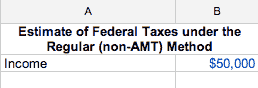

山姆不必为她的全部收入缴税，因为税法允许抵免和扣除。

山姆可以通过[列举她的扣除项目](https://www.irs.gov/taxtopics/tc501.html)来计算出她的每一项扣除，或者她可以只使用[标准扣除项目](https://www.irs.gov/publications/p17/ch20.html)。美国国税局表示:“大多数纳税人要么选择标准扣除，要么选择分项扣除。如果你有选择，你可以使用给你较低税收的方法。”

因此，Sam 计算两种扣除额以决定使用哪一种。

## 逐项扣除

萨姆首先计算分项扣除额。她算出了自己的大额分项扣除额:州和地方所得税。政府允许许多其他扣除，但这些要么不适用于山姆，要么太小，无法影响她是否行使选择权的决定。

在模型的 G 到 H 列中，Sam 使用纽约州指令[来估算她的州税和地方税。](http://www.tax.ny.gov/pdf/current_forms/it/it201i.pdf)

对于她的州税和地方税，就像她的联邦税一样，Sam 可以逐项列出她的扣除额或采用标准扣除额，并选择降低其应税收入更多的方法。Sam 的州税和地方税没有实质性的扣除项目，所以她将采用标准扣除。

说明的第 18 页告诉她标准扣除额是**$ 7800**。

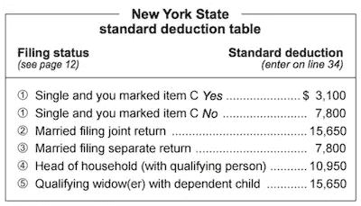

在 cell H4，她的应税收入为 42，200 美元。

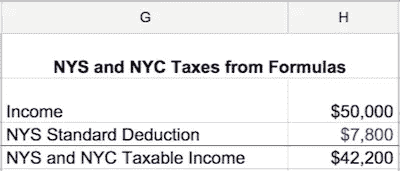

然后，Sam 在模型的 J 到 T 列中创建表，以计算她的州税和地方税。

在模型的 J 到 N 列中，Sam 使用第 50 页上的[指令](http://www.tax.ny.gov/pdf/current_forms/it/it201i.pdf)中的公式计算她的州税**2392 美元**。

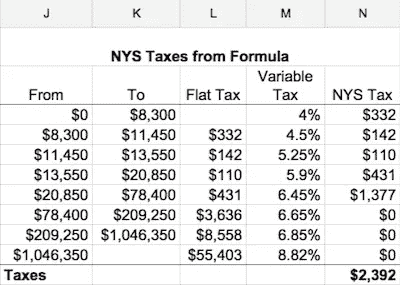

在模型的 P 到 T 列中，Sam 使用指令第 62 页的公式计算她的城市税【1,426 美元。

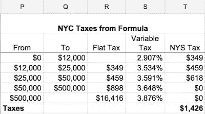

那些说明在第 42 和 54 页也有税单，如果你想仔细检查电子表格，可以查阅你的税单。

使用这些公式，Sam 得出纽约州和纽约市的总税款为 3，818 美元，这也是她可以进行的分项扣除。

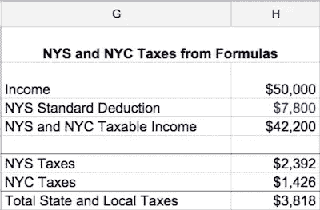

她现在必须将总计 **$3，818** 的分项扣除额与她的[联邦标准扣除额](http://www.irs.gov/publications/p17/ch20.html)进行比较，以决定是采用分项扣除额还是标准扣除额。

## 标准扣除

山姆在[表](http://www.irs.gov/publications/p17/ch20.html#en_US_2012_publink1000283782)中查找她的标准扣除额。山姆的标准扣除额是**$ 6200**。

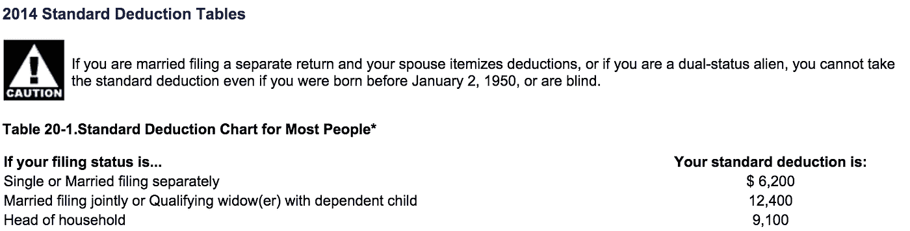

她将该数字输入到单元格 H10 中。电子表格的单元格 H12 告诉她采用 **$6，200** 标准扣除额，因为它大于分项扣除额 **$3，818** 。

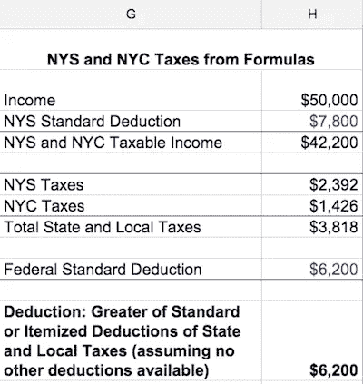

## 个人免税额

在计算她的税款之前，她可以从她的联邦应税收入中再扣除一个数字，即她的 3950 美元的个人免税额。

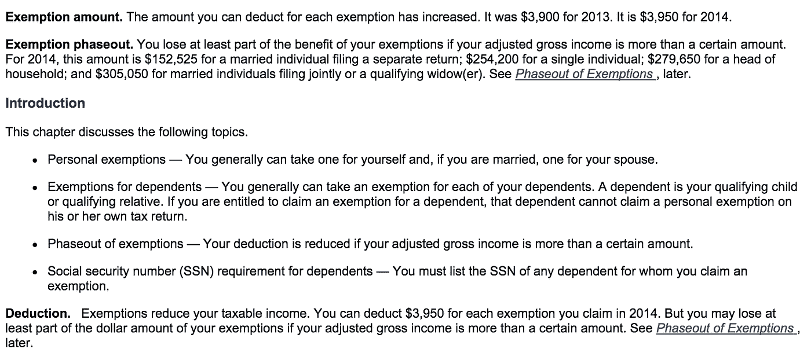

在单元格 B7 中，山姆为她的个人免税扣除了 **$3，950** ，并在单元格 B8 中获得了 **$39，850** 的应纳税收入。

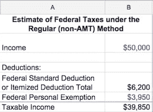

现在她已经有了应税收入，她准备计算她的联邦税。

在模型的 V 到 Z 列中，Sam 使用[公式和第 81 页的税收表](https://www.irs.gov/pub/irs-pdf/i1040tt.pdf)(更多详细信息[在此](http://www.forbes.com/sites/kellyphillipserb/2013/10/31/irs-announces-2014-tax-brackets-standard-deduction-amounts-and-more/)和[在此](https://turbotax.intuit.com/tax-tools/tax-tips/IRS-Tax-Return/2015-Federal-Tax-Rate-Schedules/INF12044.html))，计算她在 Z10 单元格中的联邦税 **$5，819** ，电子表格自动将其放入 B10。(税单要多几美元，因为它们不精确。)

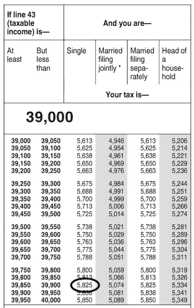

# AMT 方法

Sam 现在必须根据 AMT 方法计算她的税款，因此她可以比较两种方法下的税款，并选择提供较低税款的方法。

在 D 列和 E 列中，Sam 在 AMT 下计算她的税款。Sam 从常规方法的应税收入开始，在单元格 E2 中为 39，850 美元。

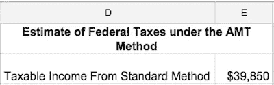

[金额表单](http://www.irs.gov/pub/irs-pdf/f6251.pdf)告诉她将常规税收计算中的某些扣除额加回该金额。

萨姆得到的唯一扣除额是标准扣除额，所以她又加上了标准扣除额和联邦个人免税额。

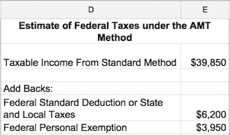

山姆接下来必须加上某些其他来源的应税收入。

[AMT 指令](http://www.irs.gov/instructions/i6251/ch02.html#d0e427)说，Sam 必须包括她行使股票期权的任何收益(大多数创业公司授予激励股票期权，简称 ISOs，因为比其他版本更好的税收待遇)，所以她必须加上行使价格和行使时公平市场价值之间的差额。

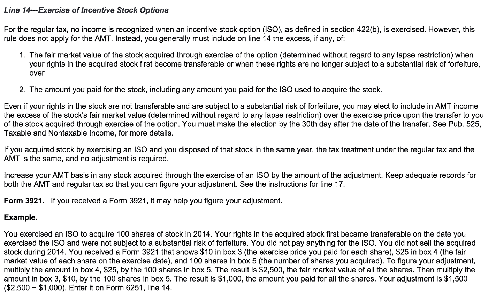

在 AB 到 AC 栏中，Sam 计算她的 ISO 增益。她获得了 10，000 份期权，每份期权的当前市值为 5 美元，行使价为 1 美元。(你应该可以向你的公司索要这些数字。)她用 10000 份期权乘以 4 美元的差价得到**40000 美元**。

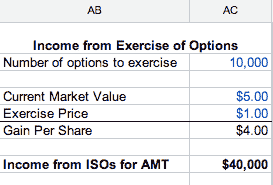

随着 ISO 练习的展开，该收入会自动填充单元格 E10。这让她通过 AMT 方法获得了**90，000 美元**的收入。

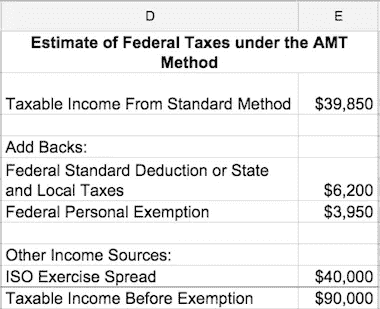

在 AE 至 AF 栏中，Sam 使用第 9 页[的表格](http://www.irs.gov/pub/irs-pdf/i6251.pdf)计算她的免税金额。

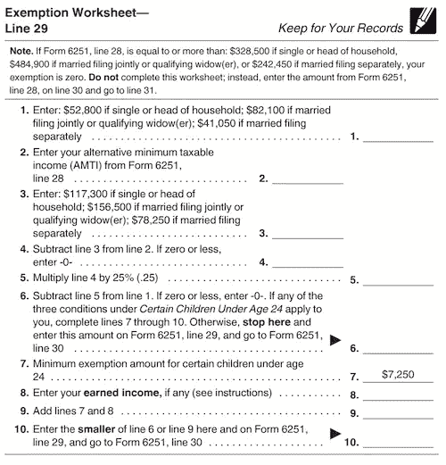

正如表格顶部的注释所述，如果山姆的收入至少为 328，500 美元，她将不会获得免税。Sam 的收入没有那么高，所以她继续计算 AE 到 AF 列。

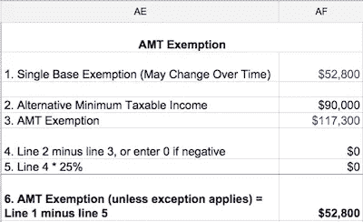

该免税金额自动进入单元格 E12。她现在有了所有的输入数据，计算出她在 AMT 下的应税收入为 **$37，200** 。

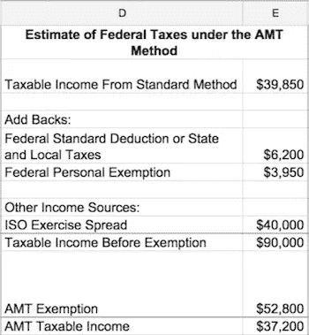

Sam 准备使用 [IRS AMT 表格](http://www.irs.gov/pub/irs-pdf/f6251.pdf)第 63 行的公式计算 AMT 方法下的税款。用国税局的话来说:“如果第 36 行是 182，500 美元或更少(如果已婚单独申报，则为 91，250 美元或更少)，则将第 36 行乘以 26% (.26)。否则，将第 36 行乘以 28% (.28)，然后从结果中减去 3650 美元(如果已婚，则为 1825 美元)。”

在单元格 E15 中使用此公式，Sam 估计她在 AMT 计算下的联邦税为 **$9，672** 。

相比之下，常规方法下为**5，819 美元**。你可以在 B18 单元格看到**$ 3853**的差额。因此，如果她行使，她将不得不支付更高的税额。

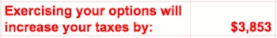

# 决定

她现在可以决定是否行使自己的选择权。如果她有额外的钱来支付税款(并且可以支付行使成本，如果她想行使所有期权，行使价格将是 1 美元乘以期权数量 10，000，所以这是一大笔钱！)，她可能想做。尽早锻炼的两个主要好处是:

*   开始计算低于正常所得税率的长期资本利得税率。
*   随着公司估值的上升，AMT 的影响会变得更大。当模型中的 AC4 上升，而行权价格保持不变时，期权的应税收入上升。

估值也可能下降，甚至为零，因此行使是一种风险！

# 信用金额

Sam 还可能因为支付了这笔金额而获得未来的税收抵免。因此，随着时间的推移，AMT 和常规方法支付的税款之间的差异可能会回到她身上。

像 AMT 本身一样，AMT 信用的法律也是复杂和不可预测的。这里有几篇解释它的文章(注意上面的日期，并确保它们是最新的): [SmartMoney](http://www.smartmoney.com/taxes/income/refundable-amt-credit-could-mean-big-tax-savings/) 、 [Fairmark](http://fairmark.com/amt/credit-refundable.htm) 、 [MyStockOptions](http://www.mystockoptions.com/articles/index.cfm/catID/9E603C8D-4033-4685-9FFC78E2BFC9B238/objectID/372E4962-5F98-4A7C-916989688AD81197) 。

# 小心点！

总之，在决定是否行使你的期权时，要小心谨慎。你可能最终会有一张税单，却没有现金支付！寻求专业协助，自己做研究！

希望这对某人有帮助！请[发微博给我](http://www.twitter.com/jaredcohe)如果你有任何意见，我很乐意听到，如果你有反馈，我会改进。

如果你也对计算你的创业选项的价值感兴趣，[这篇博文](http://bit.ly/1RmhY90)可能会有所帮助。

(更多启动操作资源，请查看[OpsMBA.com](http://opsmba.com)。)

[免责声明见](http://bit.ly/1NKtTfS)

> [黑客中午](http://bit.ly/Hackernoon)是黑客如何开始他们的下午。我们是 AMI 家庭的一员。我们现在[接受投稿](http://bit.ly/hackernoonsubmission)并乐意[讨论广告&赞助](mailto:partners@amipublications.com)机会。
> 
> 如果你喜欢这个故事，我们推荐你阅读我们的[最新科技故事](http://bit.ly/hackernoonlatestt)和[趋势科技故事](https://hackernoon.com/trending)。直到下一次，不要把世界的现实想当然！

