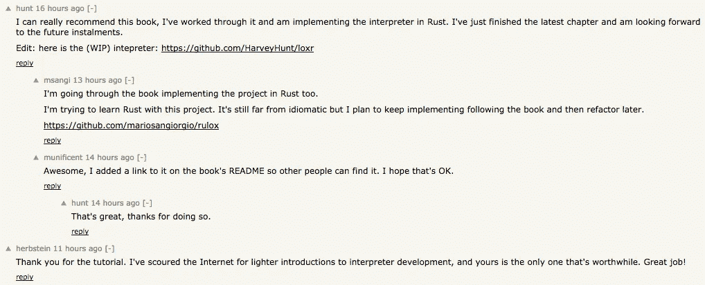

# 有哪些书是读者通过构建一个项目来学习的？问 HN(摘要)

> 原文：<https://medium.com/hackernoon/what-are-some-books-where-the-reader-learns-by-building-one-project-ask-hn-summarized-82b9ebe6c70b>

一名 HN 用户最近在 HackerNews 上发布了这个问题，获得了 600 多张赞成票。评论中提到的一些书已经非常受欢迎和众所周知。但是，它们中的许多很稀有，但仍然价值连城。

有这么多不同博客/ [书籍](https://hackernoon.com/tagged/books)的链接，涵盖了一系列[编程](https://hackernoon.com/tagged/programming)语言，我决定对它们进行分类，并添加每本书的简短摘要，链接到它们的免费和付费版本。

# 计算机科学

**从 NAND 到 Tetris** *从基本原理出发构建现代计算机*

 [## 计算系统的要素/ Nisan & Schocken

### 根据基本原理建造一台现代计算机

www.nand2tetris.org](http://www.nand2tetris.org/) 

> 该网站包含从头开始构建通用计算机系统所需的所有软件工具和项目材料。他们还提供了一系列的讲座，旨在支持该主题的典型课程。
> 
> 这些材料面向学生、教师和自学者。一切都是免费和开源的。Coursera 上也有相关课程[https://www.coursera.org/course/nand2tetris1](https://www.coursera.org/course/nand2tetris1)
> 
> **何苦呢？**因为很多 CS 的学生不懂电脑是怎么工作的；因为越来越少的学生上编译课；因为很多计算机架构课程太细，太干；因为没有什么比从几乎一无所有中创造出某种东西更令人激动的了；因为 *Nand2Tetris* 让学生参与实现应用计算机科学中一些最酷的算法、数据结构和技术，还因为 *Nand2Tetris* 课程中典型的学生反馈是“*我上过的最棒的课程*”。

## 使用 Java 构建编译器

 [## 使用 Java、JavaCC 和 Yacc 构建编译器

### 编辑描述

www.amazon.com](https://www.amazon.com/Compiler-Construction-Using-Java-JavaCC/dp/0470949597) 

这本书将教你如何写一个语法，然后根据它写一个解析器，最后在你继续阅读和做练习的时候能够改进它。这是一个伟大的时刻，我觉得写递归函数很舒服，因为语法是由递归函数组成的。您还将学习一种让编译器生成汇编代码的好方法。这本书的另一个特点是关于有限自动机的章节，其中你将学习如何在正则表达式、正则语法和有限自动机之间转换，并最终编写你自己的“grep ”,这对我来说是一次令人兴奋的经历。这本书里还有很多其他的东西你可以学习。谢谢安东尼·j·多斯·雷斯为我这样的人写了这么好的书。

## 用 ML 实现现代编译器

 [## 用 C 语言实现现代编译器

### 编辑描述

www.cs.princeton.edu](https://www.cs.princeton.edu/~appel/modern/c/) 

这本书是编译器设计方面最具开创性的书籍之一。这是本科计算机科学课程中最常用的教材之一。它将带你了解编译器的所有元素，并教你如何用 c 语言构建一个编译器。

## 制作口译员

 [## 制作口译员

### 这本书包含了你实现一个全功能、高效的脚本语言所需要的一切。两者你都会学到…

www.craftinginterpreters.com](http://www.craftinginterpreters.com/) 

> 这本书包含了你实现一个全功能、高效的脚本语言所需要的一切。您将学习解析和语义的高级概念，以及字节码表示和垃圾收集等具体细节。你的大脑会被新的想法点亮，而你的手会变得又脏又长满老茧。这将是一个爆炸。
> 
> 从`main()`开始，您将构建一种具有丰富语法、动态类型、垃圾收集、词法范围、一流函数、闭包、类和继承的语言。所有这些都打包成几千行干净、快速的代码，你会彻底理解，因为每一行都是你自己写的。
> 
> 你可以通过上面的链接免费在线阅读整本书。

HN 读者留下的一些言论！

## **编写计算机硬件和软件的隐藏语言**

 [## 《代码:计算机硬件和软件的隐藏语言》，查尔斯·佩佐德著

### 代码:计算机硬件和软件的隐藏语言是对位、字节和内部的独特探索

www.charlespetzold.com](http://www.charlespetzold.com/code/) 

“代码”，它带读者踏上一段旅程，从闪烁的闪光灯到与你的邻居交流，一直到弥合布尔代数和建立一个继电器之间的差距。

## 小阴谋家

 [## 小阴谋家

### 马蒂亚斯·费莱森是东北大学计算机科学的受托教授，卡洛一世奖获得者

mitpress.mit.edu](https://mitpress.mit.edu/books/little-schemer) 

*小阴谋家*引入计算作为算术和代数的扩展；大家小学高中都学的东西。它以递归函数的形式介绍了程序，并简要讨论了计算机的能力极限。作者使用编程语言方案和有趣的食物来说明这些抽象的概念。

# Linux 操作系统

## 从零开始的 Linux

 [## LFS 项目主页

### Linux 从零开始(LFS)是一个项目，为您提供一步一步的指示，为您建立自己的定制…

www.linuxfromscratch.org](http://www.linuxfromscratch.org/lfs/) 

> ***【LFS】告诉人们一个 Linux 系统如何在内部工作***
> 【构建 LFS】告诉你所有使 Linux 运转的东西，事物如何一起工作和相互依赖。最重要的是，如何根据自己的口味和需求进行定制。
> 
> ***构建 LFS 产生一个非常紧凑的 Linux 系统***
> 当你安装一个常规发行版的时候，你经常会安装很多你可能永远不会用到的程序。他们只是坐在那里占用(宝贵的)磁盘空间。安装一个低于 100 MB 的 LFS 系统并不难。听起来还很多吗？我们中的一些人一直致力于创建一个非常小的嵌入式 LFS 系统。我们安装了一个仅够运行 Apache web 服务器的系统；总磁盘空间使用量约为 8 MB。通过进一步的剥离，这可以降低到 5 MB 或更少。尝试使用常规分布。
> 
> 我可以用我的 LFS 系统做什么？
> 
> 一个照章办事的 LFS 系统是相当简单的，但是它被设计成提供一个强大的基础，在这个基础上你可以添加任何你想要的包。参见 [BLFS 项目](http://www.linuxfromscratch.org/blfs/)了解常用软件包的选择。

## 乔纳森·巴特利特的《从头开始编程》

[https://www . Amazon . com/Programming-Ground-Up-Jonathan-Bartlett/DP/0975283847](https://www.amazon.com/Programming-Ground-Up-Jonathan-Bartlett/dp/0975283847)

 [## 从头开始编程

### 这本书教授 x86 处理器和 GNU/Linux 操作系统的汇编语言。因此，我们将给予…

编程 groundup.blogspot.in](http://programminggroundup.blogspot.in/) 

这本书从基本原理开始教授 x86 汇编程序。

> 大多数关于编程的入门书籍都让我失望透顶。在结束时，你仍然可以问“计算机到底是如何工作的？”却没有一个好的答案。他们倾向于忽略困难的话题，即使这些话题很重要。我将带你经历困难的问题，因为这是迈向熟练编程的唯一途径。我的目标是让你从对编程一无所知到理解如何像程序员一样思考、写作和学习。你不会知道所有的事情，但是你会知道所有事情是如何组合在一起的

# 软件工程

## 设计模式:可重用面向对象软件的元素第 1 版

 [## 设计模式:可重用面向对象软件的元素

### 编辑描述

www.amazon.com](https://www.amazon.com/Design-Patterns-Elements-Reusable-Object-Oriented/dp/0201633612/ref=mt_hardcover?_encoding=UTF8&me=) 

> 经典设计模式书的第一章将带你使用书中提供的模式设计一个文本编辑器。如果你所做的是阅读这一章，然后在阅读过程中参考这些模式，并根据它们的设计构建文本编辑器，你就会得到你正在寻找的东西。这是一种不同于整本书的方式，但可以说是以一种不同于参考书的格式。

## 码头工人

**由 Shrikrishna Holla 作曲的《Docker》**

 [## 编排 Docker | PACKT 书籍

### 管理和部署 Docker 服务，高效地将应用程序容器化

www.packtpub.com](https://www.packtpub.com/virtualization-and-cloud/orchestrating-docker) 

它通过一个单独的项目教授 Docker 概念，随着章节的深入，您会发现使用 Docker 容器部署应用程序的不同方式。

## 面向系统架构师的分布式系统

 [## 系统架构师的分布式系统| Paulo Veríssimo | Springer

### 这本书的主要读者是高年级本科生和研究生。计算机体系结构，作为…

www.springer.com](http://www.springer.com/us/book/9780792372660) 

它遵循了一个虚构公司的案例研究，该公司希望实现一个分布式系统，但是它所涵盖的细节和技术复杂性令人难以置信。

## 尼姆在行动

 [## 曼宁|尼姆在行动

### 编辑描述

www.manning.com](https://www.manning.com/books/nim-in-action?a_aid=niminaction&a_bid=78a27e81) 

大多数章节都有一个小项目(例如一个聊天 CLI 应用程序或一个类似 Twitter 的网站)来教你关于 Nim 的不同事情，而不是致力于一个单一的项目。

> *Nim in Action* 介绍 Nim 编程语言，并教你编写本地软件应用程序和库、web 应用程序、嵌入式设备软件以及通过互联网通信的程序。这本书充满了帮助您学习如何测试、调试、记录和打包 Nim 应用程序的实践例子。你呢。我还将发现如何与诸如 C 和 C++之类的外语接口，以及如何使用元编程特性来编写特定于领域的语言。在本书中，你将实现一个全功能的聊天服务器，一个 Twitter 克隆，以及许多其他软件项目。当您完成阅读时，您将对 Nim 有一个扎实的了解，并且能够使用它来编写强大的、可移植的和高效的应用程序。

## Ruby On Rails

## **RUBY ON RAILS 教程(RAILS 5):用 RAILS 学习 Web 开发**

 [## Ruby on Rails 教程(Rails 5)

### 最新更新的 Rails 5，Ruby on Rails 教程和截屏系列教你如何开发和部署…

www.railstutorial.org](https://www.railstutorial.org/) 

Michael Hartl 是 Ruby On Rails 最杰出的倡导者之一。他的教程被广泛引用，被认为是学习编码或 web 开发新手的最佳起点之一。有大量的定价选项可供选择，但好的一面是这本书仍然可以在网上免费阅读。

它将带您构建一个 Twitter 克隆，并向您介绍 git、heroku、一点 CSS/HTML，甚至还会介绍一点 AJAX。

# 咬舌

实用公共语言

 [## 实用公共语言

### 这个页面，以及它链接到的页面，包含了由出版社出版的 Common Lisp 书籍《实用 Common Lisp》的文本…

www.gigamonkeys.com](http://www.gigamonkeys.com/book/) 

过滤垃圾邮件，解析二进制文件，对 MP3 进行编目，通过网络传输 MP3，并为 MP3 目录和服务器提供 Web 接口。

# 占线小时

## Erlang 和 OTP 的作用

 [## Manning | Erlang 和 OTP 在行动

### Erlang 和 OTP 将向您介绍并发编程的概念以及 Erlang 消息传递的使用…

www.manning.com](https://www.manning.com/books/erlang-and-otp-in-action) 

您构建的应用程序越来越复杂。在此过程中还构建了其他一些应用程序，以在较小的范围内演示一些想法，但是本书的整体结构是围绕着随着您对 OTP 了解的增加而使一个应用程序变得更好而设计的。

# 计算机编程语言

## 用 Python 自动化枯燥的东西

 [## 用 Python 自动化枯燥的东西

### 在用 Python 自动化枯燥的东西中，您将学习如何使用 Python 编写程序，在几分钟内完成…

automatetheboringstuff.com](https://automatetheboringstuff.com/) 

这本书的标题不言自明。我个人很喜欢读这本书，也很喜欢写艾尔在这本书里提到的很酷的剧本。

> 在用 Python 自动化枯燥的工作中，您将学习如何使用 Python 编写程序，在几分钟内完成手工需要几个小时才能完成的工作——不需要任何编程经验。一旦您掌握了编程的基础，您将创建 Python 程序，毫不费力地执行有用且令人印象深刻的自动化壮举，以:
> 
> 在一个文件或多个文件中搜索文本
> 
> 创建、更新、移动和重命名文件和文件夹
> 
> 搜索网页并下载在线内容
> 
> 更新和格式化任意大小的 Excel 电子表格中的数据
> 
> 分割、合并、水印和加密 pdf
> 
> 发送提醒电子邮件和文本通知
> 
> 填写在线表格
> 
> 一步一步的指导你通过每个程序，并且在每章的结尾练习项目挑战你改进那些程序并且使用你的新发现的技能自动化类似的任务。

## 姜戈

哈利·珀西瓦尔用 Python 进行的测试驱动开发
免费提供

 [## 用 Python 进行测试驱动开发

### 使用 Python 的测试驱动开发侧重于 web 开发，并涉及一些 JavaScript(对任何人来说都是不可避免的……

chimera.labs.oreilly.com](http://chimera.labs.oreilly.com/books/1234000000754) 

> 使用 Python 的测试驱动开发专注于 web 开发，并涉及一些 JavaScript(任何 web 程序员都无法回避)。这本书使用了一个具体的例子——一个网站的开发，从零开始——来教授 TDD 方法论，以及它如何应用于 web 编程，从数据库集成和 javascript 的基础知识，通过像 Selenium 这样的浏览器自动化工具，到像 NoSQL、websockets 和异步编程这样的高级(和流行)主题。

## 和姜戈跳探戈

 [## Django 图书:如何与 Django 跳探戈:Python Django 教程

### 编辑描述

www.tangowithdjango.com](http://www.tangowithdjango.com/) 

最后一个项目是 Django webapp，允许访问者添加网站并对其进行排名。Django 中的许多不同的方面都被考虑到了，比如 CSS，Bootstrap，search，Jquery，AJAX 等等。

## Django 官方教程

 [## 编写您的第一个 Django 应用程序，第 1 部分| Django 文档| Django

### 本教程是为 Django 1.10 和 Python 3.4 或更高版本编写的。如果 Django 版本不符，可以参考…

docs.djangoproject.com](https://docs.djangoproject.com/en/1.10/intro/tutorial01/) 

引导您创建一个投票网站。

## 瓶

**烧瓶 The Mega 教程**

 [## 烧瓶大型教程，第一部分:你好，世界！miguelgrinberg.com

### miguelgrinberg.com

miguelgrinberg.comblog.miguelgrinberg.com](https://blog.miguelgrinberg.com/post/the-flask-mega-tutorial-part-i-hello-world) 

作为本教程的一部分而开发的应用程序是一个功能相当不错的微博服务器，类似于 Twitter。

涵盖的一些主题有:

> 用户管理，包括管理登录、会话、用户角色、个人资料和用户头像。
> 
> 数据库管理，包括迁移处理。
> 
> Web 表单支持，包括字段验证。
> 
> 长项目列表的分页。
> 
> 全文搜索。
> 
> 向用户发送电子邮件通知。
> 
> HTML 模板。
> 
> 支持多种语言。
> 
> 缓存和其他性能优化。
> 
> 开发和生产服务器的调试技术。
> 
> 在生产服务器上安装。

# Java Script 语言

## 雄辩的 Javascript

 [## 雄辩的 JavaScript

### 各种艺术家的插图:由 Wasif Hyder 封面。计算机(介绍)和独轮车人(第 21 章)由马克斯…

eloquentjavascript.net](http://eloquentjavascript.net/) 

一本介绍编程的好书。

这是有史以来为 Javascript 编写的最具开创性的书籍之一。正如标题所示，作者雄辩地解释了每个主题，并带您浏览大量代码。

你通过这本书构建了 5 个项目——一个编程语言、画图程序、一个 dom 游戏和一个使用 node js 的技能分享网站。

# 反应

 [## SurviveJS

### 想学 Webpack 还是 React？免费开始，并按照示例项目构建看板。

survivejs.com](https://survivejs.com/) 

本在线教程将带您浏览 React+Webpack，并教您如何构建一个小型看板/Trello webapp。

## 学习反应的道路

 [## GitHub-rwie ruch/学习之路-反应

### 在 GitHub 上创建一个帐户，为“学习反应之路”的开发做出贡献。

github.com](https://github.com/rwieruch/the-road-to-learn-react) 

Robin Wieruch 在 github 上的免费指南，教你如何从头开始构建一个类似 HackerNews 的应用程序。

# 去

## 使用 Go 进行 Web 开发

[https://www.usegolang.com](https://www.usegolang.com/)

> 来自作者对 HN 的评论:
> 
> 使用 Go 进行 Web 开发(参见 https://www.usegolang.com)是基于从非常少的 Go 和 web 开发经验开始，并引导你完成构建一个完整的 web 应用程序的过程。
> 
> 我发现这种方法很有效，因为你不必问“他为什么做出那个设计决定”，而是我故意犯初学者会犯的常见错误，等到它们成为问题，然后我演示我们如何解决这个问题。因此，你不仅会真正理解如何在 Go 中创建 web 应用程序，还会理解为什么开发人员倾向于遵循不同的设计模式。
> 
> 我在另一个评论中说过，但它是基于 Michael Hartl 的 Rails 教程。我认为向某人展示如何从一无所有到一个完整的应用程序是一个很好的方法，可以帮助他们进入 web 开发，而不会有拼凑博客帖子/文档/试错带来的挫败感。

Golang 的网络开发:反教科书

 [## GitHub-thewhitetulip/we b-dev-golang-反教材:学习如何在没有框架的情况下编写 webapps

### web-dev-golang-反教科书-学习如何在 Go 中不用框架编写 webapps。

github.com](https://github.com/thewhitetulip/web-dev-golang-anti-textbook) 

您可以学习如何在 Go 中构建待办事项列表管理器。

这本书是关于在不使用任何框架的情况下从零开始构建 webapp。

# 多方面的

## 思考统计:程序员的概率和统计

【http://greenteapress.com/thinkstats/ 

在这里，您将通过在 Python 中实现统计函数来学习统计，并使用它们来解决书中的问题。

## 发现流星

 [## 探索 Meteor——了解如何使用 Meteor.js 框架构建实时 JavaScript web 应用程序

### 了解 Meteor 并构建更快更简单的 web 应用程序，我们将教您如何从头开始构建实时 Meteor 应用程序。

www.discovermeteor.com](https://www.discovermeteor.com/) 

引导您构建一个名为 Microscope(实际产品望远镜的缩小版)的 Reddit 克隆。

## 用 Inform 7 创作互动小说

 [## 用 Inform 7 创作互动小说

### 自该书首次出版以来，Inform 7 一直在不断发展。一些激动人心的新功能已经…

inform7.textories.com](http://inform7.textories.com/) 

> 这本书将带你构建一个完整的(并且相当复杂的)文本冒险。Inform 7 在很大程度上是一种小众编程语言，但它真的很有趣，很不寻常，如果你想拓宽视野，很值得研究一下。有点像序言，但是是用自然语言写的。

## 微积分的更好解释指南

 [## 微积分，更好地解释电子书+视频课程

### 我也是。尽管上了几年的课，我对微积分概念的理解并不是很强。当然，我可以跟着…

betterexplained.com](https://betterexplained.com/calculus/) 

> Kalid 基本上围绕推导圆的面积/周长公式的概念迭代级数，然后逐步建立到推导球体的表面积/体积。贯穿始终的焦点是在进入公式之前建立微积分的直觉。即使是一级微积分，我也确实通过阅读他的书加强了我对正在发生的事情的直觉。
> 
> 这很有趣，后来我实际上花了一些时间想象几何立体的微积分，即[http://www.trinco.io/blog/derivative-of-x3](http://www.trinco.io/blog/derivative-of-x3)

## 凯西·穆拉托里手工制作的英雄

 [## 手工英雄

### 是啊！Windows 将是第一个平台，因为它是目前最常见的游戏平台，但该系列将…

handmadehero.org](https://handmadehero.org/) 

> 不是书而是我的手工英雄系列真的很有意思。这是一个关于在 windows 上用 C 语言构建游戏的从头开始的教程，但是深入研究了许多有趣的编程主题，这些主题在游戏开发之外是有用的。

## 黑客的 Xbox 由安德鲁'邦尼'黄。

(【http://hackingthexbox.com/】T2

这本书是免费的，可以在网上下载。

从给 Xbox 增加 LED 到利用安全机制。另外，最初的 Xbox 现在也很便宜，所以你不需要花很多钱去做。当地的 craigslist 应该有很多。

## 如何制作像《糖果粉碎》这样的游戏

 [## 如何制作像《糖果粉碎》这样的游戏:第 1 部分

### 几个月来，《糖果粉碎传奇》一直是世界上玩得最多的游戏之一。拥有超过 5 亿玩家和 500 万美元…

www.raywenderlich.com](https://www.raywenderlich.com/66877/how-to-make-a-game-like-candy-crush-part-1) 

## **HTML/CSS**

 [## 学习编码 HTML 和 CSS

### 学习编码 HTML & CSS 是一个简单而全面的指南，致力于帮助初学者学习 HTML 和 CSS…

learn.shayhowe.com](http://learn.shayhowe.com/html-css/) 

> [黑客中午](http://bit.ly/Hackernoon)是黑客如何开始他们的下午。我们是 [@AMI](http://bit.ly/atAMIatAMI) 家庭的一员。我们现在[接受投稿](http://bit.ly/hackernoonsubmission)并乐意[讨论广告&赞助](mailto:partners@amipublications.com)机会。
> 
> 如果你喜欢这个故事，我们推荐你阅读我们的[最新科技故事](http://bit.ly/hackernoonlatestt)和[趋势科技故事](https://hackernoon.com/trending)。直到下一次，不要把世界的现实想当然！

