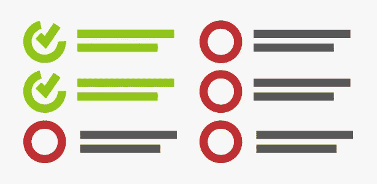

# ASP.NET 网站启动的先决条件是什么

> 原文：<https://medium.com/hackernoon/what-are-the-pre-requisites-for-an-asp-net-website-launch-da75568ee0b8>

credit: [http://saphanatutorial.com/prerequisites-for-learning-sap-hana/](http://saphanatutorial.com/prerequisites-for-learning-sap-hana/)

我写这篇文章是为了记下在[多云](http://cloud.google.com/)ASP.NET[网站部署期间我需要做的所有事情。](https://hackernoon.com/tagged/aspnet)

*   获取[数据库连接器](http://dev.mysql.com/downloads/connector/net)
*   **Re- *发布*** 项目
*   抓住那个了不起的 [URL 重写模块](http://stackoverflow.com/a/25317499/2404470)
*   释放 [IIS_IUSRS](http://stackoverflow.com/a/18621550/2404470) 和[应用池](http://stackoverflow.com/a/7334485/2404470)
*   请检查您的应用程序池是否引用了正确版本的。网
*   获得[重新认证](https://in.godaddy.com/help/request-an-ssl-certificate-562)——显然是新服务器，对吧？
*   [导入](http://windows.microsoft.com/en-us/windows/import-export-certificates-private-keys#1TC=windows-7)和[安装](https://in.godaddy.com/help/installing-an-ssl-certificate-in-microsoft-iis-5-and-6-4875)证书
*   [导入](https://hackernoon.com/tagged/import)同样在 [IIS](https://www.godaddy.com/help/installing-an-ssl-certificate-in-microsoft-iis-8-4951) 中

*原载于*[*xameeramir . github . io*](http://xameeramir.github.io/site-pre-requisites/)*。*