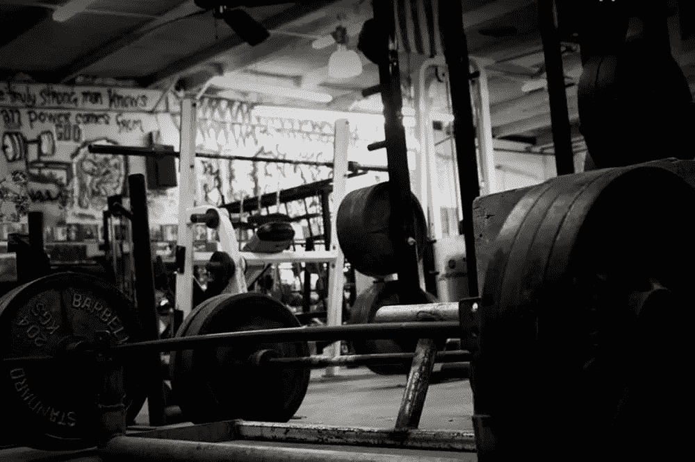

# 你愿意放弃什么

> 原文：<https://medium.com/hackernoon/what-are-you-willing-to-give-up-7eb8d1e1d503>

Success is not a mistake.

我今天决定写一些我通常不会在这个博客中提到的东西，但是如果你了解我，你就会知道这是我生活中最重要的部分之一。我是一只健身房的老鼠！除了金融和科技，我谈论的都是[锻炼](https://hackernoon.com/tagged/exercise)。更糟糕的是，我和其他和我一样痴迷于锻炼的健身迷一起去了 Crossfit 健身房。

我喜欢健身的原因实际上与健康福利或被“劫持”无关。以确保你明天醒来时会变得更强大的名义，这一切都是为了鞭策你自己，直到你打破一切。

我经常去的健身房比蒙特利尔银行的交易大厅有更多极端的 A 型人。那里的人们为了变得更大、更强、更快而奉献了一生。被这些人包围的最大好处是，你可以学到一些非常不可思议的东西，这些东西可以应用到你生活的其他领域，通常会更加成功。

取笑一个目标是硬拉 600 磅的男孩或一个想深蹲 300 磅的女孩是很容易的。我们告诉自己:“当然，如果我每天去健身房，服用类固醇，我肯定我也能做到”。我保证 99%说这话的人永远也不可能完成这些任务，即使在类固醇的帮助下。

去问问那个刚刚压下 300 磅深蹲的女孩，她多久训练一次。她可能会告诉你每天 2 小时，每周 5 天。似乎很容易。现在问她怎么吃，什么时候吃，每餐吃多少，什么时候睡觉，她周五晚上做了什么，她现在在想什么。她生活的每个方面都致力于完善她的健身游戏。她如此坚强并不是偶然的，而是因为她一直遵循着一个计划，努力工作，做了一路上她必须做的一切。

这就是我喜欢健身房的原因。我开始观察人们为了得到他们想要的东西而经历的态度、奉献和痛苦。如此艰苦的训练一点也不好玩，它让人筋疲力尽。

不足为奇的是，让你在健身房成功的秘诀，也是让你在其他任何事情上成功的秘诀。无论是金融、科技还是企业家。我相信，如果你问拉里·佩奇(Larry Page)或杰米·戴蒙(Jamie Dimon)，关于他们的成功之路，他们会告诉你，并不总是充满乐趣，有时甚至令人筋疲力尽。

我一生中学到的最重要的一课是从健身房里被大多数人称为“傻瓜”的人那里学到的。我问他是怎么变得这么大，这么强壮，这么瘦的，我需要做些什么才能得到同样的结果。他看着我说:“不是我做了什么，而是我放弃了什么。”他问我:“你愿意放弃什么来成为最好的？"

下一次，当你想知道某人是如何成为首席执行官、找到一家十亿美元的初创公司或改变世界的时候，你应该问问他们在这个过程中必须放弃什么。难以置信的成功需要难以置信的牺牲。

[http://breakingbaystreet.com/blog/](http://breakingbaystreet.com/blog)

> [黑客中午](http://bit.ly/Hackernoon)是黑客如何开始他们的下午。我们是 [@AMI](http://bit.ly/atAMIatAMI) 家庭的一员。我们现在[接受投稿](http://bit.ly/hackernoonsubmission)并乐意[讨论广告&赞助](mailto:partners@amipublications.com)机会。
> 
> 如果你喜欢这个故事，我们推荐你阅读我们的[最新科技故事](http://bit.ly/hackernoonlatestt)和[趋势科技故事](https://hackernoon.com/trending)。直到下一次，不要把世界的现实想当然！

