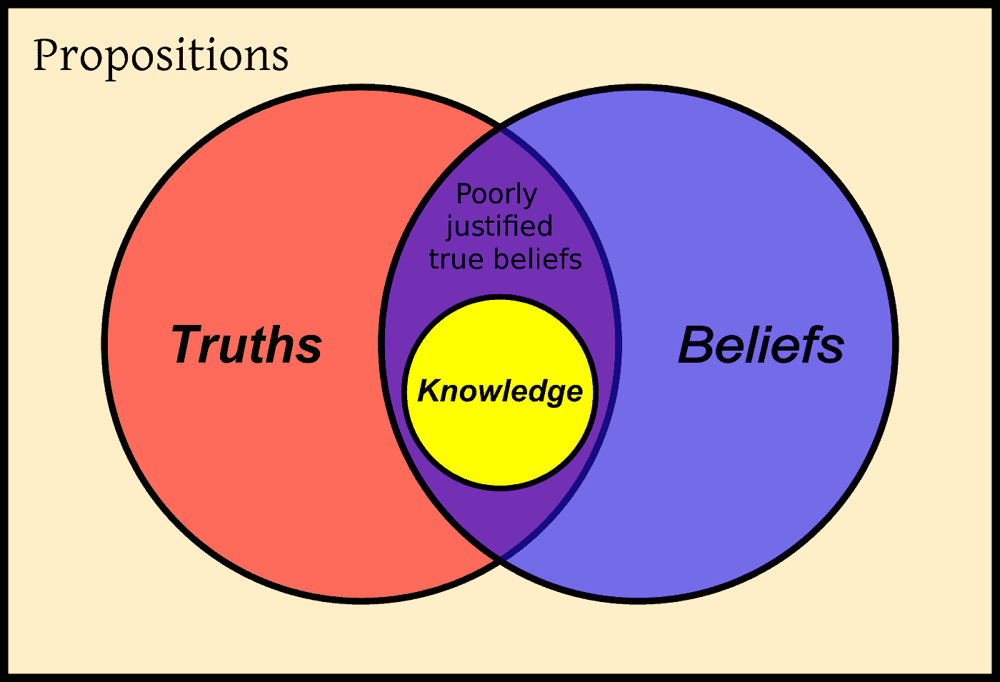

# 巩固你的创业信念

> 原文：<https://medium.com/hackernoon/what-are-your-beliefs-89ee80aa9071>

## 你有没有想过你为什么会存在于这个世界上？

你有没有问过自己，你的使命是什么，你能做些什么来改变别人的生活？

在[知识官](https://goo.gl/mtqddW)，我们每天都在问自己这些问题。这就是为什么我们决定奉献我们的时间来帮助人们的学习之旅，并实现他们的职业和生活目标。

在这篇文章中，我将带你了解我们的信念，以及是什么驱使我们每天工作并付出更多的努力。我还会分享一些关于在你的[初创公司](https://hackernoon.com/tagged/startup)内部创造归属感的技巧，并感受到与比你更伟大的东西的联系。

大约一年前，我和我的联合创始人开始了这个[之旅](https://hackernoon.com/the-knowledge-officer-is-now-live-908422a4175f)。我们发现确实需要一种替代品，为那些喜欢质量胜过广告驱动的内容、喜欢常青树胜过新鲜度和病毒式传播的人服务。

几个月前，我们决定记录我们的信念并与团队分享，结果真的令人印象深刻！

不仅更容易向团队的其他成员和任何新人传达我们的信息和价值观，而且我们还发现，在我们与候选人的面试中，评估文化和理念的契合度也更容易；拥有一套核心价值观，我们根据这些价值观来判断候选人是否最适合团队。我们还发现，我们的产品头脑风暴现在有效得多；让整个团队对我们的现状和目标保持一致。

在[知识官](https://goo.gl/mtqddW)，我们有四个核心信念，它们是我们每天工作的强大动力。

# 我们相信“学习会影响人们的决定。”

你今天学到的一件事可以永远改变你的生活。在我们生活的世界里，如果你停止学习，你会在几周内变得“过时”。你处理的每一条信息都有助于你做出更明智的决定。学习引入了一个未知的世界，让你在知识、自给自足和最终幸福的无尽旅程中飞翔。

# 我们相信“学习是拥有成功生活的主要支柱之一。”

给自己一本好书或者看一段有趣的视频，你就可以在接下来的一天，甚至一周内改变你的情绪。学习不仅能让你变得更快乐，还能让你成功！谁会对此不满意呢？！寻找一些灵感？在亚马逊上看看我的书[愿望清单](http://amzn.eu/hQqk2Wa)。

# 我们相信“最成功的人都是终身学习者。”

史蒂夫·乔布斯、杰夫·贝索斯、埃隆·马斯克、比尔·盖茨、马克·扎克伯格等等，我可以列出一页又一页的名字！这些人是终身学习者，他们总是谈论阅读对他们生活的影响。查看这些链接，了解阅读如何改变他们的生活，并可能改变你的生活。

[比尔·盖茨谈论他一生对书籍和阅读的热爱](http://time.com/4786837/bill-gates-books-reading/)

[12 本书塑造了当今世界首富杰夫·贝索斯对成功的看法](https://www.cnbc.com/2017/07/27/12-books-that-shaped-how-worlds-richest-man-jeff-bezos-thinks.html)

# 我们相信“如果今天的人们每天都在学习，明天的世界将会改变。”

说了上面的话，我想象不出比一个终身学习者的世界更好的世界了。人们现在正在谈论人工智能的进步，以及未来将如何与现在完全不同。如果我们没有准备好，你能想象我们的感受吗？我们需要每天不断地学习和消化身边的知识和信息。

这是我们的四个信念。这些是我们团队每个成员真正的共同点。你的信仰可以和我们的不同。他们应该是！但我希望在一天结束时，这篇文章能帮助你反思你自己的创业，和你自己的一套信念，并帮助你在你的团队中创造一种独特的文化。

**这里有一些在你的员工队伍中创造归属感的快速技巧:**

1.  把公司里的每个人都当成联合创始人。忘了老板和员工的关系吧。
2.  认真听大家说。内心有一个信念:每个人的投入都是有价值的，当人们聚在一起，自由、公开地分享他们的想法时，最好的想法就会产生。
3.  文化和理念的面试比什么都重要。不要只找技术大师。
4.  朝着一个值得为之献身的目标努力，找到和你有共同梦想的人。
5.  记录你的信仰和价值观。不要把它们留在你的脑海里。把它们分享给每个加入公司的人。不时地提醒你的团队，并不断地检查、编辑和添加它们。你的信念随着你的成长而演变，你应该时刻意识到这一点，并接受它们希望带你去的地方。

这个信念系统对我和我的团队产生了巨大的影响。

你呢？有什么故事可以分享吗？请在评论中留下你鼓舞人心的故事，让世界来阅读。

## 关于我们

[*知识官*](https://goo.gl/3pamFx) 是专业人士的学习平台。我们的使命是赋予一代终身学习者权力，并帮助人们，无论多忙，每天都学习新的相关知识，实现他们的职业目标。

想成为首批试用我们应用的用户之一吗？在 http://knowledgeofficer.com/[订阅](https://goo.gl/3pamFx)