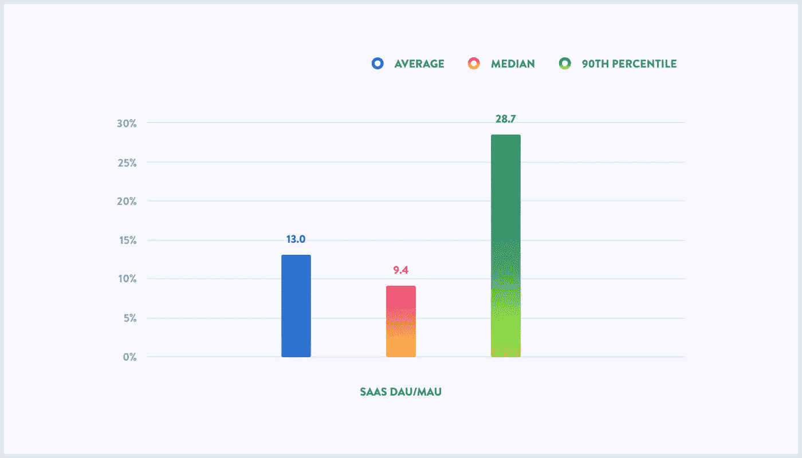
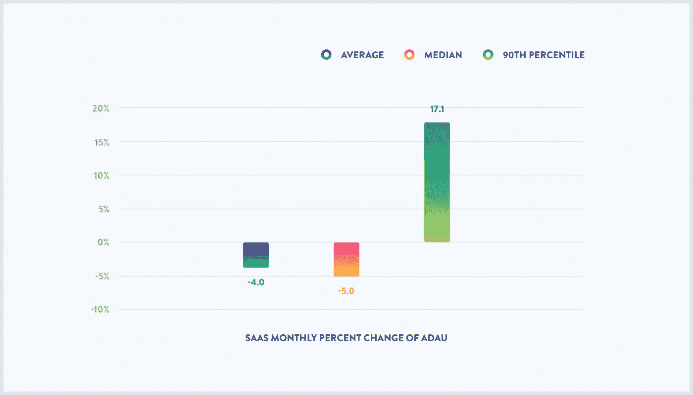
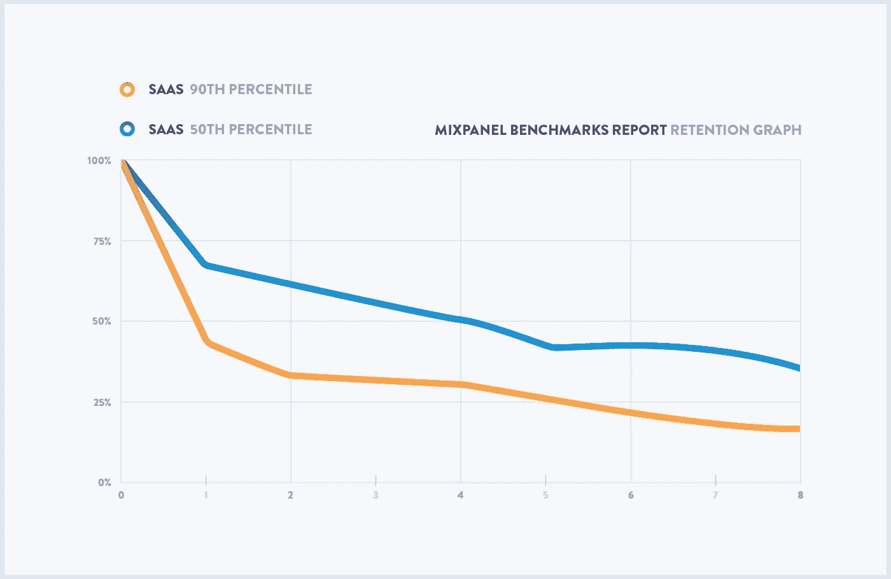
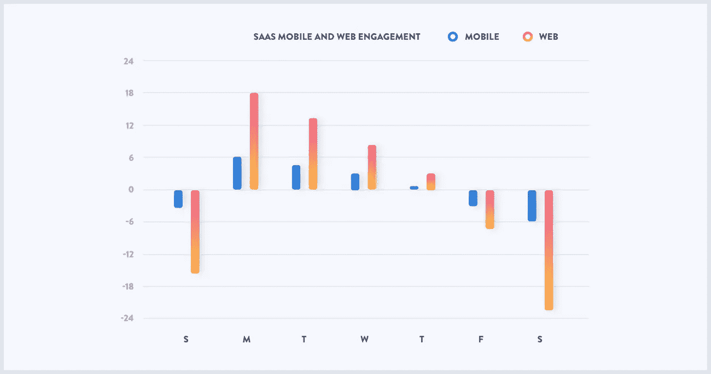
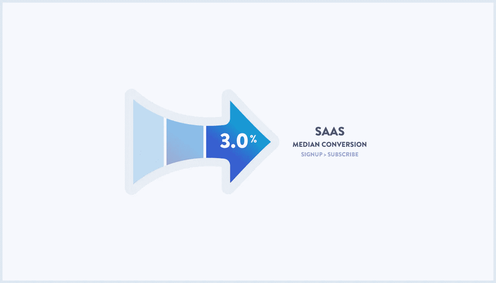

# 关于 SaaS 产品，数十亿用户事件教会了我们什么

> 原文：<https://medium.com/hackernoon/what-billions-of-user-events-taught-us-about-saas-products-fdf45a7b1fbc>

> 披露:[数据分析公司 Mixpanel](https://goo.gl/9Q5bKE) 此前曾赞助过黑客 Noon。

每个人都想知道他们的衡量标准如何，因为 [Mixpanel](https://goo.gl/9Q5bKE) 是一家数据分析公司，我们有独特的能力为那些对自己的用户行为衡量标准有疑问的公司和[产品](https://hackernoon.com/tagged/product)团队提供一些答案。

为了得到这些答案，我们必须整合一个全面的数据集。因此，我们汇总了 13 亿独立用户的行为数据，这些用户在我们客户运行的数百种产品中引发了超过 500 亿次网络和移动事件。目标是让产品经理、开发人员、营销人员、分析师和产品团队中的其他人更清楚地了解如何在产品健康的关键领域衡量自己:使用和用户增长、参与、保留和转化。通过关注这四个方面，我们旨在展示整个用户旅程中发生了什么。

然后我们将调查的产品分成四个部分:软件即服务( [SaaS](https://hackernoon.com/tagged/saas) )、电子商务、金融服务和媒体娱乐。在这些行业中，SaaS 在一个关键方面脱颖而出:它的商业模式。SaaS 非常重视企业对企业(B2B)模式，而其他行业要么完全是企业对消费者(B2C)模式，要么两者兼而有之。SaaS 恰好也是 Mixpanel 所在的行业，所以我们对在这里发现的见解特别好奇。

在本文中，我们带您了解一些(一些！)我们在 SaaS 的发现。

> 这是由 Hacker Noon 的每周赞助商 [Mixpanel](https://goo.gl/kvQQJ9) 为您带来的故事。如需更深入的见解，请[下载完整报告。](https://goo.gl/kvQQJ9)

# **用途**

用法是相关和不相关的区别。粘性和 ADAU 增长这样的指标可以帮助你理解产品用户生命周期的开始阶段。

首先是粘性，它试图显示你的用户群有多活跃。为了衡量粘性，我们研究了 DAU/MAU，它衡量的是日活跃用户除以月活跃用户。就我们的数据集而言，如果某人在某一天在应用程序中记录了任何类型的动作，他就被算作“每日活跃用户”。

该图显示了一个月内的平均 DAU 除以该月的 MAU，以百分比表示。我们查看了平均值和中值(即第 50 个百分位数)，以了解什么是行业的“正常”，然后我们发现了第 90 个百分位数的粘性，以显示最佳性能是什么样的。

如您所见，第 50 百分位和第 90 百分位之间的粘性差距高达 20 个百分点！事实上，在我们观察的所有行业中，SaaS 的粘性中值最高，即使如此，9.4%的中值数字也意味着每个用户每月的活动少于三天。

在该范围的顶端，28.7%的粘性是 SaaS 产品的黄金标准。这意味着每个用户每月有超过八天的活动，或者大约一周有两天的活动。如果人们一周使用你的 SaaS 产品几次，你的产品表现出精英水平。

我们也研究了 SaaS 的增长率。对于 ADAU，我们指的是平均每日活跃用户，如果活跃用户在测量的一天内执行了任何类型的任何操作，则他们被定义为活跃用户。ADAU 是一个月内每日活跃用户的平均值。在这张图表中，我们追踪了 ADAU 每月的变化。

虽然 ADAU 增长率不是唯一重要的使用指标，但总体而言，持平或负增长并不是一个好兆头。不是最深刻的见解，但这是真的:没有用户增长，产品很难产生价值。特别是 SaaS 看起来相当残酷——第 50 百分位的 ADAU 增长率为负，显示了那里的竞争有多激烈。另一方面，表现最好的公司正以每月 17.3%的速度快速增长。

虽然增长目标应该根据公司的成熟度而有所不同，但持续的增长是累积起来的。一家能够保持 17% ADAU 月环比增长率的公司，其活跃用户数量将在五个月内翻一番。

再一次，ADAU 增长率的第 90 个百分点和中位数之间的差距是相当惊人的。不要脸的插一句:产品经理可以使用 [Mixpanel](https://goo.gl/9Q5bKE) 来跟踪他们的 ADAU 指标，并更好地了解什么样的行动使他们更接近第 90 百分位。

# **滞留**

Weekly retention data

在这种情况下，保留意味着:一个人是否执行了一个动作——任何动作——然后回来再次执行另一个动作。对于中等规模的 SaaS 公司来说，这意味着 37%的人会在一周后回来，这个数字在八周结束时会减少到只有 15%。相比之下，在相同的时间内，精英产品仍然保留了超过三分之一的新老用户。

留存有很多因素，从最明显的，如用户是否发现产品的价值，到更微妙的，如用户在哪个平台上访问产品。

对大多数 SaaS 公司来说，保留并不一定等于对产品的满意。如果客户有付费订阅，他们可能会使用它，不管他们喜欢与否。当他们需要续订时，您将清楚地了解他们是否满意。

# **订婚**

在我们的报告中，敬业度是在给定产品中执行的所有行为的总和。该图是根据一周中平均每天的移动和网络参与度进行标准化的。也就是说，在这张图上测量为“0”的那一天，其参与度与平常的一天相当。测量值为“15”的一天的参与度是日平均参与度的 115%，测量值为“-15”的一天的参与度是日平均参与度的 85%。这样，我们可以很容易地比较不同规模的公司。

如果你有一个 SaaS 的产品，你试图在周末增加参与度，祝你好运，因为整体参与度直线下降。一句话:这些产品通常是人们用于工作的应用程序，周末不是为了工作。

在网络互动栏上，随着工作周的进行，你几乎可以看到员工的生命力在慢慢流失。看看他们吧，周一都很开心，比平均水平多使用了 18%的应用程序，然后随着时间的推移，他们的参与度越来越低。有趣的是，网络和移动使用遵循相同的参与模式。

因此，产品经理应该考虑在周一或周二整体参与度达到峰值时推出新功能。

# **转换**

在 SaaS 的例子中，我们将转化定义为从账户注册转化为实际订阅。

天哪，这个数字太低了！3%!与其他部门不同，我们从“查看报告”开始衡量转化率，我们从注册开始，因为否则比率会更低。

因为 SaaS 要求企业订阅一项服务，其转化率低于其他行业的产品并不令人意外。不过，这种方法的好处是显而易见的:一旦客户购买了订阅，他们所要担心的就是续订。

# **把所有这些放在一起**

这家 SaaS 公司的用户平均每月访问 2.8 次，尽管其活跃用户数量每月减少 5%。事实上，一周后，只有 37%的用户会回来执行任何操作，而两个月后，这个数字是 15%。SaaS 的交通流量中值主要来自工作日，尽管从周一到周五确实有所下降。尽管如此，它只能将 3%的注册用户转化为真正的订阅用户。

简而言之:成为一家中等规模的 SaaS 公司似乎真的很难。[下载完整的 2017 年 Mixpanel 产品基准报告](https://goo.gl/kvQQJ9)查看更多关于 SaaS 产品的数据，以便您能够制造更好的产品，并向对您的公司最重要的指标中的第 90 个百分位数靠近。