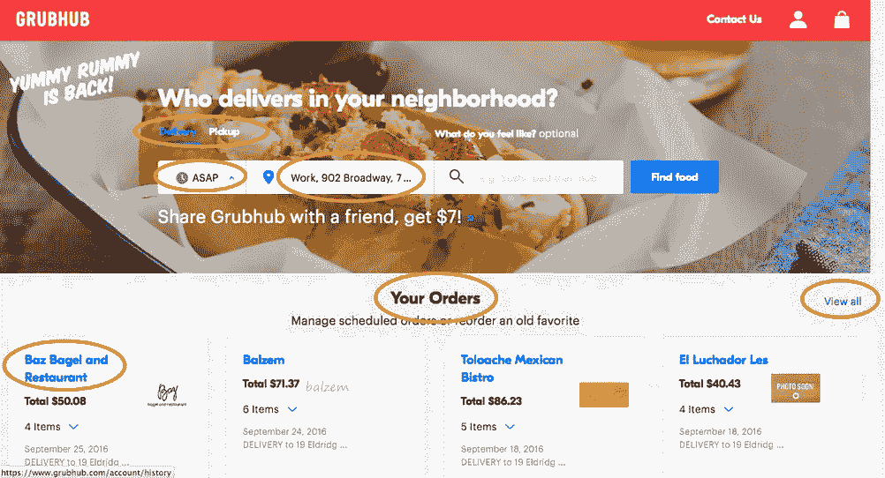
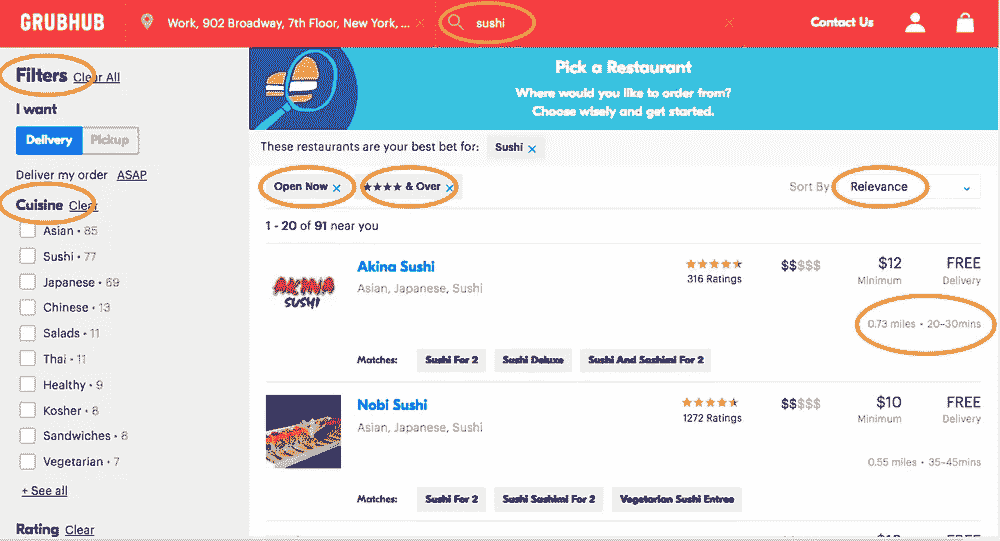
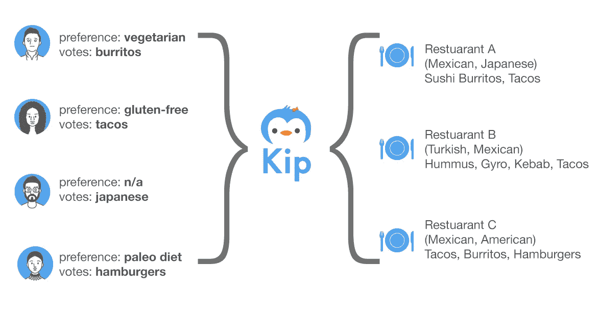
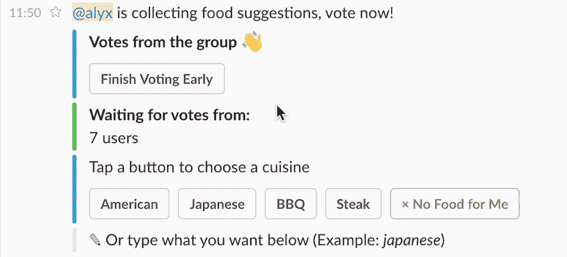
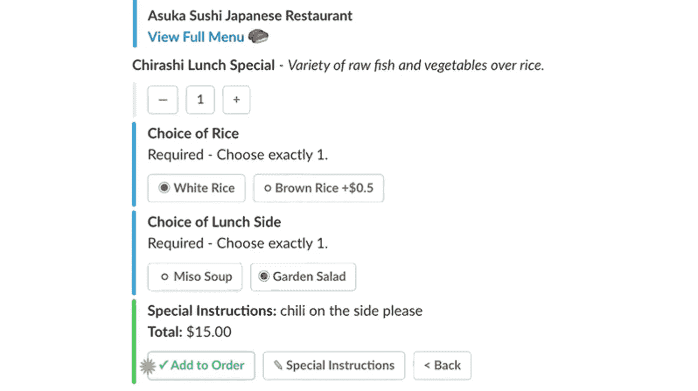

# 机器人能做什么，网站和应用不能做什么

> 原文：<https://medium.com/hackernoon/what-bots-can-do-that-websites-and-apps-cant-7ded8e679788>

人们强烈反对机器人。随着 [Facebook Messenger 从聊天转向菜单](https://techcrunch.com/2017/03/02/as-messengers-bots-lose-steam-facebook-pushes-menus-over-chat/)、 [Everlane 回滚到电子邮件](http://www.recode.net/2017/3/1/14779978/everlane-facebook-messenger-stop-customer-service-notifications)以及[品牌放弃机器人](http://digiday.com/marketing/brand-bot-backlash-begun/)作为营销策略，2016 年的宣传已经一去不复返。

2017 Bot news

在[奇普](http://www.kipthis.com)的时候，我们无畏地前进。为了打击反对者，我们向所有机器人开发者提出了一个激进的建议:

> **开发一些*只有*机器人能做的事情
> 网站和应用程序不能做的事情**

# 谁是你真正的竞争对手

事实是，你的竞争对手不仅仅是其他机器人公司，而是你的用户更喜欢使用而不是你的产品。这可能意味着他们已经访问过的一个网站，他们已经安装的一个应用程序或者他们已经想出的自己的解决方案。

**示例:**您构建了一个名为 *Fitzien* 的 FB Messenger 聊天机器人，帮助用户跟踪他们的锻炼。当人们与菲齐恩聊天时，他们会发现自己锻炼了多少小时，燃烧了多少卡路里，并可以制定自己的健身计划。听起来很有用，对吗？

**除了已经有:
1。**做同样事情的应用，比如 MyFitnessPal
**2。推荐锻炼计划并提供社会支持的在线社区。提供私人教练作为会员奖励的健身房。**像[卡路里计数器](http://www.calculator.net/calorie-calculator.html)这样不需要特定平台就可以访问的网站，例如脸书
**5。**喜欢[的人把](https://www.buzzfeed.com/rachelwmiller/how-to-start-a-bullet-journal?utm_term=.doWD5dwD4#.npXE0vlE4) [的事情](http://bulletjournal.com/get-started/) [写在](http://www.thelazygeniuscollective.com/blog/how-to-bullet-journal) [的期刊上](http://lifehacker.com/the-bullet-journal-minus-the-hype-is-actually-a-reall-1786382012)

Competition costs

一个相对简单的用例现在充满了高昂的采购成本。你面临着来自不同产品的巨大竞争，这些产品提供了与你的机器人相似的价值，你还面临着教育普通用户什么是机器人以及如何使用它的挑战。

# 你作为机器人的独特价值

当我们开始为基普咖啡馆开发时，我们面临着巨大的困境。我们如何为那些可能使用网站或应用程序的用户提供更多便利？

2-step ordering with loads of options

要在机器人对话中复制这一点，您必须经历多个步骤，如:

> 您好[用户]，我能为您做些什么？“你的地址是什么？”“你想要送货还是取货？”
> ‘是尽快交货还是计划晚点交货？’“你想开始新的订单还是重复以前的订单？”“你想吃点什么？”你的预算是多少？
> ‘多少颗星评级？等。

相比于一个网站或一个应用程序，只需点击一下——填写你的地址，点击搜索，你会立即看到各种令人眼花缭乱的食物。使用机器人既不有趣也不刺激，而是一件麻烦事。

# 增值体验

口头禅:“*做一些只有机器人才能做的事情*”对于开发机器人来说是一个很好的通过/失败测试。不仅如此，你的机器人的价值必须是目前用于改变人们习惯的价值的 20 倍。

例如，如果你想做一个递送食物的机器人，在用户选择食物之前问 16 个问题是一个万全之策。

这在奇普是一个严重的问题。我们向客户承诺，他们可以用 Kip 外卖午餐，但通过对话来做意味着 16 步问答，没有人会这么做。

最终，我们想出了一个解决方案，重新聚焦于我们的核心使命——帮助团队组织起来。我们研究了 Kip 可以做的事情，这些事情是应用程序、网站或食品配送初创公司都做不到的。

# 共识购物的群体搜索

如果你分解食物递送，它由 2 个经历组成。第一步是选择餐馆(搜索)，第二步是从菜单上点菜(选择)。作为个人，这是一个容易的过程。你知道你喜欢什么，你那天的感受，从菜单上挑选食物是小菜一碟。

> 当它是一个群体时会发生什么？当一个团队想要点午餐时会发生什么？
> 谁选择餐厅？谁发菜单？

所以我们改变了群体搜索和选择的想法。

基普搜索的不是你最喜欢的食物，而是一家拥有***你整个团队最喜欢的食物的餐厅。*

**

*Choices that suit a majority of tastes*

*也许你有一个对花生极度过敏的同事，或者一个素食主义者的朋友。或者不含麸质。或者旧石器时代的饮食。或者这是漫长的一天，你只是想吃一些美味的晚餐早餐。*

*没问题——Kip 会记住你的偏好，向团队成员投票选择，并自动向获胜餐厅的每个人发送一份个人菜单。*

**

*Live: food votes*

> *通过/失败测试:
> 这是只有基普才能做的事情吗？
> 这可以通过另一种方法来实现吗？*

***如果是在应用程序上完成:** 因为应用程序被关闭，所以不会有通信。机器人的美妙之处在于它们可以轻松访问多个平台。如果第一个人空闲，第二个人使用 Messenger，第三个人只使用电子邮件，Kip 可以同时 ping 所有三个成员，这是应用程序所不能做到的。*

***如果是在网站上做:** 会花很长时间，因为网站是供个人浏览的。当您在 Seamless/Grubhub/DoorDash 等网站上创建账户时。它应该由一个用户来管理。*

**

*Get your own personal menu instantly*

*不是同时轮询和发送菜单，而是有人必须一个一个地问每个人他们想吃什么，计算结果，然后截取菜单，粘贴到聊天上，一个一个地点菜。是服务生。*

*在对 Café进行测试的过程中，我们意识到我们创造了一些强大而有用的东西，可以应用于许多行业。经过深思熟虑，我们决定为群体搜索共识引擎申请专利。*

*在下一篇文章中，我们将更详细地讨论共识是如何工作的，以及如何从团体旅行计划到选择正确的健康保险政策中运用共识，敬请关注！*

**

*[Kip](http://kipthis.com) 是一只 AI 企鹅，帮助你收集订单，为团队协调采购。通过点击下面的按钮来尝试 Kip 松弛:*

*

Push this button* 

*如果你喜欢阅读，请推荐💚或者点击这里查看我们的其他故事。*

******

> *[黑客中午](http://bit.ly/Hackernoon)是黑客如何开始他们的下午。我们是 [@AMI](http://bit.ly/atAMIatAMI) 家庭的一员。我们现在[接受投稿](http://bit.ly/hackernoonsubmission)并乐意[讨论广告&赞助](mailto:partners@amipublications.com)机会。*
> 
> *如果你喜欢这个故事，我们推荐你阅读我们的[最新科技故事](http://bit.ly/hackernoonlatestt)和[趋势科技故事](https://hackernoon.com/trending)。直到下一次，不要把世界的现实想当然！*

**