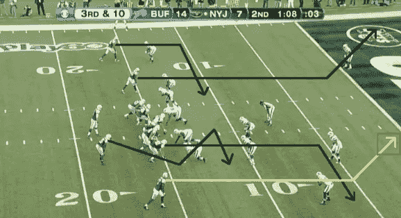
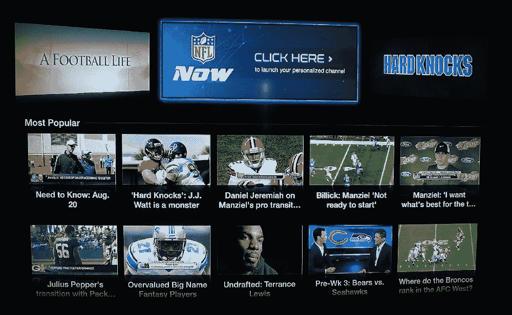

# NFL(和电视)能从创业公司学到什么？

> 原文：<https://medium.com/hackernoon/what-can-the-nfl-and-tv-learn-from-startups-16974cb6fe61>

这个周末我看了 NFL 的整个外卡赛。这意味着我花了 14 个小时看 NFL。休息了一会儿后(你无法想象有多累)，我得出了几个结论，关于我认为体育团队或联盟可以做些什么来让体验变得更加愉快。

## NFL 缺少什么

在 NFL 比赛期间，你会看到大量的电视**广告**，我指的是**广告**。根据我的计算，你看了 1:30 小时的广告，又看了 1:30 的比赛。伙计，如果 50/50 还不够压抑的话，你可以得到更多的细节，并假设玩家实际上玩了 [11 分钟](http://qz.com/150577/an-average-nfl-game-more-than-100-commercials-and-just-11-minutes-of-play/)，但对我来说，1:30 小时的游戏，重播和评论是没问题的。

ads ads ads

我喜欢的第一件事是更短的游戏。把广告放在游戏中或其他地方，但是请把游戏制作成最多 2 个小时。老实说，这场比赛唯一激动人心的部分是第四节的最后 5 分钟，由于广告的原因，这相当于 20 分钟或现实生活中的时间。

第二，对球队在比赛中所做的一些解释。也许是一个配套的应用程序来看比赛，并了解更多一点游戏是如何以及为什么会以这种方式发展。到目前为止，我不知道什么是镍阵型，也不知道 3-4 防守战术是什么意思，这些术语我已经听过很多年了。

Possible course of action

第三，规则手册，因为我仍然没有得到一些比赛的几面旗帜，我已经看了 15 年多的足球比赛。

第四，基于每个球队的支持者的社交网络或社区。我的意思是你得到了粉丝页面，但这和你得到的主要内容来自品牌本身，而不是来自粉丝和粉丝的感觉是不一样的。现在，球队的球迷页面和球队的每个球星和主力球员之间的注意力都被转移了。我承认虚拟足球联盟和团体的存在，但在这种情况下，我希望从我的团队的全球粉丝那里获得关于游戏的见解，或者在游戏期间进行智能辩论(有趣的图片)的地方。

第五，NFL 应该为我的球队的整个赛季发布不同的流选项，因为毫无疑问，我会直接在我的tv 或 Chromecast 上付费。我在墨西哥，不能经常参加比赛，但我很乐意支付我的球队整个赛季的费用。他们现在与 NFL Now 的合作是一个好的开始，但我不明白为什么这不是他们 YouTube 频道的一部分。其中的生活部分一点也不吸引我。

NFL Now (meh)

第六，NFL 得到溢价广告，我明白。事实上，他们得到的广告是如此之好，如果他们只是弹出一个“立即购买”按钮，我肯定会按几次，因为广告是如此之好和相关(对我来说)。如果他们给我机会用遥控器玩的话，我会在这个星期天买一个游戏机和一个扬声器。他们可能需要在tv 和 Chromecast 等多媒体设备上获得流媒体。一旦他们解决了这个问题，他们肯定会把我的钱给和他们一起做广告的人。

## 结论

在实现了其中一些理想后，我现在明白了，电视将随着新的流媒体发布而永远改变，当有人在那里按下购买按钮时，这将是一个完美的市场，因为他们可以获得最高的位置。社区也有点孤立，因为在墨西哥每个角落似乎都有一个钢人/牛仔队的球迷(他们是该国最受欢迎的 NFL 球队)，我相信他们可以通过互联网和在线社交做得更多。他们不需要在墨西哥领土上进行大量的游戏来获得我们的资金，因为他们已经在每个周末吸引了我们的注意力，我确信除了美国，其他几个国家也是如此。

> [黑客中午](http://bit.ly/Hackernoon)是黑客如何开始他们的下午。我们是 [@AMI](http://bit.ly/atAMIatAMI) 家庭的一员。我们现在[接受投稿](http://bit.ly/hackernoonsubmission)，并乐意[讨论广告&赞助](mailto:partners@amipublications.com)机会。
> 
> 如果你喜欢这个故事，我们推荐你阅读我们的[最新科技故事](http://bit.ly/hackernoonlatestt)和[趋势科技故事](https://hackernoon.com/trending)。直到下一次，不要把世界的现实想当然！

