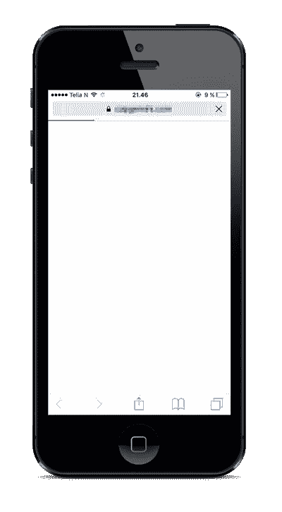
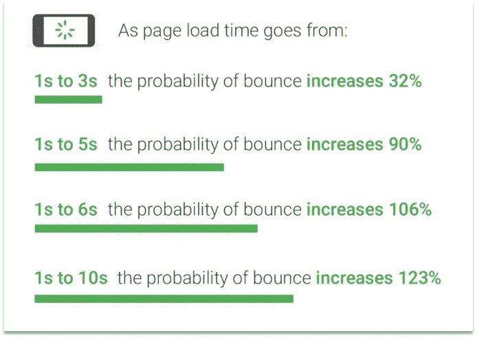
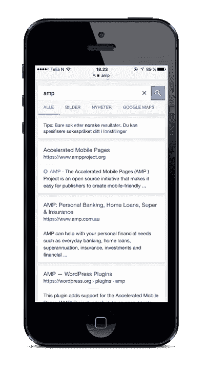

# 我们能从谷歌 AMP-project 中学到什么？

> 原文：<https://medium.com/hackernoon/what-can-we-learn-from-googles-amp-project-6eff05154f8e>

我最近参加了纽约 AMPConf 2017，围绕为什么以及如何实施 [AMP](https://hackernoon.com/tagged/amp) 进行了一些精彩的讨论。不管 AMP 是否适合你，它都为营销人员和开发者敲响了警钟。

**A faster lane for a better user experience?** photo: Glenn Wedin

首先，AMP 不仅仅是一种新的[技术](https://hackernoon.com/tagged/technology)，也是一种**哲学**和一种前端开发人员应该知道的行动号召。AMP 的目标是改善移动设备的用户体验，并为每个人改善网络。

那么，我们为什么要专注于在移动端创造更好的用户体验呢？原因很简单，这是我们的终端用户目前花费大部分时间的地方，我们让他们的体验太痛苦了。缓慢加载的广告、阻碍页面内容的广告、由于 javascript 操作而导致的多次重画页面以及几秒钟内无法工作的滚动只是 AMP 旨在解决的一些问题。

[燕麦片](http://theoatmeal.com/)也想要更好的用户体验:

[http://theoatmeal.com/comics/mobile_website](http://theoatmeal.com/comics/mobile_website)

## 死亡白屏

移动网络通常看起来像下面的图片。这种所谓的“死亡白屏”通常会让用户返回搜索结果，而不是等待页面最终出现。嗯，至少对我来说是这样的。

The white screen of death.. please wait, wait, wait, wait…

## 渲染时间慢=转换和浏览量丢失

一个被充分证明的事实是，页面加载的时间越长，就会有越多的用户在页面呈现之前离开页面。Jacob Nielsen 甚至在 90 年代早期做了研究来证明这一点。然而，获得确凿的事实和数字可能很困难。例如，如果用户在页面呈现之前离开，我们用标准的分析工具不会注意到。根据谷歌和 SOASTA 的研究，即使几秒钟也足以失去大量的访问，亚马逊的收入据说每提高 100 毫秒增长 1%。

Source: Google/SOASTA Research, 2017

在 AMPConf 2017 Natalia 巴尔塔萨从 [**《卫报》**](https://www.theguardian.com) 告诉我们，他们**在 AMP 页面上的点击率**比普通页面高 8.6%，他们发现 **AMP 链接被点击的几率**高 2%。 [Wego](https://www.wego.com/) 还谈到了他们在基于 AMP 的渐进式网络应用程序上的转化率比旧网站提高了 93%。

# 但是 AMP 是什么呢？

AMP 是一套严格的规则和一些 javascript，它让你以一种标准化的方式构建快速的网页，因此你的页面可以在任何设备和平台上被高速缓存和交付。谷歌——很快会有很多其他公司——会把你的内容缓存在他们自己的服务器上。缓存和预呈现内容的好处是，谷歌可以实现搜索结果的高速交付。AMP 可以在任何网络视图中可靠地工作，无论是浏览器、LinkedIn、脸书、谷歌搜索、雅虎搜索、必应搜索还是任何其他实现它的应用程序。

An example of how an AMP-enabled page will be displayed on Google

至于谷歌搜索结果，当他们将你的页面验证为 AMP-page 时，你的页面会显示一个小闪电。Bing 和 LinkedIn 也开始呈现 AMP-content，但迄今为止他们还没有实现 AMP-cache。

## 放大器缓存

谷歌作为 AMP-pages 的消费者，提供了自己的 AMP-cache。缓存用于在全球范围内即时提供预渲染体验，并验证页面以确保页面正常工作。出于安全原因，目前只有谷歌可以托管 AMP-cache。正如 **Cloudflare 首席执行官 Matthew Prince** 在 AMPConf 2017 上提到的，Cloudflare 已经创建了自己的 AMP-cache，并将提供自己的服务和 SDK，供希望在自己的应用程序中呈现 AMP-pages 的所有人使用。

**提高速度的关键**
AMP 的关键部分之一是，它不允许任何会阻止页面呈现的代码。呈现阻塞元素在大多数情况下是同步脚本、链接和导入标签。AMP 将只允许异步 JavaScript。自己写的 JavaScript 也不会被允许(！)相反，所有交互功能都必须由 AMP-components 处理。iframes 中允许使用自定义 JavaScript 只要它不会阻止主页的呈现。关键的和高于折叠的 CSS *有*要内联渲染，大小小于 50kB。这也意味着是时候告别像 Bootstrap 和 Foundation 这样的 CSS 框架了。

> "只做能快速完成的事情。"

AMPs 的设计原则之一是只做能快速完成的事情。这意味着你需要重新考虑你放在网站上的所有东西。这也意味着你应该考虑你的营销部门是否真的应该访问谷歌标签管理器。这个原则也强调了我对 AMP 的一个问题。具有讽刺意味的是，如果开发人员负责，我们可能一开始就不需要 AMP。然而，比起修复现有的解决方案，创建第二个性能更好的移动网站似乎更容易被接受。在 AMPConf 2017 期间发表的一个有趣的评论是**“AMP 比你的 CEO 更强大”**。

## 带 AMP 的渐进式网络应用

Progressive web apps 引入了一个名为应用外壳模型的概念，它专注于即时呈现应用程序的最小部分，然后异步加载其余内容。按照应用程序外壳模型，可以通过内联呈现关键 CSS，并用 Cache-API 缓存“应用程序外壳”来做到这一点。“应用程序外壳”是基本的用户界面。这与 AMP 的不同之处在于，AMP 的目标是即时呈现所有内容，而不是阻止页面呈现和/或由 Google 预呈现。

尽管 PWA 和 AMP 通常适用于不同的用例，但它们可以很好地共存，甚至可以共存，如 Paul Bakaus 在本文中所述:[https://www . smashingmagazine . com/2016/12/progressive-we b-amps/](https://www.smashingmagazine.com/2016/12/progressive-web-amps/)

## 评论

即使 tough AMP 有很多使用它的好理由，也有一些非常重要的反对理由。我个人遇到的第一个问题是“为什么我们不能做一个快速的移动网站？”以及“我想要自己的域名”。

因此，如前所述，可以做很多事情来提高常规移动网站的页面速度，特别是如果你遵循 AMP 的设计原则(以及性能最佳实践)。如果你想让 AMP 闪电出现在搜索结果和 LinkedIn 等应用中，你*必须*实现 AMP 并让它生效。据谷歌称，这是因为这是他们验证你的页面是否真的很快的唯一方法。如果你的网站没有 AMP，他们就不能保证你的页面会持续快速的发布。他们只是检查你的网站，看看它是否遵循放大器的限制，如果是的话，你值得闪电。

**域名**页面所有者自然希望显示正确的域名，这或者是出于品牌推广的目的，或者是因为出版商可能只有权在他们自己的域名下提供某些内容。

由于谷歌对谁可以操作 AMP-cache 一直很严格，并且不确定它是否会影响排名，人们担心这会使网络更加封闭，并锁定谷歌的服务。根据谷歌的说法，情况并非如此。这是一个开源项目，任何人都可以实现对 AMP 的支持。谷歌也希望有更多的开发者参与他们的开源项目。

**AMP 对排名没有影响** 许多人似乎认为 AMP 对网站谷歌排名有影响，但是**根据**大卫·贝斯布里斯**谷歌**工程副总裁的说法——AMP 是*不是*一个排名信号，而且可能不会是。这是因为 AMP 不能告诉谷歌任何其他当前活跃的排名信号已经告诉他们的事情。由于这是一个测试和研究的持续过程，他还说**他们不能排除任何可能性**。

# 那么我认为我们可以从 AMP 学到什么呢？

根据我的经验，作为开发人员，我们需要学会关注页面性能，并完全控制页面内容。你知道你的 400kb CSS 文件中的每一段代码是做什么的吗？大概不会。如果你仔细想想，一个 CSS 文件可能永远不需要超过 50kb 的大小来用于一个单独的页面。开发人员还需要弄清楚我们网站上的所有脚本在做什么。它们什么时候加载，是阻止渲染还是触发页面重画？如果一个脚本没有被标记为“async”或者“deferred ”,那么为什么不是呢？

如果它不适合你的解决方案，你不必生气，我个人更愿意优先考虑一般的页面性能。考虑到 AMPs 的设计原则和性能最佳实践，无疑将是对任何 webapp 的一个很好的改进，但真正使 AMP 快速的是不阻塞关键的 renderpath、优化资源、延迟加载，当然还有谷歌 AMP-cache 帮助下的缓存和预渲染的结合。

AMP 项目确实为开发商和营销人员敲响了警钟。它试图解决一个严重的问题，而且快速、简单、有针对性。如果你的移动网站就像上面奥茨先生画的那样，你可能会被禁止使用我们所有的互联网。

所以我认为我们应该对我们的网页做的是:

*   从遵循最佳性能实践开始(您为什么还没有这样做呢？)
*   静态调整所有资源的大小
*   内联关键 CSS 并使 javascript 异步加载
*   优化字体
*   让营销部门远离标签经理(是的，没错)
*   考虑 AMP)

以及 AMP 设计原则的一些总结

> “如有疑问，请选择最有利于终端用户体验的方式”

> [黑客中午](http://bit.ly/Hackernoon)是黑客如何开始他们的下午。我们是 [@AMI](http://bit.ly/atAMIatAMI) 家庭的一员。我们现在[接受投稿](http://bit.ly/hackernoonsubmission)，并乐意[讨论广告&赞助](mailto:partners@amipublications.com)机会。
> 
> 如果你喜欢这个故事，我们推荐你阅读我们的[最新科技故事](http://bit.ly/hackernoonlatestt)和[趋势科技故事](https://hackernoon.com/trending)。直到下一次，不要把世界的现实想当然！

