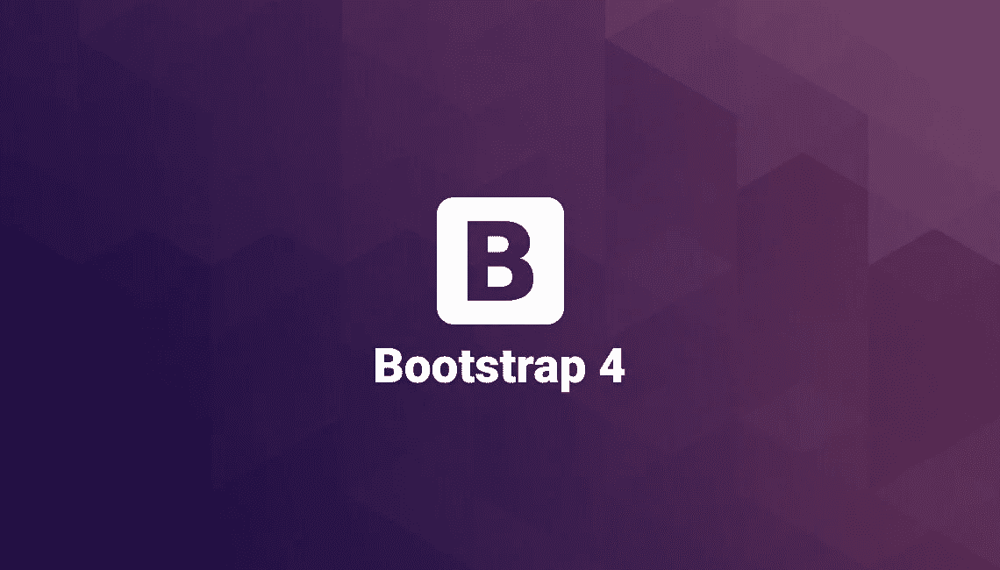

# Bootstrap 4.0 有什么变化？

> 原文：<https://medium.com/hackernoon/what-changed-in-bootstrap-4-0-ca3cbbf4f62f>

如果你有国外前端社区的最新消息，你可能会知道 **Bootstrap 4.0-alpha6** 已经发布。但是对我们开发者来说，实际上改变了什么呢？

# 首先要做的是:

*alpha 版本显然还不完整，不应该在生产中使用，他们仍然在改变语法，添加和删除功能，所以这只是一个预览版，我不建议你在生产项目中使用，只是在爱好项目中使用。*

Throwback to 2011, could even they imagined their framework became so important?

# 1-少顶嘴

Bootstrap 的现在用 SASS！在旧版本中，它很少作为主预处理器使用。直到 3.0 版本才创建了 Sass 端口。

[这很好，因为 Sass 往往更受前端开发人员的青睐。多亏了 Libsass，它的编译速度也更快了。](https://www.solitr.com/blog/2014/01/css-preprocessor-benchmark/)

不幸的是，在这次更新中，我只是收集了其他人的意见，我从未使用过 LESS just SASS，尽管 SASS 和 LESS 都是非常强大的 CSS 扩展。你可以认为它们更像是一种[编程](https://hackernoon.com/tagged/programming)语言，旨在使 CSS 更易于维护、主题化和扩展。

# 2- Flexbox

现在，Bootstrap 4 已经完全采用了 flexbox。新的[自动布局列](https://v4-alpha.getbootstrap.com/layout/grid/#auto-layout-columns)使您能够创建任意*数字列来填充视窗的宽度。这种新的“无单元”网格可以与经典的 12 单元网格相结合，实现看似无限的可能性。这意味着[等高列](http://bootstrap4.guide/#one)、[奇数列](/wdstack/the-bootstrap-4-is-getting-odd-e9400b121719)或偶数[半单元列](/wdstack/the-bootstrap-4-is-getting-odd-e9400b121719)都可以使用 Bootstrap 4。Flexbox 也意味着对*的更多控制既有* ***高度*** *和* ***宽度*** *。
Obs。:如果你不知道如何正确使用 flexbox(像我一样)，现在是时候更新了。**

# *3- 5 层网格(XL 在游戏中)*

*现在有 5 层(或断点)来支持典型的纵向和横向屏幕宽度。Bootstrap 4 用 **col-xl-*** 类引入了一个新的网格断点。这个额外的层将媒体查询范围一直向下扩展到 **544 px** 。尽管新的 XL 层会让人认为它是为了支持超大屏幕而添加的，但它实际上是与相对的*。所有 3.x 层在 4.x 中向上滑动，以适应底部新的 544 px 到 768 px 层。旧的 3.x col-xs-*支持低于 768 px 的屏幕宽度，而新的 4.x col-xs-*层支持低于 544 px 的屏幕宽度。这种新的更小的 xs 层意味着改善支持人像智能手机。**

# *4-更大的字体和改进的 REM 大小*

*这可能是 Bootstrap 4 中最令人困惑的变化。所以，在我们解释这些之前，要知道你仍然可以使用`px`、`em`，甚至`pt`来排版。如果你不想改变，什么都不会改变。*

*Bootstrap 4 中的字体大小完全基于`rem`测量单位。这其实是一个超级容易理解的概念。使用`rem`，所有的字体大小都是相对于根元素(也就是`html`标签)的。*

*更好的解释是，想象你自己在一个 bootstrap 项目中检查一个`h1`，你会意识到默认大小是 16 *px* 。如果你想让你的`h1` 标签也是这个大小，你可以简单地做:*

*`h1{ font-size: 1 rem; }`*

*如果您希望您的`h1`标签为 48px，那么计算如下:*

*`h1{ font-size: 3 rem; /* 3 x 16 = 48 */ }`*

*这样做的原因是为了使设备更容易放大或缩小。从技术上来说，您可以使用媒体查询将`html`标签更改为更小或更大的尺寸，以同等地缩放所有字体大小——这是一个非常好的特性。*

*这个版本可能是有史以来变化最大的一个版本，所以我们需要随时寻找信息并分享=)*

# *5 张新卡(取代 3.x 面板)*

*[卡](https://v4-alpha.getbootstrap.com/components/card/)取代 Bootstrap 3 的旧[面板](https://getbootstrap.com/components/#panels)和[井](https://getbootstrap.com/components/#wells)。卡被定义为*一个灵活的、可扩展的内容容器。它包括页眉和页脚选项、各种各样的内容、上下文背景颜色和强大的显示选项。**

*它们本质上是具有大量开箱即用选项的独立内容块。*

# *6-再见了 IE8！*

*IE8 支持被放弃。放弃对 IE8 的支持意味着我们可以充分利用 CSS 的优势，而不会受到 CSS 攻击或倒退的阻碍。这也意味着维护人员可以专注于新技术并不断向前推进。*

# *7-基本网格已更改**

*Bootstrap 4 网格的一个很酷的新特性是自动布局模式。它允许开发人员省去列的大小，让他们自动分配该行中的空间。*

*无大小列平均共享可用空间，总是填满整行。如果我们想让一列变大或变小，我们仍然可以用一个`.col-size`类来实现。*

** = >[http://demo . tutorial zine . com/2016/11/boostrap-4-regular-vs-flex-grid/？1-基本网格](http://demo.tutorialzine.com/2016/11/boostrap-4-regular-vs-flex-grid/?1-basic-grid)
*在上面的这个实例中检查得更好**

******

> *[黑客中午](http://bit.ly/Hackernoon)是黑客如何开始他们的下午。我们是阿妹家庭的一员。我们现在[接受投稿](http://bit.ly/hackernoonsubmission)并乐意[讨论广告&赞助](mailto:partners@amipublications.com)的机会。*
> 
> *如果你喜欢这个故事，我们推荐你阅读我们的[最新科技故事](http://bit.ly/hackernoonlatestt)和[趋势科技故事](https://hackernoon.com/trending)。直到下一次，不要把世界的现实想当然！*

**