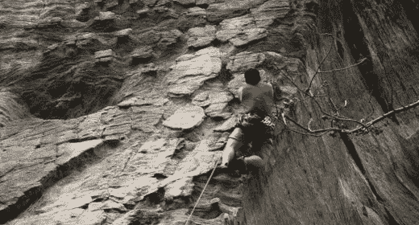

# 关于风险投资，攀岩教会了我什么

> 原文：<https://medium.com/hackernoon/what-climbing-taught-me-about-venture-capital-8bd8c850444c>

十多年前，我有幸见到了吉姆·科林斯，他在 T2 接入基金的一次活动上发言。作为一名终生的[攀登者](https://hackernoon.com/tagged/climber)，吉姆谈到了他那篇我每年都会重新准备的具有煽动性的[文章](https://www.fastcompany.com/47527/leadership-lessons-rock-climber)，将攀登中的经验教训与商业联系起来:“失败”与“失败”的概念——在你承诺全力以赴后失败与在失败的顶点放弃，这两者在外表上看起来一样，但内在却截然不同；不要让失败的可能性盖过失败的后果(反之亦然)——这正是为什么这么多斯坦福大学的 MBA 毕业生选择创业。

同样的咒语也适用于桌子的另一边。当一家 [$3B 独角兽公司倒闭](https://www.reuters.com/article/us-jawbone-failure-idUSKBN19V0BS)并带走 9 亿美元融资时，**它的投资者会有什么后果？**

继我两周前关于[风险](https://www.linkedin.com/pulse/new-beginning-distressed-vc-backed-companies-jonathan-lu)的帖子之后，让我们来看看数学。Jawbone 的首轮融资由科斯拉风险投资公司(Khosla Ventures)牵头，科斯拉风险投资公司是最著名的风险投资公司之一，管理着 27.5 亿美元的资产，在他们投资的 281 家公司中有 60 起流动性事件(10 起 IPO&5000 万& A)。假设科斯拉为他们的有限合伙人设定了 3 倍的回报目标(高于 HBS 大学教授比尔·萨尔曼 2010 年研究的平均值 2.56 倍)，他们需要在退出时达到 825 亿美元。

风投通常持有其投资组合公司 20%的股份，这意味着科斯拉退出公司的总价值必须达到 4125 亿美元，才能提供目标回报。如果我们假设他们的投资按照 CB Insight 的风险资本漏斗平均分布，成功率为 28%，他们应该达到 78 个退出(未来还有 18 个流动性事件)，每个退出公司的平均估值为 5.3 亿美元。

在他们的 281 项投资中，他们需要 78 份[安吉的清单](https://www.bloomberg.com/news/articles/2017-05-01/iac-to-acquire-angie-s-list-in-deal-valued-at-about-500-million)或 1 份[优步的清单](https://www.cbinsights.com/research-unicorn-companies)。难怪他们会荡向栅栏呢？

如果他们失手了呢？风险投资通常遵循 220 的[法则](http://www.investopedia.com/terms/t/two_and_twenty.asp)，当他们的公司退出时，他们收取 2%的管理费和 20%的利润。在科斯拉管理的 27.5 亿美元资产的情况下，这相当于每年 5500 万美元的管理费——假设 20%的营销&管理费用，这就剩下 4400 万美元在他们的 16 个投资和运营合作伙伴之间分配:这是一份有资格进入前 0.1%的高薪，但不完全是[富钱](http://time.com/money/4187538/f-u-money-defined-how-much-calculator/)。如果科斯拉达到了他们声明的退出目标，那么他们的 20%套利相当于额外的 11 亿美元的发薪日——这是 FU 的钱。

对于 VC 来说，失败的概率很高，但失败的后果很低/成功的概率很低，但成功的后果很高，所以他们 [**挥杆很大，对目标**](http://static1.businessinsider.com/image/505d02afecad04a90d000004-1190-625/hockey-coach-delivers-first-pitch-strike-using-a-hockey-stick.jpg) 出手很多才是理性的。根据美国国家风险投资协会的数据，2016 年有 898 家风投公司投资了 7751 家公司，这意味着去年风投公司平均投资了 8.6 家公司。相比之下，根据 Pitchbook 的年度报告，3600 家私募股权公司投资了 3538 家公司，平均每家公司投资 1 家公司。

**不同的训练方式**

在他上周的播客中，我的朋友和杰出的攀岩者/训练者[克里斯·汉普顿](http://www.powercompanyclimbing.com/about-power-company-climbing/),[电力公司攀岩](http://www.powercompanyclimbing.com/blog/2017/7/10/episode-50-a-coaching-masterclass-with-lantien-chu)的创始人，采访了怀俄明州兰德高中鼓舞人心的游泳教练蓝田·朱。蔻驰·朱的团队已经连续 21 次赢得州冠军，却从未淘汰过一个游泳运动员，她的一些学生甚至在加入团队时都不知道如何游泳。她是怎么做到的？不是建造游泳者，而是建造人类。

她的团队赢得了一些州级比赛，但在个人项目中没有任何获胜者——正是许多第二名、第三名和第四名的表现使他们超越了总是在个人项目中寻求第一名的竞争对手。当她有明星演员时，这很好，但永远不够，所以她依赖他们是不可持续的。换句话说，她已经形成了自己的企业，因此即使在个人层面上失败的概率很高，在团队层面上失败的概率也很低。在她的生意中，团队层面的成功=个人的成功。

蔻驰·朱不为所动，只打了几个本垒打，赢得了许多冠军。我完全赞成追求本垒打——1998 年马克·麦格威尔/萨米·索萨本垒打追逐赛季是我最后一次对棒球感兴趣——正如我是风险投资行业的热情支持者，考虑到它对创造就业机会和美国经济研发的巨大影响。2016 年，风投投资了 690 亿美元，相比之下，私募股权投资了 650 亿美元:十分之一的股权投资听起来是应该进行长期投资的正确数字。

我很高兴其他人在外面大摇大摆。相反，我会用我在比赛中的实力去追求冠军。或者把这个类比带回攀岩，你不会发现我[像亚历克斯·霍诺德](http://www.nationalgeographic.com/adventure/features/athletes/alex-honnold/most-dangerous-free-solo-climb-yosemite-national-park-el-capitan/)一样自由地独舞一堵大墙。你会发现我和一个[协作社区](http://www.powercompanyclimbing.com/blog/2017/2/22/episode-28-community-and-fleeting-youth-with-cody-roth)一起上路，在 5.12 挑战我们自己的极限——建设我们自己。对于 2016 年获得风险投资的 5500 名将失败的企业家，你们中有多少人想和我一起尝试下一次上升？

*本文为* [*原载于 2017 年 7 月 20 日*](https://www.linkedin.com/pulse/what-climbing-taught-me-venture-capital-jonathan-lu) *。*