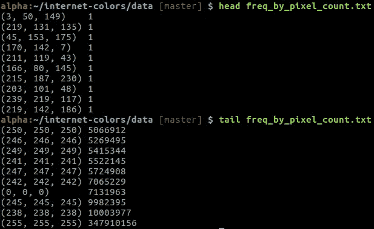
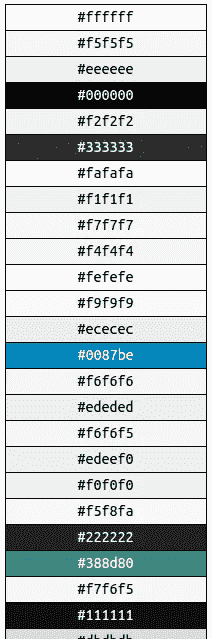
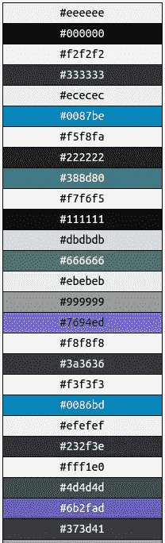
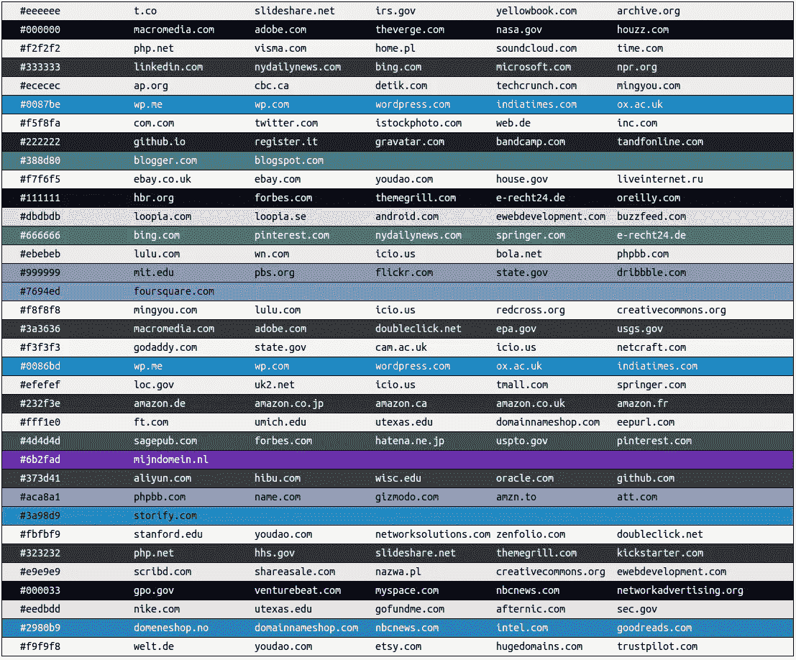
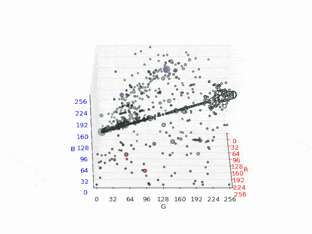
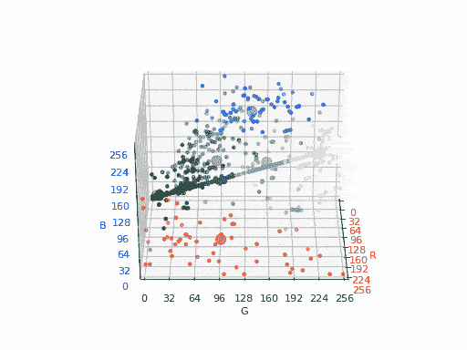

# 互联网是什么颜色？

> 原文：<https://medium.com/hackernoon/what-color-is-the-internet-just-the-most-viewed-portions-ccd33d1f878f>

## (仅查看最多的部分)

我不确定我是怎么想出这个主意的，但是前段时间，我想刮一堆网站，看看最流行的颜色和颜色主题是什么。在这篇技术文章中，我生成了 400 个访问量最大的网站的截图，并分析了它们最常用的颜色。这是一个有趣的数据收集项目，我利用这个机会学习多线程、色彩理论和 matplotlib。我将与你们分享我学到的一切，以及我写的代码，所以如果你愿意，你可以自己尝试一下。

我从 [moz.com 的 500 强名单](https://moz.com/top500)下载了一份 500 强域名名单。我必须解决的第一件事是如何以编程方式为每个 URL 捕获网页截图。我的第一个想法是使用 [pyautogui](https://pyautogui.readthedocs.io/en/latest/) 来自动化截屏和保存网站的过程，但是这看起来很不自然，而且耗时太长。

经过一些研究，我发现了一个非常酷的库，叫做 [python-webkit2png](https://github.com/adamn/python-webkit2png) ，它可以让我用 webkit 截屏一个网页。安装后，可以从命令行获得 webkit2png 脚本。除了有很好的文档记录之外，这个库非常棒，甚至还有一个很酷的跳舞蝙蝠侠 GIF。

Awesomeness. [Source](https://github.com/adamn/python-webkit2png)

不幸的是，由于 webkit2png 是为 Python 2.x 编写的，我不得不稍微修改一下以使它能与 Python 3 一起工作。(是的，我知道，我可以使用 Python 2.x)。

命令行工具将截图 PNG 的原始数据传递给 stdout，所以我使用了[子流程。从我的 Python 脚本中调用它。这样做的好处是，我不必将数据存储在临时 PNG 文件中，因为我可以将 PNG 数据直接从 stdout 传递给一个](https://docs.python.org/3/library/subprocess.html#subprocess.Popen) [Python PIL](http://effbot.org/imagingbook/pil-index.htm) 图像对象。

A snippet of the script I used to aggregate screenshots

以上是我刚刚描述的代码片段。函数的作用是:返回一个 PIL 图片对象，包括给定 url 的截图。您会注意到该函数有一个额外的*日志文件*参数。由于 webkit2png 脚本将错误写入日志文件，所以我在尝试截图之前删除了日志文件，并在之后检查它以查看截图是否被成功捕获。

太棒了，现在我有了获取网页截图的方法，我将在顶级网站的 csv 上运行它。5 分钟后，很明显脚本将永远无法运行。我刚刚再次温习了多线程，所以用它来加速这个过程有点酷。

我将 URL 列表分成块，并将每个块传递给一个线程。为了简洁起见，没有包含 chunk()函数(它所做的只是将一个列表分成 n 个大小相等的块)。这个代码片段有一个 write_image_data()函数，它使用前面的 get_image()函数将获取的图像数据追加到一个文件中。现在我们只需要[结合两部分](https://github.com/omgimanerd/internet-colors/blob/master/aggregate.py)并在每个 URL 上运行它。

好了，接下来是更有趣的事情。看代码很有趣也很好，但更有趣的是看这些数据会产生什么。我写了一个[快速脚本](https://github.com/omgimanerd/internet-colors/blob/master/frequencies.py)来统计每种颜色出现的频率，对数据进行排序，并将其转储到另一个数据文件中。

Outputting the first and last few lines of the sorted color frequencies

很明显，纯白色(255，255，255)是所有被抓取的网页中出现频率最高的颜色。不过，这种查看数据的格式不是很直观。我将数据传递给一个 [Jinja 模板](http://jinja.pocoo.org/)和[渲染成一个 HTML 文件](https://github.com/omgimanerd/internet-colors/blob/master/render_frequencies.py)。

The most frequently occurring colors (unfiltered)

上面显示的是从上到下最常出现的颜色的一小部分。这也不是很有意义，因为有很多高频率的相似颜色。我计算了两种颜色之间的平方欧几里德距离，以确定它们有多相似，并去掉了与相似颜色相邻的颜色。

The most frequently occurring colors (filtered)

这张最常出现的颜色图提供了更多的信息。

**请注意，移除相似的颜色并不是一个很好的方法，因为它完全忽略了频率计数中的那些颜色。把它们组合在一起，作为一种颜色来计数，以便准确地对它们进行排序，这样会好得多。**

有哪些网站用这些颜色？让我们检查一下。我写了一个[小模块，通过颜色](https://github.com/omgimanerd/internet-colors/blob/master/search_color.py)查找 URL。

Websites that use the most frequently occurring colors

请注意，这种视觉效果仍然具有误导性。这显示了最频繁出现的颜色，**以及使用该颜色最多的网站，**，并且不考虑网站流量或任何其他因素。这些图像只显示了整个画面的一部分。

让我们用 3D 绘制颜色，以得出一些更具体的结论。

3D visualization of website color frequencies

上面是使用 x、y 和 z 轴分别作为红色、绿色和蓝色的前 10%最常出现的颜色的 GIF。这些点被相应地着色，它们的大小代表它们的相对频率。唯一没有按比例调整大小的点是那些接近白色的点，因为这些颜色出现得如此频繁，如果按比例调整，它们将占据可视化的八分之一以上。

这是有意义的，因为白色和浅灰色经常用于网站的大背景。请注意(0，0，0)和(255，255，255)之间对角线上的粗线。这些颜色是浅灰色和深灰色，是非常常用的文本颜色和次要内容颜色。

在极端的边缘和角落附近有很少的颜色，更常见的是看到更柔和的红色和蓝色，因为这些往往是非常受欢迎的网站颜色主题。

另一种我们可以将颜色频率可视化的方法是将相似的颜色聚集在一起。k-means 聚类算法是一种简单的机器学习算法，它允许我们将相似的颜色分组到质心周围的聚类中。

k-means 聚类算法的工作原理是选择 k 个质心并移动它们，直到它们到达一个点簇中的最佳“中心”位置。关于该算法的更详细的解释，[参见本页](https://en.wikipedia.org/wiki/K-means_clustering)。出于学习的目的，我首先用纯 Python 实现了一个加权 k-means 算法，然后用 NumPy 库重写了它以提高速度。我将在这篇文章中省略算法的代码，但是[你可以在这里](https://gist.github.com/omgimanerd/ff0b9a8dd225f2d2e94aa4be76bc91d9)查看。

3D visualization of clustered website colors.

在上面的可视化中，我使用 k-means 聚类算法来确定 8 个质心和聚类，使用颜色并根据它们的频率对它们进行加权。每个聚类的质心由每个聚类中最大的点表示。每个聚类根据质心的颜色进行着色。这种可视化是一种很好的颜色分布测量方法，它向我们展示了什么颜色最容易出现。

那么互联网是什么颜色呢？大部分是黑色、白色和灰色。

我不完全确定这个项目进行到哪里，但是我学到了很多关于多处理和 NumPy 的知识。将来我可能会再次访问这些数据，看看我还能从中推断出什么。如果你想自己修改代码，[这里有一个库](http://github.com/omgimanerd/internet-colors)的链接。感谢阅读！

在推特上关注我: [@omgimanerd](http://twitter.com/omgimanerd)

> [黑客中午](http://bit.ly/Hackernoon)是黑客如何开始他们的下午。我们是 [@AMI](http://bit.ly/atAMIatAMI) 家庭的一员。我们现在[接受投稿](http://bit.ly/hackernoonsubmission)，并乐意[讨论广告&赞助](mailto:partners@amipublications.com)机会。
> 
> 如果你喜欢这个故事，我们推荐你阅读我们的[最新科技故事](http://bit.ly/hackernoonlatestt)和[趋势科技故事](https://hackernoon.com/trending)。直到下一次，不要把世界的现实想当然！

