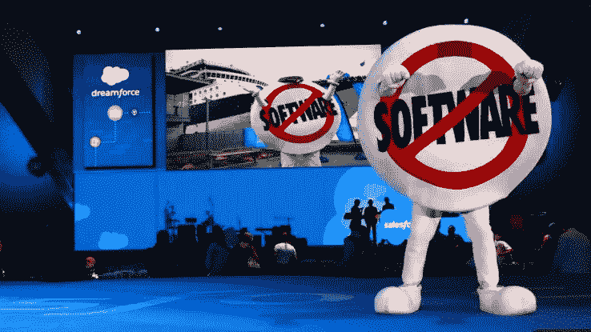
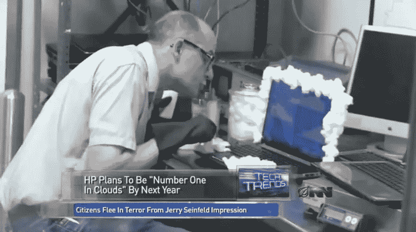

# SaaS 之后是什么？

> 原文：<https://medium.com/hackernoon/what-comes-after-saas-1f71ec40de45>

这是旧金山一个凉爽的早晨。路易斯(化名)走进当地的一家咖啡馆，去喝他的早餐咖啡，他感觉很自信，背景中是缆车轨道的声音。漫步下山去他的软件即服务公司，明媚的阳光与他的前景相匹配。这家公司是在路易斯狭小的南湾公寓里，通过三个月的编码狂欢建立起来的，在每年 1000 万美元经常性收入的神话般的“[不可消灭的](https://www.saastr.com/from-initial-traction-to-initial-scale-10m-in-arr-dont-get-killed-by-your-success/)”阶段，它正在成为一个真正的企业。

当周晚些时候(2016 年 2 月)， [SaaS](https://hackernoon.com/tagged/saas) 和[科技](https://hackernoon.com/tagged/technology)股票[暴跌](https://www.quora.com/Why-did-public-SaaS-stocks-crash-on-Feb-5-2016)超过 30%。一些公司——如数据可视化平台 Tableau——的价值减少了一半。这最终导致强大的 Linkedin 默许了微软。第二个星期一的空气中有一丝寒意——路易斯做了个鬼脸，拉上夹克的拉链御寒，冲向办公室，他安静的早晨例行公事看起来像一个奇怪的遥远的记忆。伴随着一天的大雾，这种寒意迎来了云 3.0。

# SaaS 快死了。原因如下。

Remember “No Software”? Image credit [Computerwoche](https://www.computerwoche.de/a/mit-no-software-zum-viertgroessten-softwarehaus,3216163).

云计算的早期对创业者来说是一个相对友好的地方——在 Goliath Salesforce 之后，所有斗志昂扬的人必须做的就是攻击一个旧的、服务不足的市场。或者甚至可能只是为以前被忽视的小公司制造一个产品。

市场对这种新的“粘性”收入反应非常积极——对高增长公司的估值非常有利。体验比以往任何时候都更好，设置更快，管理更容易。产品可以快速发展、改进并取悦顾客。

但是正如[吉尔·迪布纳](https://medium.com/u/b3aee1ebb172?source=post_page-----1f71ec40de45--------------------------------) [所言](/yankeesabralimey/systems-of-intelligence-is-this-the-vc-meta-thesis-weve-been-looking-for-c1ad79eccfc2)——SaaS 革命的成功可能会导致它自己的垮台:

> 基于云的(SaaS)技术的易获得性和大规模采用使得高级软件系统的构建变得更加容易/便宜/快速，以至于“价值”正在迅速从软件栈中流失。是的，软件正在吞噬世界，但是软件的无处不在已经开始威胁到从软件中获取价值的能力。换句话说，编写和部署代码的能力不再是核心价值驱动因素。

[Greylock 的陈佳瑞](https://medium.com/u/cbf936487bf4?source=post_page-----1f71ec40de45--------------------------------)(以及迪布纳)指出，传统的企业技术公司享受的护城河正在[快速消失](https://news.greylock.com/the-new-moats-53f61aeac2d9):

> *在云与开源的时代，攻克难题的深度技术正在成为一条较浅的护城河。开源的使用使得技术进步变得更难赚钱，而使用云交付技术正在将可防御性转移到产品的不同部分。过分关注技术而不把它放在客户问题的环境中的公司将会陷入进退两难的境地——或者像我喜欢说的，“在开源和云之间。”*

路易或任何有抱负的新企业家都不清楚，即使你找到了一条护城河，这种新的经营方式也有两个严重的问题: ***堆积*和*转换*成本**。

# *堆叠*

过去的软件帝国——甲骨文、SAP 和其他公司——有一个非常简单的方法来加速他们自己的发展。收购成长中的软件公司，削减研发预算，将收购的产品与他们的内部销售队伍联系起来，进行新的大规模分销。几乎在一夜之间，一家年收入 1000 万美元的公司可能会冻结未来的发展，削减最昂贵的成本，成为一家年收入 40 美元、50 美元甚至 1 亿美元的企业。所有这些新价值都实现了——只需插入收购方的分销路径。但是现在在 SaaS 的世界里——在产品和工程团队的带领下，软件在不断地变化和成长。每月的合同价值往往远低于客户获取成本(主要是销售和整合)。创造和获取真正的价值需要前期投资，并且只对快乐的长期客户有回报。因此，对于一个 SaaS 收购者来说，团队要么足够小(市场足够大)以保证重大投资，要么有足够的规模以对底线做出真正的贡献。介于两者之间的所有东西都太贵、太难扩展。

积累收入不再像过去那样简单了……

# *切换*

SaaS 公司在接纳新客户方面相对容易——不需要移动内部数据，容易集成等等。—但他们的竞争对手也是如此。更糟糕的是，甚至有一整类 SaaS 公司都是为了让切换变得更容易而建立的。他们试图解决自己的挑战——试图进入 SaaS 的一家企业，并找到一条护城河:

彼得很恼火。一个精力充沛的年轻人——他面临一个相当严重的问题:人们甚至不愿意尝试他公司的分析产品。尽管(在 2012 年)这是一个非常不成熟的市场——而且目前的产品缺乏很多客户想要的东西。为什么？从新生的“现有”分析平台进行迁移需要太多的时间和工程成本。因此，Peter 和他的团队构建了中间件，使得在 SaaS 提供商之间切换变得容易(也许人们会尝试他的系统)。然后，世界各地的开发者发现了它，[细分市场](http://segment.com)帮助引入了一个新的连接水平。(既然写了这个，[彼得·莱因哈特](https://medium.com/u/a84a652ddd82?source=post_page-----1f71ec40de45--------------------------------) [自己把这个故事](https://www.startupschool.org/videos/13)讲给了创业学校。)

> *不够大到可以堆叠，也不是没有价值(或不够弱)到可以死亡*

SaaS 自己的成功是它自己的敌人——制造新奇事物的成本和时间已经显著下降。因此，当一家软件公司达到真正的规模时，它就处于无人之境——不够大到可以堆叠，也不是没有价值(或足够弱)到可以死亡——但是太多的竞争——来自低端、高端，来自客户拼凑的一系列其他工具——阻止了任何真正的增长。

当谷歌[发布一个完整的应用构建工具](https://developers.google.com/appmaker/)时——一个聪明的人可以用它来取代他们公司可能有的几乎任何不同的应用需求——我们知道变革即将到来。

# 进入云 3.0

New Cloud Techniques. Image credit [The Onion](https://www.youtube.com/watch?v=9ntPxdWAWq8).

云软件的下一个篇章将导致新的供应商和产品的爆炸式增长。但是它们看起来与以前不太一样——期望大量的点解决方案(由小团队甚至个人运行)和软件作为更精细(例如人在回路中)服务的交付。这种新的经营方式仍在迅速发展。但是这里有一个识别这种新型公司的指南:

云 3.0 公司的独特优势:

*   **从任何地方连接:**一键认证，与所有主要平台集成相关数据源，为工具提供动力
*   **开放平台:**完整的开发人员 API 和导出功能，甚至可能将核心数据存储在一个或多个其他供应商的系统中
*   **程序化使用:**许多满意的客户可能只会以程序化的方式进行交互——不再需要记住界面、仪表盘或登录信息。只有价值和连接性。
*   **清晰的核心价值:**大多数公司似乎都符合以下一个或多个类别:

## 一个或多个核心价值

*   **I:同类最佳的积分解决方案**(如线索评分)
*   **II:连接平台** —集成是产品(例如，Segment、 [mParticle](https://www.mparticle.com/) 、 [Zapier](https://zapier.com) )
*   **三:解决方案生态系统** —产品***的核心价值实际上可能是其他开发者*** 碰巧部署或通过该产品的管道交付他们的价值。

有趣的是，给我们带来“云”的 Salesforce 甚至可能是了解下一代公司的第一个主要窗口。毕竟，有人可能会说，选择 Salesforce(而不是管理销售联系人的许多方法)对 SMB 的价值已经变成:

*   CRM 数据的标准化模式
*   与数百个其他单点解决方案轻松集成
*   一群熟悉问题空间的独立承包商

如果有办法与许多远程供应商和员工建立信任，我们可以想象更快的创新，每个供应商和员工都提供世界上最好的单点解决方案。1000 万家“公司”由世界上最优秀的人提供解决方案。听起来有点像以太坊和基于代币的经济……(改天再详谈。)

路易斯的一些顾客开始流失。他们喜欢他的服务，但想知道他是否可以降低价格，因为他们中的一些人可能很难以目前的速度筹集下一轮资金。此外，所有东西的成本—计算、存储等。—都在直线下降。也许境况不佳的公司应该考虑推出自己版本的路易斯软件，以减少每月的账单？这是后 SaaS 时代的开始——越来越少的公司会取得突破。很少有公司能发展得足够快。其余的…长期停滞，对债券的日常管理——一种已知的未来现金流，带有一些风险——只是在等待买家…

> 你能提供什么独特的价值——世界上最好的价值？

那么，对于首席执行官来说，你能为他们提供什么独特的、世界上最好的价值呢？在接下来的几个阶段，你是否具备进行跳跃的市场条件(和护城河)？是什么阻止下一代复制你的产品并以 1/10 的价格出售？你和路易晚上睡不着，想着同样的事情。

诺亚是一名硅谷企业家(前 SaaS 公司首席执行官)。你可以在 [*Twitter*](http://twitter.com/njess) *和*[*LinkedIn*](https://www.linkedin.com/in/njess/)*上找到他。*

> [黑客中午](http://bit.ly/Hackernoon)是黑客如何开始他们的下午。我们是阿妹家庭的一员。我们现在[接受投稿](http://bit.ly/hackernoonsubmission)并乐意[讨论广告&赞助](mailto:partners@amipublications.com)的机会。
> 
> 如果你喜欢这个故事，我们推荐你阅读我们的[最新科技故事](http://bit.ly/hackernoonlatestt)和[趋势科技故事](https://hackernoon.com/trending)。直到下一次，不要把世界的现实想当然！

