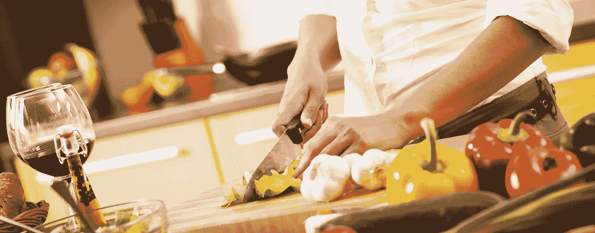

# 烹饪教会了我什么是生活、创造力和掌控力

> 原文：<https://medium.com/hackernoon/what-cooking-taught-me-about-life-creativity-and-mastery-4c9a04f8a616>

[Image: [www.thecookingshopandmore.com](https://www.thecookingshopandmore.com/)]

## 制作食物的过程教会了这位专家保持头脑清醒，拥抱创造力，追求卓越。食物是我们生存的最基本需求，几乎我们生活中的每一件大事都围绕着它。

和许多人一样，当我 17 岁开始上大学时，我开始接触烹饪——为了生存。从那以后，我旅行了许多英里，体验了许多美食，做了许多饭菜。

一路上，我学到了一些关于食物的东西，烹饪的过程，以及它对我们的思想、身体和灵魂的影响，无论是在好时光还是坏时光。食物是我们生存的最基本需求，几乎我们生活中的每一件大事都围绕着它。

它在社会交往和社会关系的发展中起着至关重要的作用。我发现食物是神圣的，制作食物的过程是觉醒和有洞察力的。虽然我没有受过专业训练，但烹饪已经成为一种快乐的激情。

制作食物的过程教会了我保持头脑清醒，拥抱创造力，追求卓越。以下是一些教训，可能会让你下次走进厨房时有不同的想法。

## 仪式化的烹饪可以增强正念

和全球数十亿其他人一样，我也饱受日常生活的折磨。我对有意识生活的喜爱不是基于任何种类的科学研究，而是来自不断的自我分析。我发现烹饪是通往正念之旅的一种方式。据说禅宗和尚唯一比坐禅更重要的两项工作是做饭和打扫卫生。烹饪是练习正念的好方法。

正念是一种积极、开放地关注当下的状态。它仅仅意味着活在当下，觉醒去体验。留心需要练习。我发现，当我定期进行仪式性的烹饪时，它增强了我对我所做的其他事情的注意力。

13 世纪，日本禅师多根为天藏写下了“[指示”，即厨师长。在检查修道院准备一顿饭的方式和方法时，他揭示了如何“烹饪”——或提炼——你的整个生活。在其中一条指导中，他说“当你煮饭时，要知道水是你自己的生命。”我们如何培养一颗像关心我们自己的生命一样关心一件普通事物如水的心？听起来很简单——但实际上很难——去试试吧。它来自于把我们的全部心思放在那些简单的任务上，集中注意力，有目的地、完全地去做它们。当我们正念时，它让我们更好地与:](http://www.amazon.com/How-Cook-Your-Life-Enlightenment-ebook/dp/B00DRFL1UI/ref=sr_1_1?ie=UTF8&qid=1396185507&sr=8-1&keywords=Instructions+for+the+Tenzo)

*   过去——我们已经完成的事情
*   当前——手头的任务
*   未来——我们手头的任务如何推动我们前进

我相信，如果我们有意识地思考我们选择的食材，它们的准备，我们烹饪的方式和我们吃的方式，它可以有助于正念的发展。

## 有意识的开放是任何创造过程的核心

我从来不按照食谱做饭。我喜欢尝试，混合和搭配，并“设计”我的饭菜。我根据可用性、我的饮食伙伴和一天中的时间来做决定。

多年来，这种对资源、观众和需求的意识(在烹饪过程中)帮助我磨练了我的思维方式。17 岁开始做饭，就像生活一样，对厨房没有把握。现在我试着自信地“创造”我的食物。对我来说，把日本味淋和印度姜黄以及墨西哥辣椒混合在一起是完全自然的。

2006 年，El Bulli 的厨师 Ferran Adria，The Fat Duck 的厨师赫斯顿·布鲁门塔尔，French 洗衣店的厨师托马斯·凯勒和作家 Harold McGee 提出了他们所谓的“伟大烹饪的国际议程”，虽然它的重点是食物，但它也可以作为任何从事创意工作的人的宣言:

> “我们相信，无论是现在还是将来，追求卓越的承诺都要求我们对所有能帮助我们通过食物给人们带来快乐和意义的资源持开放态度。在过去，厨师和他们的菜肴受到许多因素的制约:食材和转化方式的有限可用性，对烹饪过程的有限理解，以及当地传统中体现的必然狭隘的定义和期望。今天，我们的工艺发展受到的限制少得多，潜力巨大。我们可以从整个地球的原料、烹饪方法和传统中进行选择，并借鉴所有人类知识，探索如何利用食物和饮食体验。”

就像创作音乐或诗歌一样，烹饪需要理解相互联系与和谐。任何人都可以将任意两组配料混合搭配在一起，但不是每个人都会做饭。理解食材之间的关系以及它们之间的相互作用对于做出一道成功的菜肴至关重要。无论我们做什么和使用什么媒介，这种有意识的开放正是任何创造过程的核心。

## 精通来自热情和专注的练习

大多数早晨，我都会在 6 点到 6 点 15 分之间为儿子准备一份营养均衡的早餐和一份午餐。

我大约有 15 分钟来煮鸡蛋、烤面包、切水果、做三明治等等。时间不多了，对吧？其实已经很多了。它来自技能、实践、信心和组织。它从将过程分解成小目标开始:

*   我首先根据有什么菜，决定我想做什么
*   我做了做饭所需的所有准备工作
*   我根据烹饪时间和我的上菜方式开始烹饪

除了清晰的思维，高效还需要技能。精通来自热情的、反复的、专注的练习。在下面来自电影*朱莉&朱丽娅*的视频剪辑中，茱莉亚·切尔德展示了 100 磅洋葱和刻意练习可以达到的效果。她从一个洋葱开始，继续通过刻意的练习，一次掌握一种技能，直到她成为法国烹饪界公认的最好的老师。

我开始相信，不管我们是否喜欢烹饪，这些原则同样适用于我们做的任何事情。它是关于我们体验到的意识，我们投入的精力，以及我们如何创造的结果。

快乐烹饪——无论你在做什么！

发布[*@ business insider*](http://www.businessinsider.com/cooking-can-boost-your-creativity-2014-3?tru=CktBv#ixzz2xZzz0PJB)*，*[*@ huffington post*](http://www.huffingtonpost.com/faisal-hoque/how-cooking-boost-creativ_b_6443504.html)， [*@FastCompany*](http://www.fastcompany.com/3044691/work-smart/an-unconventional-and-delicious-way-to-be-more-creative) 。

还发表在 [*共同地杂志*](http://onlinedigitaleditions2.com/commonground/?pn=46) 上。

***版权所有 2017，作者费萨尔·霍克。保留所有权利。***

我是一名[企业家和作者](http://faisalhoque.com/speaking/)。SHADOKA 等公司创始人。Shadoka 让抱负成为领导、创新和变革的动力。Shadoka 的加速器和解决方案汇集了管理框架、数字平台和思想领导力，以实现创新、转型、创业、增长和社会影响。

《“ [*《万物互联——如何在创意、创新和可持续发展的时代进行变革和领导》*](http://www.amazon.com/Everything-Connects-Creativity-Innovation-Sustainability/dp/0071830758/ref=sr_1_1?ie=UTF8&qid=1376488798&sr=8-1&keywords=everything+connects%2Bfaisal+hoque) 》(麦格劳·希尔)和《 [*《生存并茁壮成长:弹性企业家、创新者和领导者的 27 种实践*](http://survivetothrive.pub/) 》(励志出版社)的作者。在推特上关注我。*免费使用* [*万物互联*](http://app.everythingconnectsthebook.com/login.php) *领导力 app 和* [*生存茁壮*](http://app.survivetothrive.pub/login.php) *弹性 app。*

