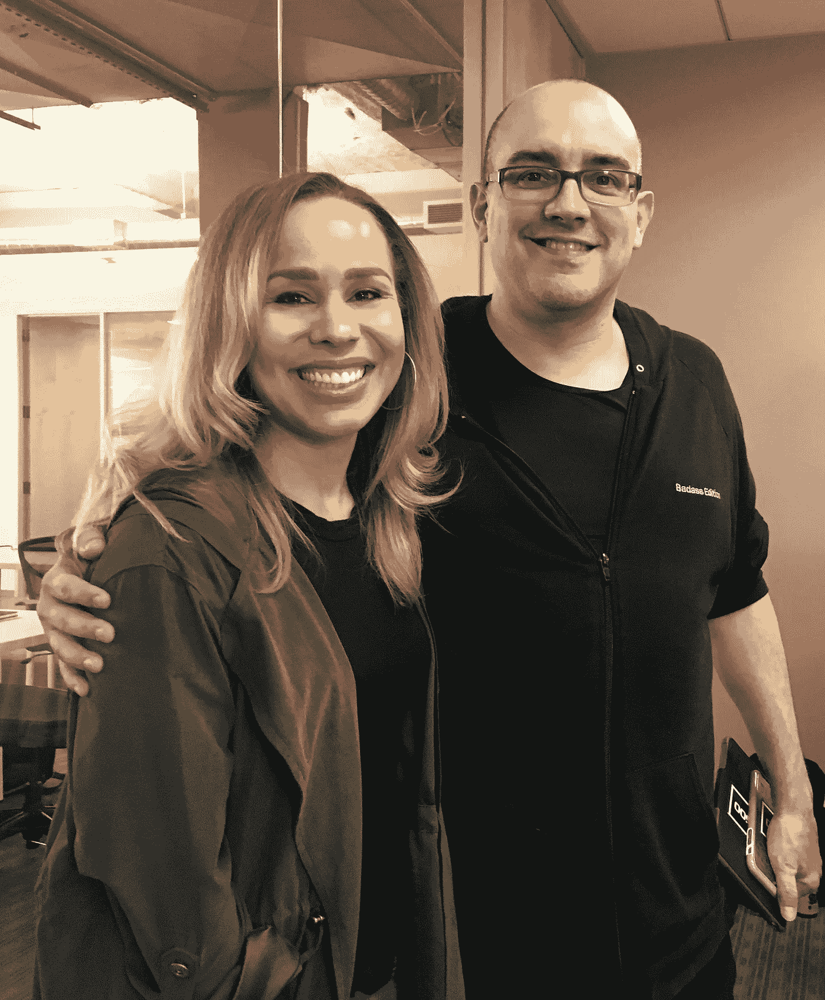

# 戴夫·麦克卢尔在硅谷工作了 25 年后学到了什么

> 原文：<https://medium.com/hackernoon/what-dave-mcclure-has-learned-after-25-years-in-silicon-valley-ec17e8f79910>

[戴夫·麦克卢尔](https://twitter.com/davemcclure)是 [500 Startups](https://twitter.com/500Startups) 的创始合伙人，这是一家位于硅谷的风险投资公司和创业孵化器，由 PayPal 和[谷歌](https://hackernoon.com/tagged/google)校友创办，管理[超过 2 . 5 亿美元](https://hackernoon.com/tagged/management)。戴夫已经在硅谷做了 25 年的极客，而且(尽管我不确定他会不会承认)他绝对是这个行业，尤其是风险投资行业的极客之一。

当然，当我有机会和 Dave 坐下来的时候，我问了他每个人都想知道的问题，比如 ***一个创始人怎样才能引起他的注意？他是如何将 500 家创业公司成长为全球现象的？*** *…* 但我也询问了 Dave 的个人爱好和兴趣，真正的目的是了解*他当初为什么*创建 500 家创业公司，以及他对未来的期望是什么。

继续滚动观看下面的采访，如果你有任何关键见解或想建议我在后续采访中应该问 Dave 的问题，请在下面的评论部分提出。还有记住，还有其他几集很棒的*[**你总能在这里找到**](https://www.facebook.com/pg/MandelaSH/videos/) 。*

# *听听戴夫·麦克卢尔对创业、成功以及科技在解决社会问题中的作用的看法*

# *感谢阅读！如果你喜欢这篇文章…*

## *在 [Instagram 上打招呼](http://instagram.com/mandelash) | [脸书](http://facebook.com/mandelash) | [推特](http://twitter.com/mandelash) | [YouTube](https://www.youtube.com/channel/UC1XemKTBoMTxK3rgUSDFIVg)*

## *点击这里订阅我的简讯*

******

> *[黑客中午](http://bit.ly/Hackernoon)是黑客如何开始他们的下午。我们是 [@AMI](http://bit.ly/atAMIatAMI) 家庭的一员。我们现在[接受投稿](http://bit.ly/hackernoonsubmission)，并乐意[讨论广告&赞助](mailto:partners@amipublications.com)机会。*
> 
> *如果你喜欢这个故事，我们推荐你阅读我们的[最新科技故事](http://bit.ly/hackernoonlatestt)和[趋势科技故事](https://hackernoon.com/trending)。直到下一次，不要把世界的现实想当然！*

**