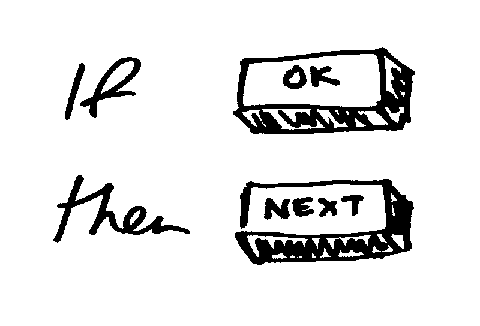
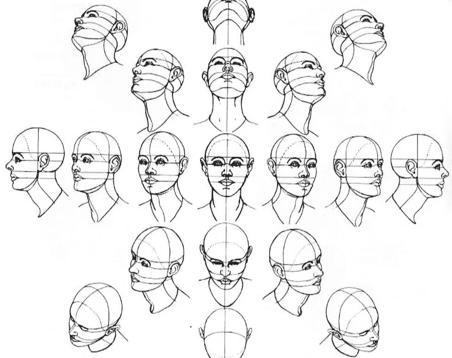
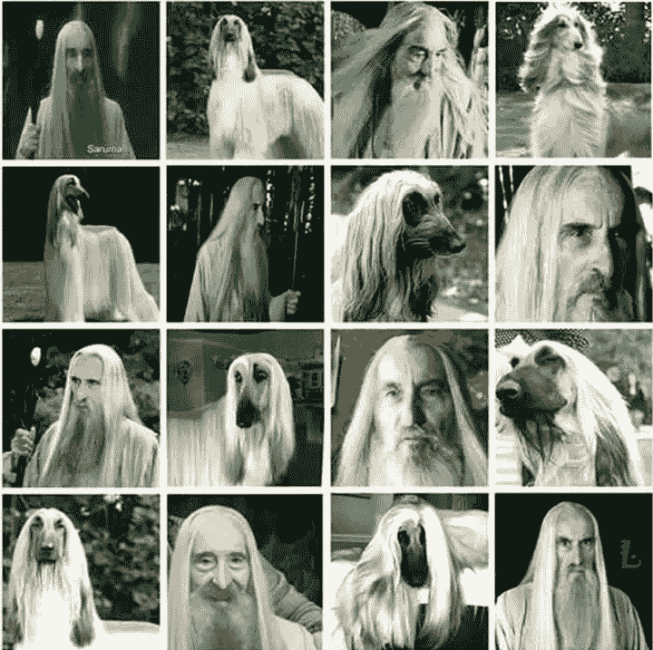
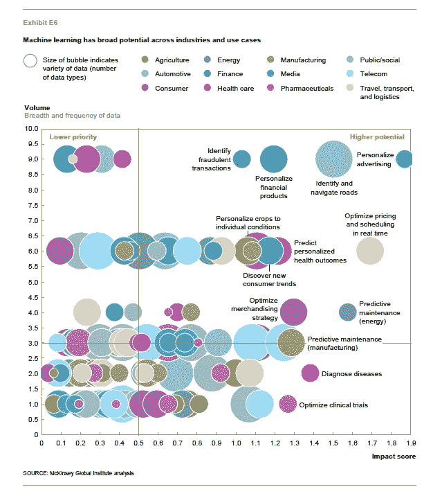
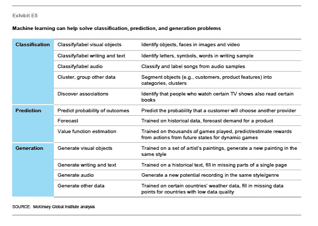

# 关于机器学习，设计师需要知道什么

> 原文：<https://medium.com/hackernoon/what-designers-need-to-know-about-machine-learning-109a12fdd3af>

机器学习不是科幻小说，也不是另一个行业术语。它已经被广泛用作网飞推荐工具、电子邮件和通讯应用中的垃圾邮件过滤器、脸书等网站的图像识别等功能的一部分，允许产品和服务随着时间的推移“学习”并做出相应的调整。产品和服务设计方式的这种变化现在开始改变我们从一开始就概念化和设计数字产品和服务的方式。因此，对于我们设计师来说，是时候开始思考这项技术如何影响我们工作的设计和用户体验，以及我们如何利用这项[技术](https://hackernoon.com/tagged/technology)为我们的用户创造新的更好的产品。

**机器学习与我们目前每天工作的技术有什么不同？**

我们在大多数计算机系统中习惯使用的是布尔逻辑。也就是说，我们软件中内置的每个表达式最终都可以被描述为“真”或“假”。这允许一个程序被构建为一系列具体的步骤，就像一本“选择你自己的冒险”的书，这样我们就可以构建和测试它，并且我们总是知道接下来会发生什么，根据我们已经构建到它里面的规则。

机器学习则不同。机器学习系统不是使用一组“真”和“假”的规则来定义程序的行为，而是在一组现有数据中寻找模式，以便产生最初创建数据的规则的近似表示。这意味着，虽然传统的布尔逻辑程序对于具体的数学方程总是正确的，但机器学习系统对于更复杂的事情往往是正确的。

这为什么有用？嗯，我们不能一开始就用布尔逻辑来编程。例如，识别人脸对于布尔逻辑来说是一个太复杂的问题。这种方法的有趣之处还在于，它实际上有点像我们自己学习周围世界的心理过程。我们通过从童年到一生中不断重复经历的事物中寻找模式来学习理解世界。

考虑识别一张脸的过程。你已经这样做过几百万次了——事实上，几乎每天都是如此。但是很难表达你会采取的步骤。人脸有很大的变化，一张脸可以在无限的光线条件下，在任何角度，任何地方被看到。一张脸的比例根据我们相对于它的位置而变化。程序使用的规则集变得太复杂，无法用真/假逻辑来描述。

**机器学习如何“思考”——演绎与归纳推理**

在**演绎**推理中，我们从一个关于某事为什么会发生的理论开始，发展假设，收集观察结果或数据，并用这些来测试我们的假设，然后证明或否定我们最初的理论。在**归纳**推理中，我们从一组观察/数据开始，然后在这些数据中寻找模式。然后，我们用它来制定试验性的假设，然后试图产生一个包含我们原始观察/数据的一般理论。机器学习系统可以被认为是自动化或辅助**归纳**推理过程的方法。

归纳推理问题的难度取决于相关和不相关属性的数量，以及这些属性的微妙程度或相互依赖性。像识别人脸这样的问题涉及大量相互关联的属性和大量噪声。机器学习系统能够自动化从大量信息中综合一般知识的过程。

**使用复杂信息和新的输入类型**

那么我们如何使用这些新工具呢？嗯，设计师应该考虑到，通过机器学习，我们的系统能够理解来自大量来源的复杂信息。例如，我们现在可以识别口语、面部表情和照片中的物体，这意味着我们可以开始考虑点击和滑动之外的其他方式，让用户与我们的产品进行交互。例如，你可以上传一张你正在购买的商品的照片，然后让系统找到最匹配的，或者告诉你某个商品的名称。听觉输入同样允许你通过对系统说话来与它互动。来自身体的输入，如面部表情，或通过 Apple Watch 或 Fitbit 等设备收集的输入，现在可以用作一种交互方法或评估用户在给定时间的状态的方式。

除了这些新类型的输入，机器学习允许我们以前所未有的规模发现用户行为模式，并使用这些数据预测用户未来的行为。我们可以使用这些信息来设计更好的产品和服务，更深入地了解我们的界面目前是如何使用的，我们的客户是谁，并根据我们预测用户行为的能力来设计新类型的功能。

在推荐系统可以基于用户喜好的相似性来推荐音乐或电影的方式中，跨大用户群检测模式的能力可以用于基于用户已经展示的现有行为向用户建议相关特征。随着学习系统在我们每天使用的产品中越来越普遍，用户行为也将开始适应这些系统，同时系统也适应用户行为。

reCAPTCHA is used to improve the performance of Google’s image recognition system by asking users to identify objects in photographs, helping to improve performance of the image recognition system

**学习类型**

监督学习:当我们可以为我们的机器学习系统提供示例输入和输出时，我们使用这些来“训练”系统，明确告诉它可以找到什么相关性，并要求它证实这些相关性。例如，我们可以使用监督学习来预测房价，例如，通过向系统提供某个城市所有房价的历史数据。然后，一旦系统根据数据了解了房子的价格和房子的其他属性之间的关系，如果我们要求系统查看未售出的房子的一些特征，如卧室数量、位置、大小，系统就可以预测未来的房价。

无监督学习:我们要求机器在一组数据中发现模式，而不告诉它寻找特定的相关性。这可以用来发现数据集或系统中的模式，这些模式太复杂了，人类自己无法弄清楚。无监督学习可以学习作曲家作品中的风格模式，然后以该风格生成新的作品。它还可以用来提高监督学习的质量。

半监督的:这里我们可以使用无监督学习的“发现”能力来改进监督学习问题的预测。

**我们能在哪里使用它？**

机器学习已经在许多行业得到应用，但在许多情况下，我们才刚刚开始应用这些技术。

McKinsey Global Institute, December 2016 — ‘The Age of Analytics: Competing in a Data-Driven World’

> 许多组织关注对数据科学家的需求，认为他们的存在本身就能推动分析转型。但另一个同样重要的角色是商务翻译，他是分析才能和商务问题实际应用之间的纽带。除了精通数据，商务翻译还需要具备深厚的组织知识和行业或职能专业知识。这使他们能够向数据科学团队提出正确的问题，并从他们的发现中获得正确的见解。

对于设计师来说，有机会成为一名“业务翻译者”——为业务和最终用户弥合技术能力和技术实际应用之间的差距。

我们可以考虑使用机器学习来解决一些问题:

McKinsey Global Institute, December 2016 — ‘The Age of Analytics: Competing in a Data-Driven World’

**如何将机器学习作为设计流程的一部分**

我们已经触及了机器学习系统的一些功能，但还有许多其他功能，太多了，无法在此赘述。但是，不管你希望采用什么类型的系统或功能，都要尽可能详细地探索机器学习问题，以便定义你试图用机器学习解决的问题的参数。考虑您能够向系统提供的输入，以及您希望接收的输出(例如，输入可以是一幅图像，输出可以是一个产品的链接，或者图像的描述)。在这一点上，如果你理解了你想要使用的机器学习技术的基本原理，你可以将学习系统视为你的设计的一个组成部分，当你作为一个整体勾画出设计时，技术细节将在以后完全建立。

尽可能与机器学习程序员或数据科学家合作是很重要的，因为他们对什么是可能的以及如何或是否可以实现您的愿景的理解将在整个设计过程中非常宝贵。一起工作来原型化想法和验证假设。设计师在开发现有算法和工具的新用途方面发挥着作用，并直觉地知道在哪里可以使用一种技术来创造更好的用户体验，或创造一种全新的产品。提出问题，并找出你的假设何时是不正确的——这将帮助你达到一个理解水平，在这个水平上，你可以开始将机器学习的想法融入到你的日常过程中

**下一步是什么？**

机器学习正在改变设计可能性的面貌。我们可以使用机器学习系统来理解人类行为，并根据这些数据做出预测。我们还可以使用机器学习带来的工具，如图像、人脸和语音识别、推荐系统等等。这些工具的影响仍有待确定——但设计师在日常工作中理解和利用技术越多，最终产品就越好。在发现我们现在和未来如何利用机器学习的过程中，实验将是非常宝贵的一部分，理解机器学习将使设计师能够在技术、业务需求和最终用户之间建立桥梁。

关于这一点，还有很多东西需要设计师去学习——这只是皮毛而已！[这本书](https://www.oreilly.com/learning/machine-learning-for-designers)是了解更多关于机器学习的宝贵资源(也是撰写本文的宝贵资源)，你可以在 Coursera [这里](https://www.coursera.org/courses/?query=machine%20learning)了解更多关于如何使用机器学习算法的信息，并在这里阅读完整的麦肯锡报告[。](http://www.mckinsey.com/business-functions/mckinsey-analytics/our-insights/the-age-of-analytics-competing-in-a-data-driven-world)

> [黑客中午](http://bit.ly/Hackernoon)是黑客如何开始他们的下午。我们是 [@AMI](http://bit.ly/atAMIatAMI) 家庭的一员。我们现在[接受投稿](http://bit.ly/hackernoonsubmission)并乐意[讨论广告&赞助](mailto:partners@amipublications.com)机会。
> 
> 如果你喜欢这个故事，我们推荐你阅读我们的[最新科技故事](http://bit.ly/hackernoonlatestt)和[趋势科技故事](https://hackernoon.com/trending)。直到下一次，不要把世界的现实想当然！

