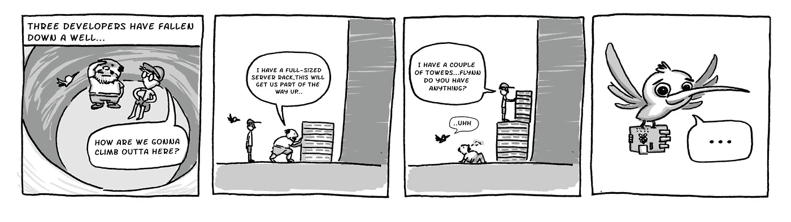
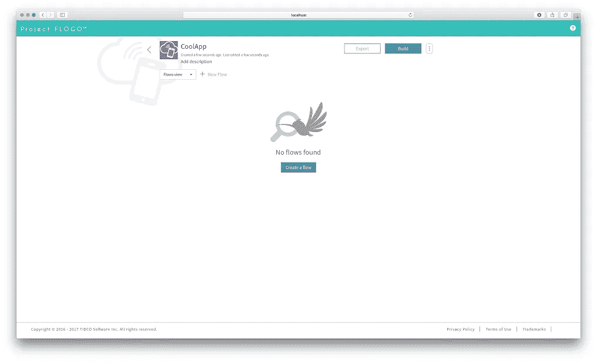
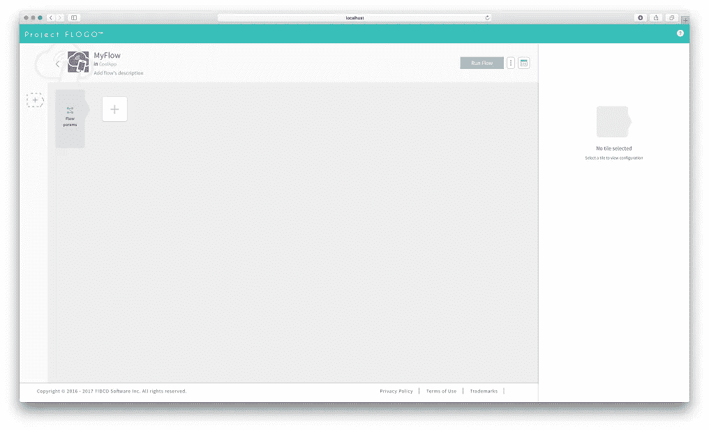
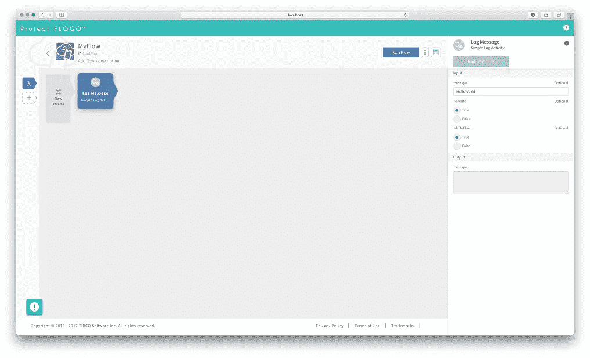
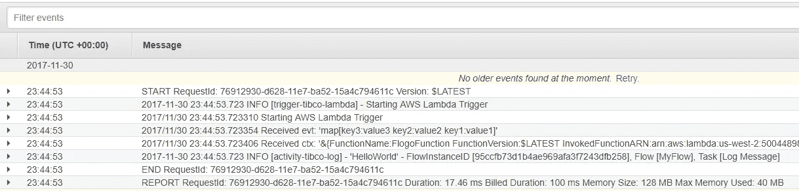

# 我该做些什么:发明实时流？构建 Lambda 函数

> 原文：<https://medium.com/hackernoon/what-do-i-do-in-between-re-invent-live-streams-build-lambda-functions-5447c641d397>



今年我没能参加 re:Invent，但我确实想在直播间隙做点好事，特别是围绕[无服务器](https://hackernoon.com/tagged/serverless)计算和 [AWS](https://hackernoon.com/tagged/aws) Lambda。

> Lambda 让您无需提供或管理服务器就能运行代码。您只需为您消耗的计算时间付费，当您的代码不运行时，则不收费。有了 Lambda，你可以为几乎任何类型的应用程序或后端服务运行代码——所有这些都无需管理。只需上传你的代码，Lambda 就会为你的代码提供高可用性的运行和扩展。

上面来自 [AWS](https://aws.amazon.com/lambda/) 的片段很好地解释了 Lambda 的目标是什么！

为了开发你的无服务器功能，你可以使用许多不同的应用程序框架，但是你知道 Flogo 是其中之一吗？使用 Project Flogo，您可以通过 Flogo 对 AWS Lambda 的一流支持来拥抱无服务器计算。无限缩放 Flogo 的超轻功能，不使用时将其缩放回零。

在我的上一篇文章[中，我写了如何将这些超轻的 Flogo 应用部署到 Kubernetes，以便在一个最强大的容器管理平台上管理您的微服务。在本文中，我想更进一步，将它们部署在一个功能即服务平台 AWS Lambda 上。](https://hackernoon.com/deploying-flogo-apps-to-kubernetes-43a74742e323)

# 先决条件

开始之前，我们需要考虑几个先决条件:

*   你需要安装 Docker
*   如果你想图形化地创建你的微服务，你需要安装最新版本的 Project Flogo Web UI(谁不想呢？):`docker run -it -p 3303:3303 flogo/flogo-docker eula-accept`
*   您需要安装 [Flogo CLI](https://github.com/TIBCOSoftware/flogo-cli#installation)
*   你显然需要一个 AWS 账户:)

# 该应用程序

在 Project Flogo 最新版本的 Web UI 中，有许多新东西(Lambda 触发器就是其中之一)。但没有改变的是，我们将从创建新的微服务开始，并在其中创建新的流程。



在您点击流之后，您将会看到一个全新的外观和感觉来为您的流建模。流和触发器已经分离，因此流现在与函数的概念非常一致。作为开发人员，您可以专注于业务逻辑，而不用担心基础设施:)



你可以点击左边的'+'号来添加一个新的触发器' *Start Flow 作为 Lambda* 中的一个函数。这允许您的流作为 Lambda 中的函数运行。我们现在不需要任何流参数，但是我们确实想在日志中看到一些东西，所以让我们添加一个'*日志消息*活动



# 为 Lambda 建造

要为 Lambda 构建一个应用程序，您需要首先使用“导出应用程序”功能从 Web UI 导出流。从终端窗口执行

```
flogo create -f <appname>.json lambda
cd lambda
```

上面的命令将创建一个名为' *lambda* '的新文件夹，并获取运行您的流所需的所有依赖项。对于 Lambda，我们希望构建一个应用程序，将配置嵌入到可执行文件中，并使用一个填充程序来指示构建过程使用 Lambda 触发器覆盖应用程序的入口点。`-shim`的参数表示用作流程(函数)入口点的触发器 ID。AWS Lambda 触发器利用 makefile 启动构建过程，构建过程发生在 docker 容器中(因此 docker 是先决条件),因为在编写时，Go plugins(。所以文件)只能在 Linux 上构建。所以要构建 execute:

```
flogo build -e -shim start_flow_as_a_function_in_lambda
```

该命令将在本地提取 docker 映像“eawsy/AWS-Lambda-go-shim:latest ”,并构建部署到 AWS Lambda 所需的 zip 文件。该命令成功完成后，zip 文件(handler.zip)将位于您的应用程序目录中(例如`/ path/to/app/lambda/src/lambda/handler . zip `)。

# 上传到 AWS Lambda

在 Lambda 控制台中，您可以创建一个新函数，重要的是运行时设置为' *Python 2.7* '(生成的 shim 包含一个 Python 可执行函数，该函数反过来触发流)。

*正如你可能已经在直播中看到的，AWS 刚刚宣布支持 Go，所以请继续关注原生触发器！*

点击创建按钮后，你会看到一个全新的 Lambda 函数。从“*代码输入类型*”下拉菜单中，您需要选择“*上传一个. zip 文件*”，选择刚刚生成的 ZIP，并将处理程序设置为“处理程序”。“处理”(没有它，你将无法触发你的心流)。您可以保留其他默认设置，并点击橙色的“*保存*按钮。要查看您的工作流，发送一个测试事件并检查 CloudWatch 日志



# 结论

这是一个运行在 AWS Lambda 上的非常简单的 Flogo 应用程序，但是您可以使用 Project Flogo 作为运行在 Lambda 上的微服务框架来做非常酷的事情！如果你想自己开始，只要按照上面的步骤，让我们知道你最终建立了什么。