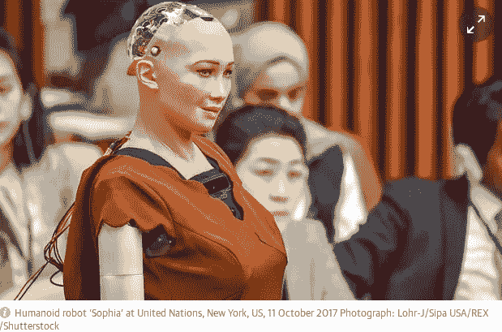
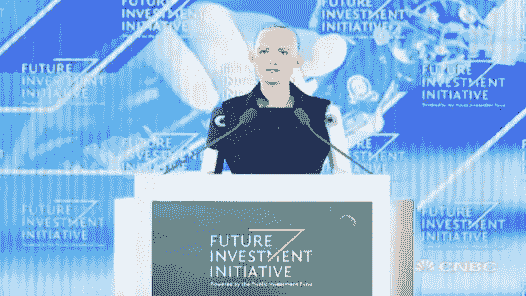
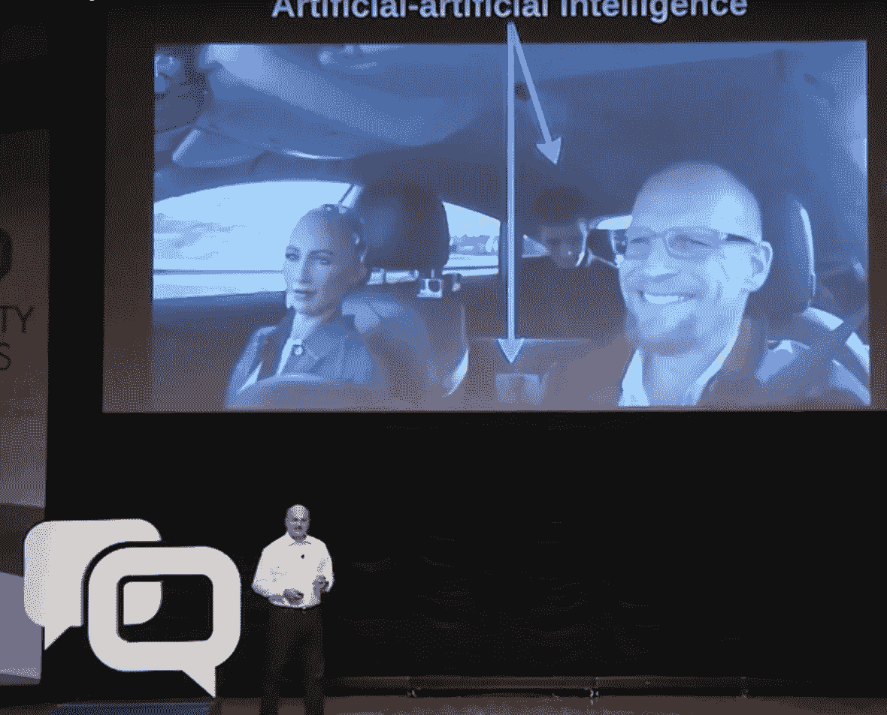

# 机器人索菲亚和小猪小姐有什么共同点？

> 原文：<https://medium.com/hackernoon/what-do-sophia-the-robot-and-miss-piggy-have-in-common-dd8651685b96>

他们都是*木偶*。也许我们被娱乐了，但是有一个问题。

credit: [http://www.instyle.com](http://www.instyle.com)

汉森[机器人](https://hackernoon.com/tagged/robotics)制造的一个名为“[索菲亚](https://hackernoon.com/tagged/sophia)的机器人，最近受到了很多媒体的关注。

索菲娅告诉美国广播公司电台，机器人应该比人类拥有更多的权利。如果你的妈妈宣布了这一声明，它将会引起人们的关注，但如果是由一些右翼智库人士在一个专题讨论节目中为工作自动化辩护，这一声明就令人失望地平淡无奇了。——卫报

沙特阿拉伯的女性蔑视政府授予一个女性机器人公民身份的决定，这个机器人不像她们，不需要男性监护人，也不需要在公共场合遮住头部 —美国消费者新闻与商业频道

*“吉米·法伦展示了来自世界各地的令人惊叹的新机器人，其中包括一个名叫索菲亚的玩石头剪子布的怪异人类机器人”* — NBC

如果你仔细观看这些视频剪辑，你会发现对话是有脚本的。甚至和吉米玩的游戏都是设计好的，他故意输，这样她就可以放弃关于“击败人类”的俏皮话。多棒啊。

## 操纵木偶的人

也许最有趣(也最具启发性)的是最近奥迪用这个机器人做的广告。此处见[。](https://www.youtube.com/watch?v=vngB4PczhpA)

因为当你不得不在车里操纵木偶时，你需要车里的木偶操纵者和你在一起。

在一些视频画面中，如果你仔细看，你可以看到一个穿着深色衣服的男人在汽车后座上操作笔记本电脑。他提供她回应的话语。是的，他正在输入句子，这些句子通过扬声器在她脑中播放，并用来使她的脸生动起来。

不再“躲在幕后”，在众目睽睽之下。

[http://blog.ncqa.org/george-kassabgi/](http://blog.ncqa.org/george-kassabgi/)

这可能就是你所说的**“人工人工智能”**。

我们有麻烦了。

## 幻觉效果

与其他技术追求不同，智能机器(无论形式如何)*带有* [*拟人化*](/p/anthropomorphism-and-ai-151ed0b17dad) 的虚幻效果，提出这一点的人**有责任弄清楚那里有什么和没有什么**。

最起码的诚信是必要的，否则我们就是在表演魔术，而不是在认真讨论技术。

导致第一架飞行器诞生的突破并没有因此受到影响。在 1903 年小鹰号出现之前，没有“假的”虚幻机器在空中飞行

在 1957 年人造卫星发射之前，没有一个国家声称向太空发射过卫星。没有“假装”通过火箭逃离地球的引力场，直到它完成。

国际人类基因组测序联盟宣布人类基因组计划于 2003 年成功完成，在此之前没有人声称已经完成了我们的基因组测序。

我们还可以举很多其他的例子。你明白了。

> 没有幻想，没有虚假，只有一个技术突破，在此之前有试验和错误。

在机器(软件)中实现 NLU(自然语言理解)，即使是最简单的形式(聊天机器人)，也是一项重大的技术突破。即使是小孩子级别的对话也是一大进步。目前我们离这还很远。我们需要诚实地面对仍在进行中的工作，而不是举出假装已经实现对话智能的例子。这是理智上诚实的做法，随着机器推理故事的展开，这种做法将经得起时间的检验。

我们有数不清的聊天机器人、会说话的扬声器和其他小发明，它们使用数学来猜测句子的意图，然后执行命令。那里没有理解，就像一只鹦鹉理解语言或者 20 世纪的德国马"[聪明的汉斯](https://en.wikipedia.org/wiki/Clever_Hans)理解数学一样。又一个错觉。

[https://en.wikipedia.org/wiki/Clever_Hans](https://en.wikipedia.org/wiki/Clever_Hans)

## 人形机器人？

“索菲亚”的制造商汉森机器人公司声称[他们的技术](http://www.hansonrobotics.com/about/innovations-technology/)是开源的，最著名的是[http://www.cogchar.org/](http://www.cogchar.org/)

在‘COGchar’中没有任何地方提到自然语言处理，更不用说理解了。如果在这些库中有任何与语言相关的能力，我们会看到的。此外，如果他们的软件“stack”有任何接近她在“采访”中显示的语言技能，它将吸引开发者的注意，并将代表“深度学习”和所谓“人工智能”的游戏规则改变者。这当然是一种保守的说法。

> 人形形态没必要追求人工自然语言理解，除非你想最大化拟人效果。

对于在软件中研究自然语言理解的研究人员和企业家来说，前面还有很长的路要走。在处理句子理解、管理从对话中检索的信息、生成响应语言、解析推理等方面存在巨大的挑战。

这些有价值的努力不需要的是一个海市蜃楼，假装已经达到这些技能，并产生大量的假新闻。对于人工智能领域已经非常具有挑战性的资本市场来说，投资指向“[狭窄的人工智能](/towards-data-science/an-interview-with-peter-voss-5ada85651ec1)”和另一个“人工智能冬天”的可能性是真实的，尽管在特定领域取得了重大成就。

所以这家公司，它在制作逼真的人形面孔方面做得很好，并根据语音模式制作动画，假装拥有一个智能人形机器人。直到最近，它才明确表示，它的“人工智能”仅限于面部运动，而面部运动本身就是一项令人印象深刻的工作。但现在它似乎成了自己幻觉的受害者，就像莎士比亚戏剧中的一个角色。

一场正在上演的悲剧。

credit: [http://people.com](http://people.com)