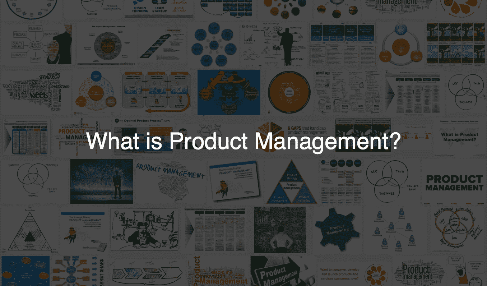
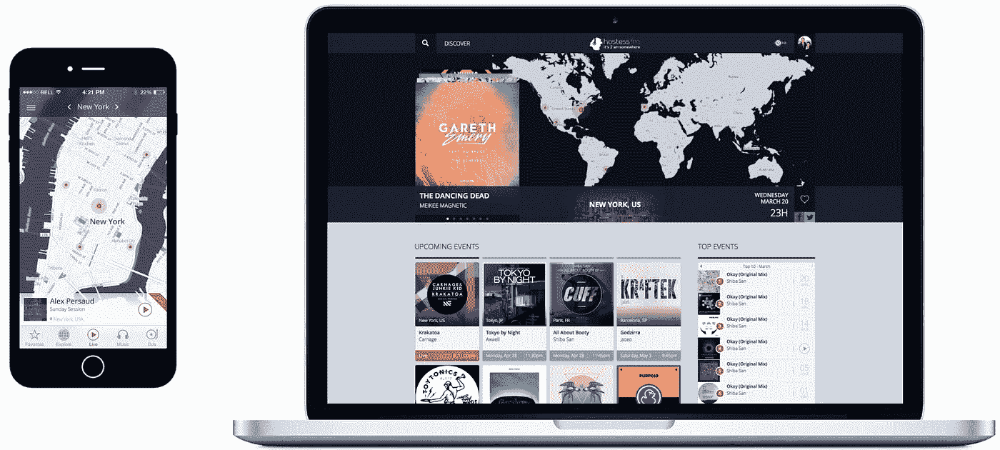

# “你到底是做什么的？”

> 原文：<https://medium.com/hackernoon/what-do-you-do-exactly-ab3e2b3a55ce>

## 我是如何发现自己是产品经理的

当[人们](https://hackernoon.com/tagged/people)问我是做什么的时候，我会对我当前的项目进行精心排练的、充满活力的电梯式推销:团队、我们的软件栈，以及我的公司正在应对的快速增长的市场。在好的一天，我会遇到一个困惑的“哦…有趣…”也许是一两个后续问题。在糟糕的一天，我得到的只有茫然的凝视。有一次一个家伙踢了我的小腿然后跑了。

今天，我告诉人们我是一个产品经理。老实说，我得到的回应并没有太大的不同。大多数人不*真的*知道什么是产品管理。事实上，大多数自称的产品经理甚至不同意他们做什么。最近，我在 [Postlight](https://www.postlight.com/) 为我的团队面试项目经理，他们对日常活动的描述从数据库管理员到数字营销人员到行政助理再到驯狮员无所不包。

A quick Google Image Search suggests it has a lot to do with Venn diagrams, flow charts, and whiteboards

在过去的三年里，我一直在两个很少被相提并论的行业的交汇处工作:软件开发和电子舞曲(年轻的读者可能知道后者是“EDM”)。2013 年，我联合创办了一家[创业公司](https://hackernoon.com/tagged/startup)，叫做 [hostess.fm](http://hostess.fm/) 。看死网址就知道我超级擅长创业。我们开发了帮助 DJ 在网上直播音乐的软件。这不是典型的社交网络、点对点贷款、拼车、千禧一代的 snapchatting，而是寻找千禧一代的应用程序。但是我们面临着许多大多数创业公司都面临的挑战。而且，像大多数早期创业者一样，我有几项重要职责:

1.  弄清楚要造什么
2.  让人们相信它能赚钱
3.  找到设计师和软件开发商来建造它
4.  确保他们建造正确
5.  说服用户(在这种情况下是 DJ)使用它
6.  重复

我大部分时间都在和团队中的设计师和开发人员一起开发我们的产品。我不完全是专家，但我想我可以在这个过程中学会一些基本的东西。我审查了代码行，阅读了新的前端框架，并进行了采访。我谈到了移动优化字体，谷歌的材料设计规范，以及我们的用户获取漏斗中的摩擦点。我给了很多反馈。当人们问我我们的平台是如何工作的，我会快速说出亚马逊网络服务产品目录中的缩写。我想我们用了一些。我制作了概述我们已经做了什么和我们要去哪里的宣传资料。我制作了带有日期和交付内容的谷歌文档。我强迫性地修改了邮件签名。我不知道哪个更令人印象深刻:极简主义，标题无关紧要，只有名字的方法，还是冗长的生活故事，并附有法律免责声明，说明我写的任何东西在任何情况下都不能向任何人重复。

我晚上和当地夜总会的三流 DJ 在一起。我费力地听着红牛伏特加，向 DJ 询问他们的设备，随着低沉的室内节拍不停地摇头。我和 DJ 们谈论他们的工作流程和他们的观众，帮助他们使用我们的软件，调试问题，并彻夜坚守以确保事情进展顺利。早上，我会向团队汇报我所学到的东西以及我们下一步应该做什么的想法。

hostess.fm iOS and Web circa 2014

到 2014 年，我们已经拼凑了一个工作网站和 iOS 应用程序，我们的团队发展到大约 10 人，并播放了几千小时的现场音乐。只有大约 1%是由人们真正听说过的 DJ 播放的，但其他 99%在我的球场甲板上制作了伟大的图表。我把我的创业公司卖给了 SFX 娱乐公司，世界上最大的电子音乐活动制作商，我加入了他们的产品和技术团队，叫做 [Beatport](https://www.beatport.com/listen) 。那是第一次有人给我正在做的事情贴上标签；他们叫我产品经理。我工作的第一周，我问老板这是什么意思。他告诉我继续做我正在做的事情。

我们进行了重建和更名，几个月后推出了 Beatport Live T1，这款产品已经在明日世界、电动动物园和感知白色等大型 EDM 节日上向全球数百万粉丝播放。突然间，我们的经营规模与在 hostess.fm 时大相径庭。然而，我的职责并没有改变。尽管软件更加复杂，用户体验更加精细，但我仍然与团队中的设计师和开发人员密切合作。我仍然和一些不出名的 DJ 聊天，但现在也和大 DJ 聊天了。我坐在节日制作的拖车里，里面装满了摄像机、电缆和时髦的荷兰人。我研究音频/视频编码应用，甚至带领一个小团队去[建造我们自己的](https://live.beatport.com/mac)。我与一个社交媒体团队合作来增加我们的受众，与商业智能团队合作来了解我们的用户，与广告销售团队合作来增加收入。我们观察、学习、迭代，从某种程度上来说，整个事情不再是拼凑起来的了。

A tweet from Afrojack during his exclusive studio session on Beatport Live

几个月前，我离开了 Beatport，帮助创办了纽约市的产品开发机构 [Postlight](https://www.postlight.com/) 。当我们成立公司时，我担任产品管理总监的角色，这意味着我领导一个项目经理团队，他们为我们的客户开发各种产品。这个新角色要求我反思一下我作为项目经理的经历，我如何定义这个职位，以及我希望项目经理为我的团队做些什么。事实证明，我在 hostess.fm 的职责为思考项目经理应该做什么提供了一个很好的框架:

> 1.弄清楚要构建什么*意味着…*

确定问题，与受影响的用户交流，试验现有产品和解决方法，集体讨论潜在的解决方案，并定义满足用户需求的最低可行产品。

> 2.让人们相信它能赚钱*的意思是……*

绘制产品草图或原型，估计开发时间和成本，确定潜在的收入流，概述可行的业务模型，征求主要利益相关者的认同，设定明确的预期，并定义 KPI 来衡量产品的成功。

> 3.找到设计师和软件开发商来建造它*的意思是…*

进行面试，评估人才，建立一个团队，并帮助激励和领导团队开发你已经同意的产品。

> 4.确保他们建造正确*表示…*

管理日常产品开发流程，促进沟通，提供反馈，熟悉现代设计和开发实践，根据需要应用项目管理方法，向利益相关者传达路线图中的变更，并对事情的成败负责。

> 5.说服用户使用它*表示……*

定义推广战略，A/B 测试产品功能，制定营销计划，管理分析仪表板以了解哪些可行，哪些不可行，并实施支持系统以在事情不如预期时帮助用户。

> 6.重复*的意思是……*

要明白，产品永远不会结束，它是一个有生命、有呼吸的东西，应该不断适应，以纳入反馈，更好地服务于用户，应对市场的变化，并在新的机会出现时抓住它们。

我花了几年时间才走到这一步，但上面的步骤清楚地表达了我通常认为的产品经理的角色。这不是一门精确的科学，通常这个列表不会直接映射到 PM 的日常活动。最重要的是，一个项目经理必须保持事情向前发展，即使这意味着偏离这些核心职责。但是这个框架帮助我处理和分解新的挑战，并构建我面前的工作。

如果以上描述了你的工作，那么恭喜你！你也可能是产品经理。我希望这篇文章能在下次有人问你是做什么的时候帮助你解释你的工作。但是不要期望比一句困惑的“哦…有意思…”

*你如何定义产品管理？在下面评论你的想法或者在 Twitter 上 ping 我*[*@ _ tydalwave _*](https://twitter.com/_tydalwave_)*。*

[https://upscri.be/hackernoon/](https://upscri.be/hackernoon/)