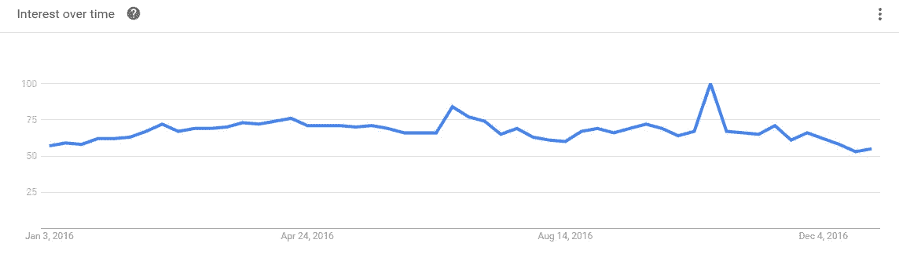

# 亚马逊交出 Echo 数据对我，对你，对一个开发者意味着什么？

> 原文：<https://medium.com/hackernoon/what-does-amazon-handing-over-echo-data-mean-to-me-to-you-to-a-developer-f6100394bce0>

Image Courtesy: [https://www.pexels.com/photo/police-line-do-not-cross-132752/](https://www.pexels.com/photo/police-line-do-not-cross-132752/)

经过抵制，[亚马逊终于交出了阿肯色杀人案](https://techcrunch.com/2017/03/07/amazon-echo-murder/)中的 Echo 录音。自从永远倾听的亚马逊 Alexa 问世以来，顾客们再高兴不过了，因为有人总是倾听他们，回答他们的问题，甚至已经成为家里孩子的朋友。

但我并不担心 Echo 去[流氓网上订购](https://www.theguardian.com/technology/shortcuts/2017/jan/09/alexa-amazon-echo-goes-rogue-accidental-shopping-dolls-house)或 Echo [向一个孩子发送色情内容](http://bgr.com/2016/12/30/amazon-alexa-video-funny-kid/)，这只是关于互联网几年前曾经有过的非常基本的讨论——**隐私**——一家公司如何处理我自己的数据？谁拥有它？谁能得到它？有人只需要一张搜查令就能听到我的私人谈话？我不知道普通网民是否还记得 [NSA](https://www.aclu.org/fact-sheet/documents-confirm-how-nsas-surveillance-procedures-threaten-americans-privacy) 或[爱德华·斯诺登](https://en.wikipedia.org/wiki/Edward_Snowden)，但我记得，

> 隐私甚至是一个商人(他不是吗？)就像[史蒂夫·乔布斯非常认真的对待](http://www.recode.net/2016/2/21/11588068/heres-what-steve-jobs-had-to-say-about-apple-and-privacy-in-2010)。

Google Trends — ‘**Privacy**’ Topic Interest going down by the end of 2016

虽然苹果总是被批评对数据非常保守，但至少他们没有拿我的私人生活(数据)开玩笑，只是因为我花了一些美元购买他们的设备或服务，因为我相信$AAPL，一家面临巨大压力为其投资者服务的上市公司，实际上把我的钱当作“信任”——我的数据是我的数据——而不是他们自己的！

但其他人，如脸书、谷歌和大男孩——T2、亚马逊，坐拥巨大的个人数据块(现在实际上是原油)——他们在做什么呢？不像[苹果公司完全加密](http://www.apple.com/in/privacy/approach-to-privacy/)我的数据(这意味着如果我不准备分享，即使是搜查令也无法检索我的个人数据)，其他人似乎不会这么做，因为他们不认为我花在他们身上的美元是一种责任或信任，而是他们向我展示增加我的 AOV 的建议或附加收入的广告的另一项额外资产，他们的整个业务都是建立在这些基础上的。但我想提出的真正问题是，你，那些最终会为他们的产品花费$$$的人，准备好问他们这个问题了吗——“我的个人数据有多安全？”

> 那一天会到来吗？那时你会担心并大喊“小心处理我的私人数据？”

最后，[一段 HN 的评论](https://news.ycombinator.com/item?id=13809923)，

> 这对不懂“不能”和“不会”区别的人应该是个教训。

苹果说“**不能**”，因为他们加密个人/私人数据的方式，而亚马逊说“**不会**”，并获得了一些良好的公关但“不会”，在一个权威的世界里“不会”是可以的——会被推翻，这在今天得到了证明！

对于构建处理私有数据的服务/产品的尊重隐私的开发者来说，

> 这一天应该敲响警钟，以确保解决方案确保“**不能**”而不是“不会”！

> [黑客中午](http://bit.ly/Hackernoon)是黑客如何开始他们的下午。我们是阿妹家庭的一员。我们现在[接受投稿](http://bit.ly/hackernoonsubmission)并乐意[讨论广告&赞助](mailto:partners@amipublications.com)的机会。
> 
> 如果你喜欢这个故事，我们推荐你阅读我们的[最新科技故事](http://bit.ly/hackernoonlatestt)和[趋势科技故事](https://hackernoon.com/trending)。直到下一次，不要把世界的现实想当然！

