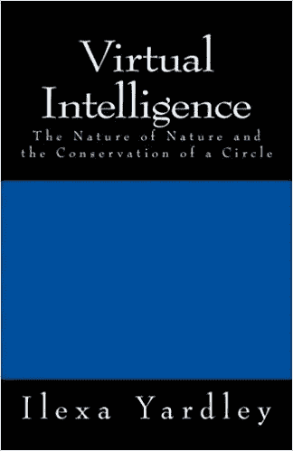

# 关于宇宙，人工智能教会了我们什么？

> 原文：<https://medium.com/hackernoon/what-does-artificial-intelligence-teach-us-about-the-universe-e513886b08a>

宇宙是一个神经网络。

Artificial intelligence of universe. (NASA)

[神经网络是节点中的节点](/the-circular-theory/search?q=node)。其中单数和复数共享一个循环关系。因此，宇宙也是一个节点网络，其中单数和复数共享一个循环关系。

这告诉我们一个[，零和一是](/the-circular-theory/search?q=zero%20and%20one)，并且，总是，X 和 Y。X 和 Y 由圆周率连接和分开。π是任意 X 和-或 Y(零和-或一)(周长和直径)之间的常数关系。虚拟角色。

这意味着一对两个“2”减少并扩展为一个“2”这是神经网络的定义，宇宙。一个图(π为一和二的关系。)[平方一。](/the-circular-theory/the-virtual-persona-and-square-one-65b7d18b47b6)

一个图标识一对二。一个图形显示了一个对位于何处，与该对不在何处的关系。再次，另一对(两个的)。否定和复制。[抽象身份对数字现实负责，也是必要的。](/the-circular-theory/abstract-identity-and-digital-reality-ac0cdb7424c3)

这意味着一个图总是缩小(和扩大)成一对 2。意思是，一对二(数字二)是稳定的(可靠的，确定的)。没有一对二，就没有线，没有线，就没有图。[多义性要求多重性(反之亦然)。](/the-circular-theory/ambiguity-and-multiplicity-in-technology-e68141bb40f7)

循环关系定义了数字二，以及任何一对二。在任何系统中，个人和群体之间都有一种强制性的循环关系。这是数学的基础。[冗余，和，多重性。](/the-circular-theory/multiplicity-and-redundancy-in-biology-db5d971e6ac1)

所以，[宇宙，一个神经网络，智能](/the-circular-theory/redundancy-and-fungibility-in-physics-96c90549c92d)，总的来说，缩小，和，扩大到，和，都依赖于，一个零，一个一(周长和直径)(相对位置)的循环关系。[相对位置依赖于一个圆。普遍的，相对的，表里不一。](/the-circular-theory/universal-and-relative-duplicity-e6a6a0621bce)

循环守恒是自然界的核心动力。

[https://www.amazon.com/Virtual-Intelligence-Nature-Conservation-Circle/dp/1974498913/](https://www.amazon.com/Virtual-Intelligence-Nature-Conservation-Circle/dp/1974498913/ref=sr_1_1?s=books&ie=UTF8&qid=1502718836&sr=1-1&keywords=virtual+intelligence+ilexa+yardley)

参见，[元宇宙与物理学的关系](/the-circular-theory/what-the-metaverse-has-to-do-with-physics-f84a7bd1c0b8) …