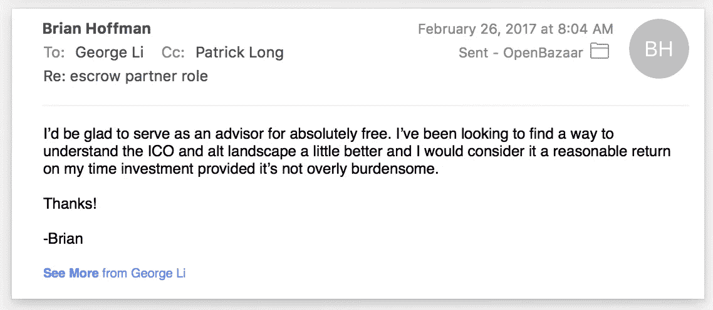

# 当顾问意味着什么？

> 原文：<https://medium.com/hackernoon/what-does-being-an-advisor-mean-a90587c133c6>

最近，在旧金山[举行的 Construct 2017 大会上，我被邀请担任一个名为 WeTrust 的新平台的](https://goo.gl/5VCLwi)[顾问，我接受了邀请。WeTrust 即将开始通过一个](https://hackernoon.com/tagged/advisor) [ICO](https://hackernoon.com/tagged/ico) an [d](https://hackernoon.com/tagged/) 筹集资金，考虑到我长期以来的立场，即 ICO 不是我个人进行的事情，我们没有计划支持 OpenBazaar 或 OB1，我认为最好解释一下这对我作为 WeTrust 项目的顾问意味着什么。

**首先，我想明确表示，我不会为我已经或将要向 WeTrust 提供的任何帮助收取任何报酬，您可以向他们的核心团队确认这一点。**

有人为我的努力提供了报酬，我决定拒绝，因为对我来说，我希望从这个过程中获得的主要价值是更无形的东西。

Email to their team declining compensation

正如你从我上面发给他们的邮件中看到的，我拒绝了，并希望了解更多关于这些类型的平台在 ICO 期间经历的事情，并尝试理解一些我通常会避免并经常被问到的没有真实世界经验的事情。

我想澄清的第二件事是，顾问类型的角色在外人看来可能是技术或团队的明确保证。我加入这个顾问团队并不是为了说服你购买我持有很多(我一个也没有)的 ICO 代币，或者增加其他人的持有量。我被要求向 Patrick 和他的团队提供任何相关的见解或帮助，如果他们希望这样要求的话。如果这让你更有信心这个项目会成功，那很好，但我不是简单地邀请你投资或加入我的参与。你还是应该给平台一个强烈的，怀疑的眼光，自己做研究。

> 正如优步的特拉维斯所说“有些人只需要为他们自己的屎负责…

我希望这澄清了关于我在 WeTrust 中的角色的任何困惑，我还想说，我计划在我有能力帮助的情况下继续接受顾问的请求。在过去的几年里，我们通过在 OpenBazaar 寻求的顾问得到了很多帮助，这对我们帮助很大，所以我觉得当别人需要帮助的时候，我有义务去帮助他们。

我也总是乐于倾听新的想法和项目(即使它们很蠢或者我太蠢而不能理解它们)，我认为这让社区变得更强大，而不是更弱。

也就是说，我认为 WeTrust 围绕与家庭和其他当地社区共享圈子建立真实世界用例的想法很有趣，也将与我们在 OpenBazaar 上遇到的一些类似的在线信任和声誉问题进行斗争。希望这能带来一些积极的成果，我们都会受益。

如果你走到这一步还认为我是个骗子，我帮不了你，孩子。我们都曾在某种程度上用加密货币欺骗过自己，所以我相信你的双手也沾满了鲜血。

这是一张有人建议的照片。

> [黑客中午](http://bit.ly/Hackernoon)是黑客如何开始他们的下午。我们是 [@AMI](http://bit.ly/atAMIatAMI) 家庭的一员。我们现在[接受投稿](http://bit.ly/hackernoonsubmission)，并乐意[讨论广告&赞助](mailto:partners@amipublications.com)机会。
> 
> 如果你喜欢这个故事，我们推荐你阅读我们的[最新科技故事](http://bit.ly/hackernoonlatestt)和[趋势科技故事](https://hackernoon.com/trending)。直到下一次，不要把世界的现实想当然！

