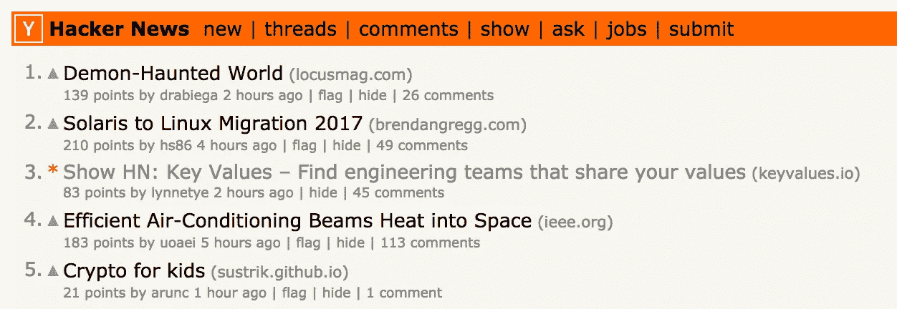
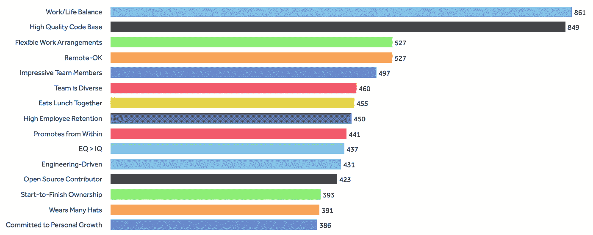
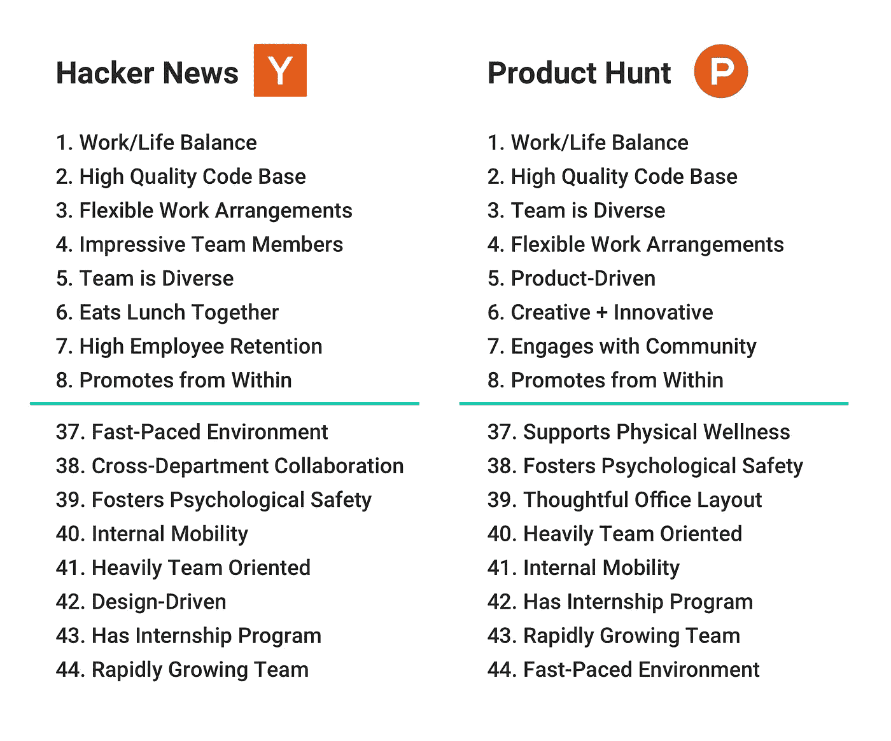
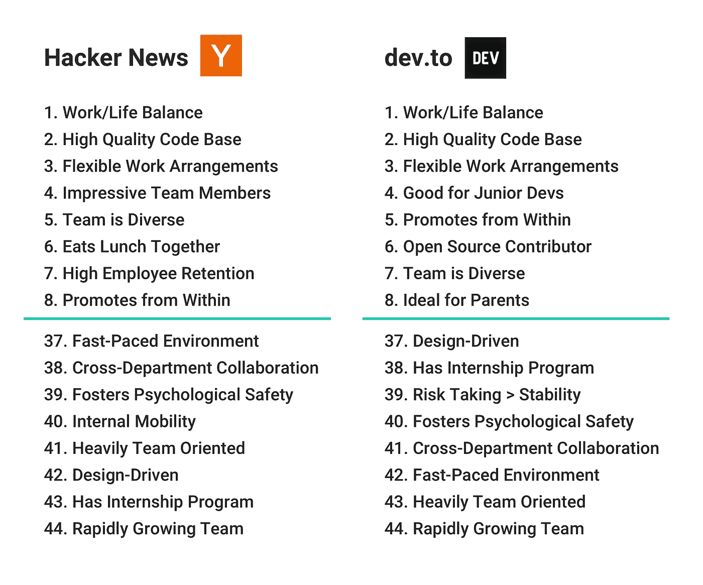
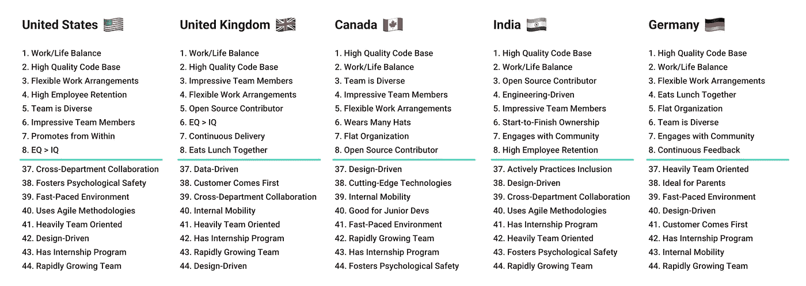

# 黑客新闻读者想要的工作

> 原文：<https://medium.com/hackernoon/what-does-hacker-news-care-about-e364fb87431c>

六周前，我在《黑客新闻》上推出了我的网站[关键价值观](https://www.keyvalues.com/)，并一瞥《黑客新闻》的读者在找工程工作时最看重什么。

我的[秀 HN 邮报](https://news.ycombinator.com/item?id=15178283)排到了第三，在头版停留了差不多 [14 个小时](http://hnrankings.info/15178283/)，发送了 5895 个黑客新闻读者到[键值](https://www.keyvalues.com/)。

[关键价值观](https://www.keyvalues.com/)帮助工程师找到基于共同价值观的工作，并让他们在申请前更多地了解团队文化。求职者可以访问该网站，并从 44 个价值标签列表中进行选择，包括“团队是多样化的”、“轻松会议”和“开源贡献者”(见完整列表[此处](https://www.keyvalues.com/))，然后筛选出具有匹配价值的团队。

在采访了几十名自称是传教士而非雇佣兵的工程师后，我策划了这份价值观清单。他们认为团队文化和共事的人与薪酬或公司声誉一样重要(如果不是更重要的话)。

然后，我要求团队从这个预设列表中选择最能描述他们的工程文化的 8 个值，并在他们的个人资料中限定他们的选择。

无论《黑客新闻》的读者是否在积极地找工作，以下是他们选择的前 15 个标签:

Values selected by Hacker News readers between September 5th and October 5th, 2017.

# **黑客新闻 vs .产品搜索**

[关键价值观](https://www.keyvalues.com/)也发布在[产品搜索](https://www.producthunt.com/posts/key-values)上，受众大不相同。人们经常比较这两个社区，我也是。

“工作/生活平衡”和“高质量代码库”分别在两个社区排名第一和第二，我们还看到了“灵活的工作安排”和“团队多样化”的共同点。

不足为奇的是，来自 Product Hunt 的人更感兴趣的是寻找“产品驱动”的团队，做“创造性+创新性”的工作，以及加入“参与(其)社区”的公司。这些价值都没有被黑客新闻的读者高度优先考虑。

相反，黑客新闻的读者搜索“令人印象深刻的团队成员”，希望找到一个“一起吃午餐”和“高员工保留率”的团队。这与《黑客新闻》的读者中软件工程师比产品搜索的读者多的观点是一致的，也说明了我们多么希望减少换工作的频率，不再独自在办公桌前吃午饭。

Comparing the most and least selected values from users referred by Hacker News vs. Product Hunt.

看看每个社区最不受欢迎的价值观，在 Hacker News 的列表底部看到“[设计](https://hackernoon.com/tagged/design)驱动”和在 Product Hunt 的底部看到“深思熟虑的办公室布局”就不足为奇了。再一次，看起来[的关键价值观](https://www.keyvalues.com/)通过黑客新闻接触到了更多的开发者，而且我不是唯一一个在嘈杂、开放的办公空间中努力提高工作效率的人。

# 黑客新闻 vs .开发到

上线几周后，我在 dev.to 上发表了一篇文章，讲述了我从潜伏者到发射者的经历。“[我如何停止拖延，学会编码，并推出我的第一个产品](https://dev.to/lynnetye/how-i-stopped-procrastinating-learned-to-code-and-launched-my-first-product-2i1)”也登上了《黑客新闻》的[头版](http://hnrankings.info/15338059/)。

尽管 Hacker News 和 dev.to 这里的读者之间有明显的重叠，但每个社区的价值选择之间仍然存在差异。值得注意的是，“适合初级开发人员”和“父母的理想选择”在 dev.to 的列表中名列前茅，甚至不在 Hacker News 的 top *15* 中(见上文)。

是的，关于学习编码和首次推出产品的文章对绿色开发者很有吸引力，但不清楚为什么这些读者会寻找适合父母的工作场所。或许在 dev.to 的读者群中，初级开发人员和家长都有更好的代表。

Comparing the most and least selected values from users referred by Hacker News vs. dev.to.

# 各国黑客新闻

为了更仔细地观察黑客新闻社区，我按照国家对价值选择进行了分类。不管读者来自哪个国家，“工作/生活平衡”和“高质量代码库”一直排在前两位。

由于[关键价值观](https://www.keyvalues.com/)，我与世界各地的工程师进行了对话，我了解到我们定义工作/生活平衡和高质量代码的方式因人而异。它们都是黑客新闻中经常讨论的话题，对开发人员来说都是非常私人的话题，值得他们自己进行充分的讨论。然而，人们同意他们应该优先于任何其他关键价值。

Most and least selected values from Hacker News readers, grouped by country. Countries are listed in order of highest total visitors reading left to right.

让我们来看看每个国家的最高值。美国的《黑客新闻》读者选择“从内部提升”的比例高于其他任何地方的读者。这是不是意味着美国人有更强的往上爬的欲望，或者它揭示了一些关于美国公司与其他国家相比如何不奖励他们的员工的事情？很难知道。

同样，对于英国的开发人员来说，“持续交付”更重要吗，或者这是英国的公司需要采用更快的部署过程的标志吗？

最不受欢迎的价值观也引发了一些有趣的讨论。我们显然不会选择对我们不重要的价值观，但有时我们不选择它们，因为它们无助于区分雇主。德国人很少选择“父母的理想”，但可能是因为德国所有的雇主都执行相同的、慷慨的探亲假政策。也许冷门的价值观让我们看到了哪些公司做得好。

# 寻找我们没有的东西

当我刚开始做[关键价值观](https://www.keyvalues.com/)的时候，我以为我只是在调查求职者的个人价值观和工作偏好。不过很快，我注意到，如果不谈论我们的过去，我们很难谈论下一步的目标。在大多数情况下，我们通过描述我们*不想要的东西来谈论我们想要的东西。*

我采访的一位全栈工程师在一家公司工作了 3 年，却没有得到提升。在这家公司，许多人表示有兴趣担任管理职位，但工程经理总是从外部招聘。她将“从内部提升”列为自己的首要价值观。

我采访的另一位工程师最近因为流程太多而离职。尽管是一个<100-employee company, there were 3 layers of managers between him and the CTO, the person who originally pitched and closed him. Frustrated by the bureaucracy, he quit and is now looking for a similarly sized company, minus the hierarchy. He chose “Flat Organization” in his top three.

Seeing “Work/Life Balance” and “High Quality Code Base” at the top of every list, regardless of community or country, says something about engineering culture at large. Clearly, the bar is too high when it comes to hours and too low when it comes to quality.

I’d like to point out that there are currently 38 teams on [关键值](https://www.keyvalues.com/)，但只有一个同时列出了“工作/生活平衡”和“高质量代码库”:[好彩蛋](https://www.keyvalues.com/good-eggs)。您还可以了解他们的敏捷流程、持续交付，以及为什么午餐时间在他们的个人资料中特别重要。

Read [Good Eggs’ profile](https://www.keyvalues.com/good-eggs).

# 讨论

[关键价值观](https://www.keyvalues.com/)让我有机会与全球数百名工程师交谈、共事并向他们学习。我希望分享这些数据能像对我一样，为其他人引发有趣的对话，并帮助雇主和员工更多地思考工作场所的价值观一致性。

我想知道发布这些信息会如何影响团队选择他们未来价值观的方式，以及这是否可以。我的猜测是，团队在撰写他们的简介时将继续像他们迄今为止所做的那样内省和深思熟虑。此外，如果团队难以证明他们的价值，我会要求他们重新评估他们的价值，最终由你，工程师，来决定团队是否能够证明他们“走在路上”。

如果有的话，这些数据将鼓励雇主、经理和员工重新思考他们的价值观，并检查他们是否正在转化为日常业务。每个公司都非常想吸引、雇佣和留住工程人才。如果他们真的想让 T2 雇佣那些对人生意义比对金钱更感兴趣的人，他们会听我们的，并在我们所在的地方与我们见面。

# 在你走之前

我是 Lynne Tye，[关键价值观](https://www.keyvalues.com/)的创造者。我计划在我的清单上增加更多的价值，描述更多的团队，写更多关于我的学习的东西。我最近写了我是如何从[潜伏者变成启动器](https://www.indiehackers.com/@lynnetye/how-i-went-from-indie-lurker-to-indie-hacker-d1042ffa5f)的，因为 Key Values 是我推出的第一个产品。

如果您想跟随我建立关键价值的旅程或获得关于新团队简介的更新，[订阅](http://eepurl.com/cW6n_j)我的每周简讯！你也可以在推特上关注我( [@lynnetye](https://twitter.com/lynnetye) ， [@keyvaluesio](https://twitter.com/keyvaluesio?lang=en) )或者发邮件给我，如果你想联系我的话。🤗