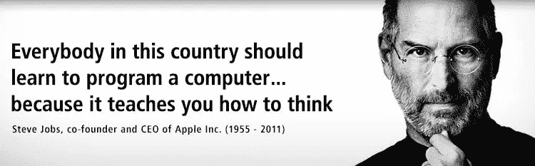

# “编码”是什么意思？

> 原文：<https://medium.com/hackernoon/what-does-it-mean-to-code-e846847d9943>

最近在 [Scratch 网站](https://scratch.mit.edu/about)看到这个视频:

> 在当今社会，编写计算机程序的能力是读写能力的重要组成部分。当人们从头开始学习编码时，他们学到了解决问题、设计项目和交流想法的重要策略。

有一种强烈的呼声要求我们社会中的每个人学习如何“编码”，因为这是一种新的“读写能力”，因为我们生活在一个数字世界中，每个人都以这样或那样的方式依赖于软件。Mitch Resnick 建议我们可以使用 Scratch 来“编码”程序，以表达我们的创造力和学习重要的技能。我认为现在是对这件事提出新观点的时候了。

首先，在软件中表达我们的创造力并不是什么新鲜事。当我们创建照片质量的图像时，当我们制作视频和动画时，当我们制作自己的音乐时，当我们写博客时，当我们使用 WordPress 和 Wix 创建自己的网站时，我们已经做了很长时间。现在，我们可以使用像 Scratch 这样的*可视化编程*工具来编写程序。

但是，当数字专家告诫我们学习如何“编码”时，可视化编程是什么意思呢这就是为什么这么多初学者从编码学院和训练营寻求编程指导的原因吗？

当然不是。我们使用 Java、Python 和 Ruby 等语言在 IT 领域进行的“编码”是 ***完全不同于可视化编程。我们编写的程序代码通常非常复杂，而且漏洞百出。我们不得不花费数小时、数天，有时甚至数周，努力尝试诊断和修复软件缺陷。这些任务不适合胆小的人。***

我也觉得“编码”这个词相当侮辱人。**编程语言中的编码**是*计算机编程*的一小部分，是一门要求非常高的工程学科。我已经提到了软件**测试和调试**，但是编程还有其他重要步骤，例如解决工程问题、**程序设计和架构**，应用复杂的数据结构和算法、性能**优化**，开发工具安装/配置/更新，以及软件**部署**。Scratch 或任何其他类似软件的用户几乎与所有这些问题绝缘。可视化编程旨在极大地简化软件开发过程，使您永远不会被通宵调试会议和长达一个月的编码操作所困扰。可视化编程很容易，因为有许多简化的假设和限制；它缺乏传统编程方法的灵活性和通用性。

> 在现实世界中，编程很难。非常难。

这是我们社会中的每个人都应该学习的新知识吗？使用 Java 或 Python 或 C++的计算机编程在任何方面都比得上阅读、写作和算术吗？

当你把自己从这种错觉中解放出来时，你会意识到一个伟大的真理:我们社会中的大多数人在他们的生活中根本不需要写一行代码。他们可能使用 Scratch 或类似的产品，从这个意义上说，他们是在“编码”但这与我们所理解的计算机编程相去甚远，呼吁每个人都学习如何编码是完全疯狂的。

## 学习解决问题和交流想法

据说，编码还教会你新的解决问题的策略和新的思考方式。我毫不怀疑这是真的。但是你猜怎么着？生活中几乎所有的智力活动都会给你类似的教训。

学习下棋也教你如何解决问题，尤其是逻辑和战术和战略的问题。

学习数学和科学同样会教会你如何解决问题。学习演奏乐器也是如此。学习解决逻辑和数学难题也是如此。学哲学和历史也是如此。见鬼，木工和汽车修理工也是。计算机编程在任何方面都不是唯一的。逻辑就是逻辑。推理能力是所有活动的共性。

> 我们社会中的每个人都应该学习如何下棋或乐器，或者学习天体物理学吗？

所以我们能不能不要再胡闹了？停止告诉每个人他们应该学习如何编码。别再告诉他们去学 JavaScript 或者 Python 或者 Java 了。如果他们想学习如何使用 Scratch 或其他可视化编程工具，那很好。这只是他们一直在做的事情的延伸。但是计算机编程完全是另外一回事。

> [黑客中午](http://bit.ly/Hackernoon)是黑客如何开始他们的下午。我们是 [@AMI](http://bit.ly/atAMIatAMI) 家庭的一员。我们现在[接受投稿](http://bit.ly/hackernoonsubmission)并乐意[讨论广告&赞助](mailto:partners@amipublications.com)机会。
> 
> 如果你喜欢这个故事，我们推荐你阅读我们的[最新科技故事](http://bit.ly/hackernoonlatestt)和[趋势科技故事](https://hackernoon.com/trending)。直到下一次，不要把世界的现实想当然！

