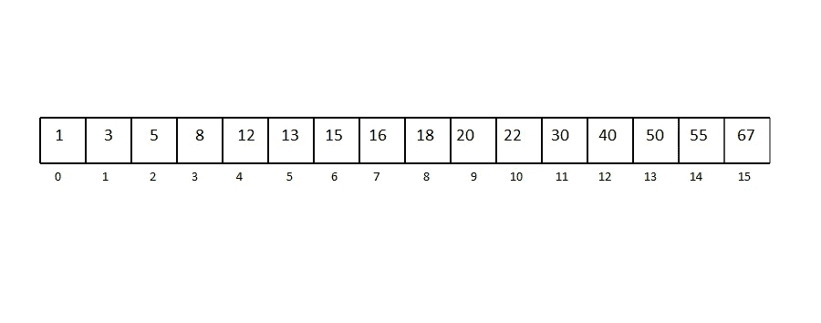
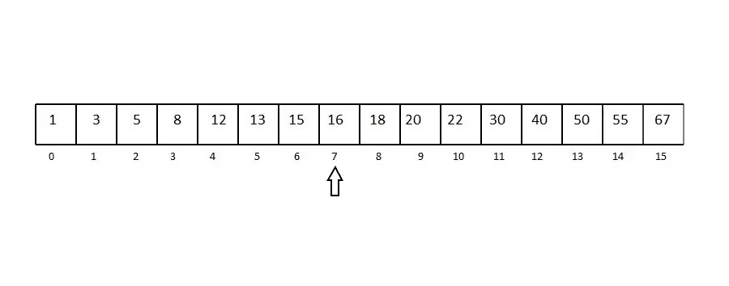
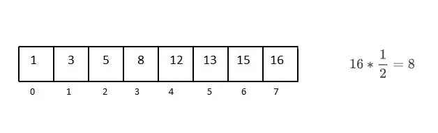
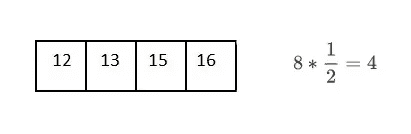
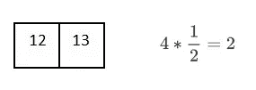
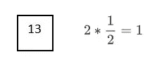
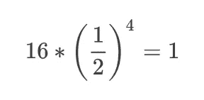
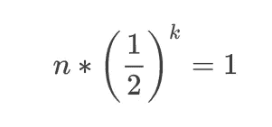
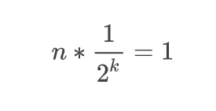
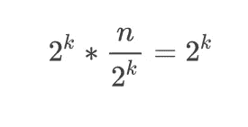

# 时间复杂度 O(log n)实际上是什么意思？

> 原文：<https://medium.com/hackernoon/what-does-the-time-complexity-o-log-n-actually-mean-45f94bb5bfbf>

事先知道算法的复杂性是一件事，另一件事是知道它背后的原因。

无论你是计算机科学的毕业生还是想有效处理最优化问题的人，如果你想用你的知识解决实际问题，这是你必须了解的。

像 O(1)和 O(n)这样的复杂问题简单明了。O(1)表示直接到达一个元素的操作(如字典或哈希表)，O(n)表示首先我们必须通过检查 n 个元素来搜索它，但是 O(log n)可能意味着什么呢？

你可能第一次听说 O(log n)时间复杂度的地方是二进制搜索算法。因此，一定有某种类型的行为，算法显示，给定的复杂性为 log n，让我们看看它是如何工作的。

由于二分搜索法的最佳情况效率为 O(1)，最差情况(平均情况)效率为 O(log n)，我们将查看最差情况的示例。考虑一个由 16 个元素组成的有序数组。

对于最坏的情况，假设我们想搜索数字 13。

A sorted array of 16 elements

Selecting the middle element as pivot (length / 2)

Since 13 is greaterthan pivot, we remove the other half of the array

Repeating the process for finding the middle element for every sub-array

你可以看到，每次与中项比较后，我们的搜索范围被分成当前范围的一半。

因此，为了到达一组 16 个元素中的一个元素，我们必须将数组划分 4 次，

我们可以这么说，

Simplified Formula

类似地，对于 n 个元素，

Generalization

Separating the power for the numerator and denominator

Multiplying both sides by 2^k

Final result

现在，让我们看看对数的定义，它说

> 一个表示一个固定数(基数)的幂的量，它必须被提高到一定的幂才能得到一个给定的数。

这使得我们的等式变成

Logarithmic form

所以对数 n 实际上意味着什么，不是吗？一种其他事物无法代表的行为。

好吧，我希望你已经很清楚了。当在计算机科学领域工作时，了解这些东西总是很有帮助的(也很有趣)。谁知道呢，也许你是团队中能够找到解决问题的最佳方案的人，因为你知道你在处理什么。祝你好运！

> [黑客中午](http://bit.ly/Hackernoon)是黑客如何开始他们的下午。我们是 [@AMI](http://bit.ly/atAMIatAMI) 家庭的一员。我们现在[接受投稿](http://bit.ly/hackernoonsubmission)，并乐意[讨论广告&赞助](mailto:partners@amipublications.com)机会。
> 
> 如果你喜欢这个故事，我们推荐你阅读我们的[最新科技故事](http://bit.ly/hackernoonlatestt)和[趋势科技故事](https://hackernoon.com/trending)。直到下一次，不要把世界的现实想当然！

