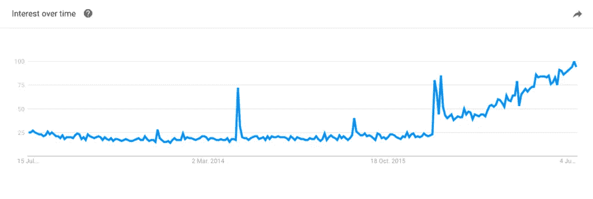
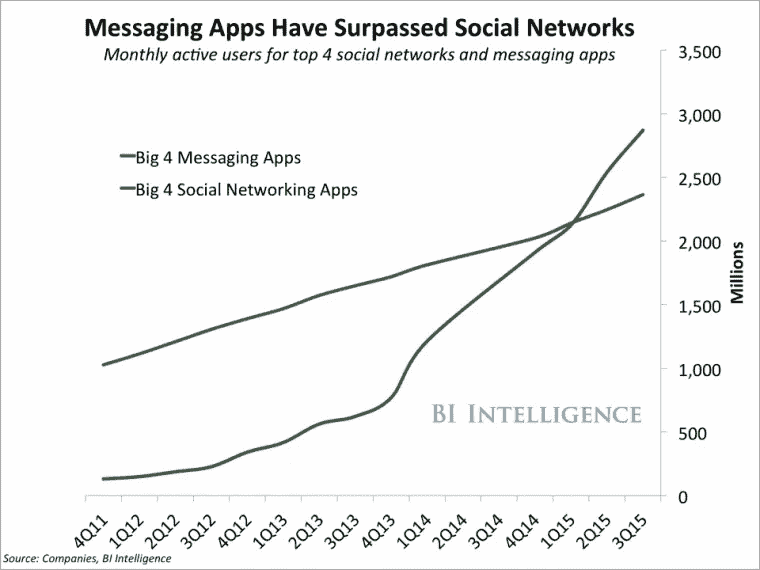
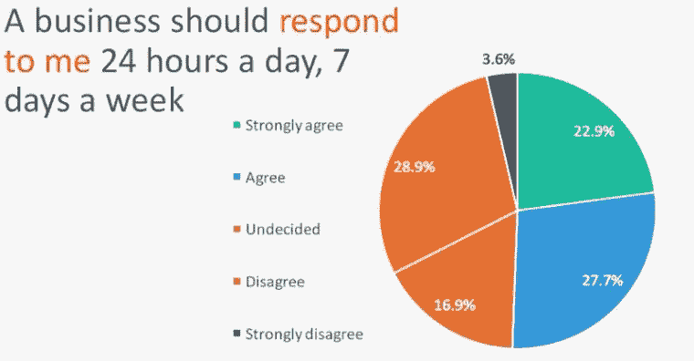
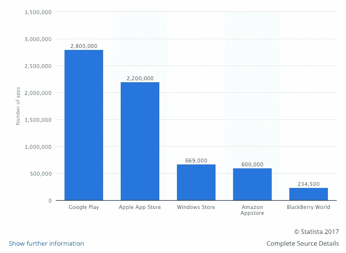
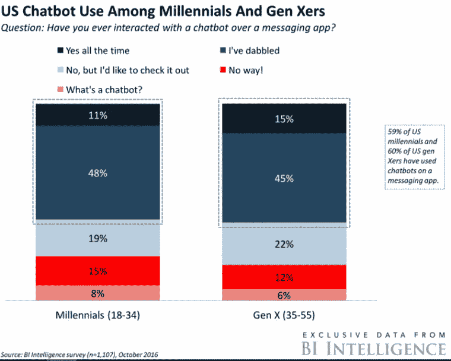

# 是什么推动聊天机器人越来越受欢迎？

> 原文：<https://medium.com/hackernoon/what-drives-the-growing-popularity-of-chatbots-e02bafe9c9f6>

Image source: Unsplash

聊天机器人的想法并不新鲜。有所改变的是，在过去的两年里，公司比以往任何时候都更专注于创造它们。

然而，这不是一夜之间发生的。

自 20 世纪 60 年代初以来，人们一直对创造一个能够与人类[交流的机器人感兴趣(仅提及](https://chatbotsmagazine.com/a-brief-history-of-bots-9c45fc9b8901)[伊莱扎](https://www.chatbots.org/chatbot/eliza/)、[爱丽丝](https://www.chatbots.org/chatbot/a.l.i.c.e/)和 [SmarterChild](http://motherboard.vice.com/read/a-history-of-smarterchild) )。

从那以后，我们向前迈进了一大步。

我们现在有像 Siri 和 Cortana 这样的人工智能助手，像亚马逊 Echo 或[谷歌](https://hackernoon.com/tagged/google) Home 这样的家庭助手。仅 Messenger 平台就有超过 [10 万个 bot。](https://venturebeat.com/2017/04/18/facebook-messenger-hits-100000-bots/)

*This Google Trends graph shows how the popularity of the term Chatbots has taken off since the beginning of 2016*

据 Business Insider 报道， [80%的企业希望在 2020 年前使用聊天机器人](http://www.businessinsider.com/80-of-businesses-want-chatbots-by-2020-2016-12?IR=T)。

在这篇文章中，我们想回答以下问题:

# 聊天机器人为什么会流行起来？

包括 HubSpot 创始人兼首席技术官 Dharmesh Shah 在内的行业专家列出了两个主要原因:

*   消息平台日益流行
*   人工智能和机器学习的进展

首先，我们交流的方式(尤其是聊天)已经发生了巨大的变化，从电话到短信，再到即时通讯应用。

现在，这些公司已经意识到聊天机器人能够帮助各行各业以前所未有的方式接触、吸引和服务他们的客户，全天候服务。

其次，人工智能、自然语言处理(NLP)和语音识别的当前状态使机器人能够更好地理解用户的查询，并相应地回答他们。事实上，聊天机器人正在成为消息应用程序的新界面，取代许多其他移动应用程序。

> “1997 年是互联网和浏览器，2017 年是机器人。”HubSpot 创始人兼首席技术官 Dharmesh Shah

让我们仔细看看聊天机器人如此受欢迎的因素。

# 消息平台胜过了社交网络

聊天机器人已经成为信息平台生态系统的重要组成部分。

据 Business Insider 报道，2015 年，四大消息平台的月活跃用户数量超过了四大社交网络应用[。](http://www.businessinsider.com/the-messaging-app-report-2015-11?IR=T)

*来源:商业内幕*

2016 年 4 月，脸书推出了他们的 [Messenger 开发者平台](http://www.reuters.com/article/us-facebook-ceo-idUSKCN0X926F)，向机器人开发者开放。脸书对聊天机器人的押注旨在模拟“用户和公司之间的一对一对话，以扩大其在客户服务和企业交易方面的影响力”。

由于仅 Messenger 就已经拥有[12 亿月活跃用户](https://www.statista.com/statistics/417295/facebook-messenger-monthly-active-users/)，而脸书的用户接近[20 亿人](https://www.statista.com/statistics/264810/number-of-monthly-active-facebook-users-worldwide/)，使用该公司收集的数据来创建更个性化的聊天机器人有很大的可能性，例如，可以预订航班或进行支付。

> “聊天应用将被视为新的浏览器；机器人将成为新的网站。这是一个新互联网的开始。”— [Ted Livingston](/@tedlivingston/the-future-of-chat-isn-t-ai-b07f65bc252#.sopnf9vla) ，Kik 的创始人

另一件事是，我们期望品牌与客户沟通的方式也发生了变化。今天，我们希望公司能够全天候可用。机器人现在可以做到这一点，它可以回答大多数问题，并立即做出反应。而且，如果需要的话，人类顾问可以随时加入对话。

来源:[2016 年手机短信报告](https://www.ubisend.com/insights/2016-mobile-messaging-report)

鉴于超过 65%的千禧一代、x 一代和婴儿潮一代认为发消息是他们的主要沟通方式，聊天机器人也可能增加各代人对技术的采用，帮助品牌触及更广泛的潜在受众。

# 机器人是新的应用

让我们面对现实吧——用户已经厌倦了应用程序。

自从引入 iPhone 和 App Store 以来，全世界的程序员已经为所有平台开发了超过 650 万个应用[。](https://www.statista.com/statistics/276623/number-of-apps-available-in-leading-app-stores/)

*资料来源:Statista.com*

用户和品牌因为各种原因受够了 app。

对于用户来说，安装新应用程序并学习如何使用它们，几天后就放弃它们已经变得令人疲惫不堪。

实际上，根据 Localytics 对 37，000 个应用程序的调查，23%的用户在使用一次后就放弃了这个应用程序。

另一方面，随着竞争变得激烈，品牌发现获得新用户比以往任何时候都难。此外，考虑到开发应用程序的高成本和废弃率，许多公司意识到构建自己的品牌应用程序可能不划算。

这就是聊天机器人发挥作用的地方。

T2 用 T3 开发和试验它们更便宜、更容易、更快，这使它们成为公司测试和实施活动的一个很好的工具。至于用户，他们也更容易安装和使用，因为一切都发生在一个消息应用程序中。

# Bot 平台和开发工具

脸书、微软和谷歌等最大的科技品牌将赌注押在了机器人上，推出了自己的机器人平台。

在收购了 [API.ai](https://api.ai/) 之后，谷歌接触了大约 6 万名机器人开发者。现在微软的[机器人框架](https://dev.botframework.com/)上有超过 45，000 名开发者，大约 34，000 名开发者使用脸书的[信使平台](https://messenger.fb.com/)。

《华尔街日报》称，仅脸书一国，在引入其机器人平台后的前六个月就有超过 30，000 个机器人诞生。

也有其他可供 bot 开发者使用的平台，如 [Telegram bot 平台](https://telegram.org/blog/bot-revolution)，以及类似 [Botlist](https://botlist.co/) 或 [Kik 的 Bot 商店](https://bots.kik.com/#/)的 Bot 商店。

此外，开发人员可以使用类似于 [IBM 的 Watson Conversation](https://www.ibm.com/watson/developercloud/conversation.html) 或 [Amazon Lex](https://aws.amazon.com/lex/) 的工具，基于深度学习算法和自然语言处理来构建他们的机器人的对话界面。

微软首席执行官塞特亚·纳德拉称聊天机器人将成为新的界面，称其为“作为平台的对话”。他将对话机器人比作图形用户界面、浏览器和触摸屏等突破。

> “聊天机器人将从根本上改变每个人体验计算的方式。”— [微软首席执行官塞特亚·纳德拉](http://uk.businessinsider.com/microsoft-ceo-satya-nadella-chatbots-wpc-2016-7?r=UK&IR=T?utm_source=ubisend.com&utm_campaign=ubisend&utm_medium=blog-link)

迄今为止，聊天机器人在 T4 的流行已经导致 59%的美国千禧一代和 60%的 x 世代在消息应用上使用聊天机器人。而且这个数字还在增长。

来源:BI 情报

# 结论

尽管聊天机器人的体验[还不完美](https://digiday.com/marketing/brand-bot-backlash-begun/)，但它们比几年前好得多。

他们现在能够帮助我们完成一些可能自动化的基本任务，从而节省我们的时间和金钱。

鉴于消息应用的流行以及聊天机器人适合这个平台的方式，加上人工智能、机器学习和自然语言处理的进步，开发越来越多聊天机器人的趋势不会消失。

接下来要讨论的不是聊天机器人是否会继续存在，而是我们到底需要什么样的机器人。

现在，我们想问你一个问题:

在你看来，哪些行业还没有被聊天机器人颠覆？

*请在评论中留下答案，我们很乐意阅读您的想法！*

*原载于 2017 年 7 月 18 日*[*blog.apptension.com*](http://blog.apptension.com/2017/07/18/popularity-of-chatbots/)T22。