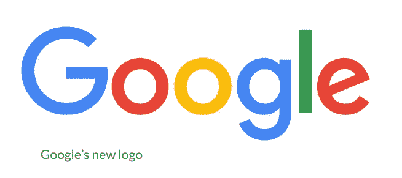
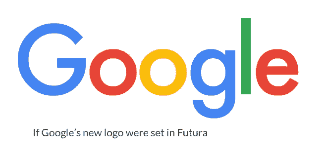
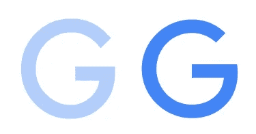
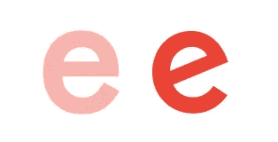
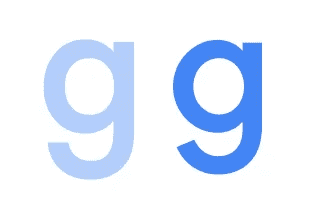
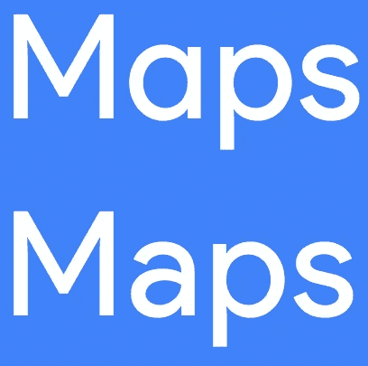
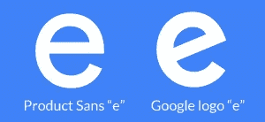
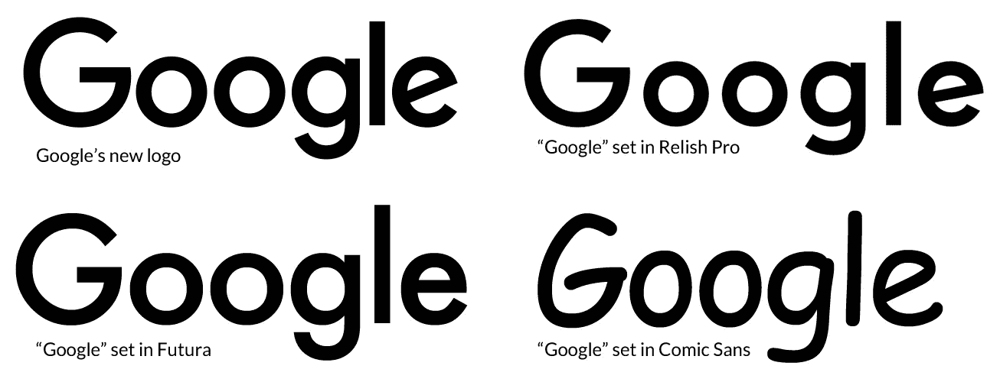

# 新的谷歌标志是什么字体？

> 原文：<https://medium.com/hackernoon/what-font-is-the-new-google-logo-89a167227f06>

谷歌最近宣布了新的标志重新设计，称我们与他们的产品互动的平台现在更加多样化。

> 今天，我们将推出一个新的标识和身份系列，反映这一现实，并向您展示谷歌的魔力何时为您工作，即使是在最小的屏幕上。

考虑到小像素有时会与微妙的形式发生冲突，这种无衬线字体对于“小屏幕”来说是有意义的

乍一看，这个标志看起来像是以 [Futura](https://www.myfonts.com/fonts/bitstream/futura/) 为背景，这是一个由保罗·伦纳在 1927 年设计的常见场景。

但是，如果你仔细看，你会发现它并不完全是 Futura。

Futura 就像一种字体的“T4”、“几何”和“T5”一样。它给了它一个数学上精确的外观，甚至有点陈旧。

但是，谷歌对字体做了一些微妙但有力的改变，以适应他们寻找的图像。

通过研究这些，你可以更好地理解调整字体的常见标志设计实践。

# Google 的新 logo 和 Futura 有什么不同？

下面，你可以看到谷歌的新标志和如果纯粹以 Futura 为背景的标志之间的细微差异。(新 logo 采用大胆的颜色，较浅的颜色为 pure Futura。)

最重要的调整是对大“G”，这是现在谷歌的 favicon 的基础，并将出现在他们的所有属性。

请注意以下更改:

1.  G 中的横木略高，也更长。这将打开信中的计数器，使它感觉有点像“咧嘴笑”这种更开放的计数器在更小的尺寸下也更可读。
2.  G 的“孔”更大(注意顶部冲程结束得更快)。这也使得表单看起来更加友好，并且在较小的尺寸下阅读起来更好。

接下来，小“e”也有类似的变化。横杆向上倾斜，这是大多数“人文主义”字体的典型特征，是对印刷术之前手写字体的回归。

你会注意到“e”也有一个更大的光圈。如果你把它们想象成脸，Futura 会咧着嘴笑，而谷歌的“e”会笑得歇斯底里。

最后，小写字母“g”不会下降到基线以下。这可能是为了平衡 logo(当你知道你在排版什么字的时候，你有这种奢侈)，但是也注意到下行的笔画末端有点倾斜。这又一次使它在较小的尺寸下更具可读性，同时承载了更“友好”的主题。

你会注意到的最后一个区别是“l”稍微短了一点。这可能又是一个平衡问题。

# 谷歌的新标志是基于他们的定制字体，产品 Sans

许多人都在疑惑*“新的谷歌标志是什么字体？”*

准确地说，谷歌的新标志没有任何特定的字体。这是一个徽标，通常徽标(至少对于像谷歌这样的大公司来说)会有一些定制。这是少有的情况之一，你知道*确切的*什么字母将被显示，所以设计师可以平衡字母，他们认为合适。

所以，不，不存在一个“谷歌标志字体”但是，谷歌的新标志是 [*，基于*他们的新字体，“产品无](https://www.quora.com/What-font-family-is-the-new-Google-logo-2015-closest-to)”

如果你想知道，不，你不能自己使用产品。正如[这个线程](http://graphicdesign.stackexchange.com/questions/58980/is-product-sans-google-new-geometric-font-being-made-available-for-commercial)指出的，产品 San 的[许可](https://www.google.com/fonts/license/productsans)声明:

> 谷歌在开源条款上提供了许多字体。这不是其中之一。请看[www.google.com/fonts](https://www.google.com/fonts)。

很公平。谷歌提供了许多字体，所以他们有权拥有自己的字体。

产品 Sans 明显受到 Futura 的严重影响，Futura 是 Paul Renner 在 1927 年设计的。

你会看到 Futura 和 Product Sans 之间的最大区别是双层的“a”，这是更人性化的字体的共同特征。这个选择是为了避免“产品锁定中的冗余”，我认为这意味着“太多该死的循环”

SOURCE: [GOOGLE’S PRODUCT SANS SPECIMEN PDF](https://storage.googleapis.com/g-design/static/product-sans-specimen.pdf)

“Google”中没有“a”，然而，产品 San 和 Google 的标志之间有一个明显的区别:它又是那个倾斜的“e”。

# 还有哪些字体看起来像谷歌的 Logo？

几乎没有完全原创的字体，所以自然地，有其他类似谷歌标志的字体。这里有一个对比:

除了 Futura，谷歌的标志[类似于](http://qr.ae/RHYeER) [毒辣 Pro](http://www.myfonts.com/fonts/redrooster/relish-pro/) (尽管毒辣 Pro 的 x 高度明显更小)。

一些人还说谷歌的新标志类似于令人讨厌的漫画《无 T21》。但是，我不同意。

[Windlesham Pro](http://www.myfonts.com/fonts/redrooster/windlesham-pro/) 也是[的近亲](http://qr.ae/RHYeER)，只是少了小写字母“f”上那个时髦的下行字母

这篇文章最初发表在[的*黑客设计*博客](http://designforhackers.com/blog/googles-new-logo-font/)上。

> [黑客中午](http://bit.ly/Hackernoon)是黑客如何开始他们的下午。我们是 [@AMI](http://bit.ly/atAMIatAMI) 家庭的一员。我们现在[接受投稿](http://bit.ly/hackernoonsubmission)并乐意[讨论广告&赞助](mailto:partners@amipublications.com)机会。
> 
> 如果你喜欢这个故事，我们推荐你阅读我们的[最新科技故事](http://bit.ly/hackernoonlatestt)和[趋势科技故事](https://hackernoon.com/trending)。直到下一次，不要把世界的现实想当然！

