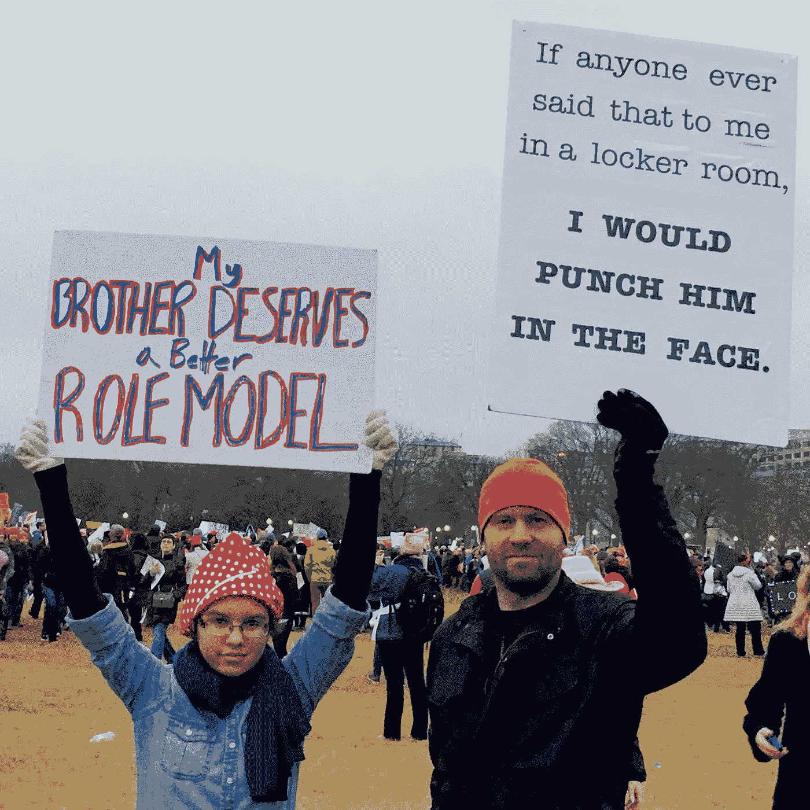

# “好男人”可以做些什么来为科技行业的女性创造更好的工作环境

> 原文：<https://medium.com/hackernoon/what-good-men-can-do-to-create-a-better-working-environment-for-women-in-tech-1591e79a08a0>

像许多读者一样，我对福勒对优步性别歧视的描述感到震惊和沮丧。科技世界，包括湾区以外的卫星地区，如华盛顿州、DC，在工作场所遭受着 T2 的性别歧视。这当然令人失望，但也自相矛盾，因为科技公司经常吹嘘自己是最具前瞻性、最进步、最受欢迎和最包容的。如果有一半的“爱狗”公司采取同样多的步骤来对女性友好，我们将取得重大进展。

在我的职业生涯中，我个人曾在 7 家科技初创公司担任运营角色，在过去的 3 年里，作为一名实践顾问，我深入参与了另一个 26:足以看到一些有意义的模式。我很幸运地避开了任何与福勒的叙述相呼应的环境；事实上，他们中的许多人都达到了非常高的标准，并受益于管理团队为每个人创造良好工作环境的积极努力。然而，我经常看到的是一种含蓄的、真正无意的以男性为中心的[文化。这种现象的影响范围很广，从在某些情况下无害甚至幽默，到在其他情况下完全不道德和非法。有时，我确信我也给我周围的职业女性制造了不舒服的情况，尽管我是出于好意。](https://hackernoon.com/tagged/culture)

福勒回忆的事件的荒谬性显示了这个问题在科技世界的严重性，但同时也揭示了一个不幸的现实，即许多与她互动的男性(在某些情况下，女性)甚至没有意识到他们的行为、决定和交流是性别歧视的，或者至少违背了他们公司声称是其文化一部分的价值观。要正确解决科技领域的性别歧视，不仅仅需要“坏男人”表现得更好。“好男人”在改变对女性不友好和不公平的工作环境中扮演着关键角色。

让我们先把它分解成三种可能的性别互动:女人与女人互动，男人与女人互动，男人与其他男人互动。

我们必须在这三个方面都取得进展。然而，我并不假装有资格谈论女性之间的互动，已经有大量关于两性之间适当互动的内容。

# 男人之间的互动

然而，还没有足够的重视男人与男人之间互动的重要性，因为这与工作场所的*女人*有关。由于男性在科技领域的比例过高，大量的互动都只涉及男性。因此，试图创造一个更公平的工作场所需要特别关注男性对彼此的期望。

通过我与数十家科技公司的数千名员工的互动，当谈到性别偏见时，我发现男性可以大致分为三种角色:

*   **选择性别歧视的坏男人**(极少数，可能不到 5%)
*   无知的男人在不同程度上存在性别歧视，却没有意识到这一点(大多数人，可能高达 2/3)
*   表现出(或至少努力表现出)反对性别歧视的好男人(剩下的，大约 1/3)

幸运的是，这些群体中的每一个都可以受到“好人”的影响。

几乎所有无知的男人都认为他们实际上属于“好”的一类。科技领域的绝大多数男性不会在性别关系 101 课程中获得及格分数，但认为他们会获得 a。他们根本没有意识到自己是性别歧视者，或者他们没有意识到“小事”实际上是一件大事，因为他们从来都不是受影响的一方。好男人可以通过私下的指导和反馈来帮助无能的男人。优秀和无能的男人都倾向于欣赏关于这件事的反馈，但是当反馈来自另一个男人时，他们会特别关注。任何批评性反馈都会给接受者造成认知失调——他们会寻找理由来证明忽略它是合理的，以便维持他们对自己的看法。但是当反馈来自另一个男人时，这就消除了男人们可能会求助的借口，比如“她只是一个疯狂的女权极端分子”。反馈必须放在心上。

少数真正的害群之马根本不会听女人的话(记住，他们是有自我意识的性别歧视者)，但他们的行为会受到愿意代表女同事表现得自信或适当对抗的男人的强烈影响。大多数“坏男人”通过自己对男子气概的错误定义，将它与支配和自我主义等特征联系起来，为自己和他人捍卫他们的性别歧视。一对一辅导不会让他们理解，因为他们可能会认为反馈来自一个软弱或过于“公司化”的个人。然而，当面对来自他们周围的男人的反对时，他们在衡量自己的地位时会考虑他们，他们要么排队，要么感到被排斥并离开。这两种结果都是可以接受的。

# “好男人”如何更好地帮助女性

男性在科技行业占绝大多数。数字带来权力，权力带来责任。为女性提供一个同样受欢迎的工作场所，这个问题不会因为女性要求男性这样做或者因为少数好男人一贯尊重他们的女同事而得到解决。当男人开始坚持让其他男人也这样做时，问题就解决了。

对于男性读者来说:如果你觉得自己是一个“好人”,在解决科技行业的性别歧视问题上尽了自己的一份力，那么在与女性打交道时，仅仅采取相应的行动是不够的。有勇气对你的男同事的不当行为给予直接反馈，甚至当面对质。这里有几个你可以采取的具体可行的步骤。

*   在新公司找工作时，问问他们采取了什么具体措施来确保工作环境对女性友好。如果他们不能给出满意的答复，就不要接受这份工作。原因是他们对这个问题缺乏关注。
*   在你说、写或展示任何东西之前，问问你自己，如果它是由一个女人制作的，它是否会有任何不同，认识到你的偏见，并相应地调整。(例如，我最近用电影作为视觉辅助创作了一个 PowerPoint 演示文稿，并意识到我选择的主要是动作片，所以我对它们进行了编辑，以包括更中性的横截面。而且，结果要好得多。)
*   询问女性，她们认为公司可以做些什么来为她们创造更好的工作环境。不要仔细检查或挑剔他们的回答。取而代之的是冠军。(想象一下，如果有 2-3 个*男人*事先对她的经理的不当行为直言不讳，福勒的经历会有多么不同。)
*   传播消息，推动对话。为你现在或以前共事过的女性提供支持。与你的同事分享这篇文章。发微博或者在 LinkedIn 上发布。或者，写下你自己的版本并分享出来。

最重要的是，在最终只有男性参与的互动中(很可能有很多)，应用同样的不成文的社会规则，如果有女性在场的话。反对你听到的任何冒犯女性的话，并大声说出来。如果有必要，不要害怕对抗。请记住，你支持的女性并不是为了维护自己。如果你真的是一个“好人”，你会代表他们表现得很自信。

# 最后一则轶事

2017 年 1 月 21 日，我参加了 DC 华盛顿州的妇女游行。我举着一个牌子，上面写着“如果有人在更衣室里对我说这样的话，我会打他的脸。”当我做这个标志的时候，我不确定我会从女人那里得到什么样的反应。我是不是走得太远了？女性会拒绝这种过时的，也许是家长式的骑士精神吗？然而，我很欣慰地发现，男女老少都非常欣赏这本书。数百名妇女拿着我的标语给我拍照，还有数百名妇女拦住我的去路，感谢我发表了这一声明，承认他们重视男人让其他男人为自己对待女人的方式负责。

从那以后，我一直在考虑如何在工作中更好地应用这一课程。以这种方式保持警惕，帮助我在多个场合成为技术领域的更好公民，希望为女性或任何代表性不足的群体建立一个更受欢迎的工作场所。

> [黑客中午](http://bit.ly/Hackernoon)是黑客如何开始他们的下午。我们是 [@AMI](http://bit.ly/atAMIatAMI) 家庭的一员。我们现在[接受投稿](http://bit.ly/hackernoonsubmission)并乐意[讨论广告&赞助](mailto:partners@amipublications.com)机会。
> 
> 如果你喜欢这个故事，我们推荐你阅读我们的[最新科技故事](http://bit.ly/hackernoonlatestt)和[趋势科技故事](https://hackernoon.com/trending)。直到下一次，不要把世界的现实想当然！

