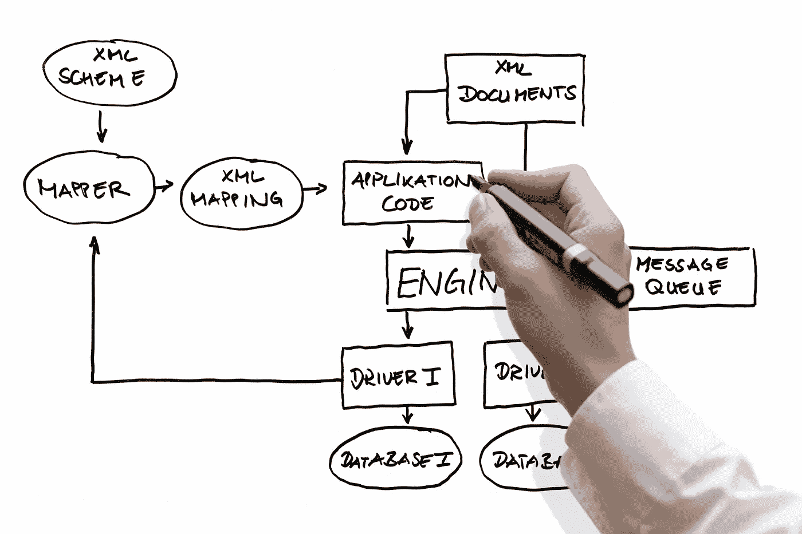
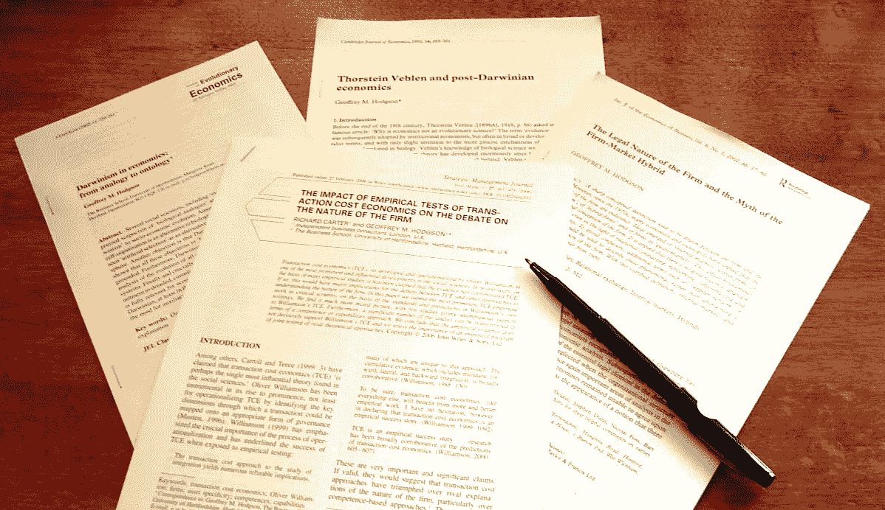
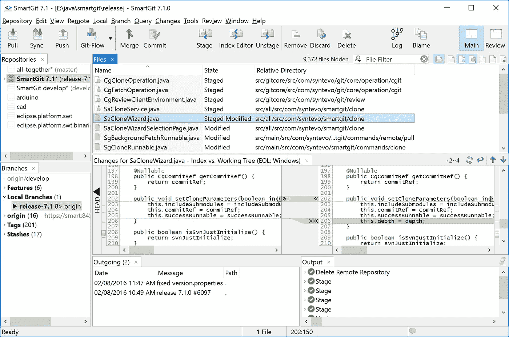
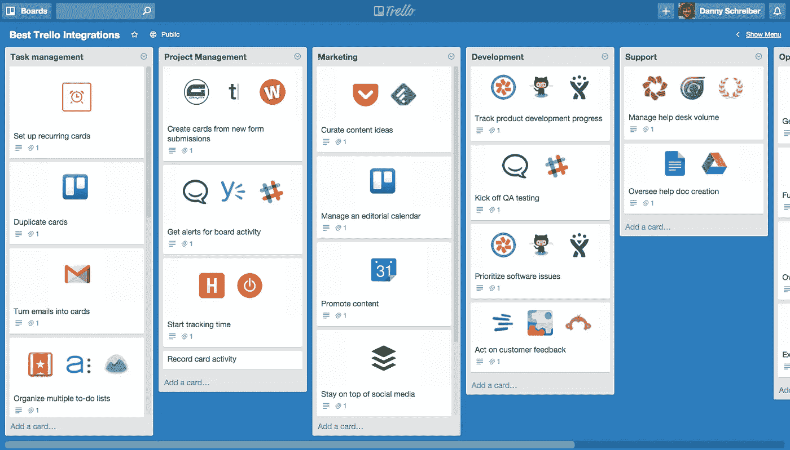
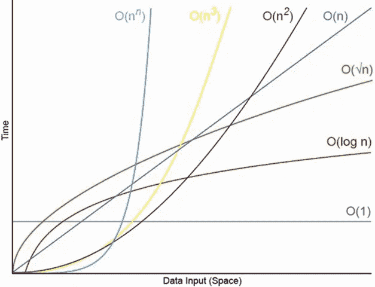

# 哪些习惯让我成为了更好的软件工程师？

> 原文：<https://medium.com/hackernoon/what-habits-made-me-a-better-software-engineer-47e7d54b8fa>

[http://www.wallpaperup.com](http://www.wallpaperup.com)

习惯顾名思义就是你生活中的日常事务。它可能是好的也可能是坏的。习惯可以以生存的形式出现，比如一天需要吃三次食物。还有一些健康的习惯，比如每周锻炼 3-4 次。有些坏习惯会损害你的身体，比如每天抽烟喝酒。

最后，有一些习惯会让你在目前的任何职业中脱颖而出。习惯造就了专家、天才，并使他们现在所做的事情变得熟练。这不是一蹴而就的，但这是可能的。大多数高效和聪明的人会说习惯是他们成功的原因。我非常同意。

我花了一段时间才开始培养一些习惯，这些习惯让我成为一名更好的软件工程师。通过与不同的客户和不同的行业打交道，我开始养成一些内在习惯，现在我发现很难停止，因为在大多数情况下，这让我每天都变得更好。

如果你想知道，这里有一些我在成长过程中养成的让我成功的习惯，你也可以这样做:

# **架构每一个软件应用**

[http://www.crossvale.com](http://www.crossvale.com/)

我几乎从不在没有正确设计的情况下编写任何应用程序。大多数时候，我使用最佳实践，比如记住何时使用 ***设计模式*** ，使用 ***可靠原则*** 和 ***领域驱动设计(DDD)*** 方法分离代码职责。当谈到代码的整洁时，也许我有点完美主义，因为我相信这将在未来为我节省很多时间，并且将进一步最小化随着时间增加软件熵 的意大利面条代码的频率。

我相信你做的每一个软件，都需要有一个更好的架构。当你试图使代码尽可能的独立和清晰时，你最有可能是高效的。当我学会如何更好地将我的存储库和我的服务层分离到应用程序中时，我能够以令人难以置信的速度提高我的编码速度。不仅如此，由于更好的关注点分离，我还能够将一些 ***单元测试*** 插入到组合中。

当我转移到***【MVC】***范例并把***【DDD】***扔进组合中时，软件架构就更明显了。这正好说明了 ***关注点分离(SoC)*** 的概念在开发应用程序中有多重要，尤其是在开发大规模企业应用程序时。作为一名软件工程师，这是我一生中最有成效的时刻。

唯一的例外是，当我编写一些样本代码片段或演示应用程序时，我需要为演示进行测试。或者一些实验软件 app 进行测试。

# 总是编写测试

[http://wealthy-doctor.com](http://wealthy-doctor.com)

作为一名软件工程师，我在工作中练习的另一件事是总是写测试。 ***【测试驱动开发】*** 在我个人看来是非常重要的规程，在编写你的 ***单元测试*** 时要贯彻。

这种方法背后的想法是 ***让测试驱动你的函数*** 的设计，并在你为它编写实现之前预测它的输出。起初，这可能听起来令人困惑，没有任何意义。但是当你开始实践它时，你会意识到它的用途和它的好处超过了使用这种方法的缺点。

更重要的是，TDD 允许你编写更干净的代码和架构，防止你的代码变得不可管理(有人喜欢意大利面代码吗？)从长远来看通过实现 ***接口******稳固原则*** 。如果处理得当，您可以使用 ***存根*** 作为您的服务的具体实现的虚拟替代。

同样值得注意的是，您不能在所有场景中创建每个测试。这是大多数开发人员犯错误和玷污 TDD 价值的地方。在这样做之前，您可能需要知道哪些场景是可测试的，哪些是不可测试的。

一个例子是为*创建一个函数。你肯定会知道你可以为此创建一个测试并应用 TDD 方法。现在，当你创建一个测试，只是为了让 ***在 ViewModel 中显示信息*** 呢？你当然可以。但这有必要吗？*

*总的来说，这种创建测试的习惯让我能够更好地重构我的软件应用程序和架构。这也让我能够满怀信心地发布我正在制作的功能，几乎没有任何挫折。*

# ***为你学到的东西写博客/文章***

**

*[http://www.freelancecopywritersblog.com](http://www.freelancecopywritersblog.com/)*

*我认为有些人忽略了像科学家一样把你的认识/发现写在纸上的想法。或者 ***为它创建一篇博客文章*** 。*

*按照我的理解，为编程中刚刚悟出的东西写文章，其实会让你变得更好。尤其是当你把它写下来并与全世界的程序员分享的时候。*

*你不仅能够分享你的想法，帮助全球的程序员解决他们的问题，而且你还能够表达你的独特性和怪癖。*

*写文章的另一个好处是你 ***增加信息在大脑中的保留*** 。研究表明，你写的信息越多，你就能更好地保留和处理信息。因此，基于这些信息，我将博客或文章写作作为一种出口，以更好地保留和处理这些信息，准备让世界各地的公众看到。*

*这样做的一个额外好处是，你允许自己与程序员交流，并且表明你愿意接受批评。这样，你会从他们的建议中得到提高和学习。或者纠正他们。这开启了一个对话，这样你们都可以受益。*

*你可能已经注意到优秀的软件工程师会写博客。这可能是他们除了展示他们的技能和作为个人品牌营销自己之外的目标。*

*你最好也练习一下叫做 ***【费曼技巧】*** 的训练。**/耸肩***

# ***使用 git 等版本控制系统***

**

*[http://www.syntevo.com](http://www.syntevo.com)*

*我不完全确定为什么我所在城市的大多数开发人员仍然不知道如何在他们作为软件开发人员的日常工作中做到这一点。对我来说，使用 git 是我作为软件工程师一生中探索的最重要的发现。这让我省了很多麻烦。*

*由于 git 等版本控制，我可以创建与您需要处理的特定特性相关的分支。在这种情况下，您不需要回滚，因为很有可能，您不会将您的特性分支合并到您的主分支，直到您完美地测试了它并且运行良好。如果事情没有如你所愿，你可以离开那个分支，不要把它和你的主分支合并。*

*版本控制非常强大。直到现在，它才真正让远程工作变得非常成功。想象一下，与不同时区的开发人员一起工作，而您没有记录/监控您的更改的版本控制，只是简单地将您的项目复制/粘贴到云存储中。那将是灾难性的！*

*另外，当你在 github 中公开你的开源项目时，特别是如果它有用的话，有可能会有很多人与你的项目合作并改进它。*

# ***使用看板***

**

*[https://zapier.cachefly.net](https://zapier.cachefly.net)*

*当我认真对待我正在构建的项目或想法时，我会使用看板应用程序，如 ***【特雷罗】*** 来记录我在构建 MVP 时遇到的所有想法/错误/问题。在团队中，我经常看到开发人员使用 trello 作为他们的惯例来突出那些需要交付的想法和特性。*

*在看板板上，你通常会看到 ***待办事项、进行中、完成*** 取决于你正在处理的任务的当前状态。您也可以根据自己的需要扩展它。我曾经合作过的一些团队在他们的 trello 板中有类似于 ***【供讨论】*** 的栏目，然后他们把它放在***【to-do】***中，准备好让开发人员在讨论完特性后使用。*

*作为一个有几个个人项目要做的个人用户(不管是我自己的个人 app，还是创业 app 之类的)，省去了我很多头疼的事。更容易理解我目前的方向，以及已经实施的想法。*

*我无法想象作为一名软件工程师，不使用 trello 的生活。与在 OneNote 等笔记应用程序中保存所有这些东西相比，它节省了我很多时间，同时使项目更有条理。*

# ***换个角度解决问题***

**

*[https://github.com/sf-wdi-31/algorithm-complexity-and-big-o](https://github.com/sf-wdi-31/algorithm-complexity-and-big-o)*

*你可以说我有点痴迷于从不同的角度解决问题。尤其是在优化方面，我经常问自己，即使查询已经优化了，我还能如何优化它。*

*也有一些场景确实需要优化查询，比如显示 100 多条记录。诸如此类的示例需要仔细考虑，因为当用户实际使用该特性时，实现可能有点太牵强或不切实际。在这种情况下，你最好和你的客户讨论这个特性，从不同的角度解决它。*

*我还尝试使用大 O 符号来分析我正在编写的代码背后的算法速度。*

*把这作为一种习惯让我更好地解决问题，即使是一些不可能解决的问题，因为这是我们作为软件工程师的职责。它还允许我产生更好的输出，几乎没有错误。*

# *锻炼/去健身房*

**

*[https://gearpatrol.com](https://gearpatrol.com)*

*我通常每周去健身房锻炼 3-4 次。这是为了确保我的大脑更加健康，让我能够更好地思考，为我的客户解决复杂的问题。*

*科学家们发现，锻炼实际上能让你变得聪明。根据研究， ***的耐力运动提高了认知能力，保护大脑免受*** 的退化。*

*总的来说，除了我能收获的好处之外，我喜欢整体健身。我们不必在电脑屏幕前 24/7 的工作和劳累。我们也需要锻炼身体，保持整体健康。*

*记住，没有健康的身体，我们就不能高效地工作。这是我为数不多的可以优化自己的方法之一，而不仅仅是一直优化代码。*

# *避免拖延*

**

*[https://www.silviachristmann.com](https://www.silviachristmann.com)*

*在当今世界，避免拖延似乎是一件具有挑战性的事情，尤其是如果你没有更大的理由这样做的话。进一步消除或最小化拖延症的关键之一是要有一个更大的理由来解释你为什么想要成功或提高到目前为止。*

*我告诉一个在其他城市工作的朋友，如果你能尽量少用 facebook 这样的社交媒体，你就是在为未来的自己做一件好事。*

*让我们做一个简单的数学计算来拖延你使用 facebook 的时间:你每天浏览 Facebook 2 小时。你习惯性地这样做 30 天/月。现在用 30 天乘以 2 小时。相当于 60 个小时，对吗？相当于差不多 3 天。这听起来可能不够浪费时间。所以让我们把它变成一年。*

*现在，假设你每月在使用 facebook 上浪费了 3 天时间。把它乘以 12。现在你已经 ***仅仅因为使用 facebook*** 而浪费了你的 36 天。*

*想象一下，如果你可以简单地减少使用你的 facebook，简单地努力提高自己。真正重要的事情。可以快速提升自己，而不是浪费时间在 facebook 上浏览无意义的故事。*

*停用我的 facebook 账户让我提高了作为一名软件工程师的技能，并利用这 36 天来提高自己。这是一个改变人生的认识。*

# ***看书***

**

*[http://www.aarp.org](http://www.aarp.org)*

*最后，这是我过去最讨厌的习惯。看书。现在我很感激。我每天都看书。*

*读书可以让你学到新的信息，这些信息可以与你目前的技能联系起来，并且比任何不读书的人更有效地解决问题。*

*我读的书通常是非小说类的。大多是自助类的书，商业类的书，还有软件工程类的书或者任何我职业生涯中可以链接的书。*

*它让我成为一个更好的思考者，也是一个更好的软件工程师。*

# *最后的想法*

*如果没有现在生活中的这些日常习惯，我不可能成为一名更好、更成功的软件工程师。*

*你呢？你的习惯是什么让你现在成为一名更好的软件工程师？把你的习惯写在下面的评论区吧！*