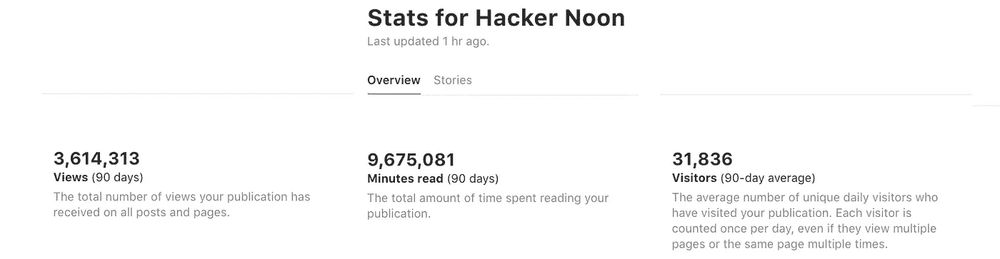

# 黑客在读什么

> 原文：<https://medium.com/hackernoon/what-hackers-are-reading-3a45be29e23b>

上个月对于黑客正午来说是一个强劲的月份，平均每天+58K 的访问量，总计 2M+浏览量。我们的 [Alexa 排名也爬进了全球前 20K](http://www.alexa.com/siteinfo/hackernoon.com) 。

如果你错过了本月黑客正午的[趋势，这里有 8 个阅读量最大的帖子:](https://hackernoon.com/trending)

[**2016 年学习 Javascript 的感受**](https://hackernoon.com/how-it-feels-to-learn-javascript-in-2016-d3a717dd577f#.s7zulaw30)**——** [**Redux Step by Step:一个简单而健壮的现实生活应用程序工作流程**](https://medium.com/u/4eb81b32b99a#.i26ogpus1) **&** [**避免构建应用程序状态时的意外复杂性**](https://hackernoon.com/avoiding-accidental-complexity-when-structuring-your-app-state-6e6d22ad5e2a#.qbhteyfnb)**—** [**Node.js v6 过渡到 LTS**](https://medium.com/u/83a4f96844d0#.oroegtxyl)**——【官方** [*将这些邮件模板发送到您的 bos*](https://medium.com/u/96cd9a1fb56#.d4a11qhem) *s，以帮助您参加奥斯汀 11/29–12/2**的* [*Node.js 互动会议，了解更多关于这一重大新闻的信息。*](https://goo.gl/0JJvmD)

[**面向 Android 开发者的移动视觉 API 机器学习—第一部分—人脸检测**](https://hackernoon.com/machine-learning-for-android-developers-with-the-mobile-vision-api-part-1-face-detection-e7e24a3e472f#.7o88wwrow) **( &** [**第二部分**](https://hackernoon.com/machine-learning-for-android-developers-with-the-mobile-vision-api-part-2-barcode-detection-61e84c858518#.9dnd3w5ra)**)—******—******—作者** [**约翰·迈克菲就联邦调查局对待希拉里·克林顿的邮件**](https://medium.com/u/7ef192b7f545#.9103hcmmz)****

*****我们显然应该知道约翰·麦卡菲对这个已经结束的选举故事是怎么想的。更多选举报道，请访问* [*ExtraNewsfeed。*](http://extranewsfeed.com)****

****[**10 个问题问每一个创业创始人**](https://hackernoon.com/10-questions-to-ask-every-startup-founder-c64e1b6deb5b)**——**[**你真正的**](http://linkedin.com/in/clarkkent)****

****这些问题很好地描述了一家初创公司的发展方向。创业公司可以 [*在这里*](https://docs.google.com/forms/d/1vwT0z3VZi9HqoC3HW_arZQIjIhhiwnmFk0IuvmNG4Rg/edit) *回答这 10 个问题，我们会考虑发表评论。*****

****[**7 理由启动资金公告被高估**](https://hackernoon.com/7-reasons-why-startup-funding-announcements-are-overrated-9817b80dced4#.eagaycyad) **，由** [**对风投过度:71 次 IPO 的教训**](https://medium.com/u/26313dc7c9d6#.urqjb53mb)**——** [**你在寻找最好的程序员还是最好的纯粹主义者？**](https://medium.com/u/f49435c6fa9#.2pi6h4qoz)**——** [**人类正在开源的项目**](https://medium.com/u/fea28b5b5ef2#.dr6qlyrwn)**——** [**创业交易—第三版**](https://medium.com/u/9e13edbcb55f#.90hsdu9n6) **，由** [**布拉德菲尔德**](https://medium.com/u/65d8116a012c?source=post_page-----3a45be29e23b--------------------------------)****

****黑客正午的故事引起了[克里斯·萨卡](https://twitter.com/sacca/status/792090833755447301)、[码头工人](https://twitter.com/docker/status/791119674192846848)、[实用开发](https://twitter.com/ThePracticalDev/status/788383626337591296)、[泰勒·埃德米斯顿](https://twitter.com/kicksopenminds/status/795278264981979137)、[硅谷银行](https://twitter.com/SVB_Financial/status/795453971192315904)、[陈楚翔](https://twitter.com/andrewchen/status/793563747612753920)、[亚历克斯·卡波](https://twitter.com/EvilAFM/status/793172752303816705)、[大中央出版社](https://twitter.com/GrandCentralPub/status/792037091312078848)、 [Y 组合商](https://twitter.com/ycombinator/status/788469867812888576)、 [FWD.us](https://twitter.com/FWD_us/status/788790563902332928) 、[塞巴斯蒂安·拉梅尔【t](https://twitter.com/lammeleon/status/789152579242647552)****

****亲切的问候，****

****[大卫·斯穆克，](https://commerce.coinbase.com/checkout/e73d40ea-bd59-406e-931e-d1e969243c91)黑客正午****

*****顶照片功劳，* [*北滩鹦鹉。*](https://www.facebook.com/NorthBeachParrot/photos/a.1494432870855647.1073741826.1493678630931071/1607139836251616/?type=3&theater)****

*******P.S.*** 和大多数[硅谷](https://hackernoon.com/tagged/silicon-valley)一样，我们仍然没有[盈利](https://hackernoon.com/search?q=profit)。如果你或你认识的人愿意合作，[我们来谈谈](mailto:partners@amipublications.com)。下面是我们过去 90 天的流量截图。****

********

*******P.P.S.*** 阅读 [**黑客正午趋势**](http://l.facebook.com/l.php?u=http%3A%2F%2Fhackernoon.com%2Ftrending&h=PAQGUYJGm) (按标签)了解什么让黑客滴答作响:[编程](https://l.facebook.com/l.php?u=https%3A%2F%2Fhackernoon.com%2Ftagged%2Fprogramming&h=PAQGUYJGm)、[创业](https://l.facebook.com/l.php?u=https%3A%2F%2Fhackernoon.com%2Ftagged%2Fstartup&h=PAQGUYJGm)、[创业](https://l.facebook.com/l.php?u=https%3A%2F%2Fhackernoon.com%2Ftagged%2Fentrepreneurship&h=PAQGUYJGm)、 [Web 开发](https://l.facebook.com/l.php?u=https%3A%2F%2Fhackernoon.com%2Ftagged%2Fweb-development&h=PAQGUYJGm)、[软件开发](https://l.facebook.com/l.php?u=https%3A%2F%2Fhackernoon.com%2Ftagged%2Fsoftware-development&h=PAQGUYJGm)、[风险投资](https://l.facebook.com/l.php?u=https%3A%2F%2Fhackernoon.com%2Ftagged%2Fventure-capital&h=PAQGUYJGm)、 [JavaScript](https://l.facebook.com/l.php?u=https%3A%2F%2Fhackernoon.com%2Ftagged%2Fjavascript&h=PAQGUYJGm) 、****